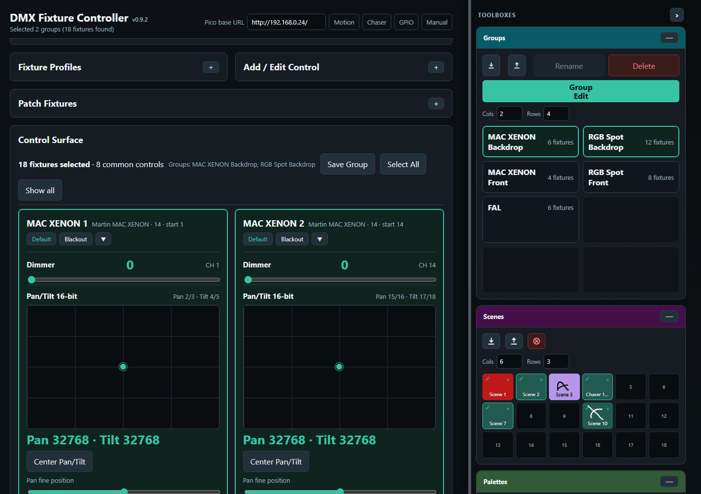

# pico_wifi_dmx

WiFi-controlled DMX512 controller firmware and browser UI for the Raspberry Pi Pico 2 W (RP2350). One Pico drives one full 512-channel DMX universe. The browser can be used for setup and live editing, while chases and motion effects can also run autonomously on the Pico so show playback does not depend on browser timing or WiFi latency.

## Overview

The project combines firmware, a XAMPP-hosted web interface, JSON-based setup storage, and automated tests/documentation for a complete small lighting-control workflow.

Core features:

- **Fixture Controller** — define fixture profiles, patch one or many fixtures, edit live values, recall Default/Blackout values, create fixture groups, save scenes, and build reusable palettes.
- **Shared Toolboxes sidebar** — scenes, groups, palettes, fan out, chases, chase steps, playback, and motion effects live in a shared resizable sidebar. Layout, width, order, collapse state, and group selection are stored server-side and shared across pages.
- **Groups and Group Edit** — select fixtures manually or through saved groups, then edit matching controls across mixed fixture types without touching unrelated channels.
- **Scenes and Palettes** — scenes store complete saved looks for their scope; palettes store partial looks such as positions, colors, gobos, dimmer, beam, or fan-out results. Filled tiles can be renamed and styled with a background color plus an optional visual.
- **Fan Out** — shape selected fixtures around snapshotted base values, including Pan/Tilt fan targets, with affected controls highlighted directly in the controller or chaser step editor.
- **Chaser** — create step-based chases, define participating controls, add/capture/duplicate/reorder steps, edit step values, use browser playback for preview, and upload chases into Pico slots for standalone playback.
- **Motion FX** — apply circle, figure-8, pan swing, tilt swing, sine, and pulse effects to compatible fixture controls. Effects are relative to the current base/scene value and can be saved as reusable recipes or uploaded to Pico motion slots.
- **Pico Playback** — run chaser and motion slots directly on the Pico with play/stop, pause/resume, direction, loop modes, BPM/speed changes, and slot status readback.
- **GPIO Control** — map Pico GPIO inputs to actions such as chase/effect play, stop, pause, resume, speed, BPM, and tap tempo. ADC-capable pins support smoothed analog speed/BPM control.
- **DMX Buffer Monitor** — read and display the current output buffer or base buffer for all 512 DMX channels.
- **Pico Performance Test** — check firmware timing, DMX frame health, HTTP callback timing, buffer readback, and write throughput against a real Pico.
- **Server-side JSON data** — setup data is stored under XAMPP `data/*.json`; pages also provide JSON import/export where useful.
- **Release tooling** — scripts sync the app to XAMPP, regenerate the dark-mode manual/PDF/screenshots, run tests, build firmware, and prepare release packages.

License: copying, modification, and sharing are allowed for non-commercial use only. Commercial use requires separate written permission. See [LICENSE](LICENSE).

User-facing operating instructions are in [docs/user-manual.md](docs/user-manual.md). A dark-mode PDF version is available at [docs/user-manual.pdf](docs/user-manual.pdf).

---

## Getting Started

### Run the software

Install the runtime tools:

- **XAMPP for Windows** with Apache and PHP enabled. The browser UI uses PHP files in `api/` to save JSON setup data.
- A modern browser such as Chrome, Edge, or Safari.
- A Raspberry Pi Pico 2 W flashed with the `pico_wifi_dmx` firmware.

Copy the web app to XAMPP:

```powershell
cd D:\Projects\pico_wifi_dmx
.\scripts\sync_fixture_controller_to_xampp.ps1
```

The example XAMPP target is:

```text
E:\Software\xampp\htdocs\dmx\
```

If your XAMPP install lives somewhere else, copy the local path config example and adjust it:

```powershell
Copy-Item config\local-paths.example.json config\local-paths.json
```

Example:

```json
{
  "xamppHtdocs": "E:/Software/xampp/htdocs",
  "appFolder": "dmx",
  "baseUrl": "http://localhost/dmx/",
  "chromePath": "C:/Program Files/Google/Chrome/Application/chrome.exe"
}
```

`config/local-paths.json` is ignored by Git. The sync and documentation scripts read it automatically. Command-line script parameters still override the config when needed.

Open the UI:

```text
http://localhost/dmx/
```

Enter the Pico base URL shown in the Pico serial log, for example:

```text
http://192.168.0.24/
```

Setup data is saved in XAMPP under `dmx/data/*.json`. Use the page-level JSON export buttons before large changes when you want an extra backup.

### Install the firmware

The latest committed firmware release is stored in:

```text
release/v0.9.0/pico_wifi_dmx-v0.9.0.uf2
```

Use that prebuilt UF2 when you only want to install the software and do not need to build from source. To install it:

1. Hold the Pico 2 W **BOOTSEL** button while plugging it into USB.
2. Wait for the `RPI-RP2` drive to appear.
3. Copy `release/v0.9.0/pico_wifi_dmx-v0.9.0.uf2` to that drive.
4. The Pico reboots automatically.
5. Open the serial log and note the printed Pico URL.

The matching checksum is stored beside it in:

```text
release/v0.9.0/pico_wifi_dmx-v0.9.0.uf2.sha256
```

Future releases use the same pattern: `release/v<VERSION>/pico_wifi_dmx-v<VERSION>.uf2`. If no prebuilt UF2 is available, build it from source with the developer steps below.

### Build the firmware from source

Install the firmware build tools:

- **Raspberry Pi Pico VS Code extension**. This is the easiest Windows setup because it installs/locates the Pico SDK, CMake, Ninja, ARM GCC, picotool, and OpenOCD.
- **Visual Studio Code**
- Recommended VS Code extensions:
  - Raspberry Pi Pico
  - C/C++
  - CMake Tools
  - PowerShell

Configure WiFi and build:

```powershell
cd D:\Projects\pico_wifi_dmx
cmake -S . -B build -G Ninja `
  -DWIFI_SSID="your_ssid" `
  -DWIFI_PASSWORD="your_password"

cmake --build build
```

The firmware output is:

```text
build/pico_wifi_dmx.uf2
```

Optional firmware settings:

```powershell
-DDMX_TX_PIN=2 -DDMX_TRIGGER_PIN=3
-DDMX_CHANNELS=512
```

Flash with BOOTSEL by copying the UF2, or use picotool/OpenOCD as described in the deeper firmware sections below.

### Getting Started for Developers

Install the development/test tools:

- Git
- Node.js LTS with `npm`
- XAMPP with Apache/PHP
- Chrome or Edge for Playwright screenshots/tests
- PowerShell 7 recommended
- Firmware build tools from the previous section

Install JavaScript test dependencies from the project root:

```powershell
cd D:\Projects\pico_wifi_dmx
npm install
npx playwright install chromium
```

Configure script paths if your XAMPP, browser, or served app URL differs:

```powershell
Copy-Item config\local-paths.example.json config\local-paths.json
```

Configure UI test and Pico hardware-test URLs separately:

```powershell
Copy-Item tests\pathconfig.example.json tests\pathconfig.local.json
```

Edit `tests/pathconfig.local.json` for your machine:

```json
{
  "xamppBaseUrl": "http://localhost/dmx/",
  "picoBaseUrl": "http://192.168.0.24/",
  "hardwareTests": {
    "enabled": false
  }
}
```

Normal development loop:

```powershell
.\scripts\sync_fixture_controller_to_xampp.ps1
npm run test:ui
```

Run real Pico hardware tests only when a Pico is connected and you accept that the configured test channels/slots may be overwritten:

```powershell
npm run test:pico
```

After UI/manual changes, regenerate the deterministic documentation screenshots and dark-mode manual:

```powershell
.\scripts\update_user_manual.ps1
```

Prepare a release package after versions, tests, and changelog are ready:

```powershell
.\scripts\prepare_release.ps1 -Build
```

To include the real Pico hardware tests in the release run, use:

```powershell
.\scripts\prepare_release.ps1 -Build -RunHardwareTests
```

If `tests\pathconfig.local.json` does not exist, the script creates it from `tests\pathconfig.example.json`. It will not overwrite an existing local config. You can override the Pico address for one run with `-PicoBaseUrl`:

```powershell
.\scripts\prepare_release.ps1 -Build -RunHardwareTests -PicoBaseUrl "http://192.168.0.24/"
```

Important developer checks:

- Keep generated folders such as `build/`, `node_modules/`, and `test-results/` out of Git.
- Add behavior rules to Playwright tests when a UI workflow is fixed or intentionally changed.
- Update `CHANGELOG.md` whenever a user-visible bug fix or workflow change is made.
- Update `VERSION` and the matching firmware version in `CMakeLists.txt` when preparing a release.

---

## Automated Tests

Regression tests live in [tests](tests/). The UI tests use Playwright against the XAMPP-served app and cover established workflow rules for Controller, Chaser, Motion FX, browser chase playback timing/fade behavior, and the DMX Buffer Monitor.

First-time setup on Windows:

```powershell
cd D:\Projects\pico_wifi_dmx
npm install
npx playwright install chromium
```

Make sure XAMPP is running and the app is available at the configured URL before running the UI tests. If needed, sync the current project files into XAMPP first:

```powershell
.\scripts\sync_fixture_controller_to_xampp.ps1
```

Run the normal UI regression tests:

```powershell
npm run test:ui
```

The default test URL is `http://localhost/dmx/`. It is defined in [tests/pathconfig.json](tests/pathconfig.json), so the same tests can run if the XAMPP installation moves.

For a local machine-specific setup, copy the example file and edit the copy:

```powershell
Copy-Item tests\pathconfig.example.json tests\pathconfig.local.json
```

`tests/pathconfig.local.json` is ignored by Git. Use it for:

- `xamppBaseUrl`: the served web UI, for example `http://localhost/dmx/`
- `picoBaseUrl`: the real Pico API, for example `http://192.168.0.24/`
- `hardwareTests.enabled`: set to `true` only when the Pico is connected and available
- `hardwareTests.dmxTestChannels`: channels the test may write while checking `/dmx/output.json`
- `hardwareTests.chaserSlot` and `hardwareTests.motionSlot`: slots the test may overwrite while checking upload/play/stop behavior

The hardware tests are opt-in because they write real DMX values and overwrite the configured chaser/motion test slots. Run them explicitly with:

```powershell
npm run test:pico
```

Environment variables can override the config for one terminal session:

```powershell
$env:DMX_TEST_BASE_URL = "http://localhost/dmx/"
$env:DMX_PICO_BASE_URL = "http://192.168.0.24/"
$env:DMX_RUN_HARDWARE_TESTS = "true"
npm run test:pico
```

---

## Project Structure

```text
pico_wifi_dmx/
├─ firmware/                 Pico 2 W firmware sources
│  ├─ main.cpp               WiFi, HTTP API routing, shared DMX state
│  ├─ dmx_engine.*           DMX512 output engine and frame buffers
│  ├─ pico_chaser.*          Pico-side chaser slot playback
│  ├─ pico_motion.*          Pico-side motion/effect slot playback
│  ├─ gpio_control.*         GPIO/ADC mapping and trigger handling
│  └─ lwipopts.h             lwIP configuration for the Pico web API
├─ web/                      Browser UI pages served by XAMPP
│  ├─ dmx_fixture_controller.html
│  ├─ dmx_chaser.html
│  ├─ dmx_motion.html
│  ├─ dmx_gpio.html
│  ├─ dmx_monitor.html
│  ├─ dmx_benchmark.html
│  └─ assets/
│     ├─ dmx-common.js       Shared toolbox, base URL, visual, fan helpers
│     └─ dmx-ui.css          Shared dark UI styling
├─ api/                      PHP JSON persistence endpoints for XAMPP
│  ├─ fixture_setup.php      Fixture profiles, patch, and live values
│  ├─ scene_setup.php        Scene storage
│  ├─ palette_setup.php      Shared palette storage
│  ├─ chaser_setup.php       Chases and mirrored Pico chaser slots
│  ├─ motion_setup.php       Motion presets and mirrored Pico motion slots
│  ├─ group_setup.php        Saved fixture groups
│  ├─ gpio_setup.php         GPIO editor setup
│  └─ ui_state.php           Shared toolbox/sidebar layout state
├─ docs/                     User manual, generated PDF, screenshots
│  ├─ manual-data/           Deterministic JSON baseline for screenshots
│  └─ screenshots/           Generated manual/README screenshots
├─ scripts/                  XAMPP sync and documentation automation
│  ├─ sync_fixture_controller_to_xampp.ps1
│  ├─ update_user_manual.ps1
│  ├─ capture_readme_screenshots.ps1
│  ├─ capture_chaser_screenshot.ps1
│  └─ build_user_manual_pdf.ps1
├─ tests/                    Automated regression tests
│  ├─ ui/                    Browser workflow tests against the served UI
│  ├─ unit/                  Pure rule/helper tests
│  ├─ fixtures/              Compact deterministic test data
│  ├─ pathconfig.json        Tracked default test environment config
│  └─ pathconfig.example.json Example local/XAMPP/Pico config
├─ VERSION                   Current application version shown in the UI
├─ CHANGELOG.md              Human-readable release history
├─ CMakeLists.txt            Pico SDK build configuration
├─ pico_sdk_import.cmake     Pico SDK import helper
├─ LICENSE                   Non-commercial license declaration
└─ todos.md                  Open design notes and follow-up ideas
```

`build/` is generated by CMake and is not source. During development, `scripts/sync_fixture_controller_to_xampp.ps1` copies `web/` and `api/` into the XAMPP `dmx` folder, with `web/dmx_fixture_controller.html` served as `index.html`.

---

## Versioning

The project uses SemVer-style application versions. The current version is stored in `VERSION`, shown beside each page title, and copied to XAMPP by `scripts/sync_fixture_controller_to_xampp.ps1`.

Stored/exported JSON files include:

```json
{
  "appVersion": "0.9.2",
  "schemaVersion": 1
}
```

`appVersion` tells you which application wrote the file. `schemaVersion` is for future data-format migrations; current imports stay backward compatible with older JSON files that do not contain these fields. Firmware program version is kept in `CMakeLists.txt` with `pico_set_program_version(...)`.

Release notes belong in `CHANGELOG.md` whenever the version changes.

### Release Checklist

Before tagging or publishing a release:

1. Decide the release version, for example `0.9.0`.
2. Update `VERSION`.
3. Update `pico_set_program_version(...)` in `CMakeLists.txt` to the same value.
4. Move the matching section in `CHANGELOG.md` from `Unreleased` to the release date.
5. Build and test the firmware/UI:

```powershell
cmake --build build
npm run test:ui
```

6. Optional, when a Pico is connected and safe test channels/slots are configured:

```powershell
npm run test:pico
```

7. Create the release package:

```powershell
.\scripts\prepare_release.ps1 -Build
```

To run the real Pico endpoint and slot tests as part of the release package, add `-RunHardwareTests`. The script creates `tests\pathconfig.local.json` from `tests\pathconfig.example.json` if it is missing, then runs the full Playwright suite with hardware tests enabled.

The script copies `build/pico_wifi_dmx.uf2` into:

```text
release/v<VERSION>/pico_wifi_dmx-v<VERSION>.uf2
```

It also writes a SHA256 checksum and `release-manifest.json` containing the version, branch, commit, firmware size, and checksum. The `release/` directory is intentionally not ignored so the firmware package can be committed if you want it in Git. For public distribution, a GitHub Release asset is usually cleaner than committing every binary artifact forever; this repository supports either workflow.

---

## Architecture

| Core | Responsibility |
|------|----------------|
| **Core 0** | DMX engine (continuous 250 kbaud frames), chaser sequencer tick, motion FX oscillator tick — runs at 100 Hz |
| **Core 1** | WiFi (CYW43), lwIP TCP/IP stack, lwIP httpd (HTTP/1.0 API server) |

Cross-core data access is protected by `critical_section_t` hardware spinlocks. DMX buffer writes from the HTTP handler (Core 1) and from the playback engines (Core 0) are coordinated so neither blocks the other.

---

## Playback Modes

### Chase Playback
The browser pages connect directly to the Pico's HTTP API. On every tick the browser computes the next DMX values and sends only the **changed channels** in one batch request (`/dmx/b/`). Two browser tabs can run simultaneously (e.g. chaser on dimmer channels + motion FX on pan/tilt) without interfering because each page tracks its own sent state and never overwrites channels it doesn't own.

### Pico Autonomous Playback
The chaser and motion FX configurations are uploaded to the Pico via HTTP POST. After that the Pico plays back entirely on Core 0 — no further network traffic is needed. This eliminates WiFi latency jitter from the DMX output completely.

Starting Chase Playback automatically stops any running Pico playback, and vice versa (mutual exclusion).

---

## HTTP API

All endpoints return JSON with `Access-Control-Allow-Origin: *`.

### DMX channel control

| Endpoint | Method | Description |
|----------|--------|-------------|
| `/dmx/set/<ch>/<val>` | GET | Set a single channel (ch 1-based, val 0–255) |
| `/dmx/b/<ch>:<val>,<ch>:<val>,…` | GET | Batch set — channel:value pairs in the URL path. Data is path-encoded (not query-string) because lwIP httpd strips query strings before calling `fs_open`. |
| `/dmx/clear` | GET | Zero all channels and clear the scene base buffer |
| `/dmx/output_clear` | GET | Zero live DMX output channels only; preserve the scene base buffer |
| `/dmx/output.json` | GET | Read the actual live DMX output frame as `{"ok":true,"channels":N,"frame_count":N,"values":[...]}` |
| `/dmx/values/<start>/<count>` | GET | Read up to 64 channel values as JSON array |
| `/dmx/values.json` | GET | Read all channel values |

### Pico chaser

Up to **32 independent chaser slots** can be loaded and played simultaneously. Each slot has its own step list, loop flag, and speed multiplier. When multiple slots control the same DMX channel the **bigger-wins** rule applies (highest raw value written).

| Endpoint | Method | Description |
|----------|--------|-------------|
| `/chaser/load/<N>` | POST | Upload chaser config to slot N (0–31) |
| `/chaser/play/<N>` | GET | Start slot N from the beginning |
| `/chaser/pause/<N>` | GET | Pause slot N at the current step/fade position |
| `/chaser/resume/<N>` | GET | Resume paused slot N |
| `/chaser/pause_toggle/<N>` | GET | Pause if running, resume if paused, otherwise start slot N |
| `/chaser/clear/<N>` | GET | Clear/unload slot N without clearing global DMX output |
| `/chaser/stop` | GET | Stop all slots |
| `/chaser/stop/<N>` | GET | Stop slot N only |
| `/chaser/speed/<N>/<mult_x100>` | GET | Set speed multiplier for slot N (100 = 1.0×) |
| `/chaser/status` | GET | `{"ok":true,"active_mask":N,"loaded_mask":N,"step":N,"step_count":N,"elapsed_ms":N}` |
| `/chaser/slots` | GET | `{"ok":true,"slots":[{"slot":N,"loaded":bool,"active":bool,"loop":bool,"step_count":N,"speed_mult":F},…]}` |

`active_mask` and `loaded_mask` are bitmasks — bit *i* set means slot *i* is active/loaded.

Chaser text protocol (POST body):
```
LOOP 1
MODE loop
LOOPS 1
DIR forward
SPEED 1.00
STEP <duration_ms> <fade_percent>
CH <channel> <value>
CH <channel> <value>
END
STEP …
END
```

`MODE` supports `single`, `loop`, and `loop_n`. `LOOPS` is used by `loop_n`. `DIR` supports `forward` and `reverse`. `SPEED` is the slot speed multiplier and can still be changed live with `/chaser/speed/<N>/<mult_x100>`.

Each chaser slot supports up to **32 steps** in firmware. The Chaser page enforces the same limit so Chase Playback and Pico playback use the same chase shape.

### Pico motion FX

Up to **64 independent motion FX slots** can be loaded and played simultaneously. Each slot has its own effect type, BPM, target list and phase offsets. Targets can be pan/tilt pairs or scalar controls such as dimmer, zoom, iris, prism, or gobo. When multiple slots control the same DMX channel the **bigger-wins** rule applies (highest raw value written).

| Endpoint | Method | Description |
|----------|--------|-------------|
| `/motion/load` | POST | Upload motion FX config to slot 0 |
| `/motion/load/<N>` | POST | Upload motion FX config to slot N (0–63) |
| `/motion/start` | GET | Start slot 0 |
| `/motion/start/<N>` | GET | Start slot N |
| `/motion/clear/<N>` | GET | Clear/unload slot N without clearing global DMX output |
| `/motion/stop` | GET | Stop all slots |
| `/motion/stop/<N>` | GET | Stop slot N only |
| `/motion/bpm/<N>/<bpm_x10>` | GET | Set BPM for slot N live (e.g. `/motion/bpm/0/1200` = 120.0 BPM) |
| `/motion/status` | GET | `{"ok":true,"active_mask":N,"loaded_mask":N,"elapsed_s":F}` |
| `/motion/slots` | GET | Array of per-slot info: `{"ok":true,"slots":[{"slot":N,"loaded":bool,"active":bool,"type":N,"bpm":F,"target_count":N},…]}` |

`active_mask` and `loaded_mask` are bitmasks — bit *i* set means slot *i* is active/loaded.

Motion FX text protocol (POST body):
```
FX 1
TYPE <0=circle|1=figure8|2=panSwing|3=tiltSwing|4=sine|5=pulse>
BPM <float>
AMP1 <0.0–1.0>
AMP2 <0.0–1.0>
SPREAD <degrees>
TARGET <scalar8|scalar16|pantilt8|pantilt16> <enabled> <ch1> <fine1> <ch2> <fine2> <phase_deg>
END
```

The `TARGET` line contains DMX channel positions only. It does not store fixed center values. Instead, the effect center is read from the **scene base buffer** (`dmx_base_frame`) at tick time — see [Scene Base Buffer](#scene-base-buffer) below. Pan/tilt targets use both axes; scalar targets use `ch1`/`fine1` and ignore `ch2`/`fine2`.

---

## Web UI

The UI is served from a separate web server (XAMPP in development). All pages talk to the Pico via cross-origin HTTP requests using `new Image().src` for fire-and-forget GET calls.

| Page | File | Description |
|------|------|-------------|
| Fixture Controller | `web/dmx_fixture_controller.html` (served as `index.html`) | Define fixture profiles, patch fixtures, set individual channels, manage groups, save/recall scenes |
| Chaser | `web/dmx_chaser.html` | Build and play step sequences with crossfade; save reusable chases in the Chases toolbox; upload the current chase to up to 32 independent Pico slots for autonomous playback; slot status strip shows live LIVE/READY/EMPTY state for all 32 slots |
| Motion FX | `web/dmx_motion.html` | Configure generic oscillator effects for pan/tilt pairs or scalar controls; upload the current effect to up to 64 independent Pico slots; slot status strip shows live LIVE/READY/EMPTY state for all 64 slots |
| GPIO Control | `web/dmx_gpio.html` | Prototype editor for mapping physical GPIO button inputs to Pico playback/DMX actions |
| DMX Monitor | `web/dmx_monitor.html` | Tile monitor for all 512 channels with adjustable refresh interval and rate; toggles between the actual live Pico output frame (`/dmx/output.json`) and the base/position buffer (`/dmx/base.json`) |
| Pico Performance Test | `web/dmx_benchmark.html` | Check Pico connectivity, parse core timing logs, verify DMX/base buffer readback, and measure HTTP latency for single-channel, batch, stress, and soak-test DMX update patterns |

### Screenshots

The screenshots below show the main pages as served from XAMPP during development and explain how the software is used in practice.

Run `scripts/update_user_manual.ps1` after UI or documentation changes. It syncs the current web app to XAMPP, captures deterministic screenshots, rebuilds the dark-mode HTML/PDF manual, syncs the result back to XAMPP, and verifies the deployed manual.

The controller screenshots are generated with deterministic per-shot setup states: each screenshot explicitly opens or collapses the relevant sections, collapses the shared toolbox sidebar for page-local topics, sets toolbox visibility for toolbox-specific topics, clears or selects group filters, and expands fixture cards as needed. This avoids stale browser collapse state leaking into the documentation images.

**Fixture Controller**


The Fixture Controller is the main setup and live-control page. It defines fixture profiles, patches real fixtures to DMX start addresses, and renders the controls for each fixture card. Fixture profiles describe the channel layout, for example dimmer, pan/tilt, RGB, RGBW, RGBWA, wheels, sliders, and 16-bit channels.

From this page you can move individual controls live, save and recall scenes, organize fixtures into groups, and recall default or blackout values per fixture or per group. Scene recall writes channel values back to the Pico and also updates the live-value snapshot used by the Chaser page.

Patch Fixtures supports one fixture at a time or a numbered run. Set a base name such as `RGB Spot`, choose a profile, enter the first DMX start address, and set Count. The controller creates `RGB Spot 1`, `RGB Spot 2`, and so on, spacing each fixture by the selected profile's channel count. After a multi-fixture patch it offers to create a Saved Group using the same base name. The patched fixture matrix is split into rows by consecutive profile runs so separate fixture groups remain visually clear.

The Controller also includes a Fan Out toolbox in the shared Toolboxes sidebar. Select one or more groups, choose a compatible control such as Dimmer, Pan, or Tilt, snapshot the current values as the base, and adjust a spread. The controller surface updates continuously, affected controls are highlighted directly, and the resulting look can be saved with the Scene Toolbox. Fan Out presets can also be saved and recalled as UI tool settings.

The Palettes toolbox stores reusable partial looks such as positions, colors, gobos, dimmer levels, or Fan Out overlays. The small pencil on a filled tile opens **Edit Tile**, where you can rename the tile and set a background color plus an optional drawn/uploaded visual. Palette visuals are independent from scope, draw on the selected background color, and automatically choose a high-contrast brush color. They can reset to the default background or clear the icon entirely. Palette names and visuals are saved inside `data/palette_setup.json` together with the palette values.


The profile editor is where a fixture personality is described. The left side lists saved fixture profiles and their controls. The Add / Edit Control card edits the selected control type, channel mapping, label, and default/blackout values. For pan/tilt controls the editor shows XY pads; for color controls it exposes the color picker and extra white/amber channels where needed. Clicking Edit on an existing control opens this editor automatically. Collapsing Fixture Profiles also hides the Add / Edit Control card.


The live control surface shows patched fixtures as cards. Each card contains the controls created in the profile, such as dimmer sliders, pan/tilt XY pads, color controls, wheels, and 16-bit coarse/fine sliders. The Default and Blackout buttons recall the stored values for one fixture, while Select adds the fixture to group editing.


Saved Groups are shown in a compact matrix. Each group has Select and Deselect on the top row, with smaller Rename and Delete buttons below. Selecting a saved group filters the control surface to that group's fixtures. Multiple groups can be selected at the same time; the surface shows the union of all selected group fixtures, and Show all clears the filter.


The Group Edit modal appears when multiple compatible fixtures are selected or when a saved group is loaded. It shows controls that exist on at least two selected fixtures; mixed fixture types are allowed, and each edit is applied only to fixtures that actually have that matching control. On the Chaser page, **Apply source** copies the selected Source fixture's value for one control to all matching participating fixtures, and **All** applies every editable Source value in the modal. The modal can also recall Default all or Blackout all; normal edits are sent to the Pico when a Pico base URL is set.

The Chaser **Palettes** toolbox can save the selected step values into an empty palette slot, recall compatible palette values into the selected step, or **Merge** the selected step values into an existing palette. Filled palette slots use the small top-left pencil icon to open **Edit Tile** for renaming and visual appearance. If the existing palette has a different scope, Chaser asks before changing it to **All controls**.



The Scene Toolbox sits in the shared Toolboxes sidebar for saving, recalling, deleting, exporting, and importing looks. The row and column controls change the visible slot grid, filled slots recall scenes, empty slots save new scenes, and the red clear button clears all controller values and the Pico DMX output when a base URL is set. Scenes can also carry a custom tile name, background color, and optional drawn/uploaded visual as a label in the slot grid, with controls to reset the background or remove the icon.

**Chaser**


The Chaser page builds step-based sequences. A chase is made from multiple steps; each step stores DMX channel values plus timing and fade settings. The participating-controls panel decides which fixture controls are part of the chase, so editing a chase does not accidentally touch unrelated channels.

Chaser steps can be created manually, duplicated, edited, or captured from the current Fixture Controller live values. A chase can run in the browser for editing, or it can be uploaded into one of the Pico's 32 chaser slots for autonomous playback. Pico playback supports single run, loop, loop N times, direction, pause/resume, and live speed changes.

The repeated page tools now live in a shared right-side Toolboxes sidebar on desktop screens. Drag the sidebar's left resize line to change the width, double-click it to reset, use the header arrow to collapse or reopen the sidebar, and drag toolbox headers to reorder them. The colored toolbox header is the only reorder handle; on iPad it uses app pointer dragging instead of Safari's native drag/drop to avoid unwanted open/search behavior. Sidebar width, collapse state, and toolbox order are shared across Controller, Chaser, and Motion FX. Filled scene, palette, chase, and effect slots use a small top-left pencil icon to open **Edit Tile** for renaming and visual appearance; the small `x` remains the delete control. The Chaser also has a Palettes toolbox: empty palette slots save the selected step's fixture/control values, and filled palette slots recall compatible values into the selected step.

**Motion FX**


The Motion FX page creates continuous effects for one selected target type at a time. Pan/tilt targets can run circle, figure-8, pan swing, or tilt swing; scalar controls such as dimmer, zoom, iris, prism, or gobo can run sine or pulse effects. All effects are calculated relative to the current scene/base-buffer value instead of using a fixed stored center point.

This means the normal workflow is: recall or set the base value first, then start the effect. The firmware reads the center from the scene base buffer and the motion oscillator moves around that value. Motion FX can also be uploaded into one of 64 Pico slots so multiple effects can run directly on the Pico without browser timing jitter. The Motion page can recall compatible shared palettes as effect centers, so position, dimmer, beam, or other scalar palettes can seed the current target before upload. The Effects toolbox stores reusable effect recipes (target, participants, effect type, BPM, amplitudes, spread, and phase offsets) without storing center/base values.

**GPIO Control**


The GPIO Control page maps physical Pico inputs to lighting actions. Digital GPIO pins can trigger actions such as DMX clear, output-only clear, chaser play/stop/toggle, pause/resume, motion start/stop/toggle, and tap tempo. ADC pins can be mapped to continuous values such as chaser speed multiplier or Motion FX BPM.

The page protects reserved hardware pins and already-used pins, then sends the mapping to the Pico with `POST /gpio/config` when a Pico base URL is set. Once uploaded, the Pico polls the inputs on Core 0 and runs the actions directly, so the browser does not need to stay open during operation.

**DMX Buffer Monitor**


The DMX Buffer Monitor shows all 512 DMX channels as tiles. Use the buffer selector to switch between the actual live output frame and the base/position buffer used as the Motion FX center. Use **Refresh ms** or **Refresh Hz** to choose how often the selected buffer is read; both fields stay synchronized.

**Pico Performance Test**


The Pico Performance Test page checks the whole browser-to-Pico path. It reads `/status.json` and `/logs.txt`, parses the Core0/Core1 timing lines, verifies that a known DMX batch can be read back from both `/dmx/output.json` and `/dmx/base`, and keeps the former frame-rate benchmark as the DMX Write Test. Timing History records Core0/Core1 slack, HTTP peak, DMX counters, and buffer state for repeated checks. The write result panel shows throughput, effective DMX channel updates per second, average latency, median, p95/p99 latency, jitter, min/max latency, completed attempts, and errors.

Use **Run Full Test** after firmware or UI changes to catch Pico timing, HTTP, CORS, buffer, and write-performance regressions in one pass. The CSV export makes it possible to compare write-test runs later.

Both playback pages show a **Chase Playback** section and a **Pico Playback** section. Only one can be active at a time — activating one automatically stops the other.

The **Pico base URL** is persisted in `localStorage` under the key `dmxPicoBaseUrl` and is shared across all pages — typing the IP once on any page is enough. Live Pico updates only happen while this URL is set; clearing it puts the UI into browser-only editing.

### Chaser / Motion FX — Saved Chases, Presets and Pico Slots

The playback pages separate browser editing from the autonomous Pico slot memory:

- **Chaser Chases toolbox** — stores reusable editable chases on the XAMPP server. Recalling a chase loads its steps, selects Step 1, rebuilds Participating Controls and Edit Step, and a newly opened Chaser page starts with no working steps until a chase is recalled or created.
- **Motion Save Preset / Load Preset** — stores and restores the editable Motion FX page setup on the XAMPP server JSON file.
- **Pico slot click upload** — click an empty Pico slot to send the current editable chase or Motion FX preset to that slot and mirror the payload on the XAMPP server. Click a loaded slot once to select it for playback controls; click the selected loaded slot again to replace it after confirmation.
- **Play Slot / Start Slot** — starts the already-loaded slot on the Pico.
- **Restore Saved Slots to Pico** — re-sends the saved server-side slot payloads to the Pico after reboot or firmware upload when a Pico base URL is set.
- **Delete slot** — loaded slots show a small `×` button in the top-right corner. It deletes the mirrored XAMPP slot payload and calls the Pico clear endpoint for that slot when the Pico base URL is set.

On the Chaser page, each uploaded Pico slot also stores its playback mode (`Single`, `Loop`, `Loop N`), loop count, direction, and speed. `Stop` resets the slot, while `Pause`/`Resume` keeps the current step and fade position.

### Chaser — Participating Controls

The **Participating Controls** panel defines which fixture+control pairs are written by the current chase. It is not saved as a separate preset anymore. Recalling a chase rebuilds the active participating controls from the selected step, while **All**, **None**, **Only**, and **Add** are working tools for creating or editing the current step.

### Chaser — Capture from Fixture Controller

**Capture + Add** and **Capture from FC** read the current live values from the Fixture Controller:

1. Tries `fixture_setup.php?livevalues` (server-side snapshot written by the FC page whenever any control is moved or a scene is recalled).
2. Falls back to `localStorage` key `dmxFCLiveValues` if the server is unavailable.

This means capture works correctly even when the Chaser and FC pages are open in different browser windows or tabs.

### Fixture Controller — Groups

Fixtures can be organised into named **Saved Groups** (stored server-side via `group_setup.php`).

- Create a group and assign any subset of patched fixtures to it.
- A collapsible **Group Bar** appears above the fixture list; clicking a group instantly selects all its fixtures and scrolls to the first one.
- The **Group Edit** modal can recall **Default all** or **Blackout all** for every selected fixture at once, using each fixture profile's own stored default/blackout values.
- Groups can be edited (rename, change member list) or deleted from the Saved Groups panel.
- Export / import the whole group store as JSON using the toolbar icon buttons.

### Fixture Controller — Default and Blackout Values

Each control in a fixture profile can store optional **Default** and **Blackout** values. These are configured in the **Default & Blackout** card while adding or editing a control.

- **None** — disables the stored value for that control. Disabled values are skipped during recall.
- **Pan/Tilt** — stores pan and tilt together; 16-bit controls use `0–65535`, 8-bit controls use `0–255`.
- **Slider / wheel controls** — store one numeric DMX value. 16-bit sliders use `0–65535`; 8-bit sliders and wheels use `0–255`.
- **RGB / RGBW / RGBWA** — use a color picker for RGB. RGBW also stores a manual `W` channel; RGBWA stores manual `W` and `Amber` channels.
- **CMY / CMYK** — use the color picker converted to CMY/CMYK. CMYK also stores a manual `K` channel.

On each patched fixture card, **Default** and **Blackout** buttons are shown when at least one control in that fixture's profile has the corresponding value enabled. Clicking one recalls all enabled values for that fixture, updates the on-screen controls, writes the live-value snapshot used by Chaser capture, and sends the resulting DMX values to the Pico when a Pico base URL is set.

### Fixture Controller — Scene Toolbox

The **Scene Toolbox** sits in the shared right-side Toolboxes sidebar.

- The toolbox shows a configurable grid of slots (rows × columns adjustable with spinners).
- **Save scene** — snapshots every channel value for every patched fixture into a named slot.
- **Recall scene** — clears the active group/fixture selection, restores all stored controller values, updates the Chaser live-value snapshot, and sends the values to the Pico in one batch request when a Pico base URL is set.
- **Delete scene** — each filled slot has a small `×` button (top-right corner); click it to permanently remove that scene after confirmation.
- **Clear all channels** — the red `×` icon next to the scene JSON import/export buttons asks for confirmation, zeros every controller value, updates the live-value snapshot, and calls `/dmx/clear` on the Pico when a Pico base URL is set.
- Slots are stored server-side in `data/scene_setup.json` via `scene_setup.php`; they survive page reloads and browser changes.
- Sidebar width and toolbox order are shared across toolbox pages via `data/ui_state.json`; collapsed state is also persisted.
- Whenever a control is moved or a scene is recalled, the current live values of all controls are written to `data/fixture_live_values.json` via `fixture_setup.php?livevalues`. This keeps the Chaser page's "Capture from FC" up to date even if the Chaser page was opened before the FC page.

### Motion FX — Scene Center Toolbox

The Motion FX page has a read-only companion to the Scene Toolbox.

- Loads the same scenes from `scene_setup.php`; renders them as a clickable slot grid.
- Clicking a filled slot reads the pan/tilt channel values stored in that scene and stores them as `basePan`/`baseTilt` in the browser's motion fixture state. When a Pico base URL is set, it also sends those values to the Pico as a DMX batch, updating `dmx_base_frame`.
- The effect then oscillates **relative to that position** rather than around any fixed stored center. Moving lights to a new position (via a scene) and starting motion will always orbit where they are now.
- The toolbox lives in the shared sidebar. Drag its colored header to reorder it, and use the sidebar resize line to adjust the shared toolbox width.
- The scene toolbox on the Motion FX page is **read-only** — it does not save or delete scenes. Scene management (save, delete) is only available on the Fixture Controller.
- The **↺ Reload from Fixture Controller** button re-fetches `fixture_setup.php` (fixture definitions, not live values) to refresh the fixture list in case fixtures were added or changed.

### Motion FX — Fixture Card Grid

Fixture cards in the Motion FX page are displayed in a responsive CSS auto-fill grid (minimum card width 220 px) rather than a single vertical list. The fixture panel is capped at 70 vh with internal scrolling — the panel heading and action buttons remain visible outside the scroll area.

---

### Scene Base Buffer

The firmware maintains a dedicated `dmx_base_frame[513]` buffer (indices 1–512 map to DMX channels) that tracks the *position layer* — the last non-FX DMX value for every channel. Motion FX effects read their center from this buffer at tick time rather than from a fixed number stored in the slot config.

**What writes to `dmx_base_frame`:**

| Source | Updates base buffer? |
|--------|----------------------|
| `/dmx/set/<ch>/<val>` GET | ✅ yes |
| `/dmx/b/<ch>:<val>,…` GET or POST batch | ✅ yes |
| Chaser tick output (Core 0) | ✅ yes |
| Motion FX tick output (Core 0) | ❌ no — intentional; prevents drift |

Because motion FX never writes back to the base buffer, the oscillation center stays fixed at whatever position was set last. There is no accumulation error even after hours of continuous playback.

**Practical workflow:**
1. Position the fixture using the Fixture Controller, or recall a scene.
2. On the Motion FX page, click that same scene in the Scene Toolbox — this updates the Motion FX center values. When a Pico base URL is set, it also sends the stored values to the Pico and updates `dmx_base_frame`.
3. Start motion (browser `▶ Start` or Pico `/motion/start`) — the effect orbits the position set in step 1/2.

When browser motion starts, the page fetches `/dmx/values.json` from the Pico and seeds the browser-side base from the live channel values, so the browser and firmware bases are always in sync.

### GPIO Control Prototype (`web/dmx_gpio.html`)

The GPIO prototype maps physical Pico GPIO inputs to common playback actions. It is intentionally input-only for the first version.

- The page loads and autosaves mappings on the XAMPP server through `gpio_setup.php` / `data/gpio_setup.json`, with browser `localStorage` only as a fallback. The active mapping set is pushed to the Pico with `POST /gpio/config`.
- **Export JSON / Import JSON** saves or restores the GPIO editor setup, including Pico base URL, enabled state, and all mappings.
- Each GPIO pin can only be used by one mapping. The page highlights duplicate pin use, and the firmware rejects duplicate digital/ADC mappings as a final safety check.
- Digital GPIO mapping pins are selected from a dropdown that excludes the configured hardware-reserved pins (`DMX_TX_PIN=2`, `DMX_TRIGGER_PIN=3`) and disables pins already used by another mapping.
- The Pico polls GPIO inputs on Core 0 with debounce and executes actions without needing the browser to stay open.
- The DMX TX pin and frame-trigger pin are reserved automatically and cannot be mapped.
- Supported pulls: `pullup`, `pulldown`.
- Supported triggers: `falling`, `rising`, `both`.
- Supported digital actions: `dmx_clear`, `dmx_output_clear`, `stop_all`, `chaser_play`, `chaser_stop`, `chaser_toggle`, `chaser_pause`, `chaser_resume`, `chaser_pause_toggle`, `chaser_tap`, `motion_start`, `motion_stop`, `motion_toggle`, `motion_tap`.
- ADC mappings are separate from digital button mappings and are limited to GPIO26, GPIO27, and GPIO28 on Pico 2 W. ADC actions include `chaser_speed`, which maps the ADC value to a chaser speed multiplier range, and `motion_bpm`, which maps the ADC value to a Motion FX BPM range.

GPIO config is a line-based text protocol:

```text
ENABLE 1
MAP 14 pullup falling dmx_clear 0 30
MAP 15 pullup falling chaser_toggle 0 30
MAP 16 pullup falling motion_tap 0 30 1
MAP 17 pullup falling chaser_tap 0 30 2
ADC 26 chaser_speed 0 10 300
ADC 27 motion_bpm 0 1000 12000
```

Format: `MAP <pin> <pull> <trigger> <action> <slot> <debounce_ms> [beat_div]`.
ADC format: `ADC <pin> <action> <slot> <min_x100> <max_x100>`.
The web editor shows `chaser_speed` ranges as normal speed multipliers, e.g. `0.10` to `6.00`, and `motion_bpm` ranges as BPM, e.g. `10.0` to `120.0`. The generated firmware line stores both as value ×100.
ADC readback and speed/BPM updates use a 10 ms mean filter to reduce ripple from pots and long wires.

Tap actions use the interval between two valid button presses. `motion_tap` writes Motion FX BPM directly. `chaser_tap` converts the tapped interval into a chaser speed multiplier using the selected slot's current step duration. Optional `beat_div` supports `1`, `2`, `4`, `8`, and `16`, where `2` means a half-beat target, `4` a quarter-beat target, and so on.

Use `dmx_clear` when the button should clear both output and the motion base buffer. Use `dmx_output_clear` when it should black out live output but keep the base buffer intact, so Motion FX can resume around the same stored center.

Firmware endpoints:

| Endpoint | Method | Description |
|----------|--------|-------------|
| `/gpio/config` | GET | Return current volatile GPIO config as JSON |
| `/gpio/config` | POST | Replace current GPIO config using the line-based protocol |
| `/gpio/status` | GET | Return input states, ADC raw values/mapped speed, event count, and last fired action |

This first prototype does not persist GPIO mappings on the Pico after reboot; save them in the web page server setup or export a JSON backup and push again after flashing/restarting. Pico-side persistence can be added later once the action model is proven.

### Server-side Persistence

All persistent data is stored as JSON files in the PHP web server's `data/` folder. No database is required. The sync script migrates existing root-level JSON files into `data/` and writes a `.htaccess` file that denies direct browser access to the folder.

| PHP handler | JSON file | Contents |
|-------------|-----------|----------|
| `fixture_setup.php` | `data/fixture_setup.json` | Fixture profiles, patched fixtures, base URL |
| `fixture_setup.php?livevalues` | `data/fixture_live_values.json` | Snapshot of every control's current live value; written by the Fixture Controller whenever a control is moved or a scene is recalled; read by the Chaser page to capture FC state into steps |
| `scene_setup.php` | `data/scene_setup.json` | Named scene snapshots, slot grid dimensions |
| `palette_setup.php` | `data/palette_setup.json` | Reusable palette overlays and slot grid dimensions |
| `group_setup.php` | `data/group_setup.json` | Fixture group definitions |
| `chaser_setup.php` | `data/chaser_setup.json` | Saved chases, Chaser toolbox grid config, mirrored Pico slot payloads |
| `motion_setup.php` | `data/motion_setup.json` | Motion FX browser setup, saved effect recipes, and saved Pico slot payloads |
| `gpio_setup.php` | `data/gpio_setup.json` | GPIO/ADC editor mappings, enabled state, Pico base URL |
| `ui_state.php` | `data/ui_state.json` | UI state such as section collapse flags, toolbox order, shared sidebar width, and toolbox collapse state |

All handlers accept `GET` (read) and `POST` (write). `ui_state.php` merges partial state — posting `{page, state}` only touches the keys provided and leaves the rest intact.

### Development sync

HTML files are developed locally and synced to XAMPP with:

```powershell
.\scripts\sync_fixture_controller_to_xampp.ps1
```

By default the scripts use the example XAMPP target `E:\Software\xampp\htdocs\dmx\`. To use another location, create `config/local-paths.json` from `config/local-paths.example.json` or pass `-XamppHtdocs`, `-AppFolder`, and `-BaseUrl` directly to the script.

---

## Detailed Source Reference

The root `CMakeLists.txt` is the Pico build entry point and references sources under `firmware/`.

| File | Description |
|------|-------------|
| `firmware/main.cpp` | Core 0/1 entry points, HTTP endpoint handlers, custom lwIP fs callbacks, DMX UI lock, POST callbacks for chaser/motion upload |
| `firmware/dmx_engine.cpp` / `.h` | Continuous DMX512 PIO output engine, channel buffer, thread-safe set/get. Also owns `dmx_base_frame` — the scene base buffer (see below) |
| `firmware/dmx_native.pio` | PIO program for 250 kbaud DMX framing |
| `firmware/pico_chaser.cpp` / `.h` | Pico-side step sequencer with linear crossfade, 100 Hz tick, hardware spinlock |
| `firmware/pico_motion.cpp` / `.h` | Pico-side generic FX oscillator — **64 independent slots**, pan/tilt and scalar targets, simultaneous playback with bigger-wins channel merge, target-aware axis writes, 100 Hz tick, hardware spinlock |
| `firmware/gpio_control.cpp` / `.h` | Pico-side GPIO input mapper for debounced physical triggers and playback/DMX actions |
| `firmware/lwipopts.h` | lwIP configuration — enables `LWIP_HTTPD_SUPPORT_POST`, custom file serving |
| `firmware/fsdata_custom.c` | lwIP custom filesystem stub (all responses are built dynamically) |
| `pico_sdk_import.cmake` | Pico SDK CMake integration |
| `CMakeLists.txt` | Build target, source files, SDK libraries |
| `api/fixture_setup.php` | REST handler — save/load fixture setup (`data/fixture_setup.json`); `?livevalues` endpoint snapshots/restores the current live control values (`data/fixture_live_values.json`) |
| `api/scene_setup.php` | REST handler — save/load scenes and slot grid config (`data/scene_setup.json`) |
| `api/palette_setup.php` | REST handler — save/load reusable palette overlays (`data/palette_setup.json`) |
| `api/group_setup.php` | REST handler — save/load fixture groups (`data/group_setup.json`) |
| `api/chaser_setup.php` | REST handler — save/load saved Chases toolbox entries and mirrored Pico slot payloads (`data/chaser_setup.json`) |
| `api/motion_setup.php` | REST handler — save/load Motion FX setup, saved effect recipes, and mirrored Pico slot payloads (`data/motion_setup.json`) |
| `api/ui_state.php` | REST handler — per-page UI state persistence (`data/ui_state.json`); merges partial state on POST |
| `scripts/sync_fixture_controller_to_xampp.ps1` | PowerShell script — copies all HTML pages and PHP handlers to the local XAMPP htdocs folder |

---

## Requirements

- Raspberry Pi Pico 2 W (`PICO_BOARD=pico2_w`, RP2350)
- Pico SDK 2.2.0
- CMake 3.13+, Ninja, ARM embedded GCC toolchain

---

## Configure

```powershell
cmake -S . -B build -G Ninja `
  -DWIFI_SSID="your_ssid" `
  -DWIFI_PASSWORD="your_password"
```

Optional overrides:

```powershell
# DMX output pin (default 2) and frame-trigger debug pin (default 3)
-DDMX_TX_PIN=2 -DDMX_TRIGGER_PIN=3

# Universe size — limits channels in firmware and UI (default 512)
-DDMX_CHANNELS=46
```

---

## Build

```powershell
& "$env:USERPROFILE/.pico-sdk/ninja/v1.12.1/ninja.exe" -C build
```

Output: `build/pico_wifi_dmx.uf2`

---

## Flash

Using picotool (Pico connected via USB in normal run mode):

```powershell
& "$env:USERPROFILE/.pico-sdk/picotool/2.2.0-a4/picotool/picotool.exe" load build/pico_wifi_dmx.elf -fx
```

Using OpenOCD + Picoprobe/CMSIS-DAP:

```powershell
& "$env:USERPROFILE/.pico-sdk/openocd/0.12.0+dev/openocd.exe" `
  -s "$env:USERPROFILE/.pico-sdk/openocd/0.12.0+dev/scripts" `
  -f interface/cmsis-dap.cfg -f target/rp2350.cfg `
  -c "adapter speed 5000; program build/pico_wifi_dmx.elf verify reset exit"
```

---

## Resource Usage

| Resource | Value |
|----------|-------|
| Free RAM (stable, measured at runtime) | **385 024 bytes** (~195 KB) |
| Total SRAM (RP2350) | 520 KB |

## Notes

- The `/dmx/b/` batch endpoint encodes channel data in the **URL path** rather than a query string. lwIP httpd nulls the `?` in the URI before calling `fs_open_custom`, making query-string-based batch endpoints unreliable.
- `dmx_engine_set_channel()` is called from both cores. Reads/writes to the DMX buffer are 8-bit aligned and the PIO reads the buffer independently, so no additional lock is needed for channel writes. The `dmx_ui_lock` critical section protects the secondary UI mirror array only.
- Both `chaser_lock` and `mfx_lock` are module-local spinlocks. DMX writes are performed **outside** these locks (after releasing them) to avoid nested-lock deadlock.
- The motion FX tick uses static scratch buffers for 8-bit and 16-bit values. Each active slot computes its values into the scratch with a *bigger-wins* merge (max raw value per channel). The final merged result is written to the DMX engine in one pass after all slots are evaluated — this ensures simultaneous slots never interfere with each other.
- `panSwing` slots only write pan channels; `tiltSwing` slots only write tilt channels. Mixed-mode pan/tilt slots (circle, figure-8) write both. Scalar slots write only their selected scalar control. This prevents one effect from zeroing unrelated channels.
