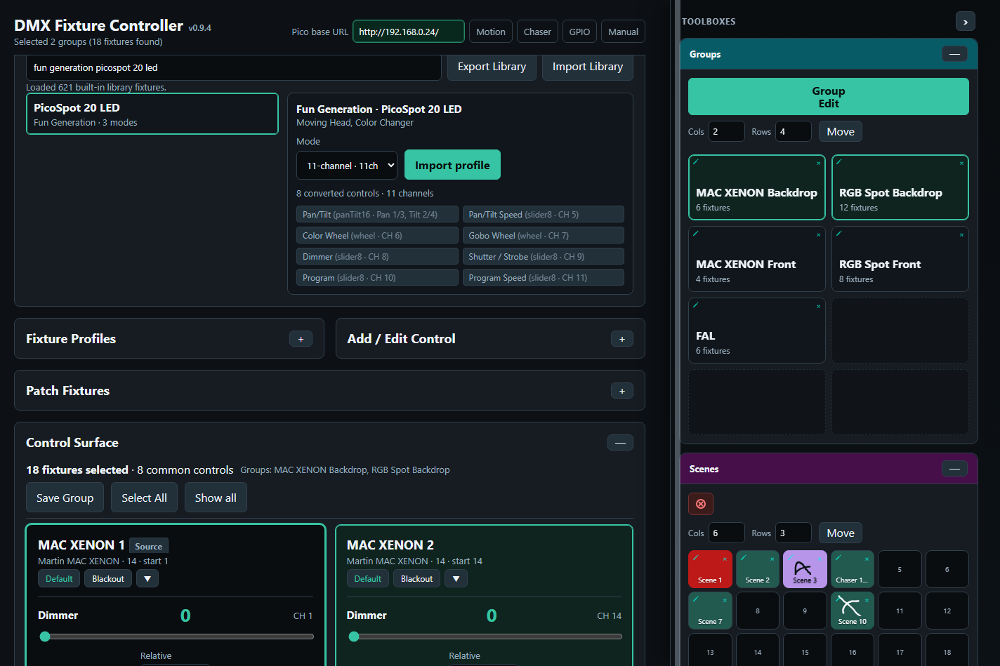
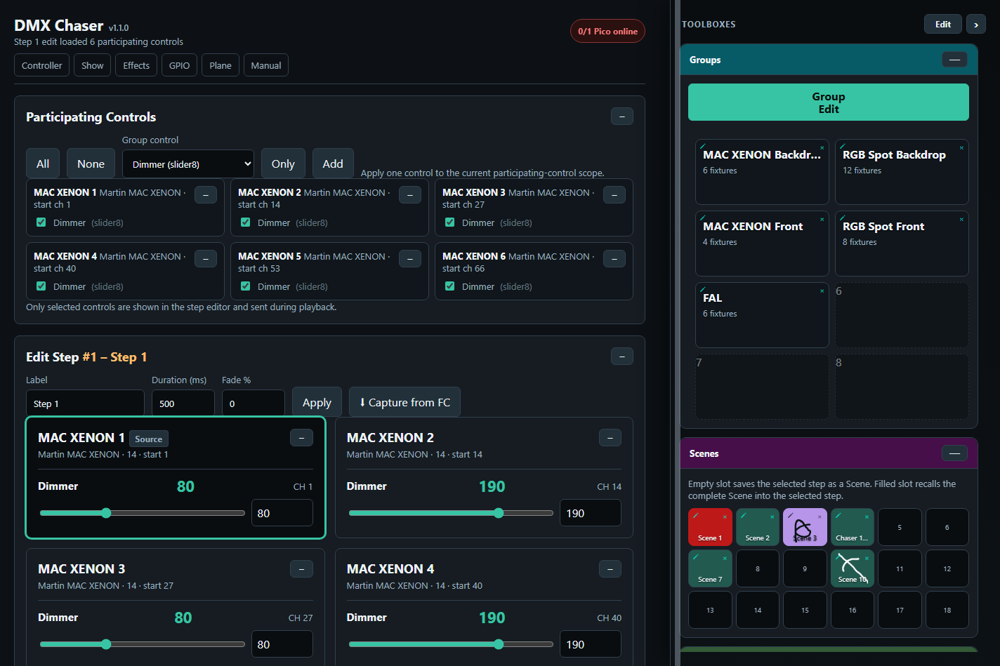

# pico_wifi_dmx

WiFi-controlled DMX512 controller firmware and browser UI for the Raspberry Pi Pico 2 W (RP2350). One Pico drives one full 512-channel DMX universe. The browser can be used for setup and live editing, while chases and effects can also run autonomously on the Pico so show playback does not depend on browser timing or WiFi latency.

## Overview

The project combines firmware, a XAMPP-hosted web interface, JSON-based setup storage, and automated tests/documentation for a complete small lighting-control workflow.

Core features:

- **Fixture Controller** — define fixture profiles, patch one or many fixtures, edit live values, recall Default/Blackout values, create fixture groups, save scenes, and build reusable palettes.
- **Fixture Library** — load fixture profiles from the converted Open Fixture Library catalog, and export/import the fixture catalog itself when moving or replacing the library.
- **Shared Toolboxes sidebar** — scenes, groups, palettes, fan out, chases, chase steps, playback, effects, and room-plane tools live in a shared resizable sidebar. Layout, width, order, collapse state, group selection, and grouped collapse-all controls are stored or handled consistently across pages.
- **Groups and Group Edit** — select fixtures manually or through saved groups, then edit matching controls across mixed fixture types without touching unrelated channels.
- **Scenes and Palettes** — scenes store complete saved looks for their scope; palettes store partial looks such as positions, colors, gobos, dimmer, beam, or fan-out results. Filled tiles can be renamed and styled with a background color plus an optional visual.
- **Fan Out** — shape selected fixtures around snapshotted base values, including Pan/Tilt fan targets, with affected controls highlighted directly in the controller or chaser step editor.
- **Chaser** — create step-based chases, define participating controls, add/capture/duplicate/reorder steps, edit step values, use browser playback with direction and ping-pong preview, and upload chases into Pico slots for standalone playback.
- **Effects** — apply circle, figure-8, pan swing, tilt swing, sine, and pulse effects to compatible fixture controls. Effects are relative to the current base/scene value and can be saved as reusable recipes or uploaded to Pico effect slots.
- **Pico Playback** — run chaser and effect slots directly on the Pico with play/stop, pause/resume, direction, loop and ping-pong modes, BPM/speed changes, and slot status readback.
- **GPIO Control** — map Pico GPIO inputs to actions such as chase/effect play, stop, pause, resume, speed, BPM, and tap tempo. ADC-capable pins support smoothed analog speed/BPM control.
- **DMX Buffer Monitor** — read and display the current output buffer or base buffer for all 512 DMX channels.
- **Pico Performance Test** — check firmware timing, DMX frame health, HTTP callback timing, buffer readback, and write throughput against a real Pico.
- **Room Plane** — calibrated room-plane coordinate mapping for moving-light pan/tilt targeting, with saved plane definitions, fixture calibration, group selection, and barycentric target interpolation.
- **Complete setup backup** — Fixture Controller **Export Setup** / **Import Setup** saves or restores the full show setup in one file, including fixtures, live values, groups, scenes, palettes, chases, effects, saved room planes, GPIO mappings, Pico slot payloads, custom fixture library data, Show Run layout/Live Controls, and saved UI layout.
- **Server-side JSON data** — setup data is stored under XAMPP `data/*.json`; the complete setup export collects these stores into one portable backup file.
- **Release tooling** — scripts sync the app to XAMPP, regenerate the dark-mode manual/PDF/screenshots, run tests, build firmware, and prepare release packages.

License: copying, modification, and sharing are allowed for non-commercial use only. Commercial use requires separate written permission. See [LICENSE](LICENSE).

User-facing operating instructions are in [docs/user-manual.md](docs/user-manual.md). A dark-mode PDF version is available at [docs/user-manual.pdf](docs/user-manual.pdf).

---

## Getting Started

### Run the software

Install the runtime tools:

- **XAMPP for Windows** with Apache and PHP enabled. The browser UI uses PHP files in `api/` to save JSON setup data.
- A modern browser such as Chrome, Edge, or Safari.
- A Raspberry Pi Pico 2 W flashed with the `pico_wifi_dmx` firmware.

Configure the local paths first. The scripts use `config/local-paths.json` as their default path configuration for your machine:

```powershell
cd <path-to-your-checkout>\pico_wifi_dmx
Copy-Item config\local-paths.example.json config\local-paths.json
```

Edit `config/local-paths.json` so it matches your XAMPP installation, app folder, browser URL, and Chrome path:

```json
{
  "xamppHtdocs": "E:/Software/xampp/htdocs",
  "appFolder": "dmx",
  "baseUrl": "http://localhost/dmx/",
  "chromePath": "C:/Program Files/Google/Chrome/Application/chrome.exe"
}
```

These values mean the web app will be copied to:

```text
E:\Software\xampp\htdocs\dmx\
```

`config/local-paths.json` is ignored by Git. Keep your real machine paths there. The sync, manual screenshot/PDF, README screenshot, and release helper scripts read this file automatically. If you pass path parameters directly to a script, those command-line values override the config file for that run.

Copy the web app to XAMPP:

```powershell
.\scripts\sync_fixture_controller_to_xampp.ps1
```

Or use the deployment wrapper, which syncs the app and verifies the deployed pages:

```powershell
.\scripts\update_xampp_server.ps1
```

Open the UI:

```text
http://localhost/dmx/
```

On Ubuntu, you can run the browser UI directly from the repository without XAMPP:

```bash
cd ~/pico_wifi_dmx
php -S 127.0.0.1:8000 scripts/dev-router.php
```

Then open:

```text
http://127.0.0.1:8000/
```

If port `8000` is already in use, choose another port in both commands, for example `8002`.

The built-in PHP server stores setup JSON under `api/data/`. This is local runtime data and is ignored by Git.

`127.0.0.1` is only reachable from the same Ubuntu machine. To use the UI from another device on the network, deploy it into XAMPP instead. On Ubuntu XAMPP installs commonly live under `/opt/lampp`; this project can use the PowerShell deployment wrapper:

```bash
pwsh -NoProfile -ExecutionPolicy Bypass \
  -File scripts/update_xampp_server.ps1 \
  -XamppHtdocs /opt/lampp/htdocs \
  -AppFolder dmx \
  -BaseUrl http://localhost/dmx/
```

If your XAMPP `htdocs` root is not writable by your user, deploy under a writable subfolder, for example:

```bash
pwsh -NoProfile -ExecutionPolicy Bypass \
  -File scripts/update_xampp_server.ps1 \
  -XamppHtdocs /opt/lampp/htdocs/editable \
  -AppFolder dmx \
  -BaseUrl http://localhost/editable/dmx/
```

After `config/local-paths.json` contains the Ubuntu paths, updating this machine's XAMPP copy is just:

```bash
pwsh -NoProfile -ExecutionPolicy Bypass -File scripts/update_xampp_server.ps1
```

Then open the matching URL from the Ubuntu machine, or replace `localhost` with the Ubuntu machine's LAN IP from another device. The XAMPP URL is only the address of the web interface and server-side show storage; it is independent from the Pico base URL used for DMX hardware control.

Enter the Pico base URL shown in the Pico serial log, for example:

```text
http://192.168.0.24/
```

If DHCP changed the Pico address, click **Find Pico** next to the Pico base URL field. The Pico firmware broadcasts a small UDP discovery beacon on port `64540`; the XAMPP endpoint `pico_discovery.php` listens briefly and returns the discovered URL to the browser. The discovered URL is written to the shared browser key and saved back to the current page's XAMPP setup file on Controller, Chaser, Effects, and GPIO, so the corrected Pico address survives reloads and is reused by other devices that open the same show data. This works when the browser/XAMPP machine and Pico are on the same LAN and local firewall rules allow UDP broadcasts to reach Apache/PHP.

Changing IP numbers are handled in two places:

- **XAMPP/server URL**: configure scripts and tests with `config/local-paths.json`, `tests/pathconfig.local.json`, or `DMX_TEST_BASE_URL`. The browser app itself uses relative URLs for setup files, so once a page is opened from the right XAMPP address it continues to talk to the same server.
- **Pico base URL**: use **Find Pico** or `DMX_PICO_BASE_URL` for hardware tests. A discovered Pico URL takes priority over older setup JSON values so page navigation does not restore a stale DHCP address.

Setup data is saved in XAMPP under `dmx/data/*.json`. Use **Fixture Controller > Show > Export Setup** before large changes when you want an extra backup of the complete show setup.

### Install the firmware

The latest committed firmware release is stored in:

```text
release/v0.9.7/pico_wifi_dmx-v0.9.7.uf2
```

Use that prebuilt UF2 when you only want to install the software and do not need to build from source. To install it:

1. Hold the Pico 2 W **BOOTSEL** button while plugging it into USB.
2. Wait for the `RPI-RP2` drive to appear.
3. Copy `release/v0.9.7/pico_wifi_dmx-v0.9.7.uf2` to that drive.
4. The Pico reboots automatically.
5. Open the serial log and note the printed Pico URL.

The matching checksum is stored beside it in:

```text
release/v0.9.7/pico_wifi_dmx-v0.9.7.uf2.sha256
```

Future releases use the same pattern: `release/v<VERSION>/pico_wifi_dmx-v<VERSION>.uf2`. If no prebuilt UF2 is available, build it from source with the developer steps below.

### Build the firmware from source

Install the firmware build tools:

- **Raspberry Pi Pico VS Code extension**. This is the easiest Windows setup because it installs/locates the Pico SDK, CMake, Ninja, ARM GCC, picotool, and OpenOCD.
- **Visual Studio Code**
- Recommended VS Code extensions:
  - Raspberry Pi Pico
  - C/C++
  - CMake Tools
  - PowerShell

Configure WiFi and build:

```powershell
cd <path-to-your-checkout>\pico_wifi_dmx
cmake -S . -B build -G Ninja `
  -DWIFI_SSID="your_ssid" `
  -DWIFI_PASSWORD="your_password"

cmake --build build
```

On Ubuntu, use the same CMake options with shell quoting:

```bash
cd ~/pico_wifi_dmx
cmake -S . -B build -G Ninja \
  -DWIFI_SSID="your_ssid" \
  -DWIFI_PASSWORD="your_password"

cmake --build build
```

If CMake cannot find the Pico SDK, install the Raspberry Pi Pico VS Code extension on Ubuntu or point CMake at an SDK checkout:

```bash
export PICO_SDK_PATH="$HOME/.pico-sdk/sdk/2.2.0"
```

The firmware output is:

```text
build/pico_wifi_dmx.uf2
```

Optional firmware settings:

```powershell
-DDMX_TX_PIN=2 -DDMX_TRIGGER_PIN=3
-DDMX_CHANNELS=512
-DMIDI_ENABLED=1 -DMIDI_RX_PIN=5 -DMIDI_UART_ID=1 -DMIDI_BAUD=31250
```

Default hardware wiring:

```text
Pico GPIO2 -> RS-485/DMX driver DI input
Pico GPIO5 -> MIDI input receiver UART output
Pico GND   -> RS-485/DMX driver GND
Pico 3V3   -> RS-485/DMX driver VCC, if the module supports 3.3 V
Driver D+  -> DMX XLR pin 3
Driver D-  -> DMX XLR pin 2
Shield/GND -> DMX XLR pin 1
```

Do not connect Pico GPIO2 directly to a DMX cable. DMX uses an RS-485 differential line, so the Pico output must go through a suitable RS-485/DMX line driver. GPIO3 is only the optional frame-trigger/debug pin, not a DMX data output. GPIO5 is reserved by default as the DIN/TRS MIDI receive input (`MIDI_RX_PIN=5`, `MIDI_UART_ID=1`). Feed GPIO5 only from a proper MIDI input receiver/opto-isolation circuit; do not wire a MIDI connector directly to the Pico GPIO.

DMX signal generation and timing:

| Signal part | Value |
|-------------|-------|
| Output method | PIO control state machine + PIO data state machine + DMA |
| Line rate | 250 kbaud DMX, 4 us per bit |
| Break | about 92 us |
| Mark After Break | about 12 us |
| Slot time | about 44 us |
| Frame slots | 513 total: start code + 512 data channels |
| Channel numbering | HTTP/UI channel 1 is the first data slot after the start-code slot |
| Default start code | logical `0x00`, encoded before transmission |
| Default refresh | 43 Hz, limited by full-frame duration |

The DMX byte stream is encoded for the RS-485/DMX driver path used by this project. Channel values and the start-code slot are both encoded before DMA sends the frame to PIO. This keeps the logical DMX start code at `0x00` while matching the working wire-level signal used by the tested Zeitmessung Pico 2 W DMX implementation.

MIDI receive diagnostics:

| Item | Value |
| --- | --- |
| Default input | GPIO5 / UART1 RX |
| Serial format | 31,250 baud, 8 data bits, no parity, 1 stop bit |
| Status endpoint | `/midi/status.json` |
| Parsed messages | Channel voice messages with running status, plus realtime byte counting |

The current MIDI firmware step is diagnostic-only. It proves that the Pico receives and parses MIDI bytes without affecting DMX output. Mapping MIDI notes, buttons, faders, and encoders to show actions will be added after the hardware input is confirmed.

Flash with BOOTSEL by copying the UF2, or use picotool/OpenOCD as described in the deeper firmware sections below.

### Getting Started for Developers

Install the development/test tools:

- Git
- Node.js LTS with `npm`
- XAMPP with Apache/PHP
- Chrome or Edge for Playwright screenshots/tests
- PowerShell 7 recommended
- Firmware build tools from the previous section

Install JavaScript test dependencies from the project root:

```powershell
cd <path-to-your-checkout>\pico_wifi_dmx
npm install
npx playwright install chromium
```

Configure script paths if your XAMPP, browser, or served app URL differs:

```powershell
Copy-Item config\local-paths.example.json config\local-paths.json
```

Configure UI test and Pico hardware-test URLs separately:

```powershell
Copy-Item tests\pathconfig.example.json tests\pathconfig.local.json
```

Edit `tests/pathconfig.local.json` for your machine:

```json
{
  "xamppBaseUrl": "http://localhost/dmx-test/",
  "picoBaseUrl": "http://192.168.0.24/",
  "hardwareTests": {
    "enabled": false
  }
}
```

Normal development loop:

```powershell
.\scripts\sync_fixture_controller_to_xampp.ps1
.\scripts\sync_test_app_to_xampp.ps1
npm run test:ui
```

Run real Pico hardware tests only when a Pico is connected and you accept that the configured test channels/slots may be overwritten:

```powershell
npm run test:pico
```

The playback stress checks fill only empty Pico playback slots with temporary demo data and clear those temporary slots afterward.

After UI/manual changes, you can regenerate the deterministic documentation screenshots and dark-mode manual directly:

```powershell
.\scripts\update_user_manual.ps1
```

The release script runs this manual/screenshot step automatically unless `-SkipManual` is passed.

Prepare a release package after versions, tests, and changelog are ready:

```powershell
.\scripts\prepare_release.ps1 -Build
```

Before running Playwright, the release script syncs the current source into the isolated XAMPP test app at `http://localhost/dmx-test/` so the regression suite does not accidentally exercise stale files. Use `-TestAppFolder`, `-TestBaseUrl`, or `-SkipTestAppSync` only when your test target is intentionally different.

To include the real Pico hardware tests in the release run, use:

```powershell
.\scripts\prepare_release.ps1 -Build -RunHardwareTests
```

If `tests\pathconfig.local.json` does not exist, the script creates it from `tests\pathconfig.example.json`. It will not overwrite an existing local config. You can override the Pico address for one run with `-PicoBaseUrl`:

```powershell
.\scripts\prepare_release.ps1 -Build -RunHardwareTests -PicoBaseUrl "http://192.168.0.24/"
```

Important developer checks:

- Keep generated folders such as `build/`, `node_modules/`, and `test-results/` out of Git.
- Add behavior rules to Playwright tests when a UI workflow is fixed or intentionally changed.
- Update `CHANGELOG.md` whenever a user-visible bug fix or workflow change is made.
- Update `VERSION` and the matching firmware version in `CMakeLists.txt` when preparing a release.

---

## Automated Tests

Regression tests live in [tests](tests/). The UI tests use Playwright against the XAMPP-served app and cover established workflow rules for Controller, Chaser, Effects, browser chase playback timing/fade behavior, and the DMX Buffer Monitor.

First-time setup on Windows:

```powershell
cd <path-to-your-checkout>\pico_wifi_dmx
npm install
npx playwright install chromium
```

Make sure XAMPP is running and the isolated test app is available at the configured URL before running the UI tests. The normal working app remains under `http://localhost/dmx/`; tests should use `http://localhost/dmx-test/` so they cannot touch your live show data. If needed, sync the current project files into the test app first:

```powershell
.\scripts\sync_test_app_to_xampp.ps1
```

Run the normal UI regression tests:

```powershell
npm run test:ui
```

On Ubuntu, point the tests at the PHP dev server instead of the default XAMPP URL:

```bash
cd ~/pico_wifi_dmx
php -S 127.0.0.1:8002 scripts/dev-router.php
```

Create `tests/pathconfig.local.json`:

```json
{
  "xamppBaseUrl": "http://127.0.0.1:8002/",
  "picoBaseUrl": "",
  "hardwareTests": {
    "enabled": false
  }
}
```

Then run:

```bash
npm install
npx playwright install chromium
npm run test:ui
```

If every UI test fails immediately with a Chromium launch error such as `sandbox_host_linux.cc` and `Operation not permitted`, run the tests from a normal Ubuntu terminal rather than from a restricted shell/container. The app may be fine; Chromium simply could not start.

The default test URL is `http://localhost/dmx-test/`. It is defined in [tests/pathconfig.json](tests/pathconfig.json), so the same tests can run if the XAMPP installation moves or if another device must reach the test app through the computer's LAN address.

For a local machine-specific setup, copy the example file and edit the copy:

```powershell
Copy-Item tests\pathconfig.example.json tests\pathconfig.local.json
```

`tests/pathconfig.local.json` is ignored by Git. Use it for:

- `xamppBaseUrl`: the isolated served test UI, for example `http://localhost/dmx-test/` on the XAMPP computer or `http://192.168.0.50/dmx-test/` from another LAN device
- `picoBaseUrl`: the real Pico API, for example `http://192.168.0.24/`
- `hardwareTests.enabled`: set to `true` only when the Pico is connected and available
- `hardwareTests.dmxTestChannels`: channels the test may write while checking `/dmx/output.json`
- `hardwareTests.chaserSlot` and `hardwareTests.motionSlot`: slots the test may overwrite while checking upload/play/stop behavior

The hardware tests are opt-in because they write real DMX values and overwrite the configured chaser/motion test slots. The playback stress checks use only empty slots for temporary demo data and clear those slots afterward. Run hardware tests explicitly with:

```powershell
npm run test:pico
```

Environment variables can override the config for one terminal session:

```powershell
$env:DMX_TEST_BASE_URL = "http://localhost/dmx-test/"
$env:DMX_PICO_BASE_URL = "http://192.168.0.24/"
$env:DMX_RUN_HARDWARE_TESTS = "true"
npm run test:pico
```

---

## Project Structure

```text
pico_wifi_dmx/
├─ firmware/                 Pico 2 W firmware sources
│  ├─ main.cpp               WiFi, HTTP API routing, shared DMX state
│  ├─ dmx_engine.*           DMX512 output engine and frame buffers
│  ├─ dmx_native.pio         PIO DMX signal generation program
│  ├─ pico_chaser.*          Pico-side chaser slot playback
│  ├─ pico_motion.*          Pico-side motion/effect slot playback
│  ├─ gpio_control.*         GPIO/ADC mapping and trigger handling
│  ├─ midi_input.*           UART MIDI receive parser and diagnostics
│  └─ lwipopts.h             lwIP configuration for the Pico web API
├─ web/                      Browser UI pages served by XAMPP
│  ├─ dmx_fixture_controller.html  Fixture setup and live control page
│  ├─ dmx_show.html                Operator Show Run page
│  ├─ dmx_midi_emulator.html       Browser Launch Control XL MIDI test surface
│  ├─ dmx_chaser.html              Chaser editor and Pico chaser playback
│  ├─ dmx_motion.html              Effects editor and Pico effects playback
│  ├─ dmx_gpio.html                GPIO/ADC mapping page
│  ├─ dmx_monitor.html             DMX output/base-buffer monitor
│  ├─ dmx_benchmark.html           Pico performance test page
│  ├─ dmx_room_plane.html          Room-plane calibration
│  └─ assets/
│     ├─ dmx-common.js       Shared toolbox, base URL, visual, fan helpers
│     ├─ dmx-ui.css          Shared dark UI styling
│     └─ fixture-library.json Built-in converted fixture catalog
├─ api/                      PHP JSON persistence endpoints for XAMPP
│  ├─ data/                  Runtime JSON data when using the local dev router
│  ├─ fixture_setup.php      Fixture profiles, patch, and live values
│  ├─ fixture_library.php    Custom fixture-library import/export endpoint
│  ├─ scene_setup.php        Scene storage
│  ├─ palette_setup.php      Shared palette storage
│  ├─ chaser_setup.php       Chases and mirrored Pico chaser slots
│  ├─ motion_setup.php       Effects presets and mirrored Pico effect slots
│  ├─ group_setup.php        Saved fixture groups
│  ├─ gpio_setup.php         GPIO editor setup
│  ├─ pico_discovery.php     UDP beacon listener for Find Pico
│  └─ ui_state.php           Shared toolbox/sidebar layout state
├─ config/                   Local machine path configuration templates
│  └─ local-paths.example.json
├─ docs/                     User manual, generated PDF, screenshots
│  ├─ manual-data/           Deterministic JSON baseline for screenshots
│  └─ screenshots/           Generated manual/README screenshots
├─ scripts/                  XAMPP sync, test, documentation, and release automation
│  ├─ sync_fixture_controller_to_xampp.ps1
│  ├─ sync_test_app_to_xampp.ps1
│  ├─ update_xampp_server.ps1
│  ├─ update_user_manual.ps1
│  ├─ sync_fixture_library_from_xampp.ps1
│  ├─ prepare_release.ps1
│  ├─ dev-router.php         PHP built-in-server router for local development
│  ├─ capture_readme_screenshots.ps1
│  ├─ capture_chaser_screenshot.ps1
│  └─ build_user_manual_pdf.ps1
├─ tests/                    Automated regression tests
│  ├─ ui/                    Browser workflow tests against the served UI
│  ├─ unit/                  Pure rule/helper tests
│  ├─ fixtures/              Compact deterministic test data
│  ├─ pathconfig.json        Tracked default test environment config
│  └─ pathconfig.example.json Example local/XAMPP/Pico config
├─ release/                  Committed release packages, UF2 files, docs, checksums
│  └─ v0.9.7/
├─ package.json              Node/Playwright test scripts
├─ package-lock.json         Locked JavaScript test dependencies
├─ playwright.config.js      Playwright browser test configuration
├─ VERSION                   Current application version shown in the UI
├─ CHANGELOG.md              Human-readable release history
├─ CMakeLists.txt            Pico SDK build configuration
├─ pico_sdk_import.cmake     Pico SDK import helper
├─ LICENSE                   Non-commercial license declaration
└─ todos.md                  Open design notes and follow-up ideas
```

`build/`, `node_modules/`, `test-results/`, `api/data/`, and your real `config/local-paths.json` are local runtime/build outputs and are not source. During development, `scripts/sync_fixture_controller_to_xampp.ps1` copies `web/` and `api/` into the XAMPP `dmx` folder, with `web/dmx_fixture_controller.html` served as `index.html`.

---

## Versioning

The project uses SemVer-style application versions. The current version is stored in `VERSION`, shown beside each page title, and copied to XAMPP by `scripts/sync_fixture_controller_to_xampp.ps1`.

Stored/exported JSON files include:

```json
{
  "appVersion": "0.9.10",
  "schemaVersion": 1
}
```

`appVersion` tells you which application wrote the file. `schemaVersion` is for future data-format migrations; current imports stay backward compatible with older JSON files that do not contain these fields. Firmware program version is kept in `CMakeLists.txt` with `pico_set_program_version(...)`.

The complete show backup exported from the Fixture Controller is `pico_dmx_setup.json`. It wraps the individual server-side JSON stores into one portable file with `type: "pico_wifi_dmx_full_setup"` and the same version metadata.

Complete setup exports also include a `project` block and `setupFormatVersion`. Import runs the setup through a versioned migration guard before writing anything to the server. Older supported setup formats are upgraded step-by-step to the current format; files with a newer setup format than the running software supports are refused with a clear update-software message.

Release notes belong in `CHANGELOG.md` whenever the version changes.

### Release Checklist

Before tagging or publishing a release:

1. Decide the release version, for example `0.9.0`.
2. Update `VERSION`.
3. Update `pico_set_program_version(...)` in `CMakeLists.txt` to the same value.
4. Move the matching section in `CHANGELOG.md` from `Unreleased` to the release date.
5. Build and test the firmware/UI:

```powershell
cmake --build build
npm run test:ui
```

6. Optional, when a Pico is connected and safe test channels/slots are configured:

```powershell
npm run test:pico
```

7. Create the release package. This regenerates the manual, PDF, and deterministic screenshots before packaging:

```powershell
.\scripts\prepare_release.ps1 -Build
```

On Ubuntu with XAMPP, pass the local XAMPP and Chrome paths explicitly:

```bash
pwsh -NoProfile -ExecutionPolicy Bypass \
  -File scripts/prepare_release.ps1 \
  -Build \
  -XamppHtdocs /opt/lampp/htdocs/editable \
  -AppFolder dmx \
  -BaseUrl http://localhost/editable/dmx/ \
  -ChromePath /usr/bin/google-chrome
```

Or store those Ubuntu paths once in ignored local config:

```bash
cp config/local-paths.example.json config/local-paths.json
```

Then edit `config/local-paths.json`:

```json
{
  "xamppHtdocs": "/opt/lampp/htdocs/editable",
  "appFolder": "dmx",
  "baseUrl": "http://localhost/editable/dmx/",
  "chromePath": "/usr/bin/google-chrome"
}
```

With that local config in place, the Ubuntu release command is shorter:

```bash
pwsh -NoProfile -ExecutionPolicy Bypass \
  -File scripts/prepare_release.ps1 \
  -Build
```

For a quick local package that reuses the already-generated manual assets, add `-SkipManual`.

To run the real Pico endpoint and slot tests as part of the release package, add `-RunHardwareTests`. The script creates `tests\pathconfig.local.json` from `tests\pathconfig.example.json` if it is missing, then runs the full Playwright suite with hardware tests enabled.

Example Ubuntu hardware-test release command for this local XAMPP layout:

```bash
pwsh -NoProfile -ExecutionPolicy Bypass \
  -File scripts/prepare_release.ps1 \
  -Build \
  -RunHardwareTests \
  -PicoBaseUrl "http://192.168.0.24/" \
  -XamppHtdocs /opt/lampp/htdocs/editable \
  -AppFolder dmx \
  -BaseUrl http://localhost/editable/dmx/ \
  -ChromePath /usr/bin/google-chrome
```

If `config/local-paths.json` already contains the Ubuntu paths, the same hardware-test release command can be shortened to:

```bash
pwsh -NoProfile -ExecutionPolicy Bypass \
  -File scripts/prepare_release.ps1 \
  -Build \
  -RunHardwareTests \
  -PicoBaseUrl "http://192.168.0.24/"
```

Replace `-PicoBaseUrl` with the URL printed by the Pico serial log. Hardware tests write the configured DMX test channels and overwrite the configured chaser/motion test slots.

The script copies `build/pico_wifi_dmx.uf2` into:

```text
release/v<VERSION>/pico_wifi_dmx-v<VERSION>.uf2
```

It also writes a SHA256 checksum and `release-manifest.json` containing the version, branch, commit, firmware size, and checksum. The `release/` directory is intentionally not ignored so the firmware package can be committed if you want it in Git. For public distribution, a GitHub Release asset is usually cleaner than committing every binary artifact forever; this repository supports either workflow.

The release package also includes `docs/user-manual.md`, the generated manual HTML/PDF files, and `docs/screenshots/`. If the automatic manual step changes generated files, review and commit those assets before doing the final clean release run, or use `-AllowDirty` only for a local test package. The first Ubuntu run can legitimately refresh screenshot/PDF binaries because Linux Chrome font rendering differs from Windows; after committing those generated assets, the same Ubuntu release command should leave the tree clean.

---

## Architecture

| Core | Responsibility |
|------|----------------|
| **Core 0** | DMX engine (continuous 250 kbaud frames), chaser sequencer tick, motion FX oscillator tick — runs at 100 Hz |
| **Core 1** | WiFi (CYW43), lwIP TCP/IP stack, lwIP httpd (HTTP/1.0 API server) |

Cross-core data access is protected by `critical_section_t` hardware spinlocks. DMX buffer writes from the HTTP handler (Core 1) and from the playback engines (Core 0) are coordinated so neither blocks the other.

The firmware HTTP layer also isolates overlapping network requests. Each POST upload owns its request body until that connection finishes, and every dynamically generated response is copied into connection-owned storage until lwIP closes the file. This prevents simultaneous browser polling, control writes, and slot uploads from overwriting one another's in-flight data.

---

## Playback Modes

### Chase Playback
The browser pages connect directly to the Pico's HTTP API. On every tick the browser computes the next DMX values and sends only the **changed channels** in one batch request (`/dmx/b/`). Two browser tabs can run simultaneously (e.g. chaser on dimmer channels + motion FX on pan/tilt) without interfering because each page tracks its own sent state and never overwrites channels it doesn't own.

### Pico Autonomous Playback
The chaser and motion FX configurations are uploaded to the Pico via HTTP POST. After that the Pico plays back entirely on Core 0 — no further network traffic is needed. This eliminates WiFi latency jitter from the DMX output completely.

Starting Chase Playback automatically stops any running Pico playback, and vice versa (mutual exclusion).

Chase Playback is the source of truth for chaser playmode. Choose **Single**, **Loop**, **Loop N**, or **Ping Pong**, then choose forward or reverse direction. The **Loops** value is only used for **Loop N**; normal **Loop** means loop forever. Uploading to a Pico chaser slot uses those same Chase Playback mode, loop count, and direction settings, while Pico speed remains slot-specific.

---

## HTTP API

All endpoints return JSON with `Access-Control-Allow-Origin: *`.

### DMX channel control

| Endpoint | Method | Description |
|----------|--------|-------------|
| `/dmx/set/<ch>/<val>` | GET | Set a single channel (ch 1-based, val 0–255) |
| `/dmx/b/<ch>:<val>,<ch>:<val>,…` | GET | Batch set — channel:value pairs in the URL path. Data is path-encoded (not query-string) because lwIP httpd strips query strings before calling `fs_open`. |
| `/dmx/clear` | GET | Zero all channels and clear the scene base buffer |
| `/dmx/output_clear` | GET | Zero live DMX output channels only; preserve the scene base buffer |
| `/dmx/master` | POST | Set output master scale factors as `ch:scale` pairs, where scale is 0–255. This scales the transmitted DMX output without blocking chaser/effect writes. |
| `/dmx/master/clear` | GET | Clear all output master scale factors |
| `/dmx/output.json` | GET | Read the actual live DMX output frame as `{"ok":true,"channels":N,"frame_count":N,"values":[...]}` |
| `/dmx/values/<start>/<count>` | GET | Read up to 64 channel values as JSON array |
| `/dmx/values.json` | GET | Read all channel values |

### Pico chaser

Up to **32 independent chaser slots** can be loaded and played simultaneously. Each slot has its own step list, playmode, direction, loop count, and speed multiplier. When multiple slots control the same DMX channel the **bigger-wins** rule applies (highest raw value written).

| Endpoint | Method | Description |
|----------|--------|-------------|
| `/chaser/load/<N>` | POST | Upload chaser config to slot N (0–31) |
| `/chaser/play/<N>` | GET | Start slot N from the beginning |
| `/chaser/pause/<N>` | GET | Pause slot N at the current step/fade position |
| `/chaser/resume/<N>` | GET | Resume paused slot N |
| `/chaser/pause_toggle/<N>` | GET | Pause if running, resume if paused, otherwise start slot N |
| `/chaser/clear/<N>` | GET | Clear/unload slot N without clearing global DMX output |
| `/chaser/stop` | GET | Stop all slots |
| `/chaser/stop/<N>` | GET | Stop slot N only |
| `/chaser/speed/<N>/<mult_x100>` | GET | Set speed multiplier for slot N (100 = 1.0×) |
| `/chaser/status` | GET | `{"ok":true,"active_mask":N,"loaded_mask":N,"step":N,"step_count":N,"elapsed_ms":N}` |
| `/chaser/slots` | GET | `{"ok":true,"slots":[{"slot":N,"loaded":bool,"active":bool,"loop":bool,"step_count":N,"speed_mult":F},…]}` |

`active_mask` and `loaded_mask` are bitmasks — bit *i* set means slot *i* is active/loaded.

Chaser text protocol (POST body):
```
LOOP 1
MODE loop
LOOPS 1
DIR forward
SPEED 1.00
STEP <duration_ms> <fade_percent>
CH <channel> <value>
CH <channel> <value>
END
STEP …
END
```

`MODE` supports `single`, `loop`, `loop_n`, and `ping_pong`. `LOOPS` is used by `loop_n`. `DIR` supports `forward` and `reverse`. `SPEED` is the slot speed multiplier and can still be changed live with `/chaser/speed/<N>/<mult_x100>`.

Each chaser slot supports up to **32 steps** in firmware. The Chaser page enforces the same limit so Chase Playback and Pico playback use the same chase shape.

### Pico Effects

Up to **64 independent effect slots** can be loaded and played simultaneously. Each slot has its own effect type, BPM, target list and phase offsets. Targets can be pan/tilt pairs or scalar controls such as dimmer, zoom, iris, prism, or gobo. When multiple slots control the same DMX channel the **bigger-wins** rule applies (highest raw value written).

| Endpoint | Method | Description |
|----------|--------|-------------|
| `/motion/load` | POST | Upload effect config to slot 0 |
| `/motion/load/<N>` | POST | Upload effect config to slot N (0–63) |
| `/motion/start` | GET | Start slot 0 |
| `/motion/start/<N>` | GET | Start slot N |
| `/motion/clear/<N>` | GET | Clear/unload slot N without clearing global DMX output |
| `/motion/stop` | GET | Stop all slots |
| `/motion/stop/<N>` | GET | Stop slot N only |
| `/motion/bpm/<N>/<bpm_x10>` | GET | Set BPM for slot N live (e.g. `/motion/bpm/0/1200` = 120.0 BPM) |
| `/motion/status` | GET | `{"ok":true,"active_mask":N,"loaded_mask":N,"elapsed_s":F}` |
| `/motion/slots` | GET | Array of per-slot info: `{"ok":true,"slots":[{"slot":N,"loaded":bool,"active":bool,"type":N,"bpm":F,"target_count":N},…]}` |

`active_mask` and `loaded_mask` are bitmasks — bit *i* set means slot *i* is active/loaded.

Effects text protocol (POST body):
```
FX 1
TYPE <0=circle|1=figure8|2=panSwing|3=tiltSwing|4=sine|5=pulse>
BPM <float>
AMP1 <0.0–1.0>
AMP2 <0.0–1.0>
SPREAD <degrees>
TARGET <scalar8|scalar16|pantilt8|pantilt16> <enabled> <ch1> <fine1> <ch2> <fine2> <phase_deg> [reverse1] [reverse2]
END
```

The `TARGET` line contains DMX channel positions only. It does not store fixed center values. Instead, the effect center is read from the **scene base buffer** (`dmx_base_frame`) at tick time — see [Scene Base Buffer](#scene-base-buffer) below. Pan/tilt targets use both axes; scalar targets use `ch1`/`fine1` and ignore `ch2`/`fine2`. The optional `reverse1` and `reverse2` flags are `0` or `1`; they invert the motion offset for target axis 1 and target axis 2 while keeping the current base value as the center. Older slot payloads without these flags remain valid.

---

## Web UI

The UI is served from a separate web server (XAMPP in development). All pages talk to the Pico via cross-origin HTTP requests using `new Image().src` for fire-and-forget GET calls.

Server-side Chaser, Effects, and UI-state updates hold an exclusive lock across the complete JSON read-modify-write operation. Multiple open browsers can therefore update different mirrored Pico slots or UI-state keys without a later request silently restoring an older copy of the file.

| Page | File | Description |
|------|------|-------------|
| Fixture Controller | `web/dmx_fixture_controller.html` (served as `index.html`) | Define fixture profiles, patch fixtures, set individual channels, manage groups, save/recall scenes |
| Show Run | `web/dmx_show.html` | Run a show from saved groups, fixtures, scenes, palettes, saved room planes, live fixture-control faders/knobs/buttons, and Pico chaser/effect playback slots without editing setup data |
| MIDI Emulator | `web/dmx_midi_emulator.html` | Emulate Launch Control XL knobs, faders, and buttons in a second browser tab for Show Run MIDI Learn testing without hardware |
| Chaser | `web/dmx_chaser.html` | Build and play step sequences with crossfade; save reusable chases in the Chases toolbox; upload the current chase to up to 32 independent Pico slots for autonomous playback; slot status strip shows live LIVE/READY/EMPTY state for all 32 slots |
| Effects | `web/dmx_motion.html` | Configure generic oscillator effects for pan/tilt pairs or scalar controls; upload the current effect to up to 64 independent Pico slots; slot status strip shows live LIVE/READY/EMPTY state for all 64 slots |
| GPIO Control | `web/dmx_gpio.html` | Prototype editor for mapping physical GPIO button inputs to Pico playback/DMX actions |
| DMX Monitor | `web/dmx_monitor.html` | Tile monitor for all 512 channels with adjustable refresh interval and rate; toggles between the actual live Pico output frame (`/dmx/output.json`) and the base/position buffer (`/dmx/base.json`) |
| Pico Performance Test | `web/dmx_benchmark.html` | Check Pico connectivity, read firmware `/perf/status.json` telemetry, verify DMX/base buffer readback, measure HTTP latency, and run all-slot playback plus palette-recall stress tests |
| Room Plane | `web/dmx_room_plane.html` | Calibrated 2D room-plane mapper for moving-light pan/tilt targeting; saved calibration fixtures automatically bind by ID to the current Controller profile and DMX patch |

### Screenshots

The screenshots below show the main pages as served from XAMPP during development and explain how the software is used in practice.

Run `scripts/update_user_manual.ps1 -LocalOnly` after UI or documentation changes when you only want to refresh the project files. This starts the repo-local PHP dev router, loads the deterministic data from `docs/manual-data/`, captures screenshots, and rebuilds the dark-mode HTML/PDF manual without depending on a local XAMPP installation or machine-specific URL.

Run `scripts/update_user_manual.ps1` without `-LocalOnly` when you also want to sync the rebuilt web app, manual, PDF, and screenshots to the configured XAMPP `dmx` folder and verify the deployed manual URL.

The controller screenshots are generated with deterministic per-shot setup states: each screenshot explicitly opens or collapses the relevant sections, collapses the shared toolbox sidebar for page-local topics, sets toolbox visibility for toolbox-specific topics, clears or selects group filters, and expands fixture cards as needed. This avoids stale browser collapse state leaking into the documentation images.

**Fixture Controller**


The Fixture Controller is the main setup and live-control page. It defines fixture profiles, patches real fixtures to DMX start addresses, and renders the controls for each fixture card. Fixture profiles describe the channel layout, for example dimmer, pan/tilt, RGB, RGBW, RGBWA, wheels, sliders, and 16-bit channels.

From this page you can move individual controls live, save and recall scenes, organize fixtures into groups, and recall default or blackout values per fixture or per group. Scene recall writes channel values back to the Pico and also updates the live-value snapshot used by the Chaser page.

The **Show** card is the first Controller card and the user-facing project/setup point. It contains the project-file actions plus the nested **Fixture Library**, **Fixture Profiles**, and **Patch Fixtures** cards. Collapsing Show hides all of that show-related setup together; expanding it restores the nested cards without changing their individual collapse states. **New Show** starts a fresh show after confirmation, clearing fixture setup, live values, groups, scenes, palettes, saved chases, effects, saved room planes, GPIO mappings, mirrored Pico slot payloads, Show Run layout, and saved toolbox/UI layout while keeping the reusable fixture library catalog. **Export Setup** downloads `pico_dmx_setup.json`, a complete show backup containing fixture setup, live values, groups, scenes, palettes, saved chases, effects, saved room planes, GPIO mappings, mirrored Pico slot payloads, custom fixture library data, Show Run card/tile layout, Show Run Live Controls, and saved toolbox/UI layout. **Import Setup** restores that complete setup through the existing XAMPP JSON endpoints and reloads the controller page. **Patch CSV** remains separate for documenting the patched DMX channel table.

The Fixture Library panel loads the built-in converted Open Fixture Library catalog by default. **Export Library** downloads the currently loaded catalog as `pico_dmx_fixture_library.json`; **Import Library** saves a converted fixture catalog to the XAMPP server so it becomes the preferred library for all browsers. If no custom catalog is saved, the page falls back to `web/assets/fixture-library.json`. During development, refresh that bundled fallback from the current XAMPP catalog with:

```powershell
.\scripts\sync_fixture_library_from_xampp.ps1
```

The script validates `schemaVersion`, `fixtureCount`, unique fixture keys, and the fixture/mode arrays before writing the project asset. If the XAMPP library differs from the bundled asset, it reviews added, removed, and changed fixtures one by one and asks whether to take the XAMPP version or keep the bundled version. Use `-AcceptAllChanges` for an intentional full refresh, `-KeepExistingChanges` to keep the current bundled fixture edits, or `-DryRun` to review without writing.

Setup command buttons use shared direct feedback: while work is running the button shows a short busy label, then briefly switches to a success or failure label such as **Added**, **Updated**, **Imported**, or **Failed** before returning to its normal text.

Patch Fixtures supports one fixture at a time or a numbered run. Set a base name such as `RGB Spot`, choose a profile, enter the first DMX start address, and set Count. The controller creates `RGB Spot 1`, `RGB Spot 2`, and so on, spacing each fixture by the selected profile's channel count. After a multi-fixture patch it offers to create a Saved Group using the same base name. The patched fixture matrix is split into rows by consecutive profile runs so separate fixture groups remain visually clear.

The Controller also includes a Fan Out toolbox in the shared Toolboxes sidebar. Select one or more groups, choose a compatible control such as Dimmer, Pan, or Tilt, snapshot the current values as the base, and adjust a spread. Fan Out calculates from each fixture's base value plus an offset assigned by fixture position in the current Fan Out order. Saved groups use their stored fixture order; manual selections use the order fixtures were selected; in Symmetric spread mode, negative Spread runs the shape in the opposite direction. The controller surface updates continuously, affected controls are highlighted directly, and the resulting look can be saved with the Scene Toolbox. Fan Out presets can also be saved and recalled as UI tool settings.

The Palettes toolbox stores reusable partial looks such as positions, colors, gobos, dimmer levels, or Fan Out overlays. The small pencil on a filled tile opens **Edit Tile**, where you can rename the tile and set a background color plus an optional drawn/uploaded visual. Palette visuals are independent from scope, draw on the selected background color, and automatically choose a high-contrast brush color. They can reset to the default background or clear the icon entirely. Palette names and visuals are saved inside `data/palette_setup.json` together with the palette values. **Merge** opens a palette matrix picker so the target palette is chosen visually from the saved tiles instead of by entering a slot number.

Gobo palettes can use fixture-library wheel visuals automatically. When all selected fixtures resolve to the same gobo image or color, the saved palette tile uses that shared visual. If the selected fixtures are on different gobos, the Controller uses the source fixture's gobo visual. When no visual metadata is available, the palette falls back to the configured default visual.

Palette scopes are based on common Open Fixture Library control names. Besides **Position**, **Color**, **Dimmer**, and **All controls**, the Controller offers focused scopes for **Shutter / Strobe**, **Gobo**, **Prism**, **Optics**, and **Programs / Effects**. Color matching includes individual library channels such as red, green, blue, cyan, magenta, yellow, UV, lime, CCT, CTO, hue, and saturation.


The profile editor is where a fixture personality is described. **Fixture Profiles** is now one card containing the profile name, mode, channel count, Add profile button, saved profile list, and a compact **Add / Edit Control** box. The compact box only chooses the control type, label, and channel mapping. **Configure control** opens the control details modal for default/blackout values and type-specific settings. Simple sliders only need default and blackout values; pan/tilt controls add profile-level mapping options to reverse Pan DMX, reverse Tilt DMX, or swap the physical Pan/Tilt axes while the UI keeps logical Pan/Tilt values; wheel controls add the guided wheel editor for ranges, colors, icons, and OFL-style metadata. Clicking Edit on an existing control loads the compact fields and opens the details modal automatically. **Update Library** writes the selected profile back into the fixture library catalog on the XAMPP server, replacing the matching fixture mode or adding a new custom fixture entry. When updating an existing Open Fixture Library mode, the updater preserves richer wheel metadata such as `WheelShake`, `WheelRotation`, `ShutterStrobe`, slot numbers, and speed ranges even if the edited profile only shows plain wheel values. Pan/Tilt reverse and swap settings are cleared for the library copy because they are show-specific mounting corrections. Collapsing Fixture Profiles also hides the compact Add / Edit Control box.

Wheel options can be edited with the **Guided wheel editor** modal. Its row table is the normal place to edit option name, DMX range, function type, slot number, speed labels, background color, uploaded icon, or drawn icon, then it writes the compatible wheel-option text for the profile. A wheel option button can show a color swatch, an icon, or an icon on top of the chosen color. Advanced users can still edit the text directly with `Name=DMX` or `Name=start-end` lines plus metadata such as `Gobo 2 shake=125-140|kind=WheelShake|slot=2|shake=slow-fast`, `Rotation slow CW to fast CW=250-255|kind=WheelRotation|speed=slow CW-fast CW`, or `Strobe slow to fast=11-255|kind=ShutterStrobe|speed=slow-fast`. The metadata lets manually edited wheels show bounded shake, rotation, and strobe sliders just like imported Open Fixture Library profiles. Control details, guided wheel editing, wheel icon drawing, palette merge, and tile visual editing use the same modal shell, so setup dialogs share the same header, scrollable body, and action footer behavior. Across all pages, clicking the dark backdrop does not close a modal; use its explicit Close, Cancel, save, or other action button.


The live control surface shows patched fixtures as cards. Each card contains the controls created in the profile, such as dimmer sliders, pan/tilt XY pads, color controls, wheels, and 16-bit coarse/fine sliders. Wheel controls can be edited with their option buttons, the DMX value slider, or the direct numeric DMX value field. The Control Surface header has a **Cols** selector with Auto and 1–4 column preferences plus a compact collapse toggle for all currently visible fixture cards. Auto retains the spacious responsive layout; a fixed preference can show up to four cards across on wide screens and automatically falls back to fewer columns when the Toolboxes rail, viewport, or touch layout leaves too little usable card width. The column preference is stored in server UI state and therefore follows complete setup export/import. The Default and Blackout buttons recall the stored values for one fixture, while selecting the fixture card adds it to group editing.


Saved Groups are shown in a compact matrix. Each filled group tile has a small pencil icon that opens **Edit Tile** for the group name, background color, and optional visual; the small `x` deletes the group, matching scene and palette tiles. Selecting a saved group filters the control surface to that group's fixtures. Multiple groups can be selected at the same time; the surface shows the union of all selected group fixtures, and Show all clears the filter.


The Group Edit modal appears when compatible fixtures are selected or when a saved group is loaded. It shows matching controls for the selected fixtures; mixed fixture types are allowed, and each edit is applied only to fixtures that actually have that matching control. Controller, Show Run, Chaser, Effects, and Room Plane use the same rich fixture-control modal surface for shared controls: pan/tilt controls use the XY pad and relative nudge rows, color controls use the same color picker and swatches, wheel controls use option buttons, bounded range sliders where metadata exists, the DMX slider, and a direct numeric DMX value field. Relative step sizes, including separate Pan/Tilt coarse and fine steps, are autosaved in each page's XAMPP UI state and restored after the modal or page is reopened. The selected **Source** fixture supplies the values shown when the modal opens, but opening the modal does not overwrite other fixtures or send output. Values are applied only when the user edits a modal control; on pages with live output, those edits are sent to the Pico when a Pico base URL is set. The Controller modal can also recall **Default** or **Blackout** for the selected group.

The Chaser **Palettes** toolbox can save the selected step values into an empty palette slot, recall compatible palette values into the selected step, or **Merge** the selected step values into an existing palette. Filled palette slots use the small top-left pencil icon to open **Edit Tile** for renaming and visual appearance. If the existing palette has a different scope, Chaser asks before changing it to **All controls**.



The Scene Toolbox sits in the shared Toolboxes sidebar for saving, recalling, and deleting looks. The row and column controls change the visible slot grid, filled slots recall scenes, empty slots save new scenes, and the red clear button clears all controller values and the Pico DMX output when a base URL is set. Scenes can also carry a custom tile name, background color, and optional drawn/uploaded visual as a label in the slot grid, with controls to reset the background or remove the icon.

**Chaser**



The Chaser page builds step-based sequences. A chase is made from multiple steps; each step stores DMX channel values plus timing and fade settings. The participating-controls panel decides which fixture controls are part of the chase, so editing a chase does not accidentally touch unrelated channels.

Chaser steps can be created manually, duplicated, edited, or captured from the current Fixture Controller live values. A chase can run in the browser for editing, or it can be uploaded into one of the Pico's 32 chaser slots for autonomous playback. Pico playback supports single run, loop, loop N times, direction, pause/resume, and live speed changes.

The repeated page tools now live in a shared right-side Toolboxes sidebar on desktop screens. Drag the sidebar's left resize line to change the width, double-click it to reset, and use the header arrow to collapse or reopen the sidebar. Toolbox reordering is locked by default: click **Edit** in the Toolboxes header, drag colored toolbox headers into place, and click **Done**. With Edit off, toolbox headers retain vertical touch scrolling, preventing accidental iPad rearrangement. Sidebar width, collapse state, and toolbox order are shared across Controller, Chaser, Effects, and Room Plane. Filled scene, palette, chase, effect, and plane slots use a small top-left pencil icon to open **Edit Tile** where that tile type supports visuals; the small `x` remains the delete control. Chaser can recall complete shared Scenes, overlay shared Palettes, and recall saved Room Planes into the selected step. Its Scenes toolbox also saves a selected step into an empty shared Scene slot. All saved tile matrices use the same Cols, Rows, and Move behavior.

**Effects**


The Effects page creates continuous effects for one selected target type at a time. Pan/tilt targets can run circle, figure-8, pan swing, or tilt swing; scalar controls such as dimmer, zoom, iris, prism, or gobo can run sine or pulse effects. All effects are calculated relative to the current scene/base-buffer value instead of using a fixed stored center point.

This means the normal workflow is: recall or set the base value first, then start the effect. The firmware reads the center from the scene base buffer and the effect oscillator moves around that value. Effects can also be uploaded into one of 64 Pico slots so multiple effects can run directly on the Pico without browser timing jitter. The Effects page can recall compatible shared palettes or saved Room Planes as effect centers, so position, dimmer, beam, or calibrated pan/tilt plane targets can seed the current target before upload. The Effects toolbox stores reusable effect recipes (target, participants, effect type, BPM, amplitudes, spread, and phase offsets) without storing center/base values. Recalling a tile is load-only while the browser preview shows **Start**; while it shows **Stop**, tile recall immediately restarts the preview with the selected saved recipe so effects can be auditioned quickly.

**Show Run**


Show Run is the operator page. It recalls saved groups, fixture targets, scenes, palettes, room planes, Pico chaser slots, Pico effect slots, and Live Controls without exposing the full setup UI. Every card can be arranged in a matrix while **Edit** is active. Card positions, repeated card instances, tile rows/columns, tile order, Live Controls, and computer MIDI mappings are saved server-side in `data/ui_state.json`, so the same operator layout can be restored on another computer.

The **Master** card contains the Grand Master plus optional Group Master faders. Group Masters can be added, assigned, cleared, and removed only while **Edit** is active. Each Group Master tile shows a small `x` in Edit mode for deletion; the Grand Master is protected and cannot be deleted. Group Masters can be assigned from selected groups or from an explicit fixture selection. Selecting a Show Run group mirrors its fixture ids into the Fixtures card so the operator can see what the group contains; manually changing the fixture selection clears the group selection. Show Run **Groups** also has a **Group Edit** button that opens the same rich Controller-style group edit modal for the current show target, including pan/tilt, color, wheel, range, and relative controls where the selected fixtures support them.


The **Planes** card opens saved room planes from the Plane page. Its recall modal contains the virtual room plot, zoom/pan/reset controls, a red target point, X/Y coarse and fine nudge buttons, and the fixtures that match the current Show target. Dragging or nudging the target sends calibrated pan/tilt values live to the Pico and updates the shared live-value snapshot.


**GPIO Control**


The GPIO Control page maps physical Pico inputs to lighting actions. Digital GPIO pins can trigger actions such as DMX clear, output-only clear, chaser play/stop/toggle, pause/resume, effect start/stop/toggle, and tap tempo. ADC pins can be mapped to continuous values such as chaser speed multiplier or Effects BPM.

The page protects reserved hardware pins and already-used pins, then sends the mapping to the Pico with `POST /gpio/config` when a Pico base URL is set. Once uploaded, the Pico polls the inputs on Core 0 and runs the actions directly, so the browser does not need to stay open during operation.

**DMX Buffer Monitor**


The DMX Buffer Monitor shows all 512 DMX channels as tiles. Use the buffer selector to switch between the actual live output frame and the base/position buffer used as the Effects center. Use **Refresh ms** or **Refresh Hz** to choose how often the selected buffer is read; both fields stay synchronized. **Clear all** clears both Pico buffers and refreshes the displayed values.

**Pico Performance Test**


The Pico Performance Test page checks the whole browser-to-Pico path. Current firmware exposes `/perf/status.json`, which reports free RAM, Core0 100 Hz playback-loop work/slack/late counts, Core1 service-loop headroom, HTTP callback timing, and DMX frame counters. Older firmware still falls back to `/logs.txt` parsing. The page verifies that a known DMX batch can be read back from both `/dmx/output.json` and `/dmx/base`, and keeps the former frame-rate benchmark as the DMX Write Test. Timing History records memory, 100 Hz headroom, Core1 headroom, HTTP peak, DMX counters, and buffer state for repeated checks. The write result panel shows throughput, effective DMX channel updates per second, average latency, median, p95/p99 latency, jitter, min/max latency, completed attempts, and errors.

Use **Run Full Test** after firmware or UI changes to catch Pico timing, HTTP, CORS, buffer, and write-performance regressions in one pass. Use **Playback + Palette Stress** to start already-loaded Pico chaser/effect slots, add temporary demo data only to empty Pico slots, store those temporary slot numbers in server UI state, send repeated full 512-channel palette-style `/dmx/b` recalls, and record the resulting Core0/Core1 headroom in Timing History. After the run, the temporary demo slots are cleared and the server marker is removed, so saved Pico chaser/effect slots are not overwritten. The CSV export makes it possible to compare write-test runs later.

Show Run blackout is handled by the Master card faders. **Full** above a master sets that master to `100%`. **Blackout** below the Grand Master sets the Grand Master to `0%` for all dimmers. **Blackout** below a Group Master sets only that Group Master to `0%`. When any master is below `100%`, Show Run sends affected dimmer channels to the Pico `/dmx/master` output-scaling endpoint as `channel:scale` factors. The Pico keeps chaser and effect playback writing their normal raw values, then scales the transmitted DMX output, so a running dimmer sine effect remains visible but follows the Grand/Group Master level. The stored live values are not overwritten. When entering Show Run, saved Grand Master and Group Master factors are restored to the Pico scaling layer. When leaving Show Run, the browser clears the Pico master scale and restores dimmer output to the underlying live values without those multipliers.

Show Run refreshes its XAMPP show data automatically when the page becomes active again, so changes made on the Controller, Chaser, or Effects page are picked up when the operator returns. Auto-refresh is skipped while **Edit** is active; **Refresh Show Data** remains as a manual fallback.

Show Run also has a configurable **Live Controls** card. While **Edit** is active, add direct fixture-control widgets as vertical faders, knobs, or buttons. The widgets write to the live-value snapshot and send the resolved DMX bytes to the Pico, so an operator can keep a few emergency dimmers, color parts, pan/tilt axes, or indexed controls on the run page without opening the full Controller. Button widgets can run as one-shot Apply buttons, momentary Hold buttons that restore the previous value on release, or fog/haze Timer buttons with configurable on/off seconds, current phase, remaining time, and a progress bar.

Show Run layout is saved server-side in `data/ui_state.json` under the `showRun` page key. This includes card rows/columns, card order, card add/remove choices, tile rows/columns and tile order for groups/fixtures/scenes/palettes/planes/chaser/effects, Live Controls cards and widgets, and MIDI mappings. Because it is server-side UI state, **Export Setup** and **Import Setup** can move the operator page to another computer instead of relying on one browser's local storage.

The **MIDI Controller** card can connect a class-compliant USB MIDI controller, such as the Novation Launch Control XL, directly to Chrome or Edge on the XAMPP computer. Click **Connect MIDI** to grant browser access and select the input/output ports. While **Edit** is active, use the pencil on group, scene, palette, Pico chaser/effect, Grand Master, Group Master, or Live Control tiles and click **Learn**, then move the desired hardware control. Pico playback tiles also provide a **Playback action** selector: start/stop toggle, start, stop, pause/resume toggle, pause, or resume. Buttons trigger the mapped show action; faders and knobs scale MIDI values `0..127` to the target range and use soft takeover to avoid sudden jumps. The separate Pico UART MIDI status remains available in the same card for GPIO5 diagnostics.

Use **Open MIDI Emulator** when the physical controller is unavailable. The separate emulator page reproduces 24 CC knobs, 8 CC faders, 16 channel buttons, and 8 utility buttons. Keep it open beside Show Run on the same browser origin; the pages exchange MIDI-like messages through `BroadcastChannel`, so no virtual MIDI driver is installed and no Pico firmware is involved. The main knob/fader/button assignments follow the common Launch Control XL CC/note layout and every assignment is printed on the emulator surface. Mappings learned from the emulator remain compatible with a real Launch Control XL device name.

**Room Plane**


The Plane page calibrates moving lights against measured room points A/B/C. Each saved plane stores the room points, target, view, fixture list, fixture mount X/Y/Z values, and per-fixture A/B/C pan/tilt calibration. The **Planes** toolbox uses the shared saved-plane tile renderer also used by Controller, Chaser, and Effects: click a filled plane tile to recall it, click an empty tile to save the current plane, use **Move** to reorder tiles, use the pencil to edit tile name/color/icon, and use `x` to delete a saved plane. The Room Plane **Groups > Group Edit** button opens the shared Controller-style rich fixture-control modal for selected patched fixtures; the fixture table **Edit** button remains the calibration editor for storing A/B/C points.


Both playback pages show a **Chase Playback** section and a **Pico Playback** section. Only one can be active at a time — activating one automatically stops the other.

The **Pico base URL** is persisted in `localStorage` under the key `dmxPicoBaseUrl` and is shared across all pages — typing the IP once on any page is enough. When **Find Pico** updates the URL, Controller, Chaser, Effects, and GPIO also save the corrected URL to their XAMPP setup JSON. Live Pico updates only happen while this URL is set; clearing it puts the UI into browser-only editing.

### Chaser / Effects — Saved Chases, Presets and Pico Slots

The playback pages separate browser editing from the autonomous Pico slot memory:

- **Chaser Chases toolbox** — stores reusable editable chases on the XAMPP server. Recalling a chase loads its steps, selects Step 1, rebuilds Participating Controls and Edit Step, and a newly opened Chaser page starts with no working steps until a chase is recalled or created.
- **Effects Save Preset / Load Preset** — stores and restores the editable Effects page setup on the XAMPP server JSON file.
- **Pico slot click upload** — click an empty Pico slot to send the current editable chase or Effects preset to that slot and mirror the payload on the XAMPP server. Click a loaded slot once to select it for playback controls; click the selected loaded slot again to replace it after confirmation.
- **Play Slot / Start Slot** — starts the already-loaded slot on the Pico.
- **Restore Saved Slots to Pico** — re-sends the saved server-side slot payloads to the Pico after reboot or firmware upload when a Pico base URL is set.
- **Delete slot** — loaded slots show a small `×` button in the top-right corner. It deletes the mirrored XAMPP slot payload and calls the Pico clear endpoint for that slot when the Pico base URL is set.

On the Chaser page, each uploaded Pico slot also stores its playback mode (`Single`, `Loop`, `Loop N`), loop count, direction, and speed. `Stop` resets the slot, while `Pause`/`Resume` keeps the current step and fade position.

### Chaser — Participating Controls

The **Participating Controls** panel defines which fixture+control pairs are written by the current chase. It is not saved as a separate preset anymore. Recalling a chase rebuilds the active participating controls from the selected step, while **All**, **None**, **Only**, and **Add** are working tools for creating or editing the current step.

### Chaser — Capture from Fixture Controller

**Capture + Add** and **Capture from FC** read the current live values from the Fixture Controller:

1. Tries `fixture_setup.php?livevalues` (server-side snapshot written by the FC page whenever any control is moved or a scene is recalled).
2. Falls back to `localStorage` key `dmxFCLiveValues` if the server is unavailable.

This means capture works correctly even when the Chaser and FC pages are open in different browser windows or tabs.

### Fixture Controller — Groups

Fixtures can be organised into named **Saved Groups** (stored server-side via `group_setup.php`).

- Create a group and assign any subset of patched fixtures to it.
- A collapsible **Group Bar** appears above the fixture list; clicking a group instantly selects all its fixtures and scrolls to the first one.
- The **Group Edit** modal can recall **Default** or **Blackout** for every selected fixture at once, using each fixture profile's own stored default/blackout values.
- Groups can be edited with **Edit Tile** for name and visual appearance, or deleted from the Saved Groups panel.
- Groups are included in the complete **Export Setup** / **Import Setup** backup from the Fixture Controller.

### Fixture Controller — Default and Blackout Values

Each control in a fixture profile can store optional **Default** and **Blackout** values. These are configured in the **Default & Blackout** card while adding or editing a control.

- **None** — disables the stored value for that control. Disabled values are skipped during recall.
- **Pan/Tilt** — stores pan and tilt together; 16-bit controls use `0–65535`, 8-bit controls use `0–255`.
- **Slider / wheel controls** — store one numeric DMX value. 16-bit sliders use `0–65535`; 8-bit sliders and wheels use `0–255`.
- **RGB / RGBW / RGBWA** — use a color picker for RGB. RGBW also stores a manual `W` channel; RGBWA stores manual `W` and `Amber` channels.
- **CMY / CMYK** — use the color picker converted to CMY/CMYK. CMYK also stores a manual `K` channel.

On each patched fixture card, **Default** and **Blackout** buttons are shown when at least one control in that fixture's profile has the corresponding value enabled. Clicking one recalls all enabled values for that fixture, updates the on-screen controls, writes the live-value snapshot used by Chaser capture, and sends the resulting DMX values to the Pico when a Pico base URL is set.

### Fixture Controller — Scene Toolbox

The **Scene Toolbox** sits in the shared right-side Toolboxes sidebar.

- The toolbox shows a configurable grid of slots (rows × columns adjustable with spinners).
- **Save scene** — snapshots every channel value for every patched fixture into a named slot.
- **Recall scene** — clears the active group/fixture selection, restores all stored controller values, updates the Chaser live-value snapshot, and sends the values to the Pico in one batch request when a Pico base URL is set.
- **Delete scene** — each filled slot has a small `×` button (top-right corner); click it to permanently remove that scene after confirmation.
- **Clear all channels** — the red `×` icon asks for confirmation, zeros every controller value, updates the live-value snapshot, and calls `/dmx/clear` on the Pico when a Pico base URL is set.
- Slots are stored server-side in `data/scene_setup.json` via `scene_setup.php`; they survive page reloads and browser changes.
- Sidebar width and toolbox order are shared across toolbox pages via `data/ui_state.json`; collapsed state is also persisted.
- Whenever a control is moved or a scene is recalled, the current live values of all controls are written to `data/fixture_live_values.json` via `fixture_setup.php?livevalues`. This keeps the Chaser page's "Capture from FC" up to date even if the Chaser page was opened before the FC page.

### Effects — Scene Center Toolbox

The Effects page has a read-only companion to the Scene Toolbox.

- Loads the same scenes from `scene_setup.php`; renders them as a clickable slot grid.
- Clicking a filled slot reads the pan/tilt channel values stored in that scene and stores them as `basePan`/`baseTilt` in the browser's effect fixture state. When a Pico base URL is set, it also sends those values to the Pico as a DMX batch, updating `dmx_base_frame`.
- The effect then oscillates **relative to that position** rather than around any fixed stored center. Moving lights to a new position (via a scene) and starting an effect will always orbit where they are now.
- The toolbox lives in the shared sidebar. Enable **Edit** in the Toolboxes header before dragging its colored header to reorder it, then click **Done**; use the sidebar resize line to adjust the shared toolbox width.
- The scene toolbox on the Effects page is **read-only** — it does not save or delete scenes. Scene management (save, delete) is only available on the Fixture Controller.
- The **↺ Reload from Fixture Controller** button re-fetches `fixture_setup.php` (fixture definitions, not live values) to refresh the fixture list in case fixtures were added or changed.

### Effects — Fixture Card Grid

Fixture cards in the Effects page are displayed in a responsive CSS auto-fill grid (minimum card width 220 px) rather than a single vertical list. The fixture panel is capped at 70 vh with internal scrolling — the panel heading and action buttons remain visible outside the scroll area.

---

### Scene Base Buffer

The firmware maintains a dedicated `dmx_base_frame[513]` buffer (indices 1–512 map to DMX channels) that tracks the *position layer* — the last non-FX DMX value for every channel. Effects read their center from this buffer at tick time rather than from a fixed number stored in the slot config.

**What writes to `dmx_base_frame`:**

| Source | Updates base buffer? |
|--------|----------------------|
| `/dmx/set/<ch>/<val>` GET | ✅ yes |
| `/dmx/b/<ch>:<val>,…` GET or POST batch | ✅ yes |
| Chaser tick output (Core 0) | ✅ yes |
| Effects tick output (Core 0) | ❌ no — intentional; prevents drift |

Because motion FX never writes back to the base buffer, the oscillation center stays fixed at whatever position was set last. There is no accumulation error even after hours of continuous playback.

**Practical workflow:**
1. Position the fixture using the Fixture Controller, or recall a scene.
2. On the Effects page, click that same scene in the Scene Toolbox — this updates the Effects center values. When a Pico base URL is set, it also sends the stored values to the Pico and updates `dmx_base_frame`.
3. Start motion (browser `▶ Start` or Pico `/motion/start`) — the effect orbits the position set in step 1/2.

When browser motion starts, the page fetches `/dmx/values.json` from the Pico and seeds the browser-side base from the live channel values, so the browser and firmware bases are always in sync.

### GPIO Control Prototype (`web/dmx_gpio.html`)

The GPIO prototype maps physical Pico GPIO inputs to common playback actions. It is intentionally input-only for the first version.

- The page loads and autosaves mappings on the XAMPP server through `gpio_setup.php` / `data/gpio_setup.json`, with browser `localStorage` only as a fallback. The active mapping set is pushed to the Pico with `POST /gpio/config`.
- GPIO mappings are included in the complete **Export Setup** / **Import Setup** backup from the Fixture Controller, including Pico base URL, enabled state, digital mappings, and ADC mappings.
- Each GPIO pin can only be used by one mapping. The page highlights duplicate pin use, and the firmware rejects duplicate digital/ADC mappings as a final safety check.
- Digital GPIO mapping pins are selected from a dropdown that excludes the configured hardware-reserved pins (`DMX_TX_PIN=2`, `DMX_TRIGGER_PIN=3`, `MIDI_RX_PIN=5` by default) and disables pins already used by another mapping.
- The Pico polls GPIO inputs on Core 0 with debounce and executes actions without needing the browser to stay open.
- Chaser GPIO actions use the playmode stored in the selected Pico chaser slot. The GPIO page reads `/chaser/slots` and shows the slot's Single/Loop/Loop N/Ping Pong mode, direction, loop state, and step count beside chaser mappings.
- The DMX TX pin, frame-trigger pin, and enabled MIDI RX pin are reserved automatically and cannot be mapped.
- Supported pulls: `pullup`, `pulldown`.
- Supported triggers: `falling`, `rising`, `both`.
- Supported digital actions: `dmx_clear`, `dmx_output_clear`, `stop_all`, `chaser_play`, `chaser_stop`, `chaser_toggle`, `chaser_pause`, `chaser_resume`, `chaser_pause_toggle`, `chaser_tap`, `motion_start`, `motion_stop`, `motion_toggle`, `motion_tap`.
- ADC mappings are separate from digital button mappings and are limited to GPIO26, GPIO27, and GPIO28 on Pico 2 W. ADC actions include `chaser_speed`, which maps the ADC value to a chaser speed multiplier range, and `motion_bpm`, which maps the ADC value to an Effects BPM range.

GPIO config is a line-based text protocol:

```text
ENABLE 1
MAP 14 pullup falling dmx_clear 0 30
MAP 15 pullup falling chaser_toggle 0 30
MAP 16 pullup falling motion_tap 0 30 1
MAP 17 pullup falling chaser_tap 0 30 2
ADC 26 chaser_speed 0 10 300
ADC 27 motion_bpm 0 1000 12000
```

Format: `MAP <pin> <pull> <trigger> <action> <slot> <debounce_ms> [beat_div]`.
ADC format: `ADC <pin> <action> <slot> <min_x100> <max_x100>`.
The web editor shows `chaser_speed` ranges as normal speed multipliers, e.g. `0.10` to `6.00`, and `motion_bpm` ranges as BPM, e.g. `10.0` to `120.0`. The generated firmware line stores both as value ×100.
ADC readback and speed/BPM updates use a 10 ms mean filter to reduce ripple from pots and long wires.

Tap actions use the interval between two valid button presses. `motion_tap` writes Effects BPM directly. `chaser_tap` converts the tapped interval into a chaser speed multiplier using the selected slot's current step duration. Optional `beat_div` supports `1`, `2`, `4`, `8`, and `16`, where `2` means a half-beat target, `4` a quarter-beat target, and so on.

Use `dmx_clear` when the button should clear both output and the effect base buffer. Use `dmx_output_clear` when it should black out live output but keep the base buffer intact, so Effects can resume around the same stored center.

Firmware endpoints:

| Endpoint | Method | Description |
|----------|--------|-------------|
| `/gpio/config` | GET | Return current volatile GPIO config as JSON |
| `/gpio/config` | POST | Replace current GPIO config using the line-based protocol |
| `/gpio/status` | GET | Return input states, ADC raw values/mapped speed, event count, and last fired action |

This first prototype does not persist GPIO mappings on the Pico after reboot; save them in the web page server setup or use **Export Setup** before flashing/restarting so the mapping set can be restored and pushed again. Pico-side persistence can be added later once the action model is proven.

### MIDI Control

The Show Run **MIDI Controller** card uses the browser Web MIDI API for a USB controller connected to the XAMPP computer. MIDI Learn mappings currently support group selection, scene and palette recall, selectable Pico chaser/effect playback actions, Grand and Group Masters, and Live Controls. Playback actions are start/stop toggle, start, stop, pause/resume toggle, pause, and resume. Continuous messages are coalesced before the existing Show output path is called, and soft takeover waits for a hardware fader or knob to reach the current Show value. The Web MIDI connection is browser-local, while the mappings, including each playback action, are stored in server-side Show Run UI state and are included in setup export/import.

The Show page must run in a Web MIDI-capable browser such as Chrome or Edge in a secure context. `http://localhost/dmx/` works when the controller and browser are on the XAMPP computer. Hardware MIDI access is requested only after **Connect MIDI** is clicked; the emulator needs no Web MIDI permission.

For browser-only testing, open `dmx_midi_emulator.html` from the MIDI Controller card. Show Run and the emulator must use the same address—for example, both under `http://localhost/dmx/`, rather than one using `localhost` and the other using a LAN IP. The emulator sends the same CC and Note On/Off data into Show Run's mapping engine, but it does not register as a Windows MIDI device.

### Pico UART MIDI Input Prototype

The Pico firmware can receive classic DIN/TRS MIDI through a UART input. The default hardware mapping is GPIO5 on UART1 RX at the standard MIDI rate of 31,250 baud. This input is reserved from the GPIO mapper when MIDI is enabled.

The Pico UART implementation remains deliberately a diagnostics layer: it receives bytes, handles channel voice messages and running status, counts realtime bytes, and exposes the last parsed message. It is separate from the computer USB MIDI mapping path and does not trigger show actions yet.

| Endpoint | Method | Description |
|----------|--------|-------------|
| `/midi/status.json` | GET | Return MIDI enable/init state, UART/pin settings, byte/message counters, parse errors, and the last parsed message |

The MIDI status object is also included inside `/status.json` beside the DMX status. Use this endpoint first after wiring the receiver circuit: moving a fader or pressing a button on the MIDI controller should increase `byte_count` and usually `message_count`, with `last_channel`, `last_data1`, and `last_data2` showing the decoded control data.

### Server-side Persistence

All persistent data is stored as JSON files in the PHP web server's `data/` folder. No database is required. The sync script migrates existing root-level JSON files into `data/` and writes a `.htaccess` file that denies direct browser access to the folder.

| PHP handler | JSON file | Contents |
|-------------|-----------|----------|
| `fixture_setup.php` | `data/fixture_setup.json` | Fixture profiles, patched fixtures, base URL |
| `fixture_setup.php?livevalues` | `data/fixture_live_values.json` | Snapshot of every control's current live value; written by the Fixture Controller whenever a control is moved or a scene is recalled; read by the Chaser page to capture FC state into steps |
| `scene_setup.php` | `data/scene_setup.json` | Named scene snapshots, slot grid dimensions |
| `palette_setup.php` | `data/palette_setup.json` | Reusable palette overlays and slot grid dimensions |
| `group_setup.php` | `data/group_setup.json` | Fixture group definitions |
| `chaser_setup.php` | `data/chaser_setup.json` | Saved chases, Chaser toolbox grid config, mirrored Pico slot payloads |
| `motion_setup.php` | `data/motion_setup.json` | Effects browser setup, saved effect recipes, and saved Pico slot payloads |
| `gpio_setup.php` | `data/gpio_setup.json` | GPIO/ADC editor mappings, enabled state, Pico base URL |
| `room_plane_setup.php` | `data/room_plane_setup.json` | Room Plane A/B/C points, target/view state, saved planes, fixture mount positions, and fixture calibration |
| `fixture_library.php` | `data/fixture_library.json` | Optional custom converted fixture library catalog |
| `ui_state.php` | `data/ui_state.json` | UI state such as section collapse flags, toolbox order, shared sidebar width, toolbox collapse state, and Show Run card/tile/live-control/MIDI mapping configuration |

All handlers accept `GET` (read) and `POST` (write). `ui_state.php` merges partial state — posting `{page, state}` only touches the keys provided and leaves the rest intact.

The controller's complete setup export reads these same endpoints and writes one `pico_dmx_setup.json` file. Importing that file posts each subsystem back to its existing endpoint, so the pages continue to use the normal autosave files after restore.

### Development sync

HTML files are developed locally and synced to XAMPP with:

```powershell
.\scripts\sync_fixture_controller_to_xampp.ps1
```

Use `.\scripts\update_xampp_server.ps1` when you also want a quick HTTP verification after the sync. By default the scripts use the example XAMPP target `E:\Software\xampp\htdocs\dmx\`. To use another location, create `config/local-paths.json` from `config/local-paths.example.json` or pass `-XamppHtdocs`, `-AppFolder`, and `-BaseUrl` directly to the script.

---

## Detailed Source Reference

The root `CMakeLists.txt` is the Pico build entry point and references sources under `firmware/`.

| File | Description |
|------|-------------|
| `firmware/main.cpp` | Core 0/1 entry points, HTTP endpoint handlers, custom lwIP fs callbacks, DMX UI lock, POST callbacks for chaser/motion upload |
| `firmware/dmx_engine.cpp` / `.h` | Continuous DMX512 PIO output engine, channel buffer, start-code encoding, DMA scheduling, thread-safe set/get. Also owns `dmx_base_frame` — the scene base buffer (see below) |
| `firmware/dmx_native.pio` | PIO program for 250 kbaud DMX framing: Break, Mark After Break, slot timing, and bit serialization |
| `firmware/pico_chaser.cpp` / `.h` | Pico-side step sequencer with linear crossfade, 100 Hz tick, hardware spinlock |
| `firmware/pico_motion.cpp` / `.h` | Pico-side generic FX oscillator — **64 independent slots**, pan/tilt and scalar targets, simultaneous playback with bigger-wins channel merge, target-aware axis writes, 100 Hz tick, hardware spinlock |
| `firmware/gpio_control.cpp` / `.h` | Pico-side GPIO input mapper for debounced physical triggers and playback/DMX actions |
| `firmware/lwipopts.h` | lwIP configuration — enables `LWIP_HTTPD_SUPPORT_POST`, custom file serving, and per-file extension storage for owned responses |
| `firmware/fsdata_custom.c` | lwIP custom filesystem stub (all responses are built dynamically) |
| `pico_sdk_import.cmake` | Pico SDK CMake integration |
| `CMakeLists.txt` | Build target, source files, SDK libraries |
| `api/fixture_setup.php` | REST handler — save/load fixture setup (`data/fixture_setup.json`); `?livevalues` endpoint snapshots/restores the current live control values (`data/fixture_live_values.json`) |
| `api/scene_setup.php` | REST handler — save/load scenes and slot grid config (`data/scene_setup.json`) |
| `api/palette_setup.php` | REST handler — save/load reusable palette overlays (`data/palette_setup.json`) |
| `api/group_setup.php` | REST handler — save/load fixture groups (`data/group_setup.json`) |
| `api/chaser_setup.php` | REST handler — save/load saved Chases toolbox entries and mirrored Pico slot payloads (`data/chaser_setup.json`) |
| `api/motion_setup.php` | REST handler — save/load Effects setup, saved effect recipes, and mirrored Pico slot payloads (`data/motion_setup.json`) |
| `api/json_store.php` | Locked JSON read-modify-write helper used when multiple browser requests can update one setup file |
| `api/room_plane_setup.php` | REST handler — save/load Room Plane calibration setup (`data/room_plane_setup.json`) |
| `api/ui_state.php` | REST handler — per-page UI state persistence (`data/ui_state.json`); merges partial state on POST |
| `scripts/sync_fixture_controller_to_xampp.ps1` | PowerShell script — copies all HTML pages and PHP handlers to the local XAMPP htdocs folder |
| `scripts/update_xampp_server.ps1` | PowerShell script — runs the XAMPP sync and verifies the deployed pages respond |

---

## Requirements

- Raspberry Pi Pico 2 W (`PICO_BOARD=pico2_w`, RP2350)
- Pico SDK 2.2.0
- CMake 3.13+, Ninja, ARM embedded GCC toolchain

---

## Configure

```powershell
cmake -S . -B build -G Ninja `
  -DWIFI_SSID="your_ssid" `
  -DWIFI_PASSWORD="your_password"
```

Optional overrides:

```powershell
# DMX output pin (default 2) and frame-trigger debug pin (default 3)
-DDMX_TX_PIN=2 -DDMX_TRIGGER_PIN=3

# DIN/TRS MIDI input over UART (enabled by default)
-DMIDI_ENABLED=1 -DMIDI_RX_PIN=5 -DMIDI_UART_ID=1 -DMIDI_BAUD=31250

# Universe size — limits channels in firmware and UI (default 512)
-DDMX_CHANNELS=46
```

The default DMX data output is Pico `GPIO2`. Connect that pin to the `DI` or transmit input of an RS-485/DMX driver module. Then connect the driver's differential output to the DMX connector: `D+` to XLR pin 3, `D-` to XLR pin 2, and ground/shield to XLR pin 1. The optional `DMX_TRIGGER_PIN` on GPIO3 is a debug/frame trigger signal only. The default MIDI input is Pico `GPIO5` on UART1 RX; connect it only through a MIDI input receiver circuit and verify incoming messages with `/midi/status.json`.

---

## Build

```powershell
& "$env:USERPROFILE/.pico-sdk/ninja/v1.12.1/ninja.exe" -C build
```

Output: `build/pico_wifi_dmx.uf2`

---

## Flash

Using picotool (Pico connected via USB in normal run mode):

```powershell
& "$env:USERPROFILE/.pico-sdk/picotool/2.2.0-a4/picotool/picotool.exe" load build/pico_wifi_dmx.elf -fx
```

Using OpenOCD + Picoprobe/CMSIS-DAP:

```powershell
& "$env:USERPROFILE/.pico-sdk/openocd/0.12.0+dev/openocd.exe" `
  -s "$env:USERPROFILE/.pico-sdk/openocd/0.12.0+dev/scripts" `
  -f interface/cmsis-dap.cfg -f target/rp2350.cfg `
  -c "adapter speed 5000; program build/pico_wifi_dmx.elf verify reset exit"
```

---

## Resource Usage

| Resource | Value |
|----------|-------|
| Free RAM (stable, measured at runtime) | **385 024 bytes** (~195 KB) |
| Total SRAM (RP2350) | 520 KB |

## Notes

- The `/dmx/b/` batch endpoint encodes channel data in the **URL path** rather than a query string. lwIP httpd nulls the `?` in the URI before calling `fs_open_custom`, making query-string-based batch endpoints unreliable.
- `dmx_engine_set_channel()` is called from both cores. Reads/writes to the DMX buffer are 8-bit aligned and the PIO reads the buffer independently, so no additional lock is needed for channel writes. The `dmx_ui_lock` critical section protects the secondary UI mirror array only.
- Both `chaser_lock` and `mfx_lock` are module-local spinlocks. DMX writes are performed **outside** these locks (after releasing them) to avoid nested-lock deadlock.
- The motion FX tick uses static scratch buffers for 8-bit and 16-bit values. Each active slot computes its values into the scratch with a *bigger-wins* merge (max raw value per channel). The final merged result is written to the DMX engine in one pass after all slots are evaluated — this ensures simultaneous slots never interfere with each other.
- `panSwing` slots only write pan channels; `tiltSwing` slots only write tilt channels. Mixed-mode pan/tilt slots (circle, figure-8) write both. Scalar slots write only their selected scalar control. This prevents one effect from zeroing unrelated channels.
