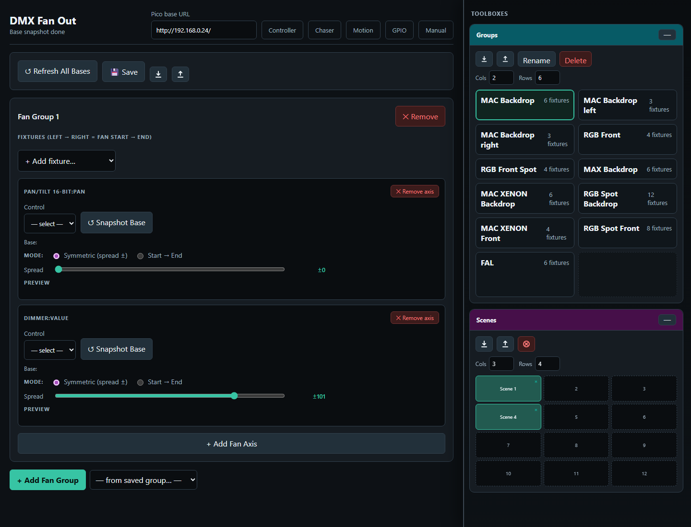

# Pico WiFi DMX User Manual

This manual explains how to use the browser-based DMX controller with the Pico firmware. It is written for daily operation: creating fixtures, controlling lights, saving scenes, building chasers, creating motion effects, and using GPIO buttons or ADC inputs.

The web interface is normally opened from XAMPP:

```text
http://localhost/dmx/
```

The Pico itself is controlled over the network with its base URL, for example:

```text
http://192.168.0.24/
```

Enter the Pico base URL once in any page. The browser stores it and shares it with the other pages.

## Main Pages

| Page | Purpose |
|------|---------|
| Fixture Controller | Fixture profiles, patching, live control, groups, scenes, default and blackout values |
| Chaser | Step-based chases with fade, loop modes, direction, pause/resume, and Pico slot upload |
| Motion FX | Pan/tilt effects such as circle, figure-8, pan swing, and tilt swing |
| Fan Out | Spread one control value across a group of fixtures |
| GPIO Control | Map Pico GPIO buttons and ADC inputs to lighting actions |
| Benchmark | Test Pico HTTP/DMX update performance |

## 1. Fixture Controller


The Fixture Controller is the central page. Use it first when setting up a new show or fixture set.

### Set the Pico Base URL

1. Open `http://localhost/dmx/`.
2. Enter the Pico base URL, for example `http://192.168.0.24/`.
3. Enable **Live send** when you want control changes to be sent immediately to the Pico.
4. Fixture setup changes are autosaved to the XAMPP server. Use JSON export before large changes when you want an extra backup.

### Create a Fixture Profile


A fixture profile describes the DMX personality of one fixture type.

1. Open **Fixture Profiles**.
2. Enter a profile name, mode name, and channel count.
3. Click **Add profile**.
4. Select the profile.
5. Use **Add / Edit Control** to add controls such as dimmer, pan/tilt, RGB, RGBW, RGBWA, wheel, or 16-bit slider.

Each control stores its own DMX channel mapping. For example, a moving head can have:

- Dimmer on channel 1
- Pan/Tilt 16-bit on channels 2/3 and 4/5
- RGBWA color on channels 6-10
- Gobo wheel on channel 12

To change an existing control, click **Edit** in the Fixture Profiles list. The **Add / Edit Control** card opens automatically and loads the selected control. After editing, click **Save control**. The **Fixture Profiles** collapse button also controls the Add / Edit Control card, so both profile editing areas can be hidden together.

### Default and Blackout Values

Each control can store a **Default** value and a **Blackout** value.

Default values are useful for a normal starting look, for example:

- Dimmer open
- Pan/Tilt centered
- RGB white
- Gobo open

Blackout values are useful for quickly shutting down output, for example:

- Dimmer 0
- RGB black
- White and amber 0
- Pan/Tilt at a safe position if needed

For RGB, RGBW, and RGBWA controls, use the color picker for RGB. White and amber channels are edited separately when the fixture type has them.

### Patch Fixtures

Patch fixtures after the profile is ready.

1. Open **Patch Fixtures**.
2. Enter a fixture name.
3. Select the fixture profile.
4. Enter the DMX start address.
5. Set **Count** to the number of fixtures you want to patch.
6. Click **Patch fixture**.

Use **Next free** to find the next available address after already patched fixtures.

When **Count** is greater than 1, the controller creates a numbered run of fixtures. For example, name `RGB Spot` with count `10` creates `RGB Spot 1` through `RGB Spot 10`. The first fixture uses the start address you entered. The following fixtures are spaced by the channel count of the selected fixture profile.

After a multi-fixture patch, the controller asks whether to create a Saved Group for the newly patched fixtures. The suggested group name is the patch name. Press **Cancel** to skip group creation, or enter a name to save the new fixtures as a group.

The patched fixture list is shown as rows of compact cards. Each row represents one consecutive run of the same fixture profile, so two separate MAC runs remain visually separate even when they use the same profile.

### Live Fixture Control


The **Control Surface** shows one card per patched fixture.

Each fixture card contains the controls from its profile:

- Sliders for dimmer and simple channels
- XY pads for pan/tilt
- Color pickers and swatches for color controls
- Wheel buttons for indexed wheel values
- Coarse/fine sliders for 16-bit channels

Use **Default** or **Blackout** on a fixture card to recall the stored values for that fixture only.

Use **Select** to include a fixture in group editing.

When you manually select fixture cards, the control surface stays visible so you can keep building or adjusting the selection. Saved Groups can also be selected from the Saved Groups card to filter the control surface.

## 2. Scenes


The Scene Toolbox is available on the Fixture Controller and Fan Out pages.

Use scenes to store complete looks.

1. Set your desired fixture values.
2. Click an empty scene slot.
3. Enter a scene name.
4. Click a filled slot once to recall it.
5. Use the small `x` on a filled slot to delete it.

Scene recall loads the stored values back into the Fixture Controller, redraws the fixture cards, and updates the live-value snapshot used by the Chaser page.

When **Live send** is enabled and a Pico base URL is set, scene recall also sends the recalled DMX values to the Pico in one batch. When **Live send** is disabled, the scene is recalled in the browser only.

If a saved scene was created before fixtures were repatched, the controller tries to remap old fixture IDs to the current patch by matching the same fixture profile in DMX start-address order. This lets older scenes continue to recall after a fixture run was recreated, as long as the fixture profiles and control IDs still match.

The red **Clear all DMX channels** button clears controller values and calls `/dmx/clear` on the Pico. This clears both live DMX output and the motion base buffer.

The Scene Toolbox sits in the shared **Toolboxes** sidebar. Its slot grid follows the configured rows and columns, and the tile size expands to the available sidebar width while keeping the old minimum slot size.

## 3. Groups


Groups let you control multiple fixtures at once.

### Create a Group

1. Select two or more fixture cards.
2. Click **Save Group**.
3. Enter a group name.
4. The group appears in **Saved Groups**.

### Saved Group Selection


The Saved Groups card shows groups in a compact matrix. Each group has four actions:

- **Select** adds the group to the active group filter.
- **Deselect** removes only that group from the active filter.
- **Rename** changes the saved group name.
- **Delete** removes the saved group.

More than one saved group can be selected at the same time. The control surface shows the union of all fixtures from the selected groups. This makes it possible to work with several fixture groups together without editing the group definitions.

The group bar above the control surface shows how many fixtures are selected and which saved groups are active. Use **Show all** to clear the saved-group filter and return to the full fixture list.

### Edit a Group

1. Load a saved group or select multiple fixtures.
2. Click **Group Edit**.
3. Adjust common controls in the modal.
4. Click **Send all to Pico** to send the group values.

The Group Edit modal only shows controls that exist on all selected fixtures. This prevents accidentally sending values to fixtures with incompatible control layouts.

Use **Default all** or **Blackout all** to recall the stored default or blackout values for every fixture in the selected group.

## 4. Chaser


The Chaser page creates step-based sequences. The main page stays focused on **Participating Controls** and **Edit Step**, while the repeated working tools sit in the **Toolboxes** sidebar.

The Chaser screenshot is captured with the important boxes visible on purpose: **Groups**, **Chases**, **Steps**, and **Browser Playback**. Toolbox headers can be dragged up or down to reorder them in the sidebar. The order is shared with the other pages: if a page does not use one of the toolbox types, the next available toolbox moves up.

### Basic Workflow

1. Open **Chaser**.
2. Select participating fixture controls.
3. Create steps manually or capture values from the Fixture Controller.
4. Set step duration and fade in **Edit Step**.
5. Store the chase in the **Chases** toolbox if you want quick recall.
6. Test timing in **Browser Playback**.
7. Upload the preset to a Pico slot.
8. Play the slot from the Pico.

### Toolbox Sidebar

Controller, Chaser, Motion FX, and Fan Out use a shared right-side toolbox sidebar on desktop-sized screens.

- Drag the vertical resize line on the left edge of the sidebar to change its width.
- The sidebar width is shared across all toolbox pages.
- Double-click the resize line to reset the default width.
- Drag a toolbox by its colored header to reorder the sidebar. The toolbox body is not a drag handle, so slot clicks, sliders, and buttons are safe on touch screens.
- On narrow screens, the sidebar changes into a bottom toolbox drawer.

The Chaser page uses several toolboxes:

- **Groups** filters the fixture list by one or more saved fixture groups. It uses the cyan header, like the group tools on the controller page.
- **Chases** stores complete editable chases in a slot matrix. Clicking an empty slot saves the current chase. Clicking a filled slot loads that chase.
- **Steps** contains the step list and step actions. Use it to add, capture, edit, duplicate, delete, and reorder steps. The box can be resized, and its top buttons remain visible while the list scrolls.
- **Browser Playback** runs the current chase from the browser for checking timing and fades before uploading to the Pico.

Loading a chase from the **Chases** box updates the step list, participating controls, and the currently edited step together. If the chase contains steps, the participating controls are rebuilt from the values stored in the chase, so old fixture/group filters do not hide the controls used by that chase.

The collapse state, toolbox order, shared sidebar width, and the Steps box size are stored by the server UI-state file, so the working layout survives reloads.

### Participating Controls

Participating controls define which fixture controls belong to the chase. This keeps the chaser from editing unrelated channels.

For example, a dimmer chase might include only dimmer controls. A color chase might include only RGB or RGBWA controls.

If no group is selected, all patched fixtures are available. If one or more groups are selected in the Groups toolbox, only fixtures from those groups are shown. The **All**, **None**, **Only**, and **Add** tools let you quickly build a participating-control set for the selected group.

### Chaser Selection Rules

The Chaser page has two different selection modes: defining a new participating-control set, and editing or recalling an existing step. They intentionally behave differently.

When you define participating controls manually:

- If no group is selected, the Participating Controls panel shows all patched fixtures.
- If one or more groups are selected, the panel is filtered to the fixtures in those groups.
- **All** selects every currently visible control.
- **None** clears the participating-control selection and collapses the fixture list.
- The control dropdown plus **Only** selects one matching control type for the selected groups and clears all other controls.
- The control dropdown plus **Add** adds one matching control type for the selected groups without clearing existing participating controls.

When you click a step in the **Steps** toolbox:

- The selected Groups filter is cleared first.
- The step values are checked against the current fixture setup.
- Invalid fixture/control references are removed from the edited step.
- The Participating Controls panel is rebuilt from the chase values.
- Only fixtures and controls that are actually stored in the selected step are shown.
- The Edit Step card shows the same scoped fixture/control set, so editing Step 2 cannot accidentally show or edit unrelated controls from another group or old filter.

When you click a saved chase in the **Chases** toolbox:

- The selected Groups filter is cleared first.
- The saved steps, playback settings, and browser playback settings are loaded.
- The first step becomes the edited step.
- Participating Controls and Edit Step are rebuilt from that loaded step.
- If the saved chase was made before fixtures were repatched, the page tries to remap old fixture IDs to the current setup by matching the same fixture profile in DMX start-address order.
- If no valid step values can be found, the page falls back to the saved participating-control map stored with the chase.

This means group selection is a tool for building or filtering a new participating-control set. Once you edit a saved step or recall a saved chase, the step data itself becomes the source of truth.

### Capture From Fixture Controller

Use **Capture from FC** or **Capture + Add** to read the current Fixture Controller live values and use them as chase step values.

This is useful when you want to build a chase visually:

1. Create a look on the Fixture Controller.
2. Capture it into the Chaser.
3. Change the look.
4. Capture the next step.

### Pico Slot Playback

Chasers can be uploaded to 32 Pico slots. Each slot can run on the Pico without the browser staying open.

Supported playback options:

- Single run
- Loop
- Loop N times
- Forward or reverse direction
- Speed multiplier
- Pause and resume

Each chaser slot supports up to 32 steps.

## 5. Motion FX


Motion FX creates continuous movement for moving lights.

Supported effects include:

- Circle
- Figure-8
- Pan swing
- Tilt swing

Motion FX is relative to the current scene position. This means the effect moves around the position that was last written into the Pico base buffer.

### Recommended Workflow

1. Use the Fixture Controller to position the fixtures.
2. Save or recall a scene.
3. Open Motion FX.
4. Select the fixtures for the effect.
5. Set BPM, pan amplitude, tilt amplitude, and spread.
6. Upload the effect to a Pico slot.
7. Start the slot.

The Motion FX page also has a read-only scene toolbox. Clicking a scene sends the position to the Pico and updates the effect center.

## 6. Fan Out



Fan Out spreads one selected control across an ordered fixture group.

Typical uses:

- Pan fan
- Tilt fan
- Zoom spread
- Dimmer gradient
- Any other offset across fixtures

### Basic Workflow

1. Open **Fan Out**.
2. Create or select a fan group.
3. Add fixtures in the desired order.
4. Select the control to fan, for example Pan.
5. Snapshot or refresh the base values.
6. Adjust the spread.

Fan Out adds offsets on top of the current base values. This keeps the fan relative to the current fixture positions.

The Fan Out page also includes the scene toolbox, so fan looks can be saved and recalled as scenes.

## 7. GPIO Control


GPIO Control maps physical Pico inputs to lighting actions.

Digital GPIO pins can trigger:

- DMX clear
- Output-only clear
- Stop all
- Chaser play, stop, toggle, pause, resume, pause toggle
- Chaser tap tempo
- Motion start, stop, toggle
- Motion tap tempo

ADC pins can control:

- Chaser speed multiplier
- Motion FX BPM

Only GPIO26, GPIO27, and GPIO28 support ADC input on the Pico 2 W.

### Add a Digital Button Mapping

1. Open **GPIO Control**.
2. Click **Add mapping**.
3. Select a free GPIO pin.
4. Choose pull mode and trigger edge.
5. Choose the action.
6. Set the slot number if the action needs one.
7. Upload the config to the Pico.

The page disables reserved pins and pins already used by other mappings.

### Add an ADC Mapping

1. Add an ADC mapping.
2. Select GPIO26, GPIO27, or GPIO28.
3. Choose `chaser_speed` or `motion_bpm`.
4. Set the target slot.
5. Set the min and max value.
6. Upload the config.

ADC values are filtered on the firmware side with a short mean filter to reduce ripple.

### Tap Tempo

Tap actions use the time between button presses.

The beat divider can be set to:

- 1 beat
- 1/2 beat
- 1/4 beat
- 1/8 beat
- 1/16 beat

The firmware ignores very long gaps between taps so stopping for a while does not create an extremely slow tempo when tapping resumes.

## 8. Benchmark


The Benchmark page tests Pico HTTP and DMX update performance.

Use it to compare:

- Single-channel updates
- Scene-sized batch updates
- Large batch updates
- Longer soak tests

The result panel shows:

- Throughput
- Effective DMX channel updates per second
- Average latency
- Median latency
- p95 and p99 latency
- Jitter
- Errors

Use **Export CSV** to save results for later comparison.

## 9. Backup and Import

Most setup data is stored as JSON files on the XAMPP server in the `data/` folder.

The UI also offers export/import buttons for:

- Fixture setup
- Groups
- Scenes
- Chaser setup
- Motion FX setup
- Fan Out setup
- GPIO setup

Use JSON export before large changes so a known-good setup can be restored later.

## 10. Clear Functions

There are two different clear actions:

| Action | What it clears | When to use |
|--------|----------------|-------------|
| DMX clear | Live DMX output and the motion base buffer | Full reset of output and base position |
| Output-only clear | Live DMX output only | Black out output while keeping the stored motion center |

Use output-only clear when you want Motion FX to resume around the same stored center after the blackout.

## Troubleshooting

### The UI does not control the Pico

- Check that the Pico is powered and connected to WiFi.
- Open the Pico URL directly in a browser, for example `http://192.168.0.24/`.
- Make sure the base URL in the UI ends with `/`.
- Enable **Live send** on the Fixture Controller.

### Chaser capture does not contain the expected values

- Move or recall the values on the Fixture Controller first.
- Make sure the participating controls include the controls you want to capture.
- Save or reload the Fixture Controller setup if fixtures were changed recently.

### Motion FX moves around the wrong center

- Recall the desired scene first.
- On the Motion FX page, click the same scene in the scene toolbox.
- Then start the motion slot.

### GPIO mapping does not react

- Check `/gpio/status` or the status panel on the GPIO page.
- Confirm that the selected pin is not reserved or already used.
- Check pull mode and trigger edge.
- For ADC, use only GPIO26, GPIO27, or GPIO28.

### A chaser has more than 32 steps

The firmware supports 32 steps per chaser slot. Keep the UI preset within this limit before uploading to the Pico.
