# Pico WiFi DMX User Manual

This manual explains how to use the browser-based DMX controller with the Pico firmware. It is written for daily operation: creating fixtures, controlling lights, saving scenes, building chasers, creating motion effects, and using GPIO buttons or ADC inputs.

The web interface is normally opened from XAMPP:

```text
http://localhost/dmx/
```

The Pico itself is controlled over the network with its base URL, for example:

```text
http://192.168.0.24/
```

Enter the Pico base URL once in any page. The browser stores it and shares it with the other pages. Across the UI, live Pico updates only happen while a Pico base URL is set; clearing the URL puts the page into browser-only editing.

This applies to every page that can talk to the Pico:

- **Fixture Controller** edits values locally, and only sends DMX changes when the Pico base URL is set.
- **Chaser** can edit steps locally without a URL; live step preview, Chase Playback, and Pico slot actions need a Pico base URL.
- **Motion FX** can edit effect recipes locally without a URL; browser preview, scene-to-Pico center updates, and Pico slot actions need a Pico base URL.
- **GPIO Control** can edit and save mappings locally without a URL; upload, readback, and status polling need a Pico base URL.
- **DMX Buffer Monitor** only polls Pico buffers when a Pico base URL is set.
- **Pico Performance Test** only runs when a Pico base URL is set.

The screenshots in this manual are generated by `scripts/update_user_manual.ps1`. Toolbox screenshots are captured as named page elements, so the manual can be regenerated after UI changes without hand-cropping images.

## Main Pages

| Page | Purpose |
|------|---------|
| Fixture Controller | Fixture profiles, patching, live control, groups, scenes, default and blackout values |
| Chaser | Step-based chases with fade, loop modes, direction, pause/resume, and Pico slot upload |
| Motion FX | Continuous effects for pan/tilt pairs or scalar controls such as dimmer, zoom, iris, prism, and gobo |
| GPIO Control | Map Pico GPIO buttons and ADC inputs to lighting actions |
| DMX Buffer Monitor | Read all 512 values from either the live output frame or the base/position buffer |
| Pico Performance Test | Test Pico HTTP/DMX update performance, buffer readback, and core timing logs |

## 1. Fixture Controller

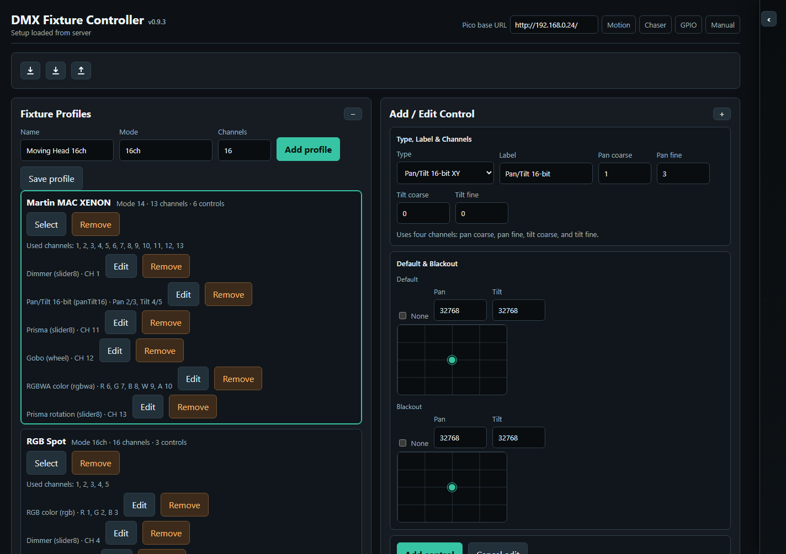

The Fixture Controller is the central page. Use it first when setting up a new show or fixture set.

### Set the Pico Base URL

1. Open `http://localhost/dmx/`.
2. Enter the Pico base URL, for example `http://192.168.0.24/`.
3. Control changes are sent to the Pico when a Pico base URL is set. If the field is empty, the page edits locally only and does not send live DMX updates.
4. Fixture setup changes are autosaved to the XAMPP server. Use JSON export before large changes when you want an extra backup.

### Create a Fixture Profile

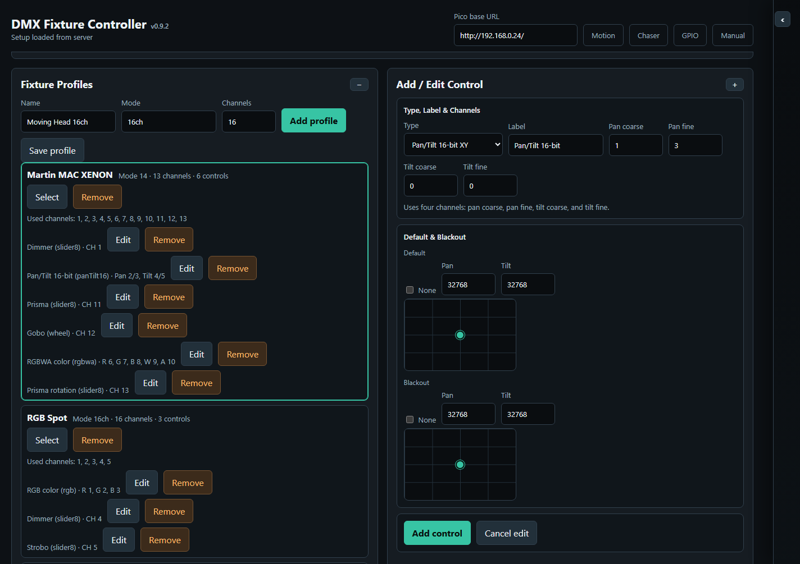

A fixture profile describes the DMX personality of one fixture type.

1. Open **Fixture Profiles**.
2. Enter a profile name, mode name, and channel count.
3. Click **Add profile**.
4. Select the profile.
5. Use **Add / Edit Control** to add controls such as dimmer, pan/tilt, RGB, RGBW, RGBWA, wheel, or 16-bit slider.

Each control stores its own DMX channel mapping. For example, a moving head can have:

- Dimmer on channel 1
- Pan/Tilt 16-bit on channels 2/3 and 4/5
- RGBWA color on channels 6-10
- Gobo wheel on channel 12

To change an existing control, click **Edit** in the Fixture Profiles list. The **Add / Edit Control** card opens automatically and loads the selected control. After editing, click **Save control**. The **Fixture Profiles** collapse button also controls the Add / Edit Control card, so both profile editing areas can be hidden together.

### Default and Blackout Values

Each control can store a **Default** value and a **Blackout** value.

Default values are useful for a normal starting look, for example:

- Dimmer open
- Pan/Tilt centered
- RGB white
- Gobo open

Blackout values are useful for quickly shutting down output, for example:

- Dimmer 0
- RGB black
- White and amber 0
- Pan/Tilt at a safe position if needed

For RGB, RGBW, and RGBWA controls, use the color picker for RGB. White and amber channels are edited separately when the fixture type has them.

### Patch Fixtures

Patch fixtures after the profile is ready.

1. Open **Patch Fixtures**.
2. Enter a fixture name.
3. Select the fixture profile.
4. Enter the DMX start address.
5. Set **Count** to the number of fixtures you want to patch.
6. Click **Patch fixture**.

Use **Next free** to find the next available address after already patched fixtures.

When **Count** is greater than 1, the controller creates a numbered run of fixtures. For example, name `RGB Spot` with count `10` creates `RGB Spot 1` through `RGB Spot 10`. The first fixture uses the start address you entered. The following fixtures are spaced by the channel count of the selected fixture profile.

After a multi-fixture patch, the controller asks whether to create a Saved Group for the newly patched fixtures. The suggested group name is the patch name. Press **Cancel** to skip group creation, or enter a name to save the new fixtures as a group.

The patched fixture list is shown as rows of compact cards. Each row represents one consecutive run of the same fixture profile, so two separate MAC runs remain visually separate even when they use the same profile.

### Live Fixture Control

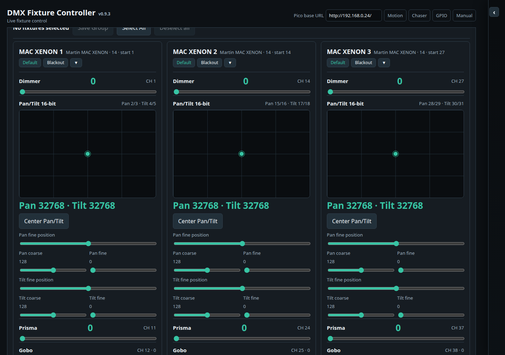

The **Control Surface** shows one card per patched fixture.

Each fixture card contains the controls from its profile:

- Sliders for dimmer and simple channels
- XY pads for pan/tilt
- Color pickers and swatches for color controls
- Wheel buttons for indexed wheel values
- Coarse/fine sliders for 16-bit channels

Wheel / indexed controls require unique DMX option values. If two wheel options use the same DMX value, the Add / Edit Control card refuses to save the control. This prevents ambiguous wheel buttons where the UI could not know which option should be highlighted after recall or chase editing.

Use **Default** or **Blackout** on a fixture card to recall the stored values for that fixture only.

Click a fixture card header or empty card area to include or exclude that fixture for group editing. The selected card uses the same accent outline style as other selectable tiles in the app. Clicking sliders, color controls, wheel buttons, Default, Blackout, or collapse controls does not change fixture selection.

After a hard page reload, no fixture cards are selected automatically. This keeps Group Edit disabled until you deliberately choose the fixtures you want to edit.

Use **Select All** in the group bar above the control surface when you want to select every patched fixture. Use **Deselect all** to clear the current manual selection. When you manually select fixture cards, the control surface stays visible so you can keep building or adjusting the selection. Saved Groups can also be selected from the Groups toolbox to filter the control surface.

### Fixture Controller Toolboxes

The Fixture Controller uses four toolboxes in the shared right-side **Toolboxes** sidebar.

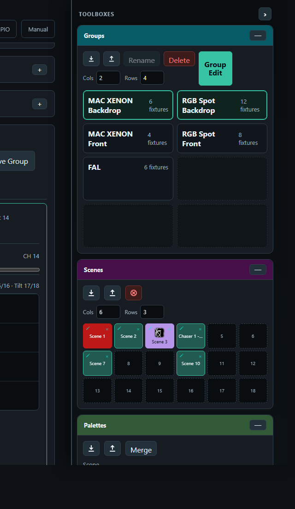

**Groups** stores fixture groups and shares the selected group filter with other toolbox pages. Use it to select fixtures quickly, rename one selected group, delete selected groups after confirmation, import/export group JSON, and open **Group Edit** when the current scope supports it.

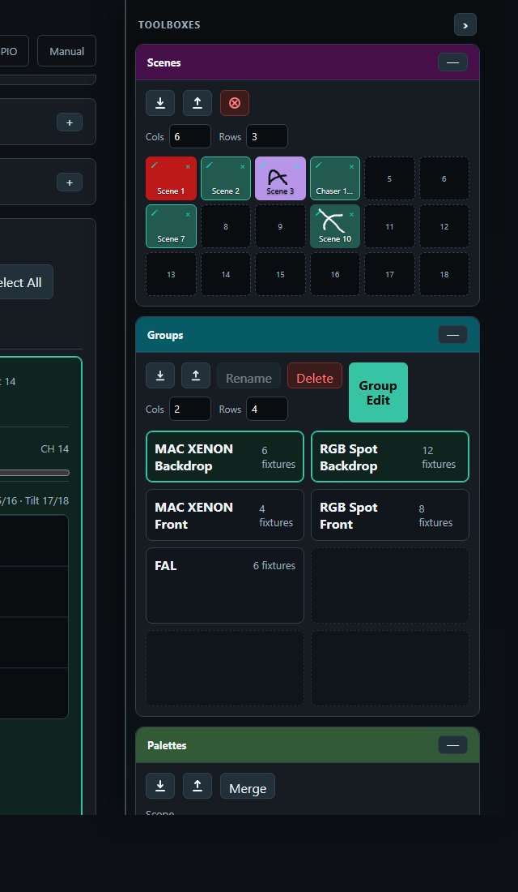

**Scenes** stores complete looks for the current working scope. Empty slots save, filled slots recall, the small `x` deletes, and the small top-left pencil icon opens **Edit Tile** for that slot's name, background, and optional drawing/upload.

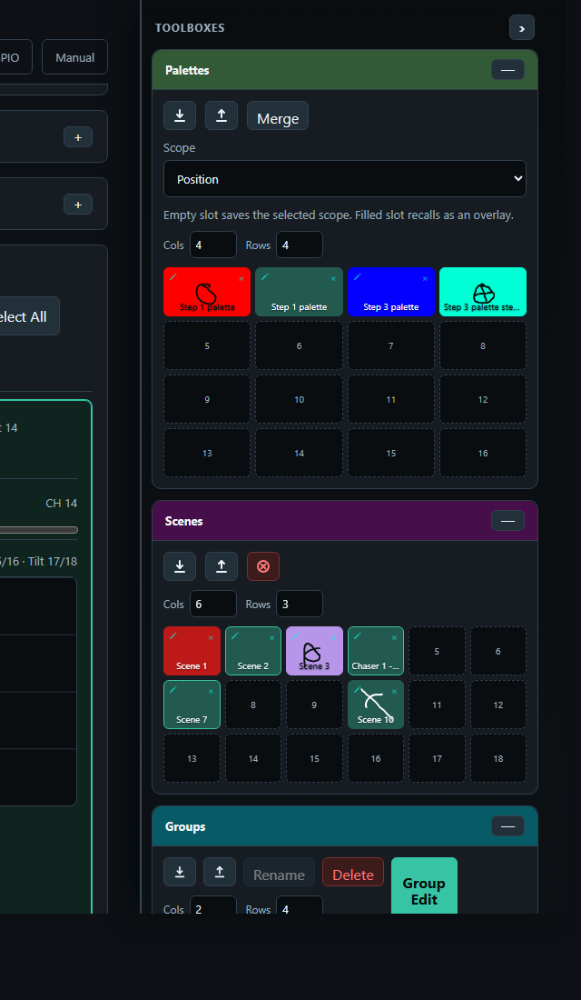

**Palettes** stores reusable value fragments such as positions, colors, gobos, dimmer looks, or Fan Out results. Palette recall applies only the stored controls and leaves unrelated values untouched.

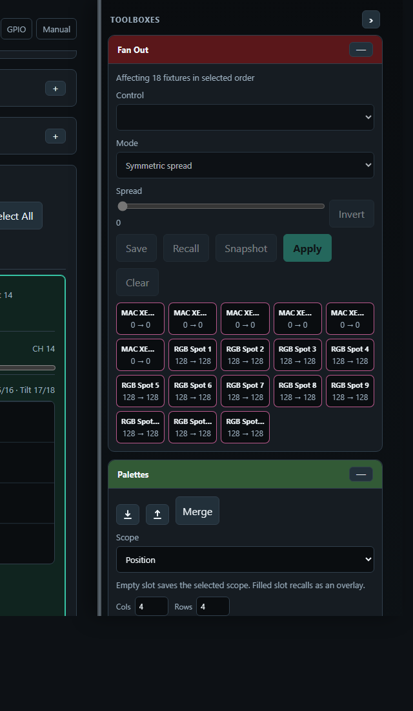

**Fan Out** shapes the currently selected fixtures or groups by spreading one compatible control through the selected order. It is documented in more detail below because its output can be saved as scenes or palettes.

### Fan Out Toolbox

The Fixture Controller includes a **Fan Out** toolbox in the shared Toolboxes sidebar. It shapes the current controller values for the selected group or selected fixture cards, so the result can immediately be saved as a scene.

1. Select one or more Saved Groups, or select fixture cards manually.
2. In **Fan Out**, choose the control to shape, for example Dimmer, Pan, Tilt, or another compatible single-value control.
3. Click **Snapshot** to use the current controller values as the fan base.
4. Adjust **Spread**, or use **Start to end** mode with From/To offsets.
5. Use **Invert** when the spread direction should run through the selected fixtures in the opposite order.
6. The Control Surface updates continuously while you change the fan values.
7. The affected fixture controls are highlighted in the Control Surface.
8. Save the resulting look with the Scene Toolbox if you want to keep the actual DMX look.

The Fan Out toolbox only shows controls that are available on every fixture in the selected set. For pan/tilt controls, Pan and Tilt appear as separate fan targets. Applying a fan writes the calculated values into the controller just like moving the controls by hand. When a Pico base URL is set, the changed DMX values are also sent to the Pico.

Fan Out calculates from a stored base value for each fixture, control, and axis. **Snapshot** stores those base values. In **Symmetric spread**, the spread is added around the base values:

```text
final value = snapshotted base value + spread offset
```

For example, with five fixtures and a spread of `100`, the offsets are `-50`, `-25`, `0`, `+25`, and `+50`. If every fixture has a base value of `128`, the result is `78`, `103`, `128`, `153`, and `178`. If the fixtures have different base values, each fixture still keeps its own base as the starting point.

Use **Save** in the Fan Out toolbox to store the fan setup itself: selected group or fixture IDs, selected control, mode, spread, and From/To offsets. Use **Recall** to restore that fan setup later. Recalling a Fan Out preset reapplies the fan to the controller values; it does not create a scene by itself. Use the Scene Toolbox when you want to store the resulting lighting look.

### Palette Toolbox

The Fixture Controller also includes a **Palettes** toolbox. Palettes are reusable value fragments, while scenes are complete looks for their saved scope.

Use palettes for building blocks such as:

- Positions
- Colors
- Gobos
- Dimmer levels
- Fan Out results that you want to reuse as an overlay

The small top-left pencil icon on a filled palette slot opens **Edit Tile** for that slot. Use **Name** to rename the tile text, and use the visual controls for a background color plus an optional drawn/uploaded visual on top. The visual is independent from the palette scope. The drawing canvas uses the selected background color, and the brush automatically switches between a light and dark stroke for readable contrast. Use **Default background** to restore the standard slot color, or **No icon** to keep only the colored button. Scope still decides which DMX values are saved; the name and visual are readable labels shown in the palette slot grid and stored inside the palette JSON.

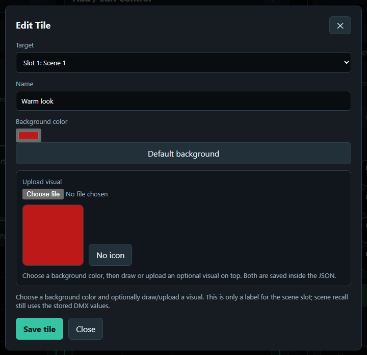

Palette save rules:

- If Fan Out is active, the palette saves only the Fan Out affected controls.
- If Fan Out is not active and fixtures are selected, the palette saves only the selected **Scope** for those fixtures.
- **Position** saves pan/tilt or position controls.
- **Color** saves RGB, RGBW, RGBWA, CMY, CMYK, and controls labeled as color-related.
- **Beam / Gobo** saves controls labeled as gobo, beam, prism, zoom, focus, iris, frost, strobe, or shutter.
- **Dimmer** saves controls labeled as dimmer, intensity, or shutter.
- **All controls** saves every control on the selected fixtures and should be used deliberately.
- If nothing is selected, the palette is not saved; select fixtures or apply Fan Out first.

Palette recall rules:

- Recalling a palette applies only the stored values.
- Unrelated controller values are left unchanged.
- The active group filter is cleared.
- The Control Surface is filtered to the fixtures involved in the palette.
- When a Pico base URL is set, only the recalled palette controls are sent to the Pico.

Filled palette slots recall palettes. Merging is done with the separate **Merge** button so recall and edit actions stay distinct.

Use **Merge** when you have a current fixture selection or active Fan Out result:

- The controller asks which saved palette slot should receive the current scoped values.
- If the current scope matches the saved palette scope, the values are merged and the palette keeps its scope.
- This allows one **Color** palette to contain RGB controls, color wheels, and RGBWA controls from different fixture types while still remaining a Color palette.
- If the current scope differs from the saved palette scope, the controller asks whether to change the saved palette to **All controls** and merge.
- If you cancel a merge prompt, the palette is not changed.

## 2. Scenes And Palettes


The Scene Toolbox is available on the Fixture Controller page.

Use scenes to store fixture/control looks. A scene stores controller values by fixture/control key, not a raw 512-channel DMX dump.

The small top-left pencil icon on a filled scene slot opens the same **Edit Tile** modal used by palettes. A scene can be renamed and can have a background color plus an optional drawn/uploaded visual in its slot. The canvas background follows the selected background color, and the brush color is calculated for contrast against it. **Default background** restores the standard slot color, and **No icon** removes the drawn/uploaded image. This name and visual are only labels for finding the scene quickly; scene save and recall still use the stored fixture values.

1. Set your desired fixture values.
2. Click an empty scene slot.
3. Enter a scene name.
4. Click a filled slot once to recall it.
5. Use the small `x` on a filled slot to delete it.

### Scene Save Rules

Scene saving uses the current working scope:

- If Fan Out is active, the scene saves only the fixtures affected by Fan Out.
- For each Fan Out fixture, the scene saves all controls of that fixture, not only the fanned control. This keeps related values such as Tilt stable when saving a Pan fan.
- If Fan Out is not active and fixtures are selected, the scene saves only the selected fixtures.
- Selected Saved Groups count as selected fixtures, so a group-filtered scene saves only the fixtures in the selected groups.
- If a scene was recalled and the control surface is filtered to that scene's involved fixtures, saving again uses those involved fixtures.
- If nothing is selected, the controller asks before saving all patched fixtures.
- If you cancel that prompt, no scene is saved.

This means a scene is normally scoped to the fixtures you are actually working with. It does not silently save unrelated fixtures unless you explicitly confirm the all-fixtures fallback.

### Scene Recall Rules

Scene recall loads the stored values back into the Fixture Controller, redraws the fixture cards, and updates the live-value snapshot used by the Chaser page.

When a Pico base URL is set, scene recall also sends the recalled DMX values to the Pico in one batch. To work browser-only, clear the Pico base URL before recalling or editing looks.

Recalling a scene clears the active group selection and shared group filter. It then selects the fixtures involved in the recalled scene and filters the Control Surface to only those fixtures. This makes the recalled scene visible without leaving an old group filter active, and without showing unrelated fixtures.

If a saved scene was created before fixtures were repatched, the controller tries to remap old fixture IDs to the current patch by matching the same fixture profile in DMX start-address order. This lets older scenes continue to recall after a fixture run was recreated, as long as the fixture profiles and control IDs still match.

The red **Clear all DMX channels** button clears controller values. When a Pico base URL is set, it also calls `/dmx/clear` on the Pico. This clears both live DMX output and the motion base buffer.

The Scene Toolbox sits in the shared **Toolboxes** sidebar. Its slot grid follows the configured rows and columns, and the tile size expands to the available sidebar width while keeping the old minimum slot size.

## 3. Groups

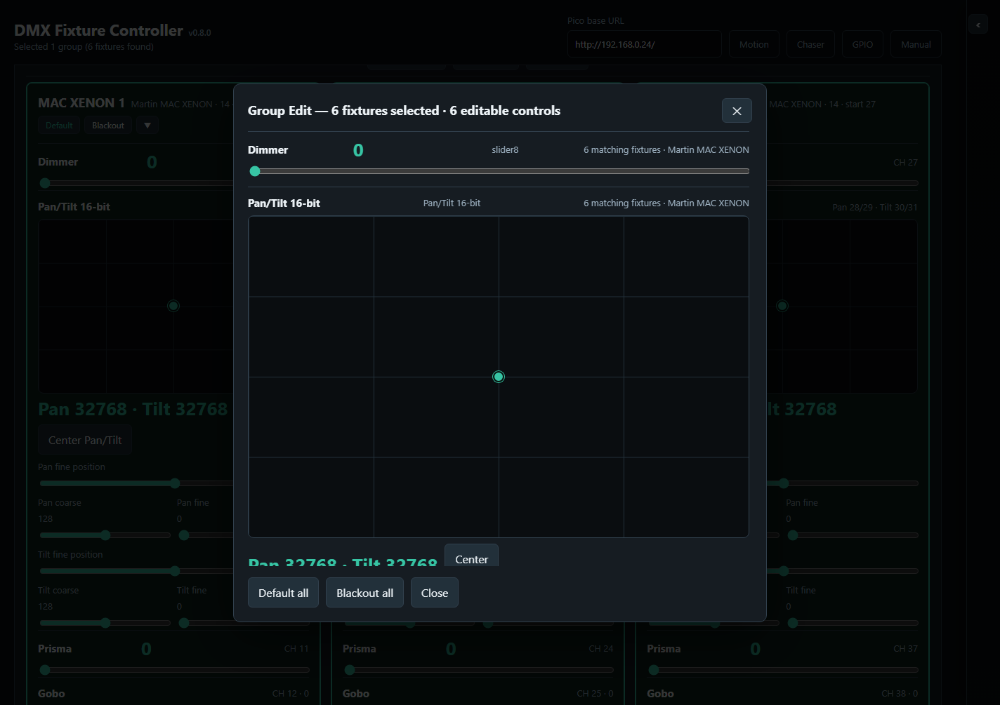

Groups let you control multiple fixtures at once.

### Create a Group

1. Select two or more fixture cards.
2. Click **Save Group**.
3. Enter a group name.
4. The group appears in **Saved Groups**.

### Saved Group Selection

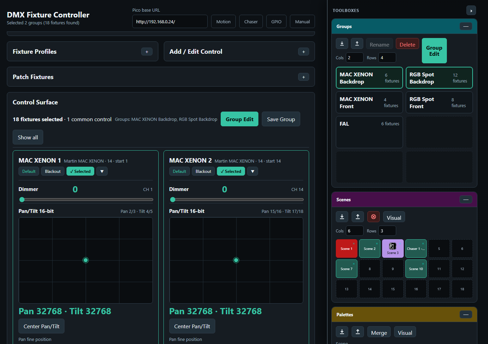

The Saved Groups card shows groups in a compact matrix. Each group has four actions:

- **Select** adds the group to the active group filter.
- **Deselect** removes only that group from the active filter.
- **Rename** changes the saved group name.
- **Delete** removes the saved group.

More than one saved group can be selected at the same time. The control surface shows the union of all fixtures from the selected groups. This makes it possible to work with several fixture groups together without editing the group definitions.

The group bar above the control surface shows how many fixtures are selected and which saved groups are active. Use **Select All** to select every patched fixture explicitly. Use **Deselect all** to clear a manual fixture selection. When a saved-group filter is active, the same button is shown as **Show all** and clears the saved-group filter to return to the full fixture list.

Group selection is shared across toolbox pages that use the Groups toolbox. It is a working filter: selecting groups limits the visible fixtures for controller editing, Fan Out targeting, and Chaser participating-control setup. Recalling a scene, editing a saved chase step, or loading a saved chase clears the group filter because the recalled data itself becomes the source of truth.

### Edit a Group

1. Load a saved group or select multiple fixtures.
2. Click **Group Edit**.
3. Adjust common controls in the modal.

On the Fixture Controller, **Group Edit** lives in the **Groups** toolbox. It requires an explicit fixture selection. If nothing is selected, Group Edit is disabled. Select individual fixture cards, load one or more saved groups, or press **Select All** before opening Group Edit from the Groups toolbox.

The Group Edit modal only shows controls that exist on at least two selected fixtures. Mixed fixture types are allowed; each control is applied only to fixtures that actually have a matching control, so incompatible fixtures are ignored for that control.

When a Pico base URL is set, each Group Edit change is sent to the Pico immediately. To use Group Edit browser-only, clear the Pico base URL first.

If the controller is currently scoped by a recalled scene, recalled palette, or Fan Out result, **Group Edit** uses that scope. In that case it shows only controls that are part of the active scope and exist on at least two selected fixtures. Editing a scoped control writes only to matching fixtures.

Use **Default all** or **Blackout all** to recall the stored default or blackout values for every fixture in the selected group.

### Group Edit Contract

Controller, Chaser, and Motion FX all use the same basic Group Edit idea: the modal is available when the current page scope contains at least one editable control on two or more fixtures. The fixtures do not need to use the same fixture profile.

Keep these rules as the contract:

- Mixed fixture types are allowed.
- A control is editable only when the page can match it by control identity, such as type and label.
- Wheel / indexed controls are stricter: same-named wheels are kept separate when their option lists differ, so a MAC Gobo wheel and a Scanner Gobo wheel are not accidentally edited as one control.
- The modal shows the matching fixture/profile scope for each control.
- Editing a control writes only to fixtures that actually have the matching control.
- Incompatible fixtures remain selected but are ignored for that specific control.
- Group selection is a filter. If groups are selected, Group Edit uses only compatible fixtures inside those groups.
- Direct scope changes, such as Select All, Participating Controls All, or Motion All, clear the saved-group filter and make the page scope the source of truth.

## 4. Chaser

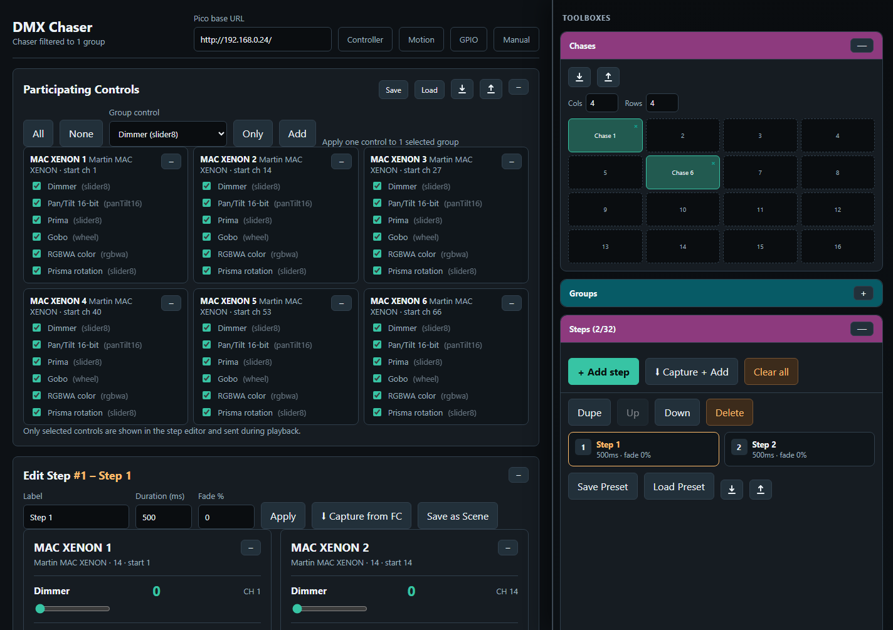

The Chaser page creates step-based sequences. The main page stays focused on **Participating Controls** and **Edit Step**, while the repeated working tools sit in the **Toolboxes** sidebar.

The Chaser screenshot is captured with the important boxes visible on purpose: **Groups**, **Chases**, **Chase Steps**, and **Chase Playback**. Toolbox headers can be dragged up or down to reorder them in the sidebar. The order is shared with the other pages: if a page does not use one of the toolbox types, the next available toolbox moves up.

### Basic Workflow

1. Open **Chaser**.
2. Select participating fixture controls.
3. Create steps with **Add step**, **Capture + Add**, or **Capture from FC**.
4. Set step duration and fade in **Edit Step**.
5. Store the chase in the **Chases** toolbox if you want quick recall.
6. Test timing in **Chase Playback**.
7. Click an empty Pico slot to upload the current chase to that slot.
8. Play the slot from the Pico.

### Toolbox Sidebar

Controller, Chaser, and Motion FX use a shared right-side toolbox sidebar on desktop-sized screens.

- Drag the vertical resize line on the left edge of the sidebar to change its width.
- The sidebar width is shared across all toolbox pages.
- Double-click the resize line to reset the default width.
- The page content and the toolbox sidebar scroll independently. The page scrollbar sits beside the toolbox separation line, while the toolbox scrollbar stays inside the toolbox sidebar.
- Use the arrow button in the Toolboxes header to collapse or reopen the whole sidebar. The collapsed state is shared across toolbox pages.
- Drag a toolbox by its colored header to reorder the sidebar. The toolbox body is not a drag handle, so slot clicks, sliders, and buttons are safe on touch screens.
- On narrow screens, the sidebar changes into a bottom toolbox drawer.

The Chaser page uses several toolboxes:

- **Groups** filters the fixture list by one or more saved fixture groups. It uses the cyan header, like the group tools on the controller page.

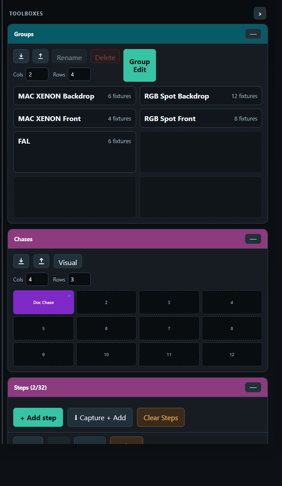

- **Chases** stores complete editable chases in a slot matrix. Clicking an empty slot saves the current chase. Clicking a filled slot loads that chase.
- The small top-left pencil icon on a filled **Chases** slot opens **Edit Tile** for the chase name, background color, and optional drawn/uploaded visual. **Default background** restores the standard slot color, and **No icon** removes the overlay image. This is only a label; loading a chase still uses the stored chase steps and playback settings.

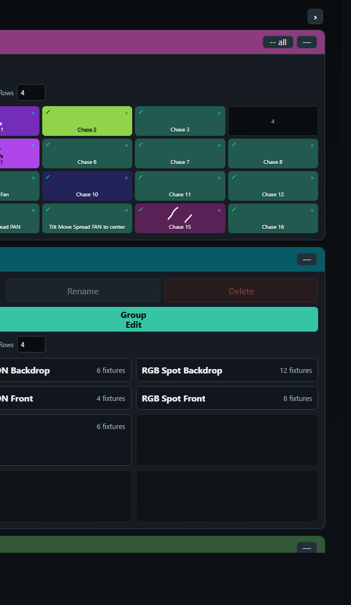

- **Palettes** stores and recalls reusable step fragments. Clicking an empty palette slot saves the currently selected step's fixture/control values to the shared palette JSON. Clicking a filled palette slot recalls compatible values into the selected step and rebuilds **Participating Controls** from the palette's stored fixture/control keys. If no step is selected, Chaser creates a new selected step from the palette. **Merge** adds the selected step's values into an existing palette; if the palette scope differs, Chaser asks before changing it to **All controls**. The small top-left pencil icon opens **Edit Tile** for a saved palette slot's name and visual appearance. When a Pico base URL is set, recalled palette values are also sent to the Pico.

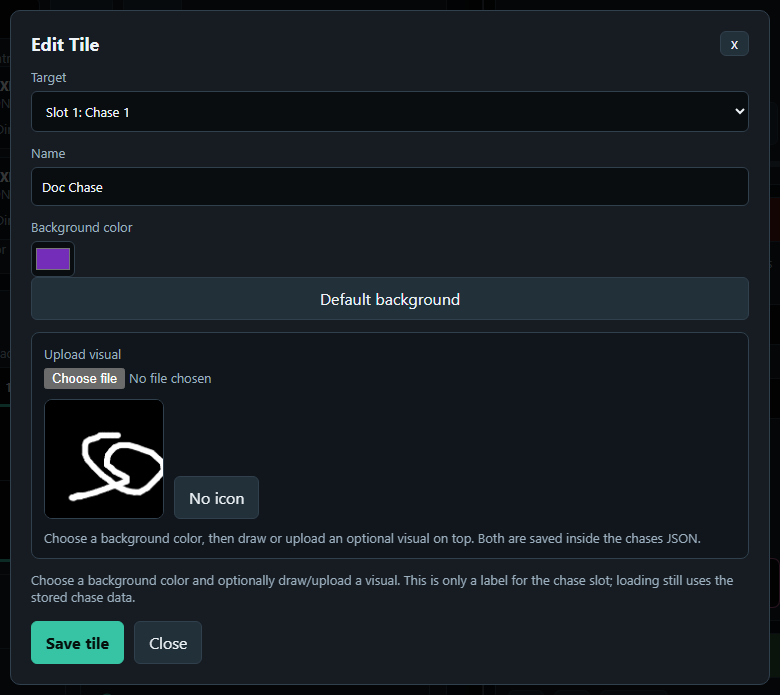

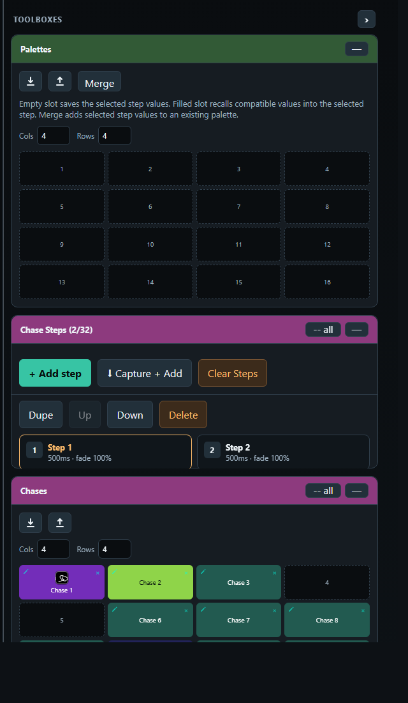

- **Chase Steps** contains the step list and step actions. Use it to add, capture, edit, duplicate, delete, and reorder steps. In the Toolboxes sidebar, drag the lower edge of the Chase Steps box to set its height. The top buttons remain visible while the step list scrolls inside the box.
- **Chases**, **Chase Steps**, and **Chase Playback** share one toolbox color and collapse together. Use **-- all** on any of those boxes to collapse the whole color group, and **+ all** to reopen it.

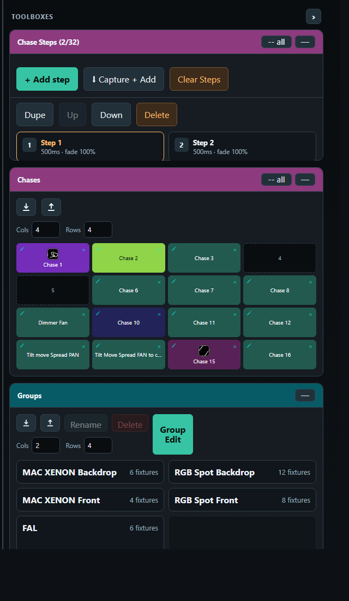

- **Fan Out** is a live step-shaping tool. It works on the currently selected step and writes directly into **Edit Step** as soon as you change the Fan Out mode, spread, or range values. There is no separate Snapshot or Apply action on the Chaser page.
- **Fan Out control selection** is filtered by the selected step. The control dropdown only shows compatible single-value controls that are actually part of the selected step's participating controls and exist on at least two fixtures. If one or more groups are selected, the same rule is applied inside the selected groups only.
- **Invert** reverses the fixture order for the Fan Out calculation. Use it when the spread shape is right but should run from the opposite side of the fixture row.
- **Fan Out base values** come from the values currently displayed in **Edit Step**. Selecting another step, loading another chase, capturing values, or using **Group Edit** refreshes the Fan Out base from the step values now shown on screen. This keeps spread calculations from drifting away from the edited step.
- **Clear** in the Chaser Fan Out toolbox resets the Fan Out shaping controls to neutral. It does not recall an older preset and it does not undo values that have already been written into the selected step.
- Editing **Edit Step**, using **Group Edit**, and changing **Fan Out** updates the selected step immediately. When a Pico base URL is set, those changed selected-step values are also sent to the Pico. Chase Playback sends the current chase continuously while it runs and therefore requires a Pico base URL.

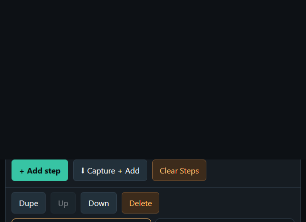

- **Chase Playback** runs the current chase from the browser for checking timing and fades before uploading to the Pico. The **Fade % (all steps)** field applies one fade value to every step immediately. Use **Edit Step > Fade %** when one step needs its own fade value.
- While Chase Playback runs, the currently playing step automatically becomes the selected step. This means **Edit Step** follows the chase visually and always shows the values of the last played step. Recalling a saved chase still selects Step 1 first, so playback starts from a predictable view.
- Selecting a step in **Chase Steps** or manually changing controls in **Edit Step** stops browser Chase Playback. This prevents playback from immediately overwriting the values you are trying to edit.

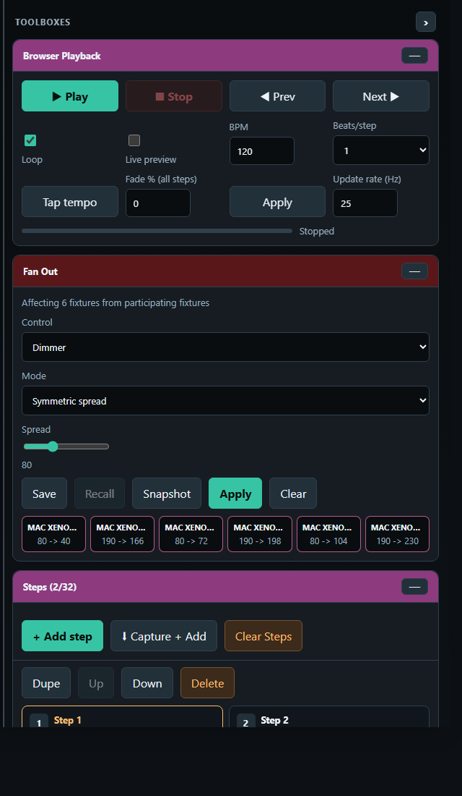

On page load, the Chaser working area starts with no steps selected. Use the **Chases** toolbox to recall a saved chase. Loading a chase from the **Chases** box updates the step list, selects Step 1, and rebuilds participating controls and the currently edited step together. If the chase contains steps, the participating controls are rebuilt from the values stored in the chase, so old fixture/group filters do not hide the controls used by that chase.

The collapse state, toolbox order, shared sidebar width, and the user-defined Chase Steps box height are stored by the server UI-state file, so the working layout survives reloads. Collapsing **Participating Controls** or **Edit Step** only hides that card body: the sticky page header keeps the same height, and the next card moves up to use the freed space.

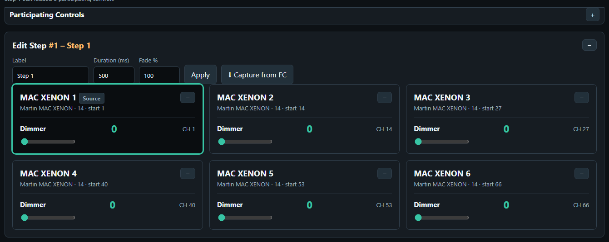

### Chase Steps Toolbox Buttons

The **Chase Steps** toolbox uses shared action buttons instead of per-step buttons. Click a step card to select the step first; the selected step is highlighted and loaded into **Edit Step**.

- **Add step** creates a new selected step from the stored default values of the currently participating controls. If a fixture profile has no custom default for a control, Chaser uses the control type fallback.
- **Capture + Add** creates a new selected step only when Fixture Controller live values exist for at least one currently participating control. If no matching live values are available, no empty step is created.
- **Clear Steps** deletes all current working steps after confirmation. It does not delete saved Chases toolbox entries or Pico slot payloads.
- **Dupe** duplicates the selected step directly after itself and selects the copy.
- **Up** and **Down** move the selected step in the step order and keep the same step loaded in **Edit Step**.
- You can also drag a step card with mouse or touch and drop it before or after another step card to reorder the chase. A short click still selects the step. The selected step and the currently playing step stay attached to the same step data after the move.
- **Delete** removes the selected step. If another step remains, it becomes the selected step.

### Participating Controls

Participating controls define which fixture controls belong to the chase. This keeps the chaser from editing unrelated channels.

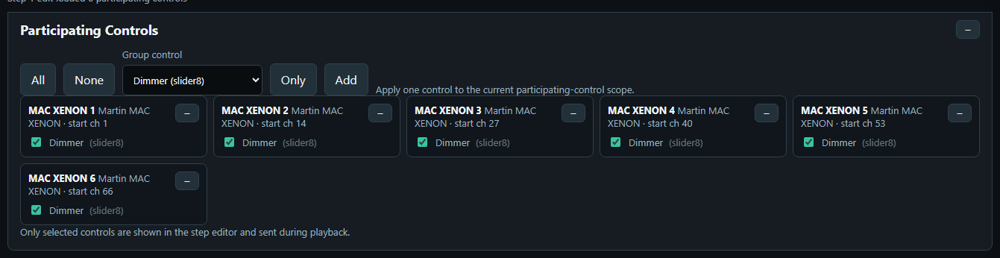

For example, a dimmer chase might include only dimmer controls. A color chase might include only RGB or RGBWA controls.

If no group is selected, all patched fixtures are available. If one or more groups are selected in the Groups toolbox, only fixtures from those groups are shown while you are choosing the scope. Any direct change in **Participating Controls** then clears the group selection. This avoids mixing two different filters: after you press **All**, **None**, **Only**, **Add**, or tick an individual checkbox, the participating-control set becomes the source of truth.

The **Group control** dropdown is built from the fixtures currently visible in the participating-control scope, not from the controls that are already ticked. With no Groups filter, the dropdown stays based on all visible patched fixtures even after **Only** narrows the selected participating controls. With a Groups filter, the dropdown is based on the selected groups. When an edited step is active, the visible step fixtures define the dropdown scope.

**All** selects every valid participating control for all patched fixtures, clears the Groups filter, expands the participating fixture list, stops browser Chase Playback, clears the selected step, clears **Edit Step**, clears the Source fixture, and resets Fan Out bases. Existing steps in **Chase Steps** are not deleted. After **All**, use **Add step**, **Capture + Add**, or **Group Edit** to create or edit a step from the full participating-control scope.

**Group Edit** edits the current participating-control scope. It becomes available when the current scope contains at least one matching selected control on two or more participating fixtures, even when those fixtures use different fixture profiles. A step does not need to be selected first. If no step is selected, the first Group Edit value change creates a new step from the current participating controls and writes the edit into that step. If a step is selected, Group Edit edits that selected step.

The fixtures may use different profiles; the modal only shows matching controls that are actually selected as participating controls and exist on at least two fixtures. For example, if only Dimmer is selected, Group Edit opens with Dimmer only and applies it to every involved fixture that has a matching Dimmer control.

Group Edit uses the **Source** fixture from **Edit Step** as the reference value. Opening the modal does not automatically overwrite the other fixtures. Use **Apply source** on one control to copy that Source value to all matching participating fixtures for that control only. Use **All** at the lower-left of the modal to copy the Source values for every editable control in the modal.

### Chaser Selection Rules

The Chaser page has two different selection modes: defining a new participating-control set, and editing or recalling an existing step. They intentionally behave differently.

Keep these rules as the contract for the Chaser page:

- **Participating Controls** define the fixture/control scope for new steps and for Group Edit.
- **Edit Step** shows the currently selected step, not a separate preview copy.
- If a saved chase is recalled, Step 1 is selected immediately and becomes the visible **Edit Step**.
- If **Chase Playback** is running, playback overrules manual step rendering: every played step automatically becomes the selected step and redraws **Participating Controls** plus **Edit Step**.
- During fades, **Edit Step** updates the existing sliders, readouts, XY dots, colors, and wheel highlights continuously from the interpolated playback values. The full card is only rebuilt when the played step changes.
- When playback stops or pauses, the last played step remains selected.
- Manual previous/next playback also selects the stepped-to chase step and redraws **Edit Step**.
- Group filters are only temporary scope builders. Direct Participating Controls changes clear the group filter.
- **All** clears the selected step/edit context but keeps the existing step list unchanged.
- **Group Edit** does not require a selected step. If no step is selected, the first Group Edit value change creates a new step from the current participating controls. If a step is selected, Group Edit edits that step.

When you define participating controls manually:

- If no group is selected, the Participating Controls panel shows all patched fixtures.
- If one or more groups are selected, the panel is temporarily filtered to the fixtures in those groups.
- **All** selects every currently visible control and clears the group selection.
- **None** clears the participating-control selection, collapses the fixture list, and clears the group selection.
- The control dropdown lists controls from the selected groups while a group filter is active. If no group is selected, it lists controls from the current participating-control scope.
- The control dropdown plus **Only** selects one matching control type from the current scope, clears all other controls, and then clears the group selection.
- The control dropdown plus **Add** adds one matching control type from the current scope without clearing existing participating controls, then clears the group selection.
- Ticking or unticking an individual participating-control checkbox also clears the group selection.

When you click a step in the **Chase Steps** toolbox:

- The step values are checked against the current fixture setup.
- Invalid fixture/control references are removed from the edited step.
- The Participating Controls panel is rebuilt from the chase values.
- If no group is selected, only fixtures and controls that are actually stored in the selected step are shown, and **Group Edit** becomes step-dependent.
- If a group is selected, the selected step is filtered to that group and **Group Edit** uses the grouped fixtures as its edit scope.
- The Edit Step card shows the same scoped fixture/control set, so editing Step 2 cannot accidentally show or edit unrelated controls from another group or old filter.

When you click a saved chase in the **Chases** toolbox:

- The selected Groups filter is cleared first.
- The saved steps, playback settings, and Chase Playback settings are loaded.
- The first step becomes the edited step.
- Participating Controls and Edit Step are rebuilt from that loaded step.
- If the saved chase was made before fixtures were repatched, the page tries to remap old fixture IDs to the current setup by matching the same fixture profile in DMX start-address order.
- If no valid step values can be found, the page falls back to the saved participating-control map stored with the chase.

This means group selection is a tool for building, filtering, and group-editing a step. Loading a saved chase clears the group filter because the recalled chase data becomes the source of truth. After recall, **Group Edit** can still become available without a selected group because it uses the fixtures participating in the selected step.

### Create Chase Steps

A chase step stores values for the selected **Participating Controls**. It does not store every patched fixture automatically.

To create a step manually:

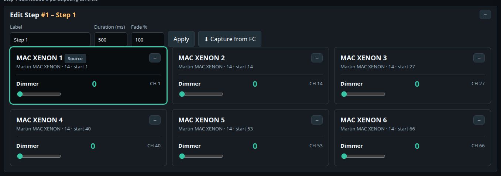

1. Select the controls that should participate in **Participating Controls**.
2. In the **Chase Steps** toolbox, click **Add step**.
3. Click the new step in the **Chase Steps** list.
4. In **Edit Step**, set **Label**, **Duration (ms)**, and **Fade %**.
5. Adjust the controls shown in **Edit Step**. Those control values are written into the selected step immediately. When a Pico base URL is set, they are also sent to the Pico.
6. Click **Apply** after changing the label, duration, or fade.

**Add step** starts from the stored default values of the selected participating controls. If a fixture profile has no custom default for a control, Chaser uses the control type fallback: centered pan/tilt, zero for sliders, wheels, and color channels.

After **Add step** or **Capture + Add**, the first fixture in the new step is automatically marked as the **Source** fixture in **Edit Step**. Click another fixture card in **Edit Step** to make it the Source fixture. Group Edit uses the Source fixture's current step values as its starting values before writing changes to the matching participating fixtures.

Use the **Palettes** toolbox when the selected step should become a reusable fragment. Empty palette slots save exactly the selected step's stored values, not the whole chase and not all DMX channels. Filled palette slots recall compatible palette values into the selected step and make the palette's stored controls the active participating-control scope. Other values already stored in the step remain stored, but **Edit Step** focuses on the recalled palette controls. If no step is selected, recalling a palette creates a new selected step from that palette.

To capture a new step from the Fixture Controller:

1. Open **Fixture Controller** in another browser tab or window.
2. Build the look there by moving controls, recalling a scene, or recalling a palette.
3. Return to **Chaser**.
4. Make sure **Participating Controls** contains the controls you want to capture.
5. In the **Chase Steps** toolbox, click **Capture + Add**.

**Capture + Add** creates a new step and copies the current Fixture Controller live values for the selected participating controls.

To capture into an existing step:

1. Click the step in the **Chase Steps** list.
2. Build the wanted look in **Fixture Controller**.
3. Return to **Chaser**.
4. In **Edit Step**, click **Capture from FC**.

**Capture from FC** updates the selected step with the current Fixture Controller live values for the selected participating controls.

### Capture From Fixture Controller

Use **Capture from FC** or **Capture + Add** to read the current Fixture Controller live values and use them as chase step values.

This is useful when you want to build a chase visually:

1. Create a look on the Fixture Controller.
2. Capture it into the Chaser.
3. Change the look.
4. Capture the next step.

If Chaser reports that no Fixture Controller values are available, open the Fixture Controller page and move a control or recall a scene first. Capture only reads controls that are selected as participating controls, so unselected controls are ignored.

### Pico Slot Playback

Chasers can be uploaded to 32 Pico slots. Each slot can run on the Pico without the browser staying open. The Pico slot strip is the upload target: click an empty slot to upload the current chase. Click a loaded slot once to select it for play, pause, resume, speed, or stop. Click the selected loaded slot again if you want to replace it with the current chase; the page asks before overwriting.

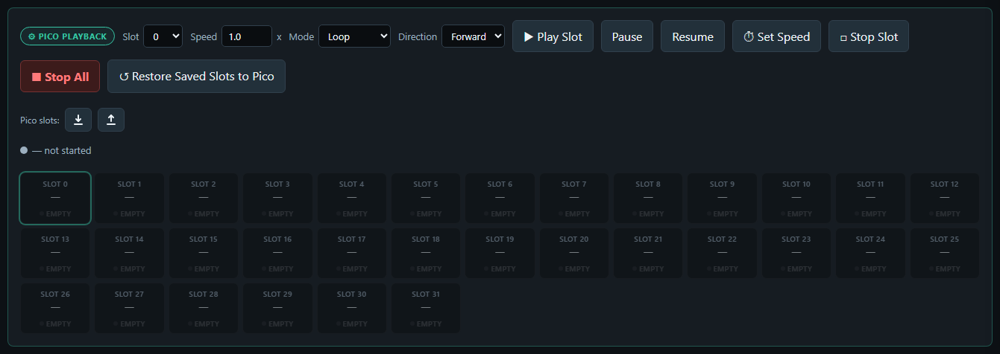

Supported playback options:

- Single run
- Loop
- Loop N times
- Forward or reverse direction
- Speed multiplier
- Pause and resume

Each chaser slot supports up to 32 steps.

## 5. Motion FX

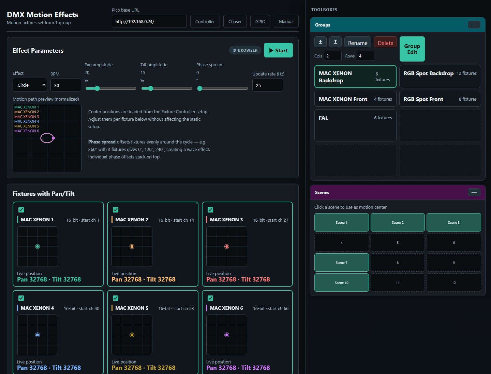

Motion FX creates continuous effects for one selected effect target at a time. It can drive a combined pan/tilt target, or one scalar DMX target such as dimmer, prism, gobo, zoom, or iris.

Supported effects include:

- Pan/tilt targets: Circle, Figure-8, Pan swing, Tilt swing
- Scalar targets: Sine, Pulse

Pan/tilt is treated as one combined two-axis target. Pan/tilt effects are relative to the current scene position, so the effect moves around the position that was last written into the Pico base buffer. Scalar controls are one-axis targets and use their displayed center value plus the **Amplitude** slider as the effect depth.

The **Participating Controls** panel uses an **Effect target** dropdown. The default target is **None**. With **None** selected, no fixture tiles are enabled, Group Edit is disabled, and no effect can be played or uploaded.

Hard reload, including Ctrl+F5, resets **Effect target** to **None** and clears playback participation. Normal navigation away from Motion FX and back in the same browser tab restores the current working target, fixture participation, and parameters from session state. The saved server preset is not auto-applied on page load; use **Load**, import a Motion JSON file, or recall a saved **Effect** tile when you want to explicitly restore saved target and participant data.

One effect can only target one control type at a time: either pan/tilt, or one scalar control type. Choosing an effect target filters the fixture matrix to compatible fixtures, but it does not automatically enable those fixtures. This keeps target choice separate from fixture participation and prevents mixed targets such as dimmer plus gobo plus pan/tilt in one effect.

The **Participating Controls** card can be collapsed when you only need the toolboxes. In collapsed mode it stays compact and does not change the sticky page-header height.

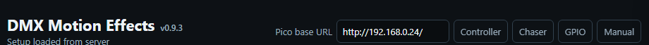

The fixture matrix is a selection and preview surface:

- Click a fixture tile to include or exclude it from the effect.
- Use **All** to clear any group filter and enable every fixture for the current target.
- Use **None** to disable every visible fixture for the current target.
- Selecting groups applies an additional filter and enables compatible fixtures inside the selected groups.
- Pan/tilt targets show a small XY plot with the current position.
- Scalar targets show a small value bar with the current value.

Center values come from the current base buffer or from recalling a scene as the motion center. Phase spread, amplitude, BPM, and effect shape are set in the **Effect Parameters** toolbox. The amplitude controls are target-aware and effect-aware. Circle and Figure-8 show **Pan amp** and **Tilt amp**. Pan Swing shows only **Pan amp**. Tilt Swing shows only **Tilt amp**. Scalar effects show one **Amplitude** slider. Hidden axes are forced to zero for preview and Pico upload, but their last two-axis values are remembered when you return to Circle or Figure-8.

The **Effect** dropdown is target-aware. It only shows effects that make sense for the selected **Effect target**.

The same target rules are used for Pico upload. Pan/tilt and scalar effects can be uploaded to one of the Pico Motion slots, and the Pico reads the effect center from its base buffer while playing.

The Motion FX page also includes the shared **Palettes** toolbox. Clicking a palette recalls any values that are compatible with Motion FX and uses them as the current effect center. For example, a position palette can set pan/tilt centers, while a dimmer or beam palette can set scalar centers. The small pencil opens **Edit Tile** so palette names and visuals can be adjusted from Motion too. Motion recalls, imports, exports, and saves the shared palette JSON.

The **Effects** toolbox stores reusable effect recipes. Click an empty effect slot to save the selected Effect target, participating fixtures, effect type, BPM, amplitudes, spread, and phase offsets. Effects do not store the current center/base values, so the same saved effect can be reused with different scene or palette centers. Clicking a saved effect recalls the recipe without sending DMX and without uploading to a Pico slot. The small pencil opens **Edit Tile** for the effect name, background, and optional drawing/upload.

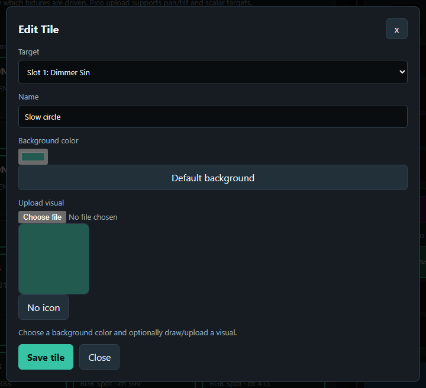

**Effect Parameters** and **Effects** share one toolbox color and collapse together. Use **-- all** on either box to collapse the whole effect group, and **+ all** to reopen it.

### Motion FX Toolboxes

The Motion FX page uses five toolboxes in the shared sidebar.

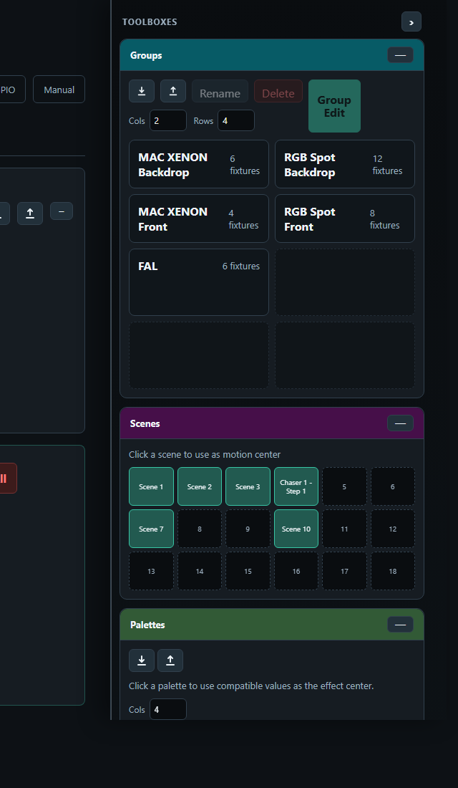

**Groups** filters the fixture matrix for the selected effect target. When **Effect target** is **None**, Group Edit is disabled. Choosing a real target does not automatically enable fixtures for playback, but it does make Group Edit available when two or more fixtures have that target. For example, after a hard reload, choosing **Dimmer** lets Group Edit work across every MAC and RGB Spot fixture that has a Dimmer control while playback participation remains off. Pressing **All** clears the group filter and enables every fixture available for the current target. Selecting one or more groups enables compatible fixtures inside those groups. If some fixtures are already enabled, Group Edit uses that enabled subset; if none are enabled yet, Group Edit uses all fixtures compatible with the selected target.

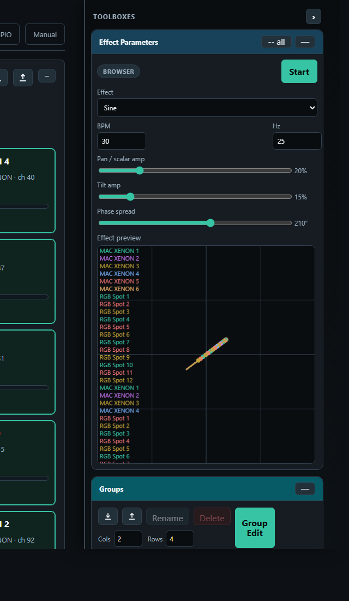

**Effect Parameters** is the live effect editor. It contains the target-aware effect dropdown, BPM, amplitude, phase spread, browser preview controls, and the Pico slot upload/play controls. The shown amplitude controls follow the selected effect: two-axis effects show both axes, Pan Swing and Tilt Swing show only the moving axis, and scalar targets show one **Amplitude** control.

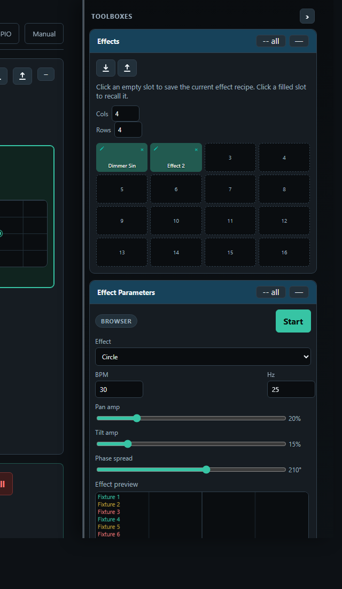

**Effects** stores reusable effect recipes. It saves the selected target, fixture participation, effect type, BPM, amplitude, spread, and phase offsets. It does not store fixed center values.

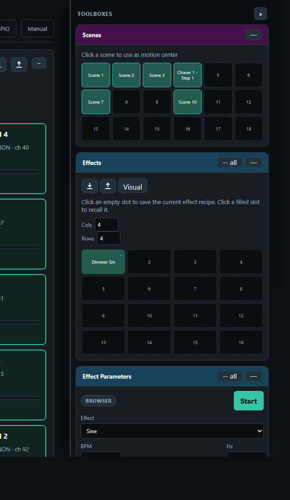

**Scenes** is read-only on Motion FX. Recalling a scene updates the motion center/base values used by effects. When a Pico base URL is set, the stored values are also sent to the Pico.

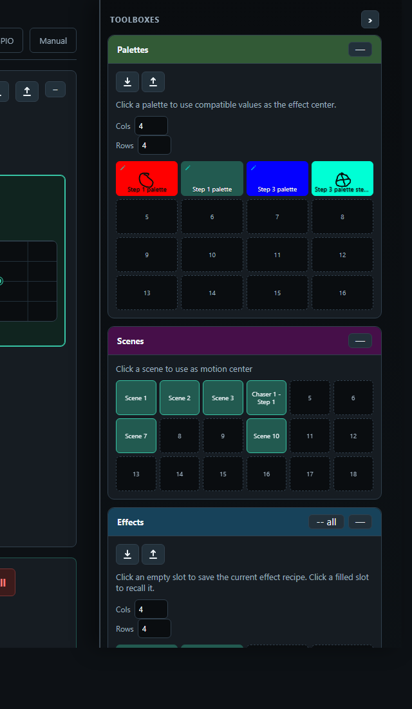

**Palettes** recalls compatible palette values into Motion FX. A position palette can set pan/tilt centers, while color, dimmer, or beam palettes can set scalar centers when the selected effect target matches.

### Pico Motion Slots

The Pico Motion slot upload now uses the same selected **Effect target** as the browser page.

- If the target is pan/tilt, the uploaded slot stores pan and tilt channel addresses and plays two-axis effects.
- If the target is pan/tilt, one-axis effects still store the pan/tilt channel addresses, but unused amplitude axes are uploaded as zero: Pan Swing uses `AMP1` and zero `AMP2`; Tilt Swing uses zero `AMP1` and `AMP2`.
- If the target is scalar, the uploaded slot stores that one control's DMX channel address and plays one-axis effects such as sine or pulse. Scalar uploads use `AMP1` for **Amplitude** and force `AMP2` to zero.
- Click an empty Pico slot to upload the current effect to that slot.
- Click a loaded slot once to select it for start, stop, or BPM changes.
- Click the selected loaded slot again to replace it with the current effect; the page asks before overwriting.
- Slots store channel mappings, BPM, amplitude, spread, effect type, and target phase. They do not store fixed center values.
- The center value is read from the Pico base buffer during playback. This means a scene recall or live controller change can define the center before the slot starts.
- Up to 64 Motion FX slots can be loaded on the Pico.

For scalar targets, set the current value first, then upload/start the slot. For example, set a dimmer to its desired base brightness and use Sine if you want the Pico to pulse above and below that base value.

### Recommended Workflow

1. Use the Fixture Controller to position the fixtures.
2. Save or recall a scene.
3. Open Motion FX.
4. Select one **Effect target**.
5. Set BPM, effect shape, amplitude, and spread in the **Effect Parameters** toolbox.
6. Optionally recall a palette from the **Palettes** toolbox to set the center for the selected target.
7. Optionally save or recall the recipe from the **Effects** toolbox.
8. Click an empty Pico slot to upload the effect, then start the slot when you want autonomous playback without browser timing jitter.
9. Use browser playback from the **Effect Parameters** toolbox when you want quick live testing before uploading.

The Motion FX page also has a read-only scene toolbox. Clicking a scene updates the effect center. When a Pico base URL is set, it also sends the position to the Pico.

## 6. GPIO Control

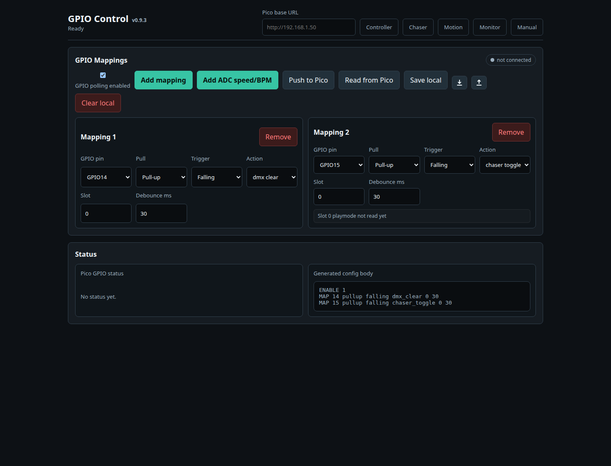

GPIO Control maps physical Pico inputs to lighting actions.

GPIO Control does not use the shared toolbox sidebar. Its setup is kept in normal page panels because GPIO mapping is configuration work, not a live fixture/scene/palette workflow.

The GPIO editor loads its mapping setup from the XAMPP server first, using `gpio_setup.php` and `data/gpio_setup.json`. Browser storage is only a fallback if the server file is not available. Adding, removing, or changing a mapping autosaves the setup back to the server, so a PC and iPad should show the same mappings after reload.

Digital GPIO pins can trigger:

- DMX clear
- Output-only clear
- Stop all
- Chaser play, stop, toggle, pause, resume, pause toggle
- Chaser tap tempo
- Motion start, stop, toggle
- Motion tap tempo

ADC pins can control:

- Chaser speed multiplier
- Motion FX BPM

Only GPIO26, GPIO27, and GPIO28 support ADC input on the Pico 2 W.

### Add a Digital Button Mapping

1. Open **GPIO Control**.
2. Click **Add mapping**.
3. Select a free GPIO pin.
4. Choose pull mode and trigger edge.
5. Choose the action.
6. Set the slot number if the action needs one.
7. Upload the config to the Pico.

The page disables reserved pins and pins already used by other mappings.

Editing the mapping saves the setup on the XAMPP server, but the Pico only receives it after **Push to Pico**. Use **Read from Pico** when the Pico already has the mapping you want to bring back into the editor.

### Add an ADC Mapping

1. Add an ADC mapping.
2. Select GPIO26, GPIO27, or GPIO28.
3. Choose `chaser_speed` or `motion_bpm`.
4. Set the target slot.
5. Set the min and max value.
6. Upload the config.

ADC values are filtered on the firmware side with a short mean filter to reduce ripple.

### Tap Tempo

Tap actions use the time between button presses.

The beat divider can be set to:

- 1 beat
- 1/2 beat
- 1/4 beat
- 1/8 beat
- 1/16 beat

The firmware ignores very long gaps between taps so stopping for a while does not create an extremely slow tempo when tapping resumes.

## 7. Pico Performance Test

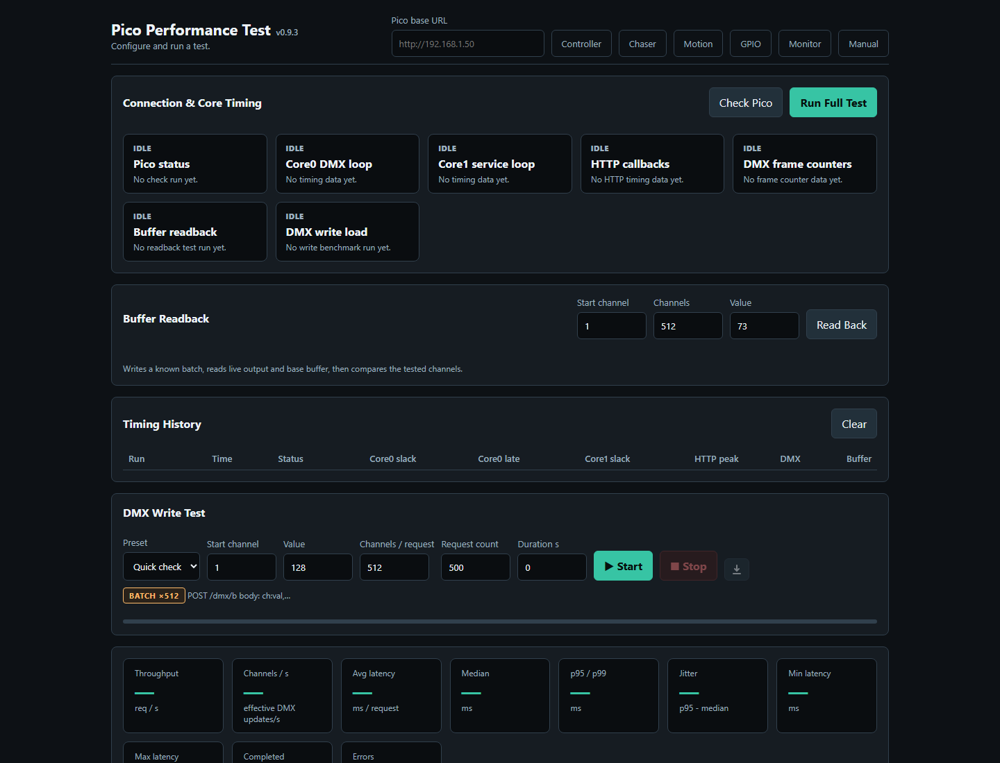

The Pico Performance Test page checks the full browser-to-Pico control path.

Pico Performance Test does not use the shared toolbox sidebar. It is a developer/test page for measuring request performance, buffer readback, and firmware timing health.

Use **Check Pico** to read `/status.json` and `/logs.txt`. The page parses the latest Core0/Core1 performance lines, HTTP callback timing, and DMX frame counters. A healthy steady-state run should show no late Core0 cycles and comfortable Core0 slack.

Use **Buffer Readback** to write a known batch with `/dmx/b`, then compare the tested channels from both `/dmx/output.json` and `/dmx/base.json`.

Use **DMX Write Test** to compare:

- Single-channel updates
- Scene-sized batch updates
- Large batch updates
- Longer soak tests

The write-test result panel shows:

- Throughput
- Effective DMX channel updates per second
- Average latency
- Median latency
- p95 and p99 latency
- Jitter
- Errors

Use **Run Full Test** to run the Pico status/log check, buffer readback, write test, and a final timing-log check in one sequence.

The **Timing History** table records each Pico timing check. A manual **Check Pico** adds one row immediately. **Run Full Test** records the final post-load timing sample, so the row reflects Core0/Core1 slack after the write and readback checks have run.

Use **Export CSV** to save results for later comparison.

Pico Performance Test and GPIO Control link to the **DMX Buffer Monitor**.

## 8. DMX Buffer Monitor

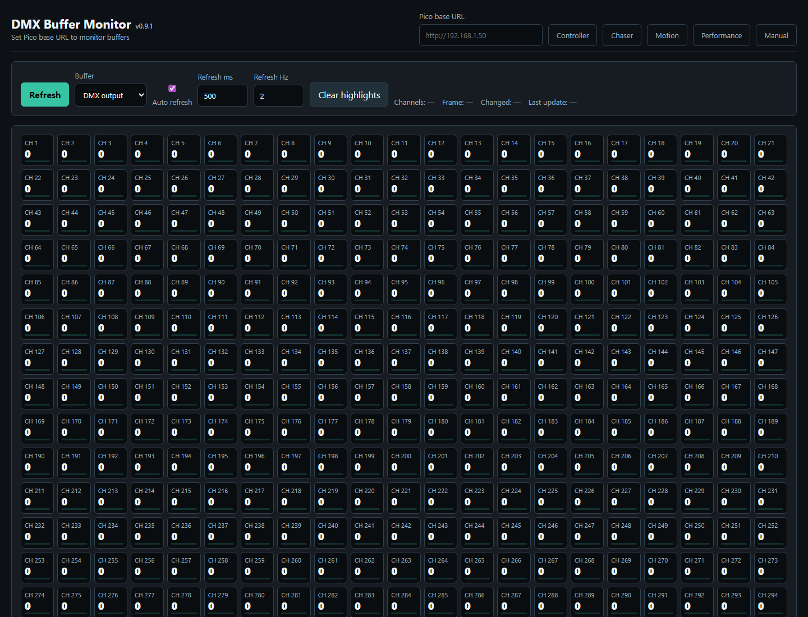

The monitor displays all 512 channels as tiles and reads one Pico buffer at a time.

Use **DMX output** to see the actual output frame currently held by the DMX engine, including values produced by Pico-side Chaser or Motion FX playback.

Use **Base / position** to inspect the scene base buffer used as the center for Motion FX.

Use **Refresh ms** to control the polling interval directly. Use **Refresh Hz** when you prefer rate instead. Both fields stay synchronized, so `500 ms` is shown as `2 Hz`. Longer intervals are calmer for observation; shorter intervals are useful when checking fast changes. **Auto refresh** starts or stops polling without changing the selected buffer.

## 9. Backup and Import

Most setup data is stored as JSON files on the XAMPP server in the `data/` folder.

The UI also offers export/import buttons for:

- Fixture setup
- Groups
- Scenes
- Palettes
- Chaser setup
- Motion FX setup
- GPIO setup

Use JSON export before large changes so a known-good setup can be restored later.

## 9. Clear Functions

There are two different clear actions:

| Action | What it clears | When to use |
|--------|----------------|-------------|
| DMX clear | Live DMX output and the motion base buffer | Full reset of output and base position |
| Output-only clear | Live DMX output only | Black out output while keeping the stored motion center |

Use output-only clear when you want Motion FX to resume around the same stored center after the blackout.

## Troubleshooting

### The UI does not control the Pico

- Check that the Pico is powered and connected to WiFi.
- Open the Pico URL directly in a browser, for example `http://192.168.0.24/`.
- Make sure the base URL in the UI ends with `/`.
- Make sure the Fixture Controller has the correct Pico base URL.

### Chaser capture does not contain the expected values

- Move or recall the values on the Fixture Controller first.
- Make sure the participating controls include the controls you want to capture.
- Save or reload the Fixture Controller setup if fixtures were changed recently.

### Motion FX moves around the wrong center

- Recall the desired scene first.
- On the Motion FX page, click the same scene in the scene toolbox.
- Then start the motion slot.

### GPIO mapping does not react

- Check `/gpio/status` or the status panel on the GPIO page.
- Confirm that the selected pin is not reserved or already used.
- Check pull mode and trigger edge.
- For ADC, use only GPIO26, GPIO27, or GPIO28.

### A chaser has more than 32 steps

The firmware supports 32 steps per chaser slot. Keep the chase within this limit before uploading to the Pico.
