# Pico WiFi DMX User Manual

## Table of Contents

- [Getting Started](#getting-started)
  - [Introduction](#introduction)
  - [Windows Customer Installation](#windows-customer-installation)
  - [macOS Customer Installation](#macos-customer-installation)
  - [Ubuntu Customer Installation](#ubuntu-customer-installation)
  - [Choose a Workflow](#choose-a-workflow)
- [Create and Program a Show](#create-and-program-a-show)
  - [Fixture Controller](#fixture-controller)
    - [Fixture Controller Tools and Toolboxes](#fixture-controller-tools-and-toolboxes)
  - [Scenes And Palettes](#scenes-and-palettes)
    - [Scenes and Palettes Tools and Toolboxes](#scenes-and-palettes-tools-and-toolboxes)
  - [Groups](#groups)
    - [Groups Tools and Toolboxes](#groups-tools-and-toolboxes)
  - [Chaser](#chaser)
    - [Chaser Tools and Toolboxes](#chaser-tools-and-toolboxes)
  - [Effects](#effects)
    - [Effects Tools and Toolboxes](#effects-tools-and-toolboxes)
  - [GPIO Control](#gpio-control)
    - [GPIO Control Tools and Toolboxes](#gpio-control-tools-and-toolboxes)
  - [Room Plane](#room-plane)
    - [Room Plane Tools and Toolboxes](#room-plane-tools-and-toolboxes)
- [Run Show](#run-show)
  - [Show Run](#show-run)
    - [Show Run Tools and Toolboxes](#show-run-tools-and-toolboxes)
- [Testing and Diagnostics](#testing-and-diagnostics)
  - [Pico Performance Test](#pico-performance-test)
    - [Pico Performance Test Tools and Toolboxes](#pico-performance-test-tools-and-toolboxes)
  - [DMX Buffer Monitor](#dmx-buffer-monitor)
    - [DMX Buffer Monitor Tools and Toolboxes](#dmx-buffer-monitor-tools-and-toolboxes)
- [Advanced Tools and Data](#advanced-tools-and-data)
  - [Back Up and Restore a Show](#back-up-and-restore-a-show)
  - [Clear Functions](#clear-functions)
- [Troubleshooting and Reference](#troubleshooting-and-reference)
  - [Troubleshooting](#troubleshooting)
    - [Open the Pico Firmware Diagnostics Page](#open-the-pico-firmware-diagnostics-page)
  - [Change Log](#change-log)

## Getting Started

### Introduction

This manual explains how to use the browser-based DMX controller with the Pico firmware. It is written for daily operation: creating fixtures, controlling lights, saving scenes, building chasers, creating effects, and using GPIO buttons or ADC inputs.

The web interface can be installed with the Pico DMX Windows, macOS, or Ubuntu customer package, or hosted from the project's XAMPP development setup.

The HTML manual provides responsive navigation and direct downloads for two PDF variants. **Clean PDF** is an A4 portrait document without browser navigation controls. **PDF with navigation** is an A4 landscape document with a persistent, clickable contents sidebar. Both contain the same operating instructions.

With a Windows, macOS, or Ubuntu customer installer, open **WiFiPicoDMX** from the desktop, Start Menu, or Applications folder. With the default installer port, the local address is:

```text
http://localhost:8090/
```

With XAMPP, the address on the same computer is often:

```text
http://localhost/dmx/
```

From an iPad, phone, or another computer, use the controller computer's LAN address or hostname and the HTTP port chosen during installation. A customer installation that kept port `8090` and enabled **Allow access from iPads and PCs on the private network** uses an address such as `http://192.168.0.50:8090/`; a XAMPP development installation may use `http://192.168.0.50/dmx/`. This computer URL is only the address of the web interface and server-side show storage.

Modal editors and dialogs require an explicit action to close. Clicking the dark area outside a modal does not dismiss it, which prevents accidental loss of edits. Use the modal's **Close**, **Cancel**, save, or other action button when you are finished.

The Fixture Controller stores Pico network addresses as named **DMX Outputs**, with one DMX universe per Pico. Pico URLs are separate from the XAMPP URL: XAMPP serves the pages and stores the show, while each output URL identifies one lighting-controller hardware API.

This applies to every page that can talk to the Pico:

- **Fixture Controller** routes fixtures to their assigned DMX Outputs and can send to several Picos concurrently.
- **GPIO Control** stores a separate mapping for each DMX Output and lets the user choose which Pico to configure.
- **Pico Performance Test** can measure one selected output or every configured Pico sequentially.
- **DMX Buffer Monitor** lets the user select which Pico/universe to inspect and clear.
- **Show Run** routes scenes, palettes, Pixel Matrices, Live Controls, room-plane targeting, and Grand/Group Master output to every involved fixture's assigned DMX Output.
- **Room Plane** routes calibrated target movement, fixture editing, Group Edit, and scene/palette recalls to every involved fixture's assigned DMX Output.
- Autonomous **Pico Chaser** and **Pico Effects** playback is output-aware. The browser splits one fleet-wide logical slot into linked payloads for the involved Picos. Logical slot N always uses physical slot N, and upload, start, pause/resume, stop, synchronization, and deletion are coordinated across the Pico fleet.
- The sticky header checks every output used by patched fixtures. Its fleet pill reports how many Picos are online and can be clicked to check again.

The screenshots in this manual are generated by `scripts/build_user_manual.ps1 -LocalOnly` from the repo-local PHP dev router and the deterministic data in `docs/manual-data/`. Toolbox screenshots are captured as named page elements, so the manual can be regenerated on another development machine without a local XAMPP path or hand-cropping images. Every screenshot uses the same 1440-pixel reference viewport and is displayed at its proportional width: a small cropped control stays small, while a full-page capture remains full width. This preserves the relative size of the interface throughout the manual.

### Windows Customer Installation

1. Run `wifi-pico-dmx-<VERSION>-windows-x64.exe` as an administrator.
2. Keep the default installation folder unless company policy requires another location.
3. On **Controller port**, keep the default `8090` or enter another port from `1024` to `65535`. An upgrade starts with the currently installed port so existing bookmarks continue to work. If the running Pico DMX installation owns that port, setup identifies it and asks to close the application window and server before continuing on the same port. If an unrelated desktop application owns it, setup shows its name and PID and asks before closing it; save that application's work first. Setup never automatically stops an unrelated Windows service, so stop such a service manually or choose another port.
4. Enable **Allow access from iPads and PCs on the private network** only when another trusted device needs the controller. This creates a Windows Private-profile firewall rule for the selected TCP port. It does not expose the app through the router or public internet.
5. On **Pico firmware**, choose whether WiFiPicoDMX should open its guided BOOTSEL firmware installer after setup. Choosing **No** installs only the customer application and does not modify any Pico.
6. Finish the installer and select **Open WiFiPicoDMX**, or use its desktop/Start Menu shortcut later. The shortcut opens the selected port in a dedicated application window rather than a normal browser tab. If firmware flashing was selected, the application opens the firmware guide after the controller starts.
7. For an iPad on the same private Wi-Fi, open `http://<controller-pc-address>:<selected-port>/`, for example `http://192.168.0.50:8090/`. The PC and the Pico controllers must be reachable from that Wi-Fi.
8. Configure the hardware in **DMX Outputs**, then use **Export Show** to keep a portable backup in addition to the server copy.

#### Guided Windows Firmware Installation

The Windows customer installer contains the matching Pico 2 W application
firmware, the separate CYW43 Wi-Fi firmware, a checksum manifest, and Raspberry
Pi `picotool`. Customers therefore do not need Visual Studio Code or the Pico
SDK to provision or recover a controller.

Open the guide when setup offers it, choose **Application > Firmware update…**
inside WiFiPicoDMX, or use **Firmware Update** in the WiFiPicoDMX Start Menu
folder. Then:

1. While the Picos are still running on the network, click **Check installed
   firmware**. The guide reuses the Controller's Pico discovery service and
   lists each detected Pico's address, installed version, bundled version, and
   whether its firmware is current, needs an update, or does not report a
   version.
2. If an update is needed, identify the target Pico from that list. Disconnect
   every other Pico from the computer. Flash only one controller at
   a time so the wrong unit cannot be selected.
3. Unplug the target Pico's USB cable.
4. Press and hold **BOOTSEL** on the Pico.
5. While holding BOOTSEL, reconnect the USB cable to the Windows computer.
6. Release BOOTSEL when Windows detects the Pico, normally as `RPI-RP2`.
7. Confirm in the guide that all other Picos are disconnected, then click
   **Check for Pico**.
8. When the guide reports that one RP2350 Pico is ready, click **Flash
   application + Wi-Fi firmware** and approve the final confirmation.
9. Keep USB and power connected until the guide reports that application and
   Wi-Fi firmware installation completed.

Firmware setup is deliberately opt-in. The Windows software installer never
writes a Pico itself, and the guide validates both bundled UF2 files before
enabling the flash action. Flashing temporarily stops DMX output from the
target controller. The guide cannot be closed while a write is running.

If flashing is interrupted, reconnect the Pico while holding BOOTSEL and
repeat the procedure. BOOTSEL recovery is held in the Pico's read-only ROM, so
an incomplete application installation does not remove this recovery path.
If the guide cannot find the Pico, check the data-capable USB cable, repeat the
BOOTSEL connection steps, and ensure no other Pico is connected.

The application window has normal minimize, maximize, and close controls. Its Windows title bar and frame, menu/dropdown surfaces, status bar, tray menu, and fullscreen buttons use a dark theme that matches the controller page. The firmware updater, exit-choice dialog, and server-shutdown progress window use the same dark title-bar treatment. Press **F11** to enter fullscreen and **Escape** to leave it. Fullscreen also keeps an **Exit full screen** button and **Close application** button visible. The tray icon offers **Open**, **Toggle full screen**, and **Exit…**. Opening the shortcut again activates the existing window instead of creating another instance.

Each time the native Windows application starts, it clears only its WebView2 disk cache before loading the controller. The packaged server also requires updated HTML, CSS, and JavaScript to be revalidated. This ensures that layout changes from an upgrade—including full-width utility pages such as **GPIO Control** and **Pico Performance Test**—appear immediately. Show data, browser-local settings, and cookies are preserved.

Closing the application window presents three choices. **Exit only** closes the local WiFiPicoDMX window but keeps the server running, so iPads and other operator devices remain connected. **Exit and stop server** warns that those devices will disconnect, requests Windows administrator approval, stops only the internally stable `PicoDmxController` service, waits for it to stop, and then exits. During that wait, a centered progress window displays **Stopping the Pico DMX server…**, an animated progress bar, and the notice that shutdown can take up to 45 seconds. The window cannot be dismissed while shutdown is in progress. The application checks the service once more at the timeout boundary before it reports that stopping failed. **Cancel** leaves both the application and server running. Cancelling the Windows UAC prompt also keeps the application open and server running. To use the controller again after stopping the server, start **WiFiPicoDMX** from its shortcut. The application explains that administrator approval is required, requests that approval, starts the service, and then loads the controller; no approval prompt appears if the service is already running. The service is also configured to start when the application is installed or the computer starts. A new installation stores application binaries below `%ProgramFiles%\WiFiPicoDMX`; upgrades can retain the former program directory. Show data remains in the upgrade-compatible `%ProgramData%\Pico DMX Controller\data` location. An upgrade snapshots existing data below the neighboring `backups` folder before replacing application files. Uninstall removes the app and service but preserves the `ProgramData` show data deliberately.

Do not forward the selected controller port from the internet router. The LAN option is intended for a trusted private lighting network. An unsigned development installer can display a Windows SmartScreen warning; customer release installers should carry the supplier's Authenticode signature.

### macOS Customer Installation

1. Open `wifi-pico-dmx-<VERSION>-macos-<ARCH>.pkg` and complete the standard macOS installation.
2. Start **WiFiPicoDMX** from Applications.
3. In the first-run **Controller Settings**, keep port `8090` or enter another unused port from `1024` to `65535`. The app refuses a port already used by another program.
4. Leave **Allow access from trusted iPads and PCs** disabled for operation only on the Mac. Enable it only for devices on the intended private lighting network.
5. For an iPad on the same trusted Wi-Fi, open `http://<mac-address>:<selected-port>/`, for example `http://192.168.0.50:8090/`.
6. Configure the hardware in **DMX Outputs**, then use **Export Show** to keep a portable backup.

The native dark application window provides normal macOS close, resize, reload, and fullscreen behavior. Use **WiFiPicoDMX → Controller Settings…** to change the port or LAN mode later. Closing or quitting offers **Exit only**, **Exit and stop server**, and **Cancel**. Exit only closes the local application while its per-user LaunchAgent keeps the server available. Exit and stop server unloads that LaunchAgent and disconnects operator devices; starting WiFiPicoDMX again installs and starts it.

Application code lives below `/Applications/Pico DMX Controller.app`. Shows and fixture data live separately below `~/Library/Application Support/Pico DMX Controller/data`; the first launch after an upgrade creates a snapshot below the neighboring `backups` directory. Removing the app does not remove those customer files. macOS may ask whether the signed bundled server may accept incoming connections when trusted-LAN access is enabled.

Do not forward the selected controller port from the internet router. Direct customer packages should be Developer ID-signed, notarized by Apple, and have their notarization ticket stapled so Gatekeeper can validate them offline.

### Ubuntu Customer Installation

1. Install `wifi-pico-dmx_<VERSION>_<ARCHITECTURE>.deb` through Ubuntu App Center or with `sudo apt install ./wifi-pico-dmx_<VERSION>_amd64.deb`.
2. Start **WiFiPicoDMX** from Applications or its installer-owned desktop shortcut.
3. Use `sudo pico-dmx-config --lan` only when trusted iPads or other PCs need access. The default remains local-only on port `8090`. The command detects and prints this computer's current DHCP-assigned controller URL; enter that URL in Safari on an iPad connected to the same trusted network. Run `pico-dmx-config --status` to detect and display the current URL again after any address change, or `sudo pico-dmx-config --local` to return to local-only access.
4. Configure the hardware in **DMX Outputs**, then use **Export Show** to keep a portable backup.

Closing WiFiPicoDMX offers **Exit only**, **Exit and stop server**, and **Cancel**. Exit only closes the Electron/Chromium application but leaves the `pico-dmx-controller.service` server available. Exit and stop server waits until no other local WiFiPicoDMX window is using the service, then stops it. Cancel returns to the application. Use `sudo pico-dmx-config --always-on` when the server must also start automatically at boot; use `sudo pico-dmx-config --application-managed` to restore application-managed startup.

Application files remain below `/opt/pico-dmx-controller`, while customer shows and upgrade snapshots remain below `/var/lib/pico-dmx-controller`. Removing the package deliberately preserves that data.

### Choose a Workflow

| Use | Page | Purpose |
| --- | --- | --- |
| Set up and program | [Fixture Controller](#fixture-controller) | Configure outputs and fixtures, patch channels, build groups, and create scenes and palettes |
| Set up and program | [Chaser](#chaser) | Build step-based chases and load them into Pico playback slots |
| Set up and program | [Effects](#effects) | Build continuous movement or scalar effects and load them into Pico playback slots |
| Set up and program | [GPIO Control](#gpio-control) | Map Pico GPIO buttons and ADC inputs to show actions |
| Run the show | [Show Run](#show-run) | Recall programmed show items from an operator-focused page without changing their setup |
| Run the show | [MIDI Emulator](#midi-controller-card) | Test Show Run MIDI mappings without a physical MIDI controller |
| Test and diagnose | [Pico Performance Test](#pico-performance-test) | Check connectivity, firmware, memory, timing, and playback stress behavior |
| Test and diagnose | [DMX Buffer Monitor](#dmx-buffer-monitor) | Inspect all 512 live-output or base-buffer channel values |
| Set up and program | [Room Plane](#room-plane) | Calibrate moving lights to shared positions on a measured room plane |

## Create and Program a Show

Use these pages while building and programming the show. Start with Fixture Controller, create reusable scenes and groups, prepare Chaser, Effects, and GPIO operation, and calibrate moving lights with Room Plane.

### Fixture Controller

The Fixture Controller is the central programming page. Use it first when setting up a new show or fixture set. This overview keeps every section and toolbox expanded while limiting the repeated Control Surface fixture tiles to a representative set so the whole page remains readable.


#### What You Can Do on Fixture Controller

Use Fixture Controller to configure Pico outputs, maintain fixture profiles, patch fixtures, control their live values, and create reusable groups, scenes, palettes, fan-outs, and Pixel Matrices.

#### Fixture Controller Tools and Toolboxes

The Controller combines the main **Show**, **Fixture Library**, **Patch Fixtures**, and **Control Surface** cards with a reorderable toolbox rail. Use the main cards to manage the show, profiles, patch, and live fixture tiles. Use the **DMX Outputs**, **Fixtures**, **Groups**, **Scenes**, **Palettes**, **Fan Out**, and **Pixel Matrices** toolboxes for reusable setup and batch control; the detailed toolbox behavior is documented later in this chapter.

#### Configure Picos and Read Header Status

1. Open the controller URL: normally `http://localhost:8090/` for a Windows, macOS, or Ubuntu customer installation using the default port, `http://localhost:<selected-port>/` when it was changed, or the configured XAMPP URL in a development environment.
2. Click **DMX Outputs**, then use **Find Picos** or enter each Pico URL manually. Discovery records the Pico's stable unique-board identity so a later DHCP address change does not require rebuilding the show.
3. Give every output a descriptive name and unique universe, then click **Done**.
4. Read the fleet pill in the sticky header. **2/2 Picos online** in green means all used outputs answered; amber means only some answered; red means none answered. Click the pill to refresh immediately. The Controller keeps **DMX Outputs** anchored at the right edge of this row while the fleet check changes state; on a narrow window, the fleet text is shortened with an ellipsis instead of wrapping or shifting the button.
5. The application checks again automatically. A tooltip lists every used output, its universe, and its online/offline result.
6. The navigation links use their own wrapping header row. They remain visible when the Toolboxes sidebar is widened—even to roughly two thirds of the page—so Controller, Show, Chaser, Effects, GPIO, Plane, and Manual remain quickly reachable.
7. Fixture setup changes are autosaved to the controller server. Use **Export Show** before large changes when you want an extra backup of the complete show setup.

#### DMX Outputs and Multiple Picos

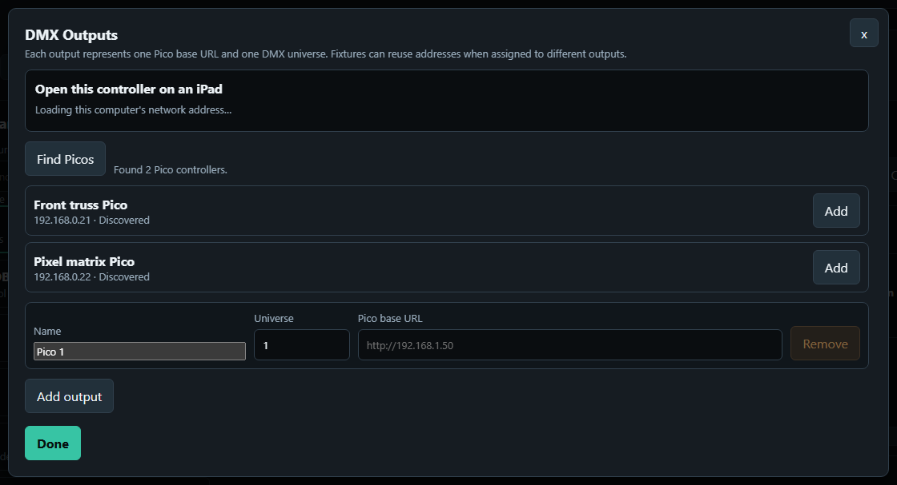

Open **DMX Outputs** in the Controller header when the show needs more than one 512-channel DMX universe. Each output has:

- A descriptive name, such as `Front truss Pico` or `Pixel matrix Pico`
- A unique universe number
- One controller URL for that Pico
- A stable discovered-device ID when it was added through network discovery

Click **Find Picos** to listen for every Pico WiFi DMX discovery beacon on the LAN. The result list shows every discovered controller with its advertised name and IP address. The beacon also carries the stable unique-board ID obtained through the Pico SDK; the show stores it as the DMX Output's device identity. This identity remains the same when the DHCP server gives the Pico another IP address.

Click **Add** beside each Pico that belongs to a new show. The first discovered Pico fills an unused empty output; additional devices receive the next free universe number. A Pico whose device ID or normalized URL already belongs to an output is marked **Added** and cannot be added again.

If discovery recognizes a saved unique-board ID at a different URL, it automatically replaces the URL displayed on that existing output and reports how many saved Pico addresses were updated. Click **Done** to validate and autosave the refreshed addresses. Only the Pico URL changes: the output ID, descriptive name, universe, fixture assignments, GPIO configuration, chases, effects, and other show programming remain attached to the same logical output. An unknown Pico is never assigned automatically; it remains available through **Add** so a different physical controller cannot silently take over a programmed universe.

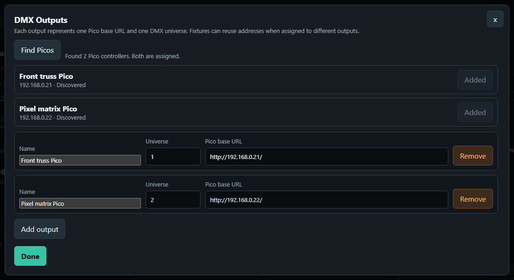

Names, universe numbers, and URLs remain editable after discovery. Click **Add output** for a controller that must be entered manually. Every output must have a unique universe number. Click **Done** to validate the list, refresh the shared header health immediately, and autosave the show.

The top of the modal also shows **Open this controller on an iPad**. It asks the server for the host computer's LAN IPv4 addresses and builds clickable URLs with the current protocol, port, and application path. Open one of those addresses on an iPad connected to the same trusted network. If no address appears, check the host computer's network connection and the installer/firewall LAN-access setting.

Select the wanted **DMX output** while patching a fixture. Address conflicts are checked only inside that output, so Universe 1 channel 1 and Universe 2 channel 1 are independent and may both be used. Existing fixture cards in **Patch Fixtures** also have a DMX output dropdown. Reassigning a fixture is refused if its address range would overlap another fixture on the destination output. After an accepted reassignment, the Controller immediately sends all current values for that fixture to its new Pico/universe; the status line confirms the number of sent channels or reports a connection error.

The Controller routes single controls, fixture Default/Blackout/Highlight recalls, Group Edit, scenes, palettes, Fan Out, room-plane targeting, and clear-all operations to their fixtures' assigned outputs. Multi-fixture batches are separated by output and sent to the involved Picos concurrently. **Patch CSV** includes the output name and universe for every channel. Complete show export/import preserves the output definitions and fixture assignments; the current show format is version 5 so older controller software refuses unsupported multi-output and pixel-matrix data instead of silently losing it.

Show Run and Room Plane use shared fixture-aware batching. Show Run scenes, palettes, Pixel Matrices, Live Controls, room-plane targeting, and Grand/Group Masters follow each fixture's assigned output. Room Plane calibrated targeting, fixture editing, Group Edit, and scene/palette recalls do the same. When one action involves several outputs, the browser sends one channel batch to each involved Pico concurrently. GPIO Control, DMX Buffer Monitor, and Pico Performance Test provide their own output selectors.

Pico Chaser and Pico Effects uploads are also output-aware. When the participating fixtures use several outputs, the page creates one logical playback, splits its channel payload by output, and loads physical slot N on every involved Pico for logical slot N. Play, pause, resume, speed/BPM, stop, synchronization, and delete operate the linked members together. Commands are dispatched concurrently over HTTP; this keeps normal playback starts close together but is not a firmware-level synchronized start guarantee.

#### Pixel Matrices

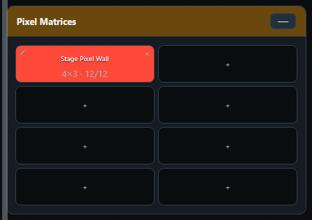

Use the **Pixel Matrices** toolbox on the Controller page to convert a still image into fixture colors. The toolbox can drive separate RGB-type fixtures, individual pixels inside a native **RGB pixel matrix** fixture control, or a mixture spread across multiple DMX outputs. Saved matrices use the same tile layout as Scenes and Palettes: click a filled tile to clear the previous Controller fixture/group/scene selection, select exactly the valid fixtures referenced by that matrix, stop autonomous Chaser/Effects playback on every involved output, and immediately send the complete picture to DMX. If those fixtures exactly match a saved Group, independent of fixture order, its Group tile is selected too; partial and superset Groups are not selected. Use the matrix pencil to edit it or its `x` to delete it. Click an empty `+` tile to create a matrix in that position.

Enable Toolboxes **Edit** to reveal the Pixel Matrices **Cols** and **Rows** dropdowns and automatically enable tile movement. Drag a filled matrix to another slot on desktop, or tap its source and destination slots on a touch screen. Moving onto a filled slot swaps the two matrices; moving onto an empty slot leaves the other matrices unchanged. The layout and matrix positions autosave with the fixture setup.

Before creating the visual matrix:

1. Add or import fixture profiles with RGB, RGBW, RGBWA, CMY, CMYK, or native RGB matrix controls.
2. Patch every physical fixture to the correct **DMX output**, universe, and address.
3. Arrange the compatible fixture color controls in the intended row-major order if you want to use **Auto Map**.

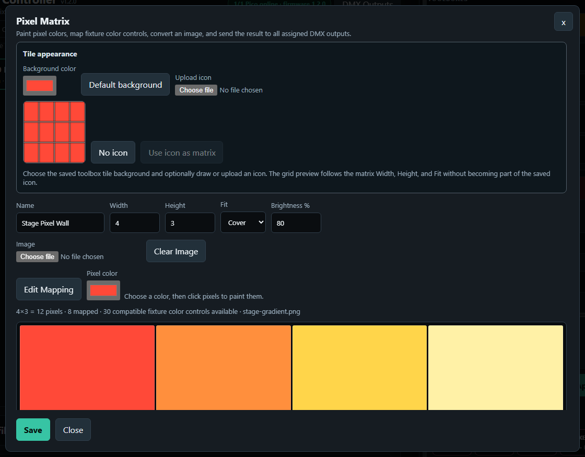

To create and test a matrix:

1. Open **Pixel Matrices** and click an empty `+` tile.
2. The modal starts with **Tile appearance**, matching the other saved-tile editors. Choose the toolbox tile background, then optionally upload an icon or draw one on its canvas. **No icon** clears it and **Default background** returns to the matrix's first pixel color. Tile appearance is reused on Controller, Chaser, and Show Run but remains independent from the matrix's DMX pixel colors.
3. Enter a name and the logical **Width** and **Height**. Matrices may contain up to 64×64 pixels. The icon canvas immediately overlays the corresponding grid. **Contain** shows the letterboxed image area, **Cover** shows the source crop, and **Stretch** shows the full distorted image. Drawing follows the displayed transform, while the grid lines remain guides and are never stored in the icon. Click **Use icon as matrix** when you want to composite that artwork over its background, resample it with the selected Fit and Brightness, write it into the pixel cells, and preview it on DMX.
4. The matrix editor starts in color-paint mode. Choose **Pixel color**, then click one or more matrix cells to paint them. Every painted color previews immediately through the mapped fixtures; there is no separate Apply button.
5. Click **Edit Mapping** when you need to change fixture assignments. The active button reveals **Mapping target**, **Auto Map**, and **Clear Mapping**. Auto Map assigns compatible fixture controls from the top-left pixel across each row. If the physical order differs, select the first Mapping target and click its wanted pixel cell. The dropdown automatically advances to the next unused compatible fixture target, so continue clicking the physical pixel positions in sequence without reopening the dropdown each time. After the last available target it returns to **Unmapped**. Selecting the same target on another cell moves that target rather than duplicating it. Choose **Unmapped** and click a cell to clear only that assignment, or use Clear Mapping for the whole matrix.
6. Choose **Contain**, **Cover**, or **Stretch**, set a brightness limit, and select a PNG, JPEG, WebP, or GIF image when the matrix should use a separate still image instead of its tile icon. Conversion happens locally in the browser and previews immediately. The saved show stores the resulting pixel colors and image filename, not the original image file.
7. Click **Save** to store the definition. Use the matrix tile `x` outside the modal when you want to delete the definition.

**Clear Image** makes every logical pixel black without changing its mapping. Saved matrices use the normal 800 ms fixture-setup autosave, are included in **Export Show**, and are restored by **Import Show**. The first implementation handles one converted still frame; animation and video playback are not yet included.

For tall or wide matrices on an iPad, scroll anywhere in the modal content to reach every pixel row or column. The editor uses one touch scroll area rather than a second vertical scroller inside the matrix. **Save** and **Close** remain fixed below the scrolling content, so they stay available after editing the final row.

#### Fixture Library

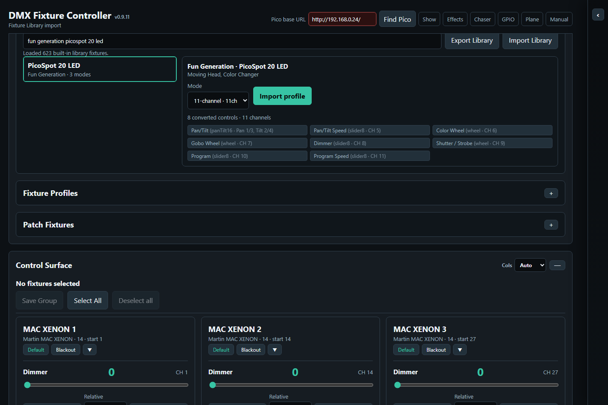

The **Fixture Library** panel imports fixture profiles from an export of the original [Open Fixture Library](https://open-fixture-library.org/) project. Use it when you want to start from an existing fixture definition instead of building every channel by hand. Selecting a fixture shows **Fixture Information** when OFL provides it: authors, creation/update dates, dimensions, weight, power, DMX connector, light source, beam angle, and links to the OFL entry, manual, product page, or video. External information links open in a new tab and only HTTP/HTTPS links are accepted.

The library loads automatically when the controller page opens. While it is loading, the search field is disabled and the panel shows a loading status. If loading fails, the panel shows a **Retry** button.

Command buttons that save, import, export, or update setup data briefly show their result on the button itself. For example, **Update Library** changes to **Comparing...** while its merge dialog is open and then **Updated** when the chosen operation is complete.

Use **Export Library** to download the currently loaded fixture catalog as the compressed `pico_dmx_fixture_library.zip`; it contains `pico_dmx_fixture_library.json`. Use **Import Library** to replace the active catalog with that ZIP or an older uncompressed library JSON file. The server creates and maintains one active catalog rather than hiding updates behind separate standard and custom layers.

Use **Update from OFL** to refresh the active catalog from the complete OFL data bundled with the installed application. A timestamped backup is created before the update. Current OFL fixture facts and newly available fixtures are applied while user-added inline wheel/gobo images, explicitly user-modified modes, and fixtures created in the Controller are preserved. Because a user-modified mode is retained as a complete unit, an OFL correction does not silently replace its custom channel or wheel mapping; merge the desired library definition into the show or edit that preserved mode when you want to adopt the correction without losing its custom data.

1. Type part of the manufacturer, fixture name, category, or mode in **Search manufacturer or fixture**.
2. Select the matching fixture from the results list.
3. Choose the desired DMX mode from the **Mode** dropdown.
4. Review the converted controls and channel count in the preview.
5. Click **Import profile**.

The imported fixture is added to **Fixture Profiles** and becomes the active profile. You can edit it like any manually created profile, including changing labels, defaults, blackout values, and wheel options. The imported profile remembers its library fixture key and mode, so later updates still find the correct reusable definition if you rename the show profile.

The converter keeps the richer Open Fixture Library data where the controller can use it:

- Pan/tilt channels are grouped as 8-bit or 16-bit pan/tilt controls when matching channels are present.
- Scalar coarse/fine pairs such as dimmer, focus, zoom, iris, and color temperature become one 16-bit control instead of separate coarse and fine sliders.
- RGB, RGBW, and RGBWA color intensity channels are grouped into color controls.
- Explicit OFL defaults are imported and scaled to the actual 8-bit or 16-bit control resolution.
- Compatible rectangular matrices using sequential RGB channels per pixel become native RGB matrix controls. Unsupported arrangements are left uncollapsed rather than mapped incorrectly.
- Wheel slots keep their OFL names, colors, and offline SVG/PNG images when the library provides them.
- Wheel DMX ranges are preserved. Normal slot buttons send the midpoint of the range.
- Adjustable wheel functions such as `WheelShake`, `WheelRotation`, and `WheelSlotRotation` show a bounded speed/range slider after you select that option.
- Segmented shutter/strobe, program, effect, prism, and maintenance channels become named option controls. Their buttons send a value safely inside the selected DMX range.
- Continuous capabilities retain their DMX range and speed information so the UI can provide a bounded control where the capability supports it.
- Explicit OFL highlight values enable a temporary **Highlight** / **Restore** action on the patched fixture card.
- Unsupported or ambiguous channels are kept as simple 8-bit sliders so no channel is silently lost.

#### Create a Fixture Profile

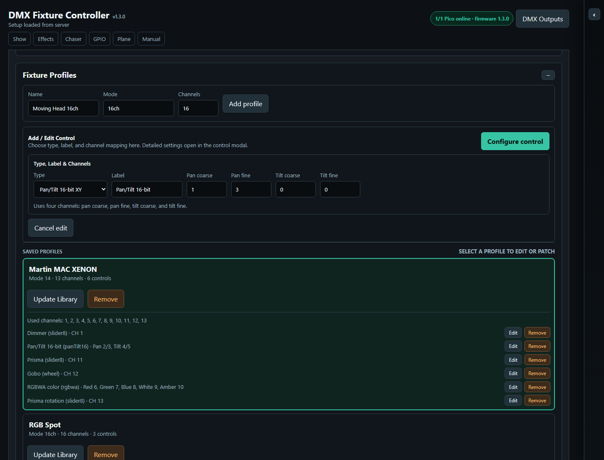

A fixture profile describes the DMX personality of one fixture type. Use this section when the wanted fixture is not available in the **Fixture Library**, or when you want to fine-tune an imported profile.

1. Open **Fixture Profiles**.
2. Enter a profile name, mode name, and channel count. These fields update the selected profile automatically.
3. Click **Add profile**.
4. Select the profile.
5. In **Add / Edit Control**, choose the control type, label, and channel mapping.
6. Click **Configure control** to open the control details modal, then set default/blackout values and type-specific options.
7. Click **Add control** or **Save control** in the modal.

Each control stores its own DMX channel mapping. For example, a moving head can have:

- Dimmer on channel 1
- Pan/Tilt 16-bit on channels 2/3 and 4/5
- RGBWA color on channels 6-10
- Gobo wheel on channel 12

Simple 8-bit and 16-bit sliders only need channel mapping plus optional **Default** and **Blackout** values in the modal. Color controls add a color picker and any extra white, amber, or key channels. Wheel / indexed controls add the wheel editor and guided wheel editor so DMX ranges, colors, icons, and OFL-style function metadata can be entered without writing the raw text by hand.

In the Guided Wheel Editor, **Add option** appends a row; the row `x` removes it. Set its name, From/To range, function type, optional slot and speed labels, color, and icon. **Icon** uploads an image, while **Draw** opens the icon canvas; use **Clear drawing** and **Save icon** there. **Apply options** validates the rows and returns them to Control Details. The control itself is not stored until **Add control** or **Save control** is used. **Cancel edit** leaves the selected control unchanged and returns the compact editor to add mode.

Pan/Tilt controls also have fixture-profile mapping options in the control details modal:

- **Reverse Pan DMX** sends the logical Pan value as `max - value`.
- **Reverse Tilt DMX** sends the logical Tilt value as `max - value`.
- **Swap Pan/Tilt axes** sends logical Pan through the fixture's Tilt channels and logical Tilt through the fixture's Pan channels.

These options belong to the fixture profile, so every patched fixture using that profile follows the same mapping. The controller, chaser, and browser effect output keep showing logical Pan/Tilt values; only the physical DMX bytes are changed. This means scenes, palettes, chases, and effect centers remain readable even when a fixture is mounted backwards or rotated.

To change an existing control, click **Edit** in the Fixture Profiles list. The compact **Add / Edit Control** fields load the selected type, label, and channels, and the control details modal opens automatically. After editing, click **Save control** in the modal. Saving an existing control immediately resends the current live value for every patched fixture using that profile/control to its assigned DMX Output, so Pan/Tilt reverse or axis-swap changes are applied to the correct universe right away. The **Fixture Profiles** collapse button hides the profile list and the compact Add / Edit Control box together.

Click **Update Library** to compare the selected show profile with its linked reusable fixture mode. The **Merge Fixture Profile** dialog shows both names, modes, channel counts, control counts, and a short difference summary. Choose **Use show in library** to update the reusable mode from the show, or choose **Use library in show** to refresh the existing show profile without adding a duplicate profile. A profile that has no library match can only be added with **Use show in library**.

The merge keeps data that belongs to only one side. Fixture Information, OFL capabilities, warnings, categories, unrelated modes, and richer wheel details remain in the library. Show profile/control IDs and Pan/Tilt reverse or axis-swap settings remain in the show because they describe patch references and how fixtures are mounted in this show. When **Use show in library** is selected, matching reusable controls retain their library IDs and metadata while editable names, channel mappings, defaults, and blackout values come from the show.

#### Default and Blackout Values

Each control can store a **Default** value and a **Blackout** value.

Default values are useful for a normal starting look, for example:

- Dimmer open
- Pan/Tilt centered
- RGB white
- Gobo open

Blackout values are useful for quickly shutting down output, for example:

- Dimmer 0
- RGB black
- White and amber 0
- Pan/Tilt at a safe position if needed

For RGB, RGBW, and RGBWA controls, use the color picker for RGB. White and amber channels are edited separately when the fixture type has them.

#### Patch Fixtures

Patch fixtures after the profile is ready.

1. Open **Patch Fixtures**.
2. Enter a fixture name.
3. Select the fixture profile.
4. Select the **DMX output** that physically drives the fixture.
5. Enter the DMX start address within that output's 512-channel universe.
6. Set **Count** to the number of fixtures you want to patch.
7. Click **Patch fixture**.

Use **Next free** to find the next available address on the selected output. The same address can be used on another output.

When **Count** is greater than 1, the controller creates a numbered run of fixtures. For example, name `RGB Spot` with count `10` creates `RGB Spot 1` through `RGB Spot 10`. The first fixture uses the start address you entered. The following fixtures are spaced by the channel count of the selected fixture profile.

After a multi-fixture patch, the controller asks whether to create a Saved Group for the newly patched fixtures. The suggested group name is the patch name. Press **Cancel** to skip group creation, or enter a name to save the new fixtures as a group.

The patched fixture list is shown as rows of compact cards. Each card shows its output, universe, profile, and channel range and provides a **DMX output** dropdown for repatching the fixture to another Pico. The controller checks the destination universe for an overlapping address range before accepting the move. When accepted, it saves the new assignment and immediately transmits the fixture's complete current state to the destination output, so the fixture responds without requiring another slider movement or recall. Each row represents one consecutive run of the same fixture profile, so separate patch runs remain visually separate even when they use the same profile.

#### Live Fixture Control

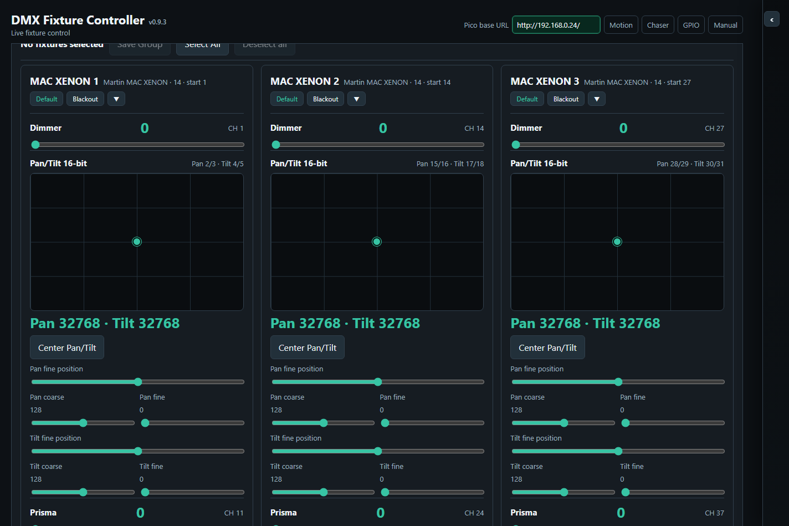

The **Control Surface** shows one card per patched fixture.

Each fixture card contains the controls from its profile:

- Sliders for dimmer and simple channels
- XY pads for absolute pan/tilt positioning
- Relative pan/tilt nudge controls for small position corrections
- Color pickers and swatches for color controls
- Wheel buttons, a DMX value slider, and a direct numeric DMX value field for indexed wheel values
- Coarse/fine relative nudges for 16-bit channels
- A pixel grid, **Paint color**, **Fill all**, and **Clear** for a native RGB pixel-matrix control

For pan/tilt controls, drag inside the XY pad when you want to move directly to an absolute position. Use **Pan coarse relative**, **Pan fine relative**, **Tilt coarse relative**, and **Tilt fine relative** when you want to adjust from the current position without jumping to a new absolute value. The number field in each relative row sets how many DMX increments the next `-` or `+` click will move. The fine relative buttons move the combined 16-bit value by that many steps, including byte borrow and carry: for example `256 - 1` becomes coarse `0`, fine `255`, and `255 + 1` becomes coarse `1`, fine `0`. The value is clamped at the valid DMX range, so it cannot go below `0` or above `65535`. If the fixture profile reverses or swaps Pan/Tilt, the XY pad and relative controls still show logical Pan/Tilt movement while the DMX output is mapped for the physical fixture.

**Center Pan/Tilt** writes the logical midpoint on both axes in one action. It follows the profile's reverse/swap mapping when the bytes are sent.

For a native RGB pixel-matrix control, choose **Paint color** and click individual pixels, use **Fill all** to apply that color to the complete control, or use **Clear** to set every pixel to black. These are direct live controls for one patched fixture; the separate **Pixel Matrices** toolbox stores reusable pictures and mappings across fixtures.

Wheel / indexed controls require unique DMX option values. If two wheel options use the same DMX value, the control details modal refuses to save the control. This prevents ambiguous wheel buttons where the UI could not know which option should be highlighted after recall or chase editing. On the Controller page and in Controller Group Edit, wheel controls can be changed with the option buttons, the DMX value slider, or the direct numeric DMX value field.

Use **Guided wheel editor** when creating or correcting indexed controls such as color wheels, gobo wheels, and shutter/strobe ranges. The guided table is the normal place to edit wheel rows, including option name, DMX range start/end, function type, slot number, speed labels, background color, uploaded icon, or drawn icon. A wheel option button can show a color swatch, an icon, or an icon on top of the chosen color. This is the recommended way to define rich functions such as `WheelShake`, `WheelRotation`, and `ShutterStrobe` without memorizing the raw text syntax.

The **Wheel options** text box remains editable for advanced use and accepts one option per line. Basic lines use `Name=DMX` or `Name=start-end`, for example `Open=0-15`. Richer OFL-style metadata can be added after pipe characters. Use `kind=WheelSlot` with `slot=2` for a named slot, `kind=WheelShake` with `shake=slow-fast` for a bounded shake speed range, `kind=WheelRotation` with `speed=slow CW-fast CW` for a bounded rotation range, and `kind=ShutterStrobe` with `speed=slow-fast` for a bounded strobe range. For example: `Gobo 2 shake=125-140|kind=WheelShake|slot=2|shake=slow-fast`.

Fixture profiles imported from the **Fixture Library** keep richer Open Fixture Library wheel information when it is available. Wheel slots use their real names and colors, for example `White`, `Red`, or `Gobo 2`. OFL can describe a split position through a `WheelSlot` capability and DMX range together with two direct colors or references to the adjacent wheel slots. The converter retains both colors and the range. Selecting that position shows a **Split position** slider so you can move the mechanical wheel between both colors; it does not claim an exact optical mixing percentage. Single-color `WheelSlot` positions remain fixed.

If an OFL wheel option covers a DMX range, its button initially sends the middle of that range so the value is safely inside the fixture function. Adjustable ranges such as split-color `WheelSlot`, `WheelShake`, `WheelRotation`, `WheelSlotRotation`, and `ShutterStrobe` then show the appropriate bounded slider. Genuine wheel rotation remains labeled **Rotation speed**. For example, the Fun Generation PicoSpot 20 LED in 11-channel mode exposes its split colors as **Split position** controls and imports `Gobo 2 shake` as a wheel button with a **Shake speed** slider limited to its real DMX range.

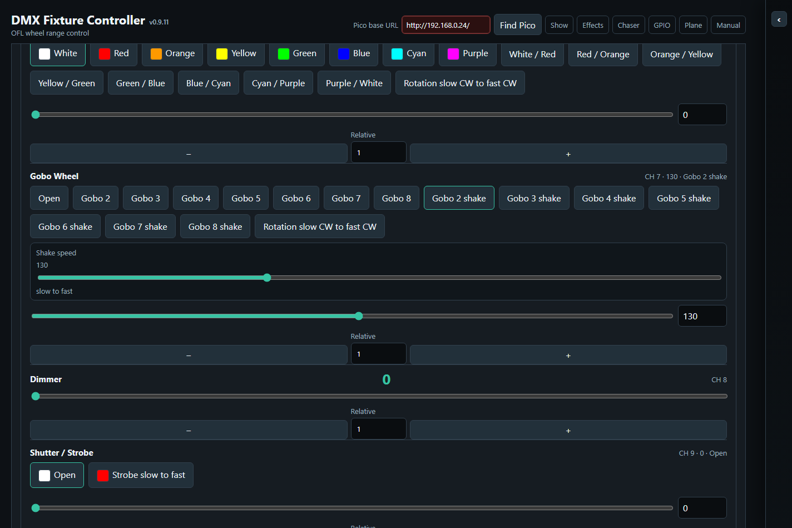

Use **Default** or **Blackout** on a fixture card to recall the stored values for that fixture only. A fixture-card recall takes manual control of the DMX output: it stops Pico Chaser and Pico Motion playback first, then sends the configured values so active playback cannot immediately overwrite the recalled look.

If an imported OFL profile provides explicit highlight values, its fixture card also shows **Highlight**. Click it to stop Pico playback, remember the current look, and send only the declared highlight values for fixture identification or focusing. The same button changes to **Restore**. The temporary highlight is not autosaved; click **Restore** to send back the exact remembered values and return to normal editing.

Use **Cols** in the **Control Surface** header to choose **Auto** or a preferred count from 1 to 4. Auto keeps the spacious responsive card width. A fixed preference can show three or four fixtures across on a wide desktop, but the Controller automatically reduces the effective count when the Toolboxes rail, available viewport width, or iPad layout would make sliders, buttons, readouts, or XY pads too narrow. The saved preference is stored in server UI state and is included in complete setup export/import.

Use the small button in the **Control Surface** header to collapse all visible fixture cards or expand them again. The button affects only the fixtures currently shown by the active group, scene, or palette filter. A collapsed card keeps its Highlight/Restore, Default, Blackout, and expand controls visible. On iPad those controls retain full-size touch targets and the card header grows when necessary, preventing the bottom edge of a button from being cropped.

Click a fixture card header or empty card area to include or exclude that fixture for group editing. The selected card uses the same accent outline style as other selectable tiles in the app. Clicking sliders, color controls, wheel buttons, Highlight/Restore, Default, Blackout, or collapse controls does not change fixture selection.

After a hard page reload, no fixture cards are selected automatically. This keeps Group Edit disabled until you deliberately choose the fixtures you want to edit.

Use **Select All** in the group bar above the control surface when you want to select every patched fixture. Use **Deselect all** to clear the current manual selection. When you manually select fixture cards, the control surface stays visible so you can keep building or adjusting the selection. Saved Groups can also be selected from the Groups toolbox to filter the control surface.

#### Fixture Controller Toolboxes

The Fixture Controller uses the shared right-side **Toolboxes** sidebar.

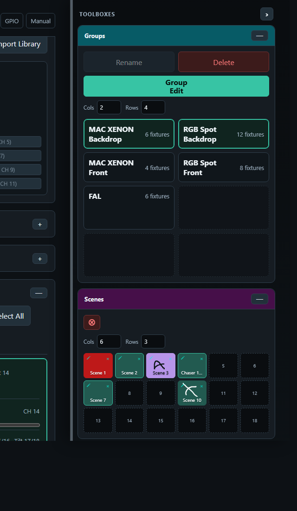

**Show** is the first Controller card and the project-level home for show setup. Edit the **Show name** field directly; changes use the normal 800 ms server autosave. Its top action bar displays **Export Show**, **Import Show**, **Export Library**, and **Import Library** together; the nested **Fixture Library**, **Fixture Profiles**, and **Patch Fixtures** cards follow below. Collapse Show to hide all of those setup tools at once. When Show is expanded again, each nested card returns with its own previous expanded or collapsed state. **New Show** confirms the reset and then asks for the required show name before clearing fixtures, live values, groups, scenes, palettes, chases, effects, saved room planes, GPIO mappings, Pico playback slots, Show Run layout, and saved toolbox layout while keeping the reusable fixture library. **Export Show** and **Import Show** handle the complete show backup, including every named DMX Output/universe, each fixture's output assignment, and the independent GPIO/ADC mapping for every Pico. **Export Library** and **Import Library** independently handle the complete reusable catalog. **Patch CSV** exports the patched channel table.

**Groups** stores fixture groups and shares the selected group filter with other toolbox pages. Use it to select fixtures quickly, edit group tile names and visuals from the small pencil icon, delete groups from the small `x`, import/export group JSON, reorder group tiles while Toolboxes **Edit** is active, and open **Group Edit** when the current scope supports it.

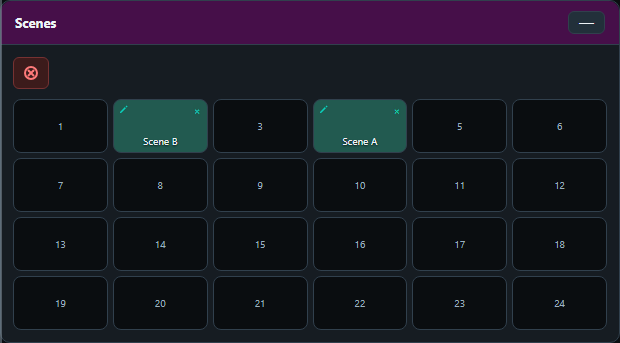

**Scenes** stores complete looks for the current working scope. Empty slots save, filled slots recall, the small `x` deletes, Toolboxes **Edit** enables tile reordering, and the small top-left pencil icon opens **Edit Tile** for that slot's name, background, and optional drawing/upload.

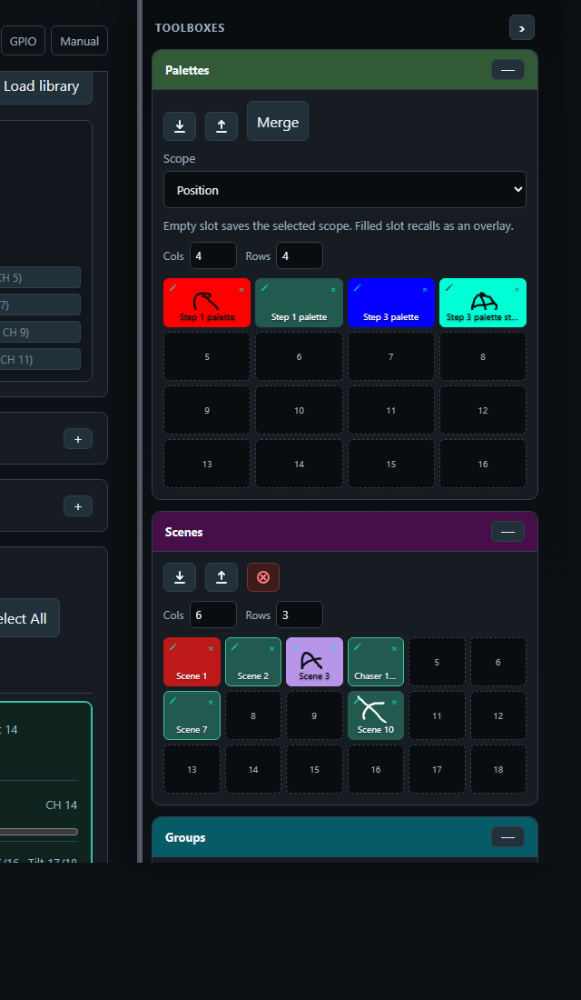

**Palettes** stores reusable value fragments such as positions, colors, gobos, dimmer looks, or Fan Out results. Palette recall applies only the stored controls and leaves unrelated values untouched. Toolboxes **Edit** reorders palette tiles without recalling them.

**Planes** recalls room planes saved on the Room Plane page. Clicking a filled Plane tile opens the virtual room target modal and immediately recalls the Plane's fixture scope: every fixture saved in the Plane that still exists in the current Controller patch becomes selected, while an unrelated saved-group selection is cleared. Fixtures saved in the Plane but no longer patched are ignored. The modal applies the saved target's calibrated Pan/Tilt values to that recalled selection and routes them live to the fixtures' assigned DMX Outputs. Drag or click the red target, use the X/Y coarse and fine nudge controls, or pinch with two fingers to zoom the plot without moving the target. Closing the modal does not change the saved Plane definition.

Toolboxes **Edit** automatically enables tile movement in Groups, Scenes, Palettes, and Planes while showing their **Cols** and **Rows** layout dropdowns. Tap either dropdown to choose the matrix size with the native iPad picker. Drag a filled tile to a new position. While dragging, the source tile gets the same accent outline used when moving toolboxes, and the target position shows an accent insertion line. On touch screens, tap the filled source tile and then tap the destination. Dropping onto an empty slot moves the tile there; dropping onto another filled tile swaps the two slots. Click **Done** to return the tiles to their normal recall/use behavior. Groups use the same tile-slot behavior as Scenes and Palettes; the fixture order stored inside a group is not changed by moving the group tile.

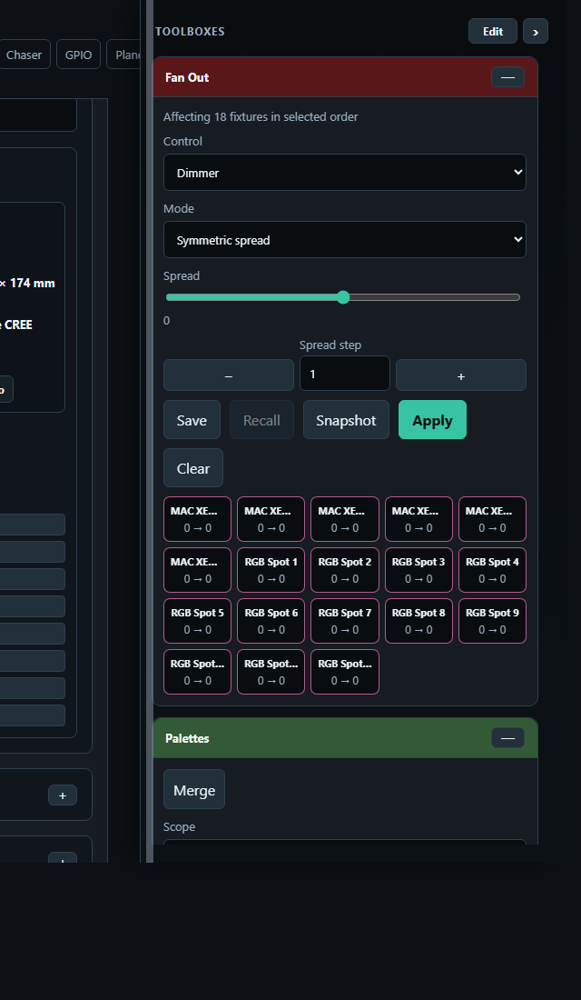

**Fan Out** shapes the currently selected fixtures or groups by spreading one compatible control through the selected order. It is documented in more detail below because its output can be saved as scenes or palettes.

#### Fan Out Toolbox

The Fixture Controller includes a **Fan Out** toolbox in the shared Toolboxes sidebar. It shapes the current controller values for the selected group or selected fixture cards, so the result can immediately be saved as a scene.

1. Select one or more Saved Groups, or select fixture cards manually.
2. In **Fan Out**, choose the control to shape, for example Dimmer, Pan, Tilt, or another compatible single-value control.
3. Click **Snapshot** to use the current controller values as the fan base.
4. Adjust **Spread**, or use **Start to end** mode with From/To offsets.
5. In **Symmetric spread** mode, `0` is the center of the slider. Positive and negative Spread values run the same shape in opposite directions through the selected fixture order.
6. The Control Surface updates continuously while you change the fan values.
7. The affected fixture controls are highlighted in the Control Surface.
8. Save the resulting look with the Scene Toolbox if you want to keep the actual DMX look.

In **Symmetric spread** mode, the **Spread** slider is centered at `0` and can move into positive or negative values. Positive Spread sends the fan in one direction through the selected fixture order; negative Spread sends it in the opposite direction. The **Spread step** field and the `-` / `+` buttons provide fine adjustment of the signed Spread value. Set the step size to the number of DMX increments you want to add or subtract, then click `-` or `+`. The buttons clamp at the valid signed range for the selected Fan Out control. **Start to end** mode hides the Spread nudge row because that mode is edited directly with the **From** and **To** number fields.

The current Fan Out working state is autosaved to the XAMPP server UI-state file. This includes the selected Fan Out control, mode, signed Spread, From/To offsets, and Spread step size, so the toolbox can restore the last working shape after a reload. Saved Fan Out presets are separate: **Save** stores a named recipe with its group/manual fixture scope, **Recall** asks which named recipe to load and immediately reapplies it, and saving another preset with the same name replaces the old recipe. **Snapshot** refreshes the base values, **Apply** explicitly reapplies the displayed calculation, and **Clear** resets the shaping controls to neutral without recalling the pre-fan DMX look.

The Fan Out toolbox only shows controls that are available on every fixture in the selected set. For pan/tilt controls, Pan and Tilt appear as separate fan targets. Applying a fan writes the calculated values into the controller just like moving the controls by hand, separates them by fixture assignment, and sends them to every involved DMX Output.

Fan Out calculates from a stored base value for each fixture, control, and axis. **Snapshot** stores those base values. In **Symmetric spread**, the spread is added around the base values:

```text
final value = snapshotted base value + spread offset
```

For example, with five fixtures and a spread of `100`, the offsets are `-50`, `-25`, `0`, `+25`, and `+50`. If every fixture has a base value of `128`, the result is `78`, `103`, `128`, `153`, and `178`. With a spread of `-100`, the same offsets run in the opposite direction. If the fixtures have different base values, each fixture still keeps its own base as the starting point.

The offset is assigned by fixture position in the current Fan Out order:

```text
fixture position = 0 ... fixture count - 1
offset position = fixture position / (fixture count - 1)
```

In **Symmetric spread**, the first fixture receives `-spread / 2`, the last fixture receives `+spread / 2`, and fixtures between them are spaced evenly. In **Start to end** mode, the first fixture receives the **From** offset, the last fixture receives the **To** offset, and fixtures between them are spaced evenly.

Fan Out order is important:

- If one or more saved groups are selected, the Controller uses the fixture order stored inside those groups. When several groups are selected, the groups are read in selected group order and duplicate fixtures are skipped after their first appearance.
- If no saved group is selected, the Controller uses the manual fixture selection order from the Control Surface.
- Negative **Spread** reverses the symmetric fan direction. It does not change the saved group, patch order, or fixture selection.

For a physical left-to-right fan, the saved group fixture order must match the physical fixture order. If a group was saved in a different order, the Fan Out math is still correct, but the visible stage result can look crossed or random.

Use **Save** in the Fan Out toolbox to store the fan setup itself: selected group or fixture IDs, selected control, mode, spread, and From/To offsets. Use **Recall** to restore that fan setup later. Recalling a Fan Out preset reapplies the fan to the controller values; it does not create a scene by itself. Use the Scene Toolbox when you want to store the resulting lighting look.

#### Palette Toolbox

The Fixture Controller also includes a **Palettes** toolbox. Palettes are reusable value fragments, while scenes are complete looks for their saved scope.

Use palettes for building blocks such as:

- Positions
- Colors
- Gobos
- Dimmer levels
- Fan Out results that you want to reuse as an overlay

The small top-left pencil icon on a filled palette slot opens **Edit Tile** for that slot. Use **Name** to rename the tile text, and use the visual controls for a background color plus an optional drawn/uploaded visual on top. The visual is independent from the palette scope. The drawing canvas uses the selected background color, and the brush automatically switches between a light and dark stroke for readable contrast. Use **Default background** to restore the standard slot color, or **No icon** to keep only the colored button. Scope still decides which DMX values are saved; the name and visual are readable labels shown in the palette slot grid and stored inside the palette JSON.

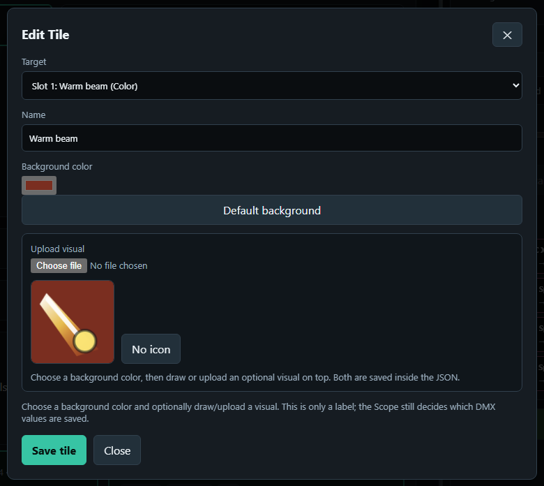

Palette save rules:

- If Fan Out is active, the palette saves only the Fan Out affected controls.
- If Fan Out is not active and fixtures are selected, the palette saves only the selected **Scope** for those fixtures.
- **Position** saves pan/tilt or position controls.
- **Color** saves RGB, RGBW, RGBWA, CMY, CMYK, matrix RGB, and common fixture-library color channels such as red, green, blue, cyan, magenta, yellow, white, amber, UV, lime, hue, saturation, CCT, CTO, or tint.
- **Dimmer** saves controls labeled as dimmer, dimming, or intensity.
- **Shutter / Strobe** saves shutter, strobe, and flash controls.
- **Gobo** saves gobo wheels and gobo rotation/index controls.
- **Prism** saves prism and prism rotation controls.
- **Optics** saves focus, zoom, iris, frost, beam, diffuser, or lens controls.
- **Programs / Effects** saves program, macro, effect, auto show, chase, pattern, scene, or preset controls.
- **All controls** saves every control on the selected fixtures and should be used deliberately.
- If nothing is selected, the palette is not saved; select fixtures or apply Fan Out first.

When saving a **Gobo** palette, the Controller can fill the palette tile visual from the selected fixture's gobo wheel metadata. If all selected fixtures resolve to the same gobo image or color, that shared visual is used automatically. If selected fixtures use different gobos, the current source fixture supplies the tile visual. If no gobo visual metadata exists, the palette uses the normal default visual.

Palette recall rules:

- Recalling a palette applies only the stored values.
- Unrelated controller values are left unchanged.
- The active group filter is cleared.
- The Control Surface is filtered to the fixtures involved in the palette.
- Only the recalled palette controls are sent, routed to the DMX Outputs assigned to the affected fixtures.

Filled palette slots recall palettes. Merging is done with the separate **Merge** button so recall and edit actions stay distinct.

Use **Merge** when you have a current fixture selection or active Fan Out result:

- The controller opens a palette matrix picker, so you choose the saved palette tile visually instead of typing a slot number.
- Empty slots are shown for orientation but cannot be selected as merge targets.
- If the current scope matches the saved palette scope, the values are merged and the palette keeps its scope.
- This allows one **Color** palette to contain RGB controls, color wheels, and RGBWA controls from different fixture types while still remaining a Color palette.
- If the current scope differs from the saved palette scope, the controller asks whether to change the saved palette to **All controls** and merge.
- If you cancel a merge prompt, the palette is not changed.

Use Toolboxes **Edit** when you want to reorder palette tiles. The same interaction is also available in the Groups and Scenes toolboxes:

- Click **Edit** in the sticky Toolboxes header to enable tile movement.
- Drag a filled palette tile to an empty slot to move it there; the tile shows the same drag outline and insertion marker used for moving toolboxes.
- Drag a filled palette tile onto another filled palette tile to swap their positions.
- On touch screens, tap a filled tile to select it, then tap the destination slot.
- While Toolboxes Edit is active, clicking a palette tile does not recall or save it.
- Click **Done** in the Toolboxes header when you are done organizing the palette grid.

### Scenes And Palettes

Scenes and palettes are reusable programming building blocks on the Fixture Controller. A scene stores a complete fixture look, while a palette stores reusable values for compatible controls.


#### What You Can Do with Scenes and Palettes

Use scenes to save and recall complete fixture looks. Use palettes to reuse compatible control values across fixtures and programming pages without rebuilding those values each time.

#### Scenes and Palettes Tools and Toolboxes

Scenes and palettes are programmed from the Controller's **Scenes** and **Palettes** toolboxes and recalled from their saved tiles. Show Run, Chaser, Effects, and Room Plane expose recall-oriented versions where those saved items are useful without duplicating their editors.


The Scenes and Palettes toolboxes are available together on the Fixture Controller page. Each screenshot keeps the toolbox at its normal Controller scale.

Scenes store controller values by fixture/control key, not a raw 512-channel DMX dump.

The small top-left pencil icon on a filled scene slot opens the same **Edit Tile** modal used by palettes. A scene can be renamed and can have a background color plus an optional drawn/uploaded visual in its slot. The canvas background follows the selected background color, and the brush color is calculated for contrast against it. **Default background** restores the standard slot color, and **No icon** removes the drawn/uploaded image. This name and visual are only labels for finding the scene quickly; scene save and recall still use the stored fixture values.

1. Set your desired fixture values.
2. Click an empty scene slot.
3. Enter a scene name.
4. Click a filled slot once to recall it.
5. Use the small `x` on a filled slot to delete it.

#### Scene Save Rules

Scene saving uses the current working scope:

- If Fan Out is active, the scene saves only the fixtures affected by Fan Out.
- For each Fan Out fixture, the scene saves all controls of that fixture, not only the fanned control. This keeps related values such as Tilt stable when saving a Pan fan.
- If Fan Out is not active and fixtures are selected, the scene saves only the selected fixtures.
- Selected Saved Groups count as selected fixtures, so a group-filtered scene saves only the fixtures in the selected groups.
- If a scene was recalled and the control surface is filtered to that scene's involved fixtures, saving again uses those involved fixtures.
- If nothing is selected, the controller asks before saving all patched fixtures.
- If you cancel that prompt, no scene is saved.

This means a scene is normally scoped to the fixtures you are actually working with. It does not silently save unrelated fixtures unless you explicitly confirm the all-fixtures fallback.

#### Scene Recall Rules

Scene recall loads the stored values back into the Fixture Controller, redraws the fixture cards, and updates the live-value snapshot used by the Chaser page.

When the applicable DMX Outputs are configured, scene recall groups the recalled values by fixture assignment and sends one batch to every involved Pico. Disconnect or disable the hardware outputs before recalling looks that must remain browser-only.

Recalling a scene clears the active group selection and shared group filter. It then selects the fixtures involved in the recalled scene and filters the Control Surface to only those fixtures. This makes the recalled scene visible without leaving an old group filter active, and without showing unrelated fixtures.

If a saved scene was created before fixtures were repatched, the controller tries to remap old fixture IDs to the current patch by matching the same fixture profile in DMX start-address order. This lets older scenes continue to recall after a fixture run was recreated, as long as the fixture profiles and control IDs still match.

The red **Clear all DMX channels** button clears controller values and calls `/dmx/clear` on every configured DMX Output. This clears both live DMX output and the motion base buffer on the involved Picos.

The Scene Toolbox sits in the shared **Toolboxes** sidebar. Its slot grid follows the configured rows and columns, and the tile size expands to the available sidebar width while keeping the old minimum slot size.

### Groups

Groups are saved fixture selections used throughout show programming and operation.


#### What You Can Do with Groups

Use a group to select several fixtures quickly, filter the current work area, and edit compatible controls across those fixtures together.

#### Groups Tools and Toolboxes

The **Groups** toolbox selects saved fixture sets and opens **Group Edit** for compatible controls across the selected fixtures. Group tiles are shared by Controller, Chaser, Effects, and Room Plane, but each page applies the selection to its own work area. Show Run provides recall-oriented group tiles instead of the programming toolbox.

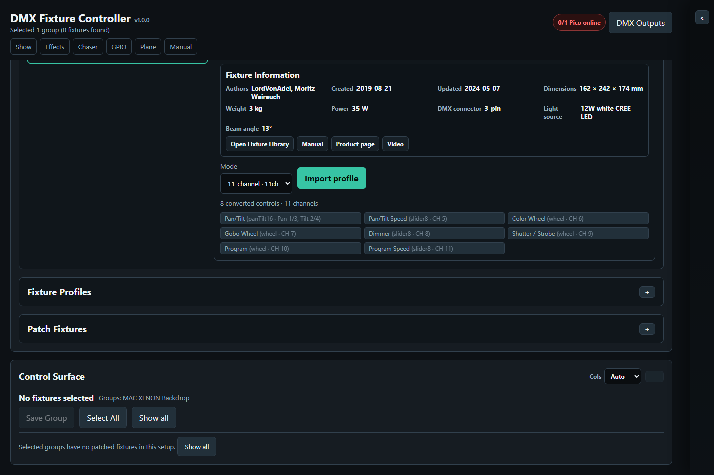

#### Create a Group

1. Select two or more fixture cards.
2. Click **Save Group**.
3. Enter a group name.
4. The group appears in **Saved Groups**.

#### Saved Group Selection

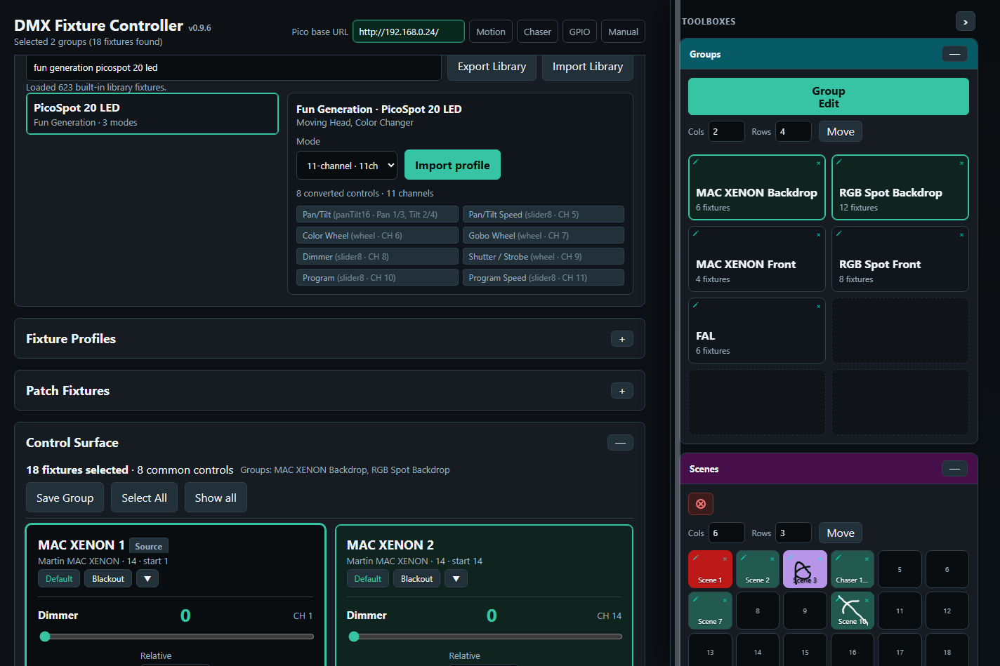

The Saved Groups card shows groups in a compact matrix. Each group has three interactions:

- Click the group tile to add it to the active group filter; click the highlighted tile again to remove only that group.
- The small pencil on a group tile opens **Edit Tile** for that saved group's name, background color, and optional drawn/uploaded visual.
- The small `x` on a group tile removes that saved group after confirmation.

More than one saved group can be selected at the same time. The control surface shows the union of all fixtures from the selected groups. This makes it possible to work with several fixture groups together without editing the group definitions.

The group bar above the control surface shows how many fixtures are selected and which saved groups are active. Use **Select All** to select every patched fixture explicitly. Use **Deselect all** to clear a manual fixture selection. When a saved-group filter is active, the same button is shown as **Show all** and clears the saved-group filter to return to the full fixture list.

Group selection is shared across toolbox pages that use the Groups toolbox. It is a working filter: selecting groups limits the visible fixtures for controller editing, Fan Out targeting, and Chaser participating-control setup. Recalling a scene, editing a saved chase step, or loading a saved chase clears the group filter because the recalled data itself becomes the source of truth.

#### Edit a Group

1. Load a saved group or select multiple fixtures.
2. Click **Group Edit**.
3. Adjust common controls in the modal.

On the Fixture Controller, **Group Edit** lives in the **Groups** toolbox. It requires an explicit fixture selection. If nothing is selected, Group Edit is disabled. Select individual fixture cards, load one or more saved groups, or press **Select All** before opening Group Edit from the Groups toolbox.

The Group Edit modal shows controls that exist in the current edit scope. It can be used for one fixture or many fixtures where the page supports single-fixture editing. Mixed fixture types are allowed; each control is applied only to fixtures that actually have a matching control, so incompatible fixtures are ignored for that control.

Exact profile-control matching is active when the modal opens. If differently defined fixtures expose the same physical function at different resolutions or use different color models, press **Merge Controls** inside the modal. The active button combines matching 8-bit and 16-bit functions such as Dimmer, Focus, Zoom, Iris, Frost, and color temperature and converts the high-resolution editor value to each fixture's native DMX range. Pan/Tilt values are likewise converted between 8-bit and 16-bit fixtures.

Merged color editing provides one RGB control for RGB, RGBW, RGBWA, CMY, and CMYK fixtures. The Controller converts RGB values to the subtractive CMY channels where required and preserves fixture-specific white, amber, and key channels. Controls that actually combine different native definitions use the same green background and accent border as the active **Merge Controls** button; exact matches remain uncolored. Press **Merge Controls** again to restore exact matching. Wheel controls are never merged through this mode because their option tables and DMX ranges must match exactly. If one fixture contains two controls with the same merge identity, that ambiguous fixture/function is excluded instead of choosing an arbitrary channel.

The selected **Source** fixture is the template for the modal values. When you open Group Edit, the modal reads the Source fixture's current matching control values and shows those values in the sliders, wheel buttons, color controls, XY pads, and relative nudge controls. Opening the modal does not overwrite the other selected fixtures and does not send DMX by itself.

The source selection is automatic. Loading a saved group makes the first fixture stored in that group the Source. With manual fixture selection, the clicked/selected fixture becomes the Source; if that fixture is removed from the selection, the page picks the next selected fixture that can provide the control.

The values are applied when you actually edit a control in the modal. Moving a slider, typing a direct numeric DMX value, dragging an XY pad, choosing a wheel slot, changing a color, pressing Center, using relative nudges, or using Default/Blackout writes the change to every selected fixture that has the matching control. Absolute edits write the shown Source value to the matching fixtures. Relative nudges keep each selected fixture relative to its own current value, so a group pan/tilt nudge moves the selected fixtures together without forcing them all to the same absolute position. Each Group Edit change is grouped by fixture assignment and sent immediately to every involved DMX Output. Disconnect or disable the hardware outputs before edits that must remain browser-only.

Group Edit remembers the relative step-size fields you set, for example **Pan fine relative** or **Tilt fine relative**. Controller, Show Run, Chaser, Effects, and Room Plane use the same autosave behavior. Each page stores its own step sizes in the XAMPP server UI-state file and restores them the next time Group Edit or the page opens, so your preferred nudge sizes survive reloads without forcing every workflow to use the same values.

If the controller is currently scoped by a recalled scene, recalled palette, or Fan Out result, **Group Edit** uses that scope. In that case it shows only controls that are part of the active scope and exist in the selected fixture scope. Editing a scoped control writes only to matching fixtures.

Use **Default** or **Blackout** to recall the stored default or blackout values for every fixture in the selected group. On the Controller, Chaser, Effects, and Room Plane programming pages, either button first stops both chaser and effect playback on every Pico assigned to the selected fixtures and waits for those requests before applying values. If a Pico cannot be stopped, the recall is cancelled and the page reports the failed output. Show Run is the exception: its Group Edit recalls do not automatically stop playback, preserving live-operation behavior.

#### Group Edit Contract

Controller, Chaser, and Effects all use the same basic Group Edit idea: the modal is available when the current page scope contains at least one editable control. Controller and Effects can use the same modal for a single fixture or a group of fixtures; Chaser uses the current participating-control scope for step editing. The fixtures do not need to use the same fixture profile.

Keep these rules as the contract:

- Mixed fixture types are allowed.
- A control is editable only when the page can match it by control identity, such as type and label.
- Controller and Show Run can optionally merge matching 8-bit/16-bit scalar controls, Pan/Tilt resolutions, and supported additive/subtractive color models. Exact matching remains the default.
- Wheel / indexed controls are stricter: same-named wheels are kept separate when their option lists differ, so a MAC Gobo wheel and a Scanner Gobo wheel are not accidentally edited as one control.
- Ambiguous duplicate merge candidates in one fixture are excluded rather than applied to an arbitrary channel.
- The modal shows the matching fixture/profile scope for each control.
- Opening the modal reads the Source fixture values into the modal but does not apply or send anything yet.
- Editing a control writes only to fixtures that actually have the matching control.
- The first edit in the modal is the moment the value is written to the group. Controller, Show Run, and Room Plane route live edits to every involved fixture's assigned DMX Output. Chaser and Effects editor previews currently use the primary show output.
- Incompatible fixtures remain selected but are ignored for that specific control.
- Group selection is a filter. If groups are selected, Group Edit uses only compatible fixtures inside those groups.
- Direct scope changes, such as Select All, Participating Controls All, or Effects All, clear the saved-group filter and make the page scope the source of truth.

### Chaser

The Chaser page creates and tests step-based lighting sequences. The overview shows every toolbox and collapsible work panel expanded.

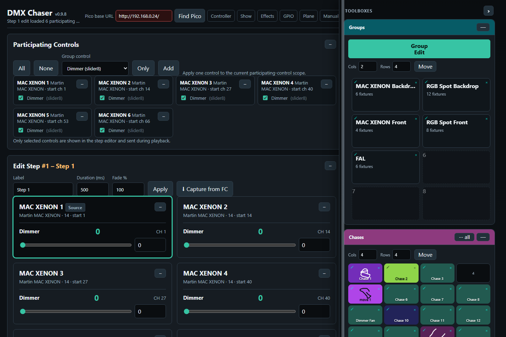

#### What You Can Do on Chaser

Use Chaser to choose participating fixture controls, build and time steps, test a chase in the browser, and deploy it to synchronized Pico playback slots.

#### Chaser Tools and Toolboxes

The Chaser page has a central chase-step work area and a shared toolbox rail. Use **Groups**, **Scenes**, **Palettes**, **Fan Out**, and **Planes** to prepare values and participating fixtures; use **Chases** and **Chase Steps** to manage saved chases and edit their steps; use **Browser Playback** and **Pico Chaser Slots** to test or deploy playback. The main page stays focused on **Participating Controls** and **Edit Step**, while the repeated working tools sit in the **Toolboxes** sidebar.

The Chaser overview is captured with every toolbox and collapsible work panel expanded. To reorder the toolboxes, click **Edit** in the Toolboxes header, drag colored toolbox headers up or down, and click **Done**. The order is shared with the other pages: if a page does not use one of the toolbox types, the next available toolbox moves up.

#### Basic Workflow

1. Open **Chaser**.
2. Select participating fixture controls.
3. Create steps with **Add step**, **Capture + Add**, or **Capture from FC**.
4. Set step duration and fade in **Edit Step**.
5. Store the chase in the **Chases** toolbox if you want quick recall.
6. Test timing in **Chase Playback**.
7. Click an empty Pico slot to upload the current chase to that slot.
8. Play the slot from the Pico.

#### Main Work Area

The Chaser page is arranged from top to bottom as **Participating Controls**, **Edit Step**, and **Pico Playback**. Use the cards in that order when building a chase: choose the fixture controls that may participate, edit the selected step values, then upload or play Pico slots after the chase behaves correctly.

The **Toolboxes** sidebar sits beside the main work area on desktop-sized screens. It contains the repeated tools for Groups, Chases, Palettes, Chase Steps, Fan Out, and Chase Playback.

#### Toolbox Sidebar

Controller, Chaser, and Effects use a shared right-side toolbox sidebar on desktop-sized screens.

- Drag the vertical resize line on the left edge of the sidebar to change its width.
- The sidebar width is shared across all toolbox pages.
- Double-click the resize line to reset the default width.
- The page content and the toolbox sidebar scroll independently. The page scrollbar sits beside the toolbox separation line, while the toolbox scrollbar stays inside the toolbox sidebar.
- Use the arrow button in the Toolboxes header to collapse or reopen the whole sidebar. The collapsed state is shared across toolbox pages.
- The Toolboxes header stays visible at the top of the sidebar while its toolbox tiles scroll, keeping **Edit** and the sidebar arrow within reach.
- Toolbox reordering is locked by default. Click **Edit** in the Toolboxes header, drag a toolbox by its colored header, and click **Done** when the order is correct. The toolbox body is never a drag handle. While Edit is off, dragging a colored header scrolls vertically instead of moving the toolbox, which prevents accidental rearrangement on iPad. While Edit is active, the app uses pointer dragging instead of Safari's native drag/drop.
- The **Cols** and **Rows** dropdowns in tile-based toolboxes are visible only while Toolboxes **Edit** is active. Their native pickers and 44-pixel touch targets make the matrix size easier to choose on iPad. Edit also enables movement in every tile matrix automatically, so no separate Move button is needed. Clicking **Done** hides the layout controls and restores normal tile actions.
- On narrow screens, the sidebar changes into a bottom toolbox drawer.

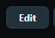

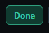

The Chaser page uses several toolboxes:

- **Groups** filters the fixture list by one or more saved fixture groups. It uses the cyan header, like the group tools on the controller page.

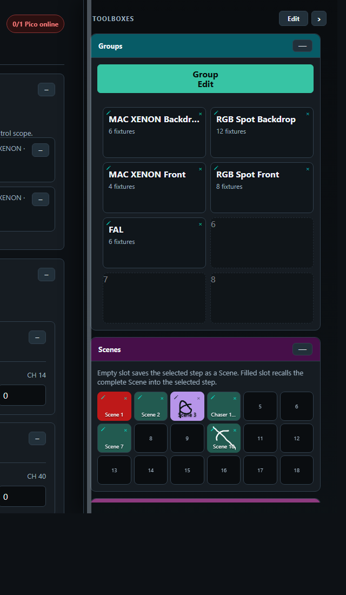

- **Chases** stores complete editable chases in a slot matrix. Clicking an empty slot saves the current chase. Clicking a filled slot loads that chase. After loading one, **Update chase** in Chase Steps replaces that saved chase's step data and playback settings with the current working chase without creating a second tile.
- The small top-left pencil icon on a filled **Chases** slot opens **Edit Tile** for the chase name, background color, and optional drawn/uploaded visual. **Default background** restores the standard slot color, and **No icon** removes the overlay image. This is only a label; loading a chase still uses the stored chase steps and playback settings.

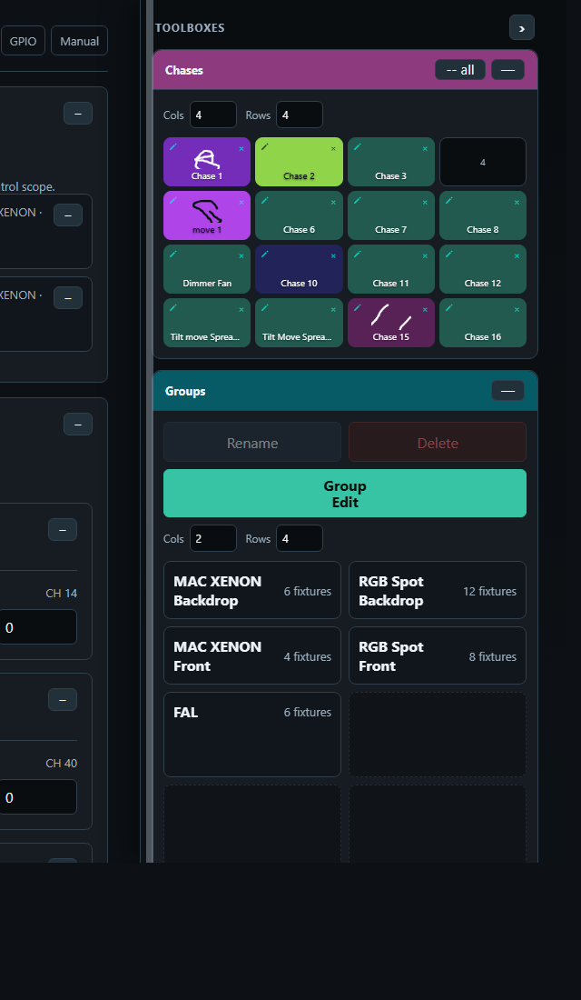

- **Palettes** stores and recalls reusable step fragments. Clicking an empty palette slot saves the currently selected step's fixture/control values to the shared palette JSON. Clicking a filled palette slot recalls compatible values into the selected step and rebuilds **Participating Controls** from the palette's stored fixture/control keys. If no step is selected, Chaser creates a new selected step from the palette. **Merge** adds the selected step's values into an existing palette; if the palette scope differs, Chaser asks before changing it to **All controls**. The small top-left pencil icon opens **Edit Tile** for a saved palette slot's name and visual appearance. Recalled palette values are previewed on the primary show output.

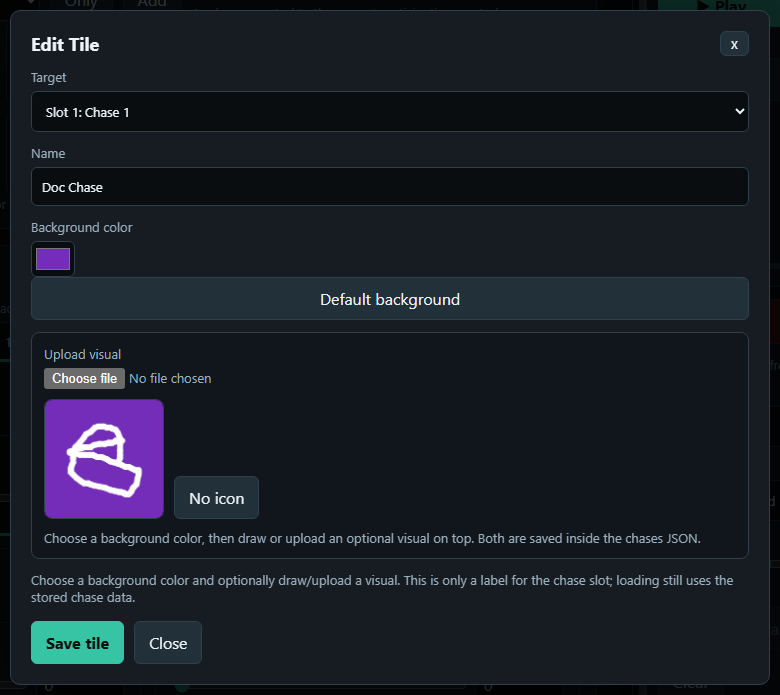

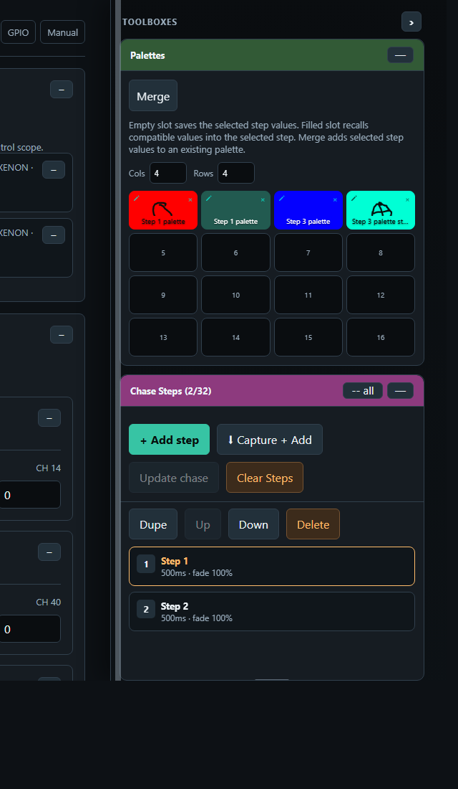

- **Scenes** uses the same saved Scene tiles as the Fixture Controller. Clicking a filled tile replaces the selected chase step with the complete Scene, makes the Scene controls the participating controls, clears an unrelated Groups filter, and previews those values on the primary show output. Clicking an empty tile saves the selected step as a shared Scene. The pencil edits the shared Scene name/visual, `x` deletes it, and **Cols** and **Rows** update the shared Scene layout while Toolboxes Edit enables tile movement.
- **Pixel Matrices** provides the same creation and editing workflow as the Fixture Controller. Click an empty `+` tile to create a picture in that position. The shared editor starts in color-paint mode: choose **Pixel color** and click cells to recolor them. Enable **Edit Mapping** only when cell clicks should assign fixture targets instead. Painting, mapping, resizing, image conversion, and clearing preview immediately in the selected chase step. The separate **Tile appearance** box changes the saved tile background and optional uploaded or drawn icon without changing pixel output unless **Use icon as matrix** is clicked; that action converts the tile artwork into pixel colors and previews them immediately. **Save** stores the definition. On a filled tile, use the pencil to reopen that editor or use `x` and confirm to delete the shared picture. Enable Toolboxes **Edit** to reveal the persisted **Cols** and **Rows** controls and tile movement: drag a filled tile on desktop, or tap its source and destination on a touch screen. Moving onto a filled slot swaps the pictures.

  Click a filled picture tile outside Toolboxes Edit to recall all of its compatible mappings into the selected chase step. If no step is selected, Chaser creates and selects a new picture step. To create an animated sequence, recall the first picture, add or select the next step, recall the next picture, and repeat. The picture becomes normal chase data: browser Chase Playback can fade or switch between the steps on the primary show output, while autonomous upload expands native matrix pixels into RGB DMX channels and splits a multi-output chase into linked Pico payloads. Recalling a picture stops browser playback and both playback engines on the primary Pico, clears the browser's last-output cache, and retransmits the complete selected picture to the primary output as a live preview even when its values match the previous browser output.
- **Planes** recalls saved room planes into the selected chase step. Select a group first if only part of the rig should be affected. Chaser uses the plane target and calibrated fixtures to write pan/tilt values into the step, rebuilds the participating controls for those pan/tilt channels, and previews the changed step on the primary show output. The Planes tile matrix uses the same **Cols**, **Rows**, and Toolboxes Edit movement behavior as the other saved tile toolboxes.

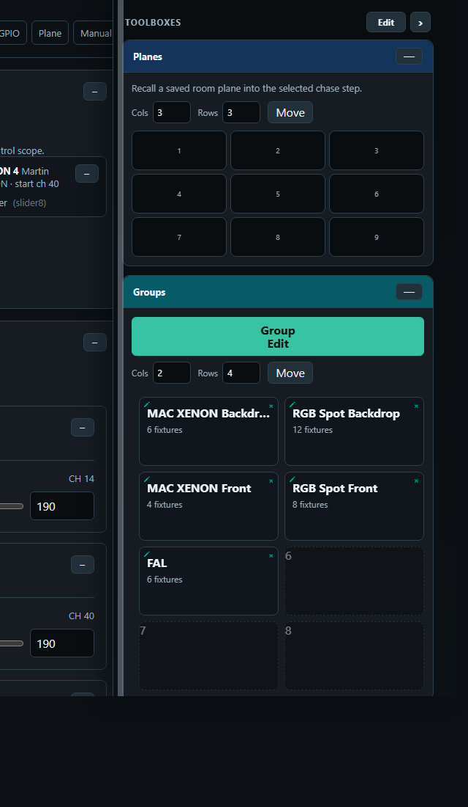

- **Chase Steps** contains the step list and step actions. Use it to add, capture, edit, duplicate, delete, and reorder steps. In the Toolboxes sidebar, drag the lower edge of the Chase Steps box to set its height. The top buttons remain visible while the step list scrolls inside the box.
- **Chases**, **Chase Steps**, and **Chase Playback** share one toolbox color and collapse together. Use **-- all** on any of those boxes to collapse the whole color group, and **+ all** to reopen it.

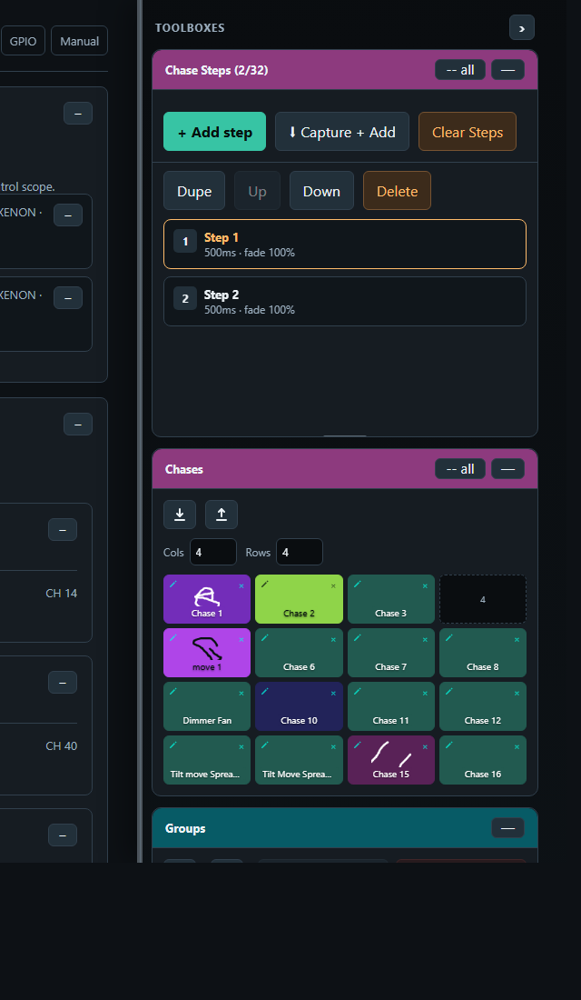

- **Fan Out** is a live step-shaping tool. It works on the currently selected step and writes directly into **Edit Step** as soon as you change the Fan Out mode, spread, or range values. **Snapshot** refreshes the base values from that step, and **Apply** explicitly reapplies the currently displayed calculation; normal slider/field changes already apply automatically.
- **Fan Out control selection** is filtered by the selected step. The control dropdown only shows compatible single-value controls that are actually part of the selected step's participating controls and exist on at least two fixtures. If one or more groups are selected, the same rule is applied inside the selected groups only.
- **Fan Out order** comes from the current participating fixture/control list. If a group filter is active, only fixtures inside the selected groups participate, but the calculation still follows the participating order that is shown for the current step/scope. In Symmetric spread mode, negative Spread runs the shape from the opposite side of the fixture row.
- **Fan Out base values** come from the values currently displayed in **Edit Step**. Selecting another step, loading another chase, capturing values, or using **Group Edit** refreshes the Fan Out base from the step values now shown on screen. This keeps spread calculations from drifting away from the edited step.
- **Clear** in the Chaser Fan Out toolbox resets the Fan Out shaping controls to neutral. It does not recall an older preset and it does not undo values that have already been written into the selected step.
- **Save** stores a named Chaser Fan Out recipe with its selected group scope. **Recall** asks for one of those recipes, restores its group and shaping fields, snapshots the selected step's current bases, and applies the recipe immediately. A preset with the same name is replaced.
- Editing **Edit Step**, using **Group Edit**, and changing **Fan Out** updates the selected step immediately and previews the changed values on the primary show output. Browser Chase Playback also uses that primary output. Upload the chase to a logical Pico slot when autonomous playback must be split across several DMX Outputs.

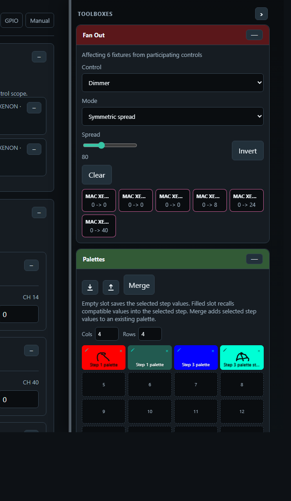

- **Chase Playback** runs the current chase from the browser for checking timing and fades before uploading to the Pico. **Mode** chooses **Single**, **Loop**, **Loop N**, or **Ping Pong**. **Direction** chooses whether playback starts at the first step and moves forward or starts at the last step and moves backward. **Loops** is only used by **Loop N**; normal **Loop** runs forever. **Ping Pong** reverses at the end of the chase instead of jumping back to the first or last step. The **Fade % (all steps)** field applies one fade value to every step immediately. Use **Edit Step > Fade %** when one step needs its own fade value.
- **BPM** and **Beats/step** calculate the duration applied to all current steps and the default duration of a newly added step: `duration = 60000 / BPM × beats`. **Tap tempo** averages recent taps, updates BPM, and reapplies the calculated duration. **Prev** and **Next** manually recall the adjacent step, including its immediate DMX preview. **Update rate (Hz)** controls how often browser playback calculates and sends fade progress, from 5 to 50 updates per second; it does not change Pico-resident playback.
- While Chase Playback runs, the currently playing step automatically becomes the selected step. This means **Edit Step** follows the chase visually and always shows the values of the last played step. Recalling a saved chase still selects Step 1 first, so playback starts from a predictable view.
- Selecting a step in **Chase Steps** stops browser Chase Playback and both playback engines on the primary Pico, then sends that step's programmed DMX values to the primary output immediately. This lets you verify positions, colors, and other programmed values without starting the chase. Manually changing controls in **Edit Step** also stops browser Chase Playback so playback cannot immediately overwrite the values you are editing.

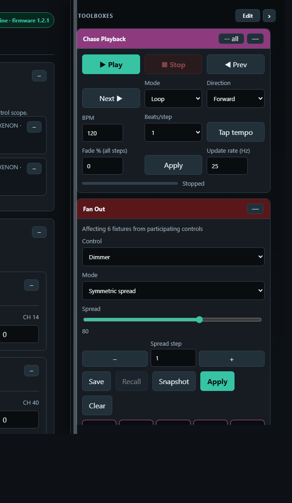

On page load, the Chaser working area starts with no steps selected. Use the **Chases** toolbox to recall a saved chase. Loading a chase from the **Chases** box stops Chaser and Effects playback on the primary Pico, updates the step list, selects Step 1, and rebuilds participating controls and the currently edited step together. If browser Chase Playback was already running, the recalled chase begins playing immediately; otherwise, Step 1 is sent to the primary output as a static preview. If the chase contains steps, the participating controls are rebuilt from the values stored in the chase, so old fixture/group filters do not hide the controls used by that chase.

Saved chases also recall the playback controls that were saved with them, including browser mode, Loop N count, Ping Pong, direction, BPM, and Pico speed. The Chases toolbox tiles still show only the chase name and visual so they stay consistent with the other toolboxes. Uploading to a Pico slot uses the current **Chase Playback** playmode, loop count, and direction, so the Pico slot behaves like the chase you previewed in the browser. Each loaded **Pico Playback** tile shows one canonical mode—Single, Loop, Loop N, or Ping Pong—plus its fade percentage or fade range, direction, and speed. Linked tiles additionally show their Pico count and universe/physical-slot members.

The collapse state, toolbox order, shared sidebar width, and the user-defined Chase Steps box height are stored by the server UI-state file, so the working layout survives reloads. Collapsing **Participating Controls** or **Edit Step** only hides that card body: the sticky page header keeps the same height, and the next card moves up to use the freed space.

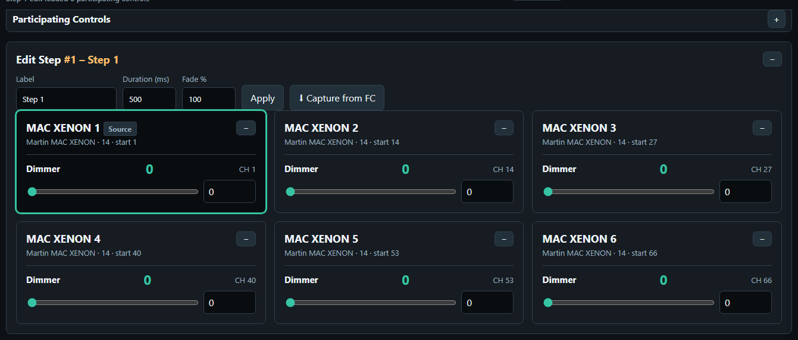

#### Chase Steps Toolbox Buttons

The **Chase Steps** toolbox uses shared action buttons instead of per-step buttons. Click a step card to select the step first; the selected step is highlighted and loaded into **Edit Step**.

- **Add step** creates a new selected step from the stored default values of the currently participating controls. If a fixture profile has no custom default for a control, Chaser uses the control type fallback.
- **Capture + Add** creates a new selected step only when Fixture Controller live values exist for at least one currently participating control. If no matching live values are available, no empty step is created.
- **Clear Steps** deletes all current working steps after confirmation. It does not delete saved Chases toolbox entries or Pico slot payloads.
- **Dupe** duplicates the selected step directly after itself and selects the copy.
- **Up** and **Down** move the selected step in the step order and keep the same step loaded in **Edit Step**.
- You can also drag a step card with mouse or touch and drop it before or after another step card to reorder the chase. A short click still selects the step. The selected step and the currently playing step stay attached to the same step data after the move.
- **Delete** removes the selected step. If another step remains, it becomes the selected step.

#### Effects Participating Controls

Participating controls define which fixture controls belong to the chase. This keeps the chaser from editing unrelated channels.

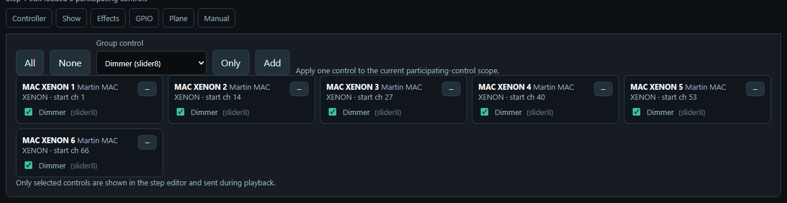

For example, a dimmer chase might include only dimmer controls. A color chase might include only RGB or RGBWA controls.

If no group is selected, all patched fixtures are available. If one or more groups are selected in the Groups toolbox, only fixtures from those groups are shown while you are choosing the scope. Any direct change in **Participating Controls** then clears the group selection. This avoids mixing two different filters: after you press **All**, **None**, **Only**, **Add**, or tick an individual checkbox, the participating-control set becomes the source of truth.

The **Group control** dropdown is built from the fixtures currently visible in the participating-control scope, not from the controls that are already ticked. With no Groups filter, the dropdown stays based on all visible patched fixtures even after **Only** narrows the selected participating controls. With a Groups filter, the dropdown is based on the selected groups. When an edited step is active, the visible step fixtures define the dropdown scope.

**All** selects every valid participating control for all patched fixtures, clears the Groups filter, expands the participating fixture list, stops browser Chase Playback, clears the selected step, clears **Edit Step**, clears the Source fixture, and resets Fan Out bases. Existing steps in **Chase Steps** are not deleted. After **All**, use **Add step**, **Capture + Add**, or **Group Edit** to create or edit a step from the full participating-control scope.

**Group Edit** edits the current participating-control scope. It becomes available when the current scope contains at least one matching selected control on two or more participating fixtures, even when those fixtures use different fixture profiles. A step does not need to be selected first. If no step is selected, the first Group Edit value change creates a new step from the current participating controls and writes the edit into that step. If a step is selected, Group Edit edits that selected step.

The fixtures may use different profiles; the modal only shows matching controls that are actually selected as participating controls and exist on at least two fixtures. For example, if only Dimmer is selected, Group Edit opens with Dimmer only and applies a changed Dimmer value to every involved fixture that has a matching Dimmer control.

Group Edit uses the **Source** fixture from **Edit Step** as the reference value. Opening the modal reads the Source fixture's current selected-step values into the modal controls. It does not automatically overwrite the other fixtures, does not create a new step, and does not send output by itself.

The values are written when you change a control in the modal. If no step is selected, the first Group Edit value change creates a new step from the current participating controls and writes the edited value into that step. If a step is selected, the edit writes into that selected step. Changed selected-step values are previewed on the primary show output.

#### Chaser Selection Rules

The Chaser page has two different selection modes: defining a new participating-control set, and editing or recalling an existing step. They intentionally behave differently.

Keep these rules as the contract for the Chaser page:

- **Participating Controls** define the fixture/control scope for new steps and for Group Edit.
- **Edit Step** shows the currently selected step, not a separate preview copy.
- If a saved chase is recalled, Step 1 is selected immediately and becomes the visible **Edit Step**.
- If **Chase Playback** is running, playback overrules manual step rendering: every played step automatically becomes the selected step and redraws **Participating Controls** plus **Edit Step**.
- During fades, **Edit Step** updates the existing sliders, readouts, XY dots, colors, and wheel highlights continuously from the interpolated playback values. The full card is only rebuilt when the played step changes.
- When playback stops or pauses, the last played step remains selected.
- Manual previous/next playback also selects the stepped-to chase step and redraws **Edit Step**.
- Group filters are only temporary scope builders. Direct Participating Controls changes clear the group filter.
- **All** clears the selected step/edit context but keeps the existing step list unchanged.
- **Group Edit** does not require a selected step. If no step is selected, the first Group Edit value change creates a new step from the current participating controls. If a step is selected, Group Edit edits that step.
- Opening **Group Edit** loads the current Source fixture values into the modal only. The output or selected step changes only after you edit a modal control.

When you define participating controls manually:

- If no group is selected, the Participating Controls panel shows all patched fixtures.
- If one or more groups are selected, the panel is temporarily filtered to the fixtures in those groups.
- **All** selects every currently visible control and clears the group selection.
- **None** clears the participating-control selection, collapses the fixture list, and clears the group selection.
- The control dropdown lists controls from the selected groups while a group filter is active. If no group is selected, it lists controls from the current participating-control scope.
- The control dropdown plus **Only** selects one matching control type from the current scope, clears all other controls, and then clears the group selection.
- The control dropdown plus **Add** adds one matching control type from the current scope without clearing existing participating controls, then clears the group selection.
- Ticking or unticking an individual participating-control checkbox also clears the group selection.

When you click a step in the **Chase Steps** toolbox:

- Browser Chase Playback, Pico Chaser playback, and Pico Motion playback are stopped before the step is recalled.
- The step values are checked against the current fixture setup.
- Invalid fixture/control references are removed from the edited step.
- The Participating Controls panel is rebuilt from the chase values.
- If no group is selected, only fixtures and controls that are actually stored in the selected step are shown, and **Group Edit** becomes step-dependent.
- If a group is selected, the selected step is filtered to that group and **Group Edit** uses the grouped fixtures as its edit scope.
- The Edit Step card shows the same scoped fixture/control set, so editing Step 2 cannot accidentally show or edit unrelated controls from another group or old filter.
- The selected step's programmed values are sent to DMX immediately so the look can be verified without starting playback.

When you click a saved chase in the **Chases** toolbox:

- The selected Groups filter is cleared first.
- The saved steps, playback settings, and Chase Playback settings are loaded.
- The first step becomes the edited step.
- Participating Controls and Edit Step are rebuilt from that loaded step.
- If the saved chase was made before fixtures were repatched, the page tries to remap old fixture IDs to the current setup by matching the same fixture profile in DMX start-address order.
- If no valid step values can be found, the page falls back to the saved participating-control map stored with the chase.

This means group selection is a tool for building, filtering, and group-editing a step. Loading a saved chase clears the group filter because the recalled chase data becomes the source of truth. After recall, **Group Edit** can still become available without a selected group because it uses the fixtures participating in the selected step.

#### Create Chase Steps

A chase step stores values for the selected **Participating Controls**. It does not store every patched fixture automatically.

To create a step manually:

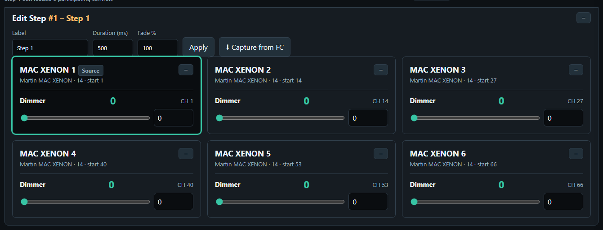

1. Select the controls that should participate in **Participating Controls**.
2. In the **Chase Steps** toolbox, click **Add step**.
3. Click the new step in the **Chase Steps** list.
4. In **Edit Step**, set **Label**, **Duration (ms)**, and **Fade %**.
5. Adjust the controls shown in **Edit Step**. Those control values are written into the selected step immediately and previewed on the primary show output.
6. Click **Apply** after changing the label, duration, or fade.

**Add step** starts from the stored default values of the selected participating controls. If a fixture profile has no custom default for a control, Chaser uses the control type fallback: centered pan/tilt, zero for sliders, wheels, and color channels.

After **Add step** or **Capture + Add**, the first fixture in the new step is automatically marked as the **Source** fixture in **Edit Step**. Click another fixture card in **Edit Step** to make it the Source fixture. Group Edit uses the Source fixture's current step values as its starting values before writing changes to the matching participating fixtures.

Use the **Palettes** toolbox when the selected step should become a reusable fragment. Empty palette slots save exactly the selected step's stored values, not the whole chase and not all DMX channels. Filled palette slots recall compatible palette values into the selected step and make the palette's stored controls the active participating-control scope. Other values already stored in the step remain stored, but **Edit Step** focuses on the recalled palette controls. If no step is selected, recalling a palette creates a new selected step from that palette.

To capture a new step from the Fixture Controller:

1. Open **Fixture Controller** in another browser tab or window.
2. Build the look there by moving controls, recalling a scene, or recalling a palette.
3. Return to **Chaser**.
4. Make sure **Participating Controls** contains the controls you want to capture.
5. In the **Chase Steps** toolbox, click **Capture + Add**.

**Capture + Add** creates a new step and copies the current Fixture Controller live values for the selected participating controls.

To capture into an existing step:

1. Click the step in the **Chase Steps** list.
2. Build the wanted look in **Fixture Controller**.
3. Return to **Chaser**.
4. In **Edit Step**, click **Capture from FC**.

**Capture from FC** updates the selected step with the current Fixture Controller live values for the selected participating controls.

#### Capture From Fixture Controller

Use **Capture from FC** or **Capture + Add** to read the current Fixture Controller live values and use them as chase step values.

This is useful when you want to build a chase visually:

1. Create a look on the Fixture Controller.
2. Capture it into the Chaser.
3. Change the look.
4. Capture the next step.

If Chaser reports that no Fixture Controller values are available, open the Fixture Controller page and move a control or recall a scene first. Capture only reads controls that are selected as participating controls, so unselected controls are ignored.

#### Pico Slot Playback

Chasers can be uploaded to 32 fleet-wide logical Pico slots. Each slot can run on the Pico without the browser staying open. The Pico slot strip is the upload target: click an `EMPTY` slot to upload the current chase. Click a loaded slot once to select it for play, pause, resume, speed, or stop. Click the selected loaded slot again if you want to replace it with the current chase; the page asks before overwriting.

If the participating fixtures belong to several DMX Outputs, Chaser splits the chase into one payload per output. Logical slot N uses physical slot N on every involved Pico. Before an upload, the page reads every configured Pico: `EMPTY` means every Pico consistently reports that position empty, `READY` means the saved linked playback is present, `PARTIAL` identifies missing members or unexpected occupancy, and `UNKNOWN` prevents changes while a Pico cannot be inspected. A tile marked **LINKED · 2 PICOS**, for example, represents one logical chase whose members both use the displayed slot number. Play, Pause/Resume, Speed, Stop, synchronization, and Delete apply to the linked members.

##### Linked Chaser Slot Capacity

The current Chaser interface can address a maximum of **32 logical Pico playbacks**. A linked chase consumes one physical chaser slot on each Pico involved in that chase. Therefore:

- A chase using one Pico consumes one slot on that Pico.
- A chase using two Picos consumes one slot on each of those Picos.
- If every chase uses the same two Picos, those Picos can hold at most 32 linked chases.
- The same physical slot number is used on every Pico participating in a logical chase.
- Although separate Picos could theoretically hold additional unrelated playbacks, the Chaser interface deliberately exposes only the same 32 fleet-wide positions to keep Pico memory consistent with the UI.

This limit applies only to Pico-resident playback. Saved browser chase definitions remain separate from the physical slot allocation.

Starting a Pico slot with **Play Slot** stops browser Chase Playback first, so only one chase engine controls the DMX output.

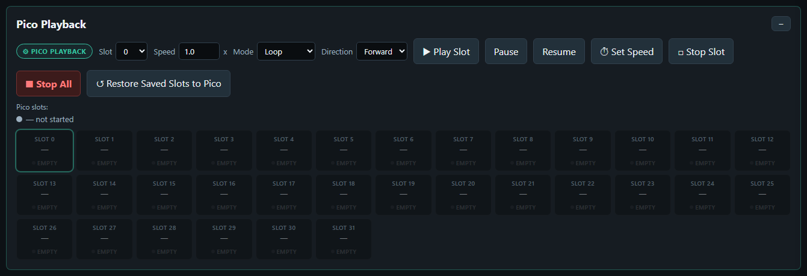

**Set Speed** changes the speed multiplier of the selected loaded slot without re-uploading its chase. **Stop Slot** stops only the selected logical slot, while **Stop All** stops Chaser playback on the relevant Pico playback target. Use the small `x` on a loaded tile to remove its saved mirror and clear physical slot N from every configured Pico after confirmation. **Synchronize Saved Slots to Picos** treats the controller application's saved slot state as authoritative: after every Pico passes preflight and you approve the exact upload/clear summary, it reloads saved payloads into their common slot numbers and clears loaded Pico slots that are absent from the saved controller state. This is useful after a reset, reflash, interrupted upload, or inconsistent fleet state. Data that exists only on a Pico cannot be recovered after synchronization. Older linked manifests whose physical member numbers differ show **Normalize Legacy Slots**; normalization first creates a timestamped server backup and refuses unmanaged conflicts rather than silently overwriting them.

Supported playback options:

- Single run
- Loop
- Loop N times
- Ping Pong
- Forward or reverse direction
- Speed multiplier
- Pause and resume

Direction sets the first playback direction for the slot. In Ping Pong mode the Pico reverses direction whenever it reaches either end of the chase.

Each chaser slot supports up to 32 steps.

### Effects

The Effects page creates continuous movement and scalar effects for selected fixtures and controls.

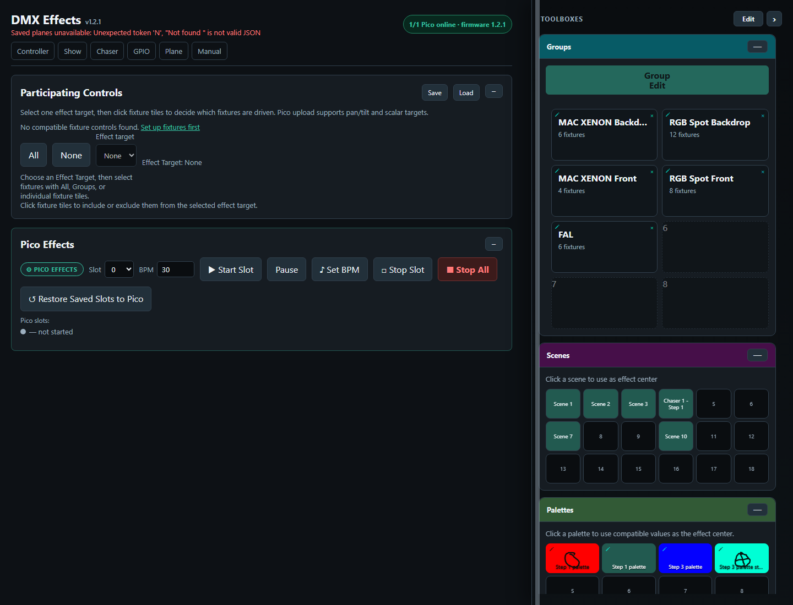

#### What You Can Do on Effects

Use Effects to choose participating fixtures, configure one effect target, test it in the browser, save reusable definitions, and deploy autonomous playback to synchronized Pico slots. It can drive a combined pan/tilt target or one scalar DMX target such as dimmer, prism, gobo, zoom, or iris.

#### Effects Tools and Toolboxes

The Effects page combines participating-fixture cards and effect parameters with a shared toolbox rail. **Groups**, **Scenes**, **Palettes**, **Fan Out**, and **Planes** establish targets and base values; **Effects** loads and saves effect definitions; **Pico Effects Slots** deploys autonomous playback. Selecting a toolbox item does not automatically enable unrelated effect targets.

Supported effects include:

- Pan/tilt targets: Circle, Figure-8, Pan Sine Wave, Tilt Sine Wave, Pan Pulse, Tilt Pulse
- Scalar targets: Sine, Pulse

Pan/tilt is treated as one combined two-axis target. Pan/tilt effects are relative to the current scene position, so the effect moves around the position that was last written into the Pico base buffer. Scalar controls are one-axis targets and use their displayed center value plus the **Amplitude** slider as the effect depth. Browser playback is only an overlay for testing; when you press **Stop**, Effects restores the stored base values to the output so the last moving effect position does not become the next center.

#### Participating Controls

The **Participating Controls** panel uses an **Effect target** dropdown. The default target is **None**. With **None** selected, no fixture tiles are enabled, Group Edit is disabled, and no effect can be played or uploaded.

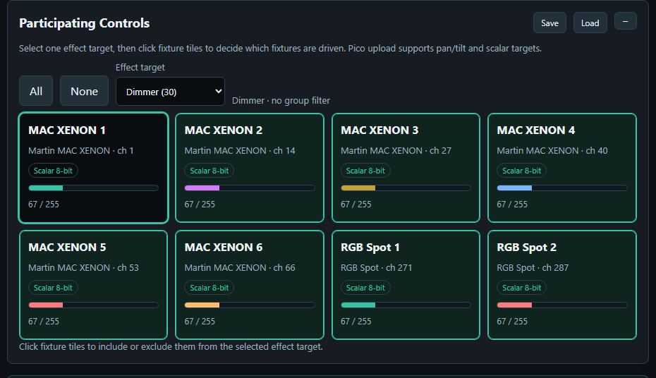

Hard reload, including Ctrl+F5, resets **Effect target** to **None** and clears playback participation. Normal navigation away from Effects and back in the same browser tab restores the current working target, fixture participation, and parameters from session state. The saved server preset is not auto-applied on page load; use **Load** or recall a saved **Effect** tile when you want to explicitly restore saved target and participant data.

**Save** in Participating Controls writes the complete current Effects working setup to the server: target, enabled fixtures, effect parameters, and saved effect recipes. **Load** explicitly replaces the current working setup with that server copy. Normal parameter changes also preserve the current tab's working state for navigation, but they do not automatically invoke the explicit server Load operation after a hard reload.

One effect can only target one control type at a time: either pan/tilt, or one scalar control type. Choosing an effect target filters the fixture matrix to compatible fixtures, but it does not automatically enable those fixtures. This keeps target choice separate from fixture participation and prevents mixed targets such as dimmer plus gobo plus pan/tilt in one effect.

The **Participating Controls** card can be collapsed when you only need the toolboxes. In collapsed mode it stays compact and does not change the sticky page-header height.

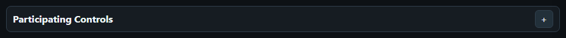

The fixture matrix is a selection and preview surface:

- Click a fixture tile to include or exclude it from the effect.
- Use **All** to clear any group filter and enable every fixture for the current target.
- Use **None** to disable every visible fixture for the current target.
- Selecting groups applies an additional filter and enables compatible fixtures inside the selected groups.
- Pan/tilt targets show a small XY plot with the current position.
- Scalar targets show a small value bar with the current value.

Center values come from the current base buffer or from recalling a scene as the effect center. Phase spread, amplitude, BPM, and effect shape are set in the **Effect Parameters** toolbox. The amplitude controls are target-aware and effect-aware. Circle and Figure-8 show **Pan amp** and **Tilt amp**. Pan Sine Wave and Pan Pulse show only **Pan amp**; Tilt Sine Wave and Tilt Pulse show only **Tilt amp**. The sine-wave effects move smoothly between both amplitude limits, while Pulse switches directly between them once per half-cycle. Scalar effects show one **Amplitude** slider. Hidden axes are forced to zero for preview and Pico upload, but their last two-axis values are remembered when you return to Circle or Figure-8.

Pan Pulse and Tilt Pulse also show **Position offset** and **Direction**. Position offset shifts both pulse levels from the current base Pan/Tilt center: negative values move the complete pulse toward the negative side of the axis and positive values move it toward the positive side. Direction continuously changes the balance between the two levels. At **-100%**, the effect pulses from the center toward the negative side only; at **0%**, it uses the original symmetric negative/positive pulse; and at **+100%**, it pulses toward the positive side only. Intermediate values create asymmetric pulses. Position offset does not replace timing phase: per-fixture phase offsets and **Phase spread** continue to decide when each fixture changes level.

The **Effect** dropdown is target-aware. It only shows effects that make sense for the selected **Effect target**.

**BPM** controls the effect cycle speed. One complete effect cycle lasts one beat at the selected BPM. **Mode** determines how many cycles play: **Single** stops after one cycle, **Loop** repeats continuously, and **Loop N** stops after the selected 1–999 cycles. **Hz** is the browser preview update rate from 5 to 50 calculations/s; changing Hz affects browser smoothness and request load, not the autonomous Pico effect timing. **Start** begins browser preview and changes to **Stop** while it is running. **Pause** freezes the current effect phase and changes to **Resume**; resuming continues from that phase instead of restarting the effect. While paused, **Restart** starts the effect again from its beginning.

##### Autonomous Pico Effect Smoothness

An autonomous Pico-slot effect is calculated every 10 ms (100 calculations/s). The configured 43 Hz DMX output sends a new frame approximately every 23.26 ms, so the fixture receives about 43 effect positions per second. A 16-bit Pan/Tilt target has 65,536 possible values on each axis, with a smallest numerical change of one 16-bit unit, but 16-bit resolution does not increase the number of positions sent per second.

For one complete BPM-timed effect cycle:

- Pico calculations per cycle = `6000 / BPM`
- Positions transmitted over DMX per cycle = approximately `2580 / BPM`

| BPM | Pico calculations per cycle | Approximate DMX positions per cycle |
| ---: | ---: | ---: |
| 10 | 600 | 258 |
| 30 | 200 | 86 |
| 60 | 100 | 43 |
| 120 | 50 | 21–22 |
| 300 | 20 | 8–9 |
| 600 | 10 | 4–5 |

At the maximum supported 600 BPM, the Pico therefore calculates only 10 positions per cycle and approximately 4–5 reach the fixture as DMX frames. Large Pan/Tilt amplitudes can make those steps visible. For smoother 16-bit movement, use about 60 BPM or less when practical; at 60 BPM, approximately 43 positions are transmitted during each cycle. The exact 16-bit value change between positions also depends on the selected effect shape and Pan/Tilt amplitude.

The same target rules are used for Pico upload. Pan/tilt and scalar effects can be uploaded to one of the Pico effect slots, and the Pico reads the effect center from its base buffer while playing. Pan/Tilt profile mapping is included in the uploaded target: swapped axes use the swapped physical channels, and reversed axes invert the effect offset around the current base value.

The Effects page also includes the shared **Palettes** toolbox. Clicking a palette recalls any values that are compatible with Effects and uses them as the current effect center. For example, a position palette can set pan/tilt centers, while a dimmer or beam palette can set scalar centers. The small pencil opens **Edit Tile** so palette names and visuals can be adjusted from Effects too. Effects recalls, imports, exports, and saves the shared palette JSON.

The **Effects** toolbox stores reusable effect recipes. Click an empty effect slot to save the selected Effect target, participating fixtures, effect type, BPM, play mode, Loop N count, amplitudes, spread, and phase offsets. Effects do not store the current center/base values, so the same saved effect can be reused with different scene or palette centers. With the browser preview stopped and its button showing **Start**, clicking a saved effect only recalls the recipe. When the preview is already active and the button shows **Stop**, clicking another saved effect restarts the browser preview immediately with that recipe's saved timing and update rate, making it easy to audition several effects. Recall never uploads the recipe to a Pico slot. The small pencil opens **Edit Tile** for the effect name, background, and optional drawing/upload.

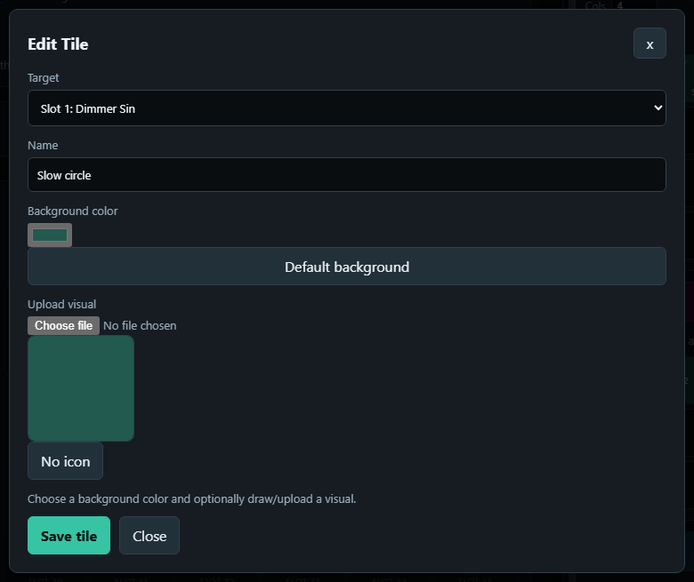

**Effect Parameters** and **Effects** share one toolbox color and collapse together. Use **-- all** on either box to collapse the whole effect group, and **+ all** to reopen it.

#### Pico Effects Slots

The Pico effect slot upload uses the same selected **Effect target** as the browser page. When enabled target fixtures use several DMX Outputs, the effect is split into a linked payload for each involved Pico. Logical effect slot N uses physical motion slot N on every involved Pico. The strip uses the same `EMPTY`, `READY`, `PARTIAL`, and `UNKNOWN` fleet states as Chaser so it never describes a slot as empty when another configured Pico still contains data there.

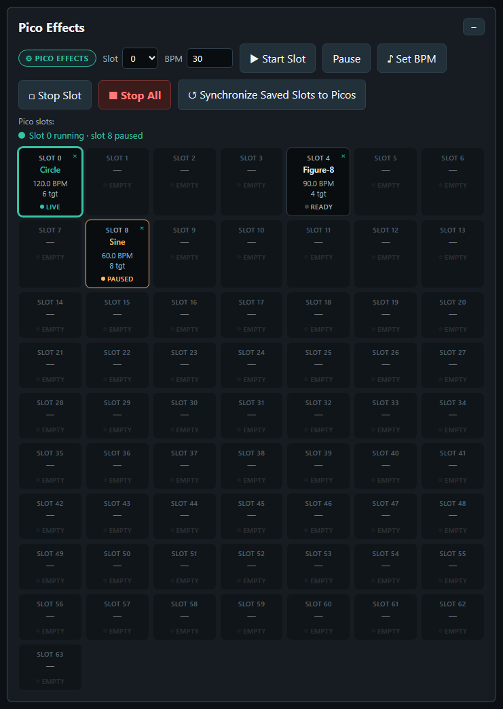

- If the target is pan/tilt, the uploaded slot stores pan and tilt channel addresses and plays two-axis effects.
- If the target is pan/tilt, one-axis effects still store the pan/tilt channel addresses, but unused amplitude axes are uploaded as zero: Pan Swing uses `AMP1` and zero `AMP2`; Tilt Swing uses zero `AMP1` and `AMP2`.
- If the target is scalar, the uploaded slot stores that one control's DMX channel address and plays one-axis effects such as sine or pulse. Scalar uploads use `AMP1` for **Amplitude** and force `AMP2` to zero.
- Click an empty Pico slot to upload the current effect to that slot.
- If physical slot N is occupied on a required Pico, the page identifies that Pico and asks before replacing it. Choose **Cancel** to preserve all existing slots; no partial upload is performed before this decision.
- Click a loaded slot once to select it for start, stop, or BPM changes.
- Click the selected loaded slot again to replace it with the current effect; the page asks before overwriting.
- **Mode** selects **Single**, **Loop**, or **Loop N** for both browser preview and Pico upload. **Loops** appears for Loop N and sets its 1–999 cycle limit.
- **Pause/Resume** freezes and continues the current Pico effect phase without discarding or restarting the loaded slot, and **Set BPM** changes the selected slot's tempo without re-uploading its targets.
- **Stop Slot** stops only the selected logical effect; **Stop All** stops the relevant Pico Effects playback.
- The small `x` clears the selected saved slot and physical slot N on every configured Pico after confirmation.
- **Synchronize Saved Slots to Picos** preflights the fleet, reports the exact uploads and stale-slot clears, reloads every saved effect into its common slot number, and removes Pico slots absent from the controller application's saved slot state. Older differing-slot manifests must first be handled with **Normalize Legacy Slots**, which creates a backup and checks for conflicts.
- Slots store channel mappings, BPM, play mode, Loop N count, amplitude, spread, effect type, and target phase. Slot tiles identify Single and Loop N configurations and report their playback state. Slots do not store fixed center values.
- The center value is read from the Pico base buffer during playback. This means a scene recall or live controller change can define the center before the slot starts.
- Up to 64 physical effect slots can be loaded on one Pico.

##### Linked Effect Slot Capacity

The current Effects interface can address a maximum of **64 logical Pico effect playbacks**. Each linked effect consumes one physical effect slot on every Pico used by its participating fixtures. If every effect uses the same Picos, the fleet can therefore hold at most 64 linked effects. Member slot numbers may differ between Picos, and the linked tile records their universe/slot mapping. A coordinator may still show empty slots when a peer is already full; in that case the overwrite confirmation described above is required. As with Chaser, additional disjoint capacity on otherwise unused Picos is not exposed as extra logical positions by the current coordinator-based interface.

For scalar targets, set the current value first, then upload/start the slot. For example, set a dimmer to its desired base brightness and use Sine if you want the Pico to pulse above and below that base value.

#### Effects Toolboxes

The Effects page uses five toolboxes in the shared sidebar.

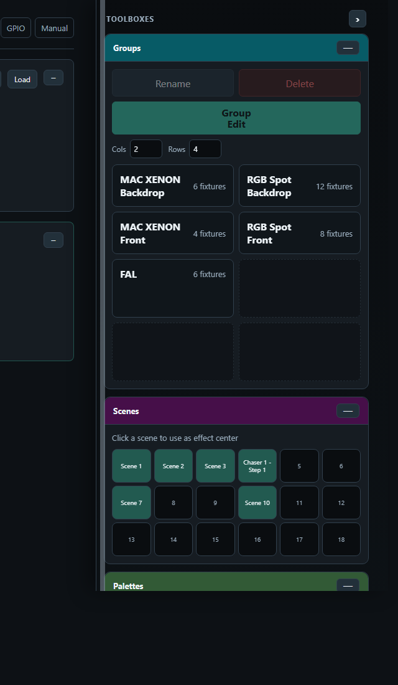

**Groups** filters the fixture matrix for the selected effect target. When **Effect target** is **None**, Group Edit is disabled. A saved Effects setup restores its target and participating fixtures when the page is opened or hard-reloaded. Choosing a different target does not automatically enable fixtures for playback, but it does make Group Edit available as soon as at least one fixture has that target. For example, choosing **Dimmer** lets Group Edit work across every MAC and RGB Spot fixture that has a Dimmer control while playback participation remains off until fixtures are selected. Choosing **Pan/Tilt** can also open Group Edit for a single moving light. Pressing **All** clears the group filter and enables every fixture available for the current target. Selecting one or more groups enables compatible fixtures inside those groups. If some fixtures are already enabled, Group Edit uses that enabled subset; if none are enabled yet, Group Edit uses all fixtures compatible with the selected target.

The Effects fixture grid marks the current **Source** fixture with the same highlighted selection language used by the Controller. The Source fixture supplies the values shown in the Group Edit modal. Click another enabled fixture tile to make it the Source; click the current Source tile again when you want to remove that fixture from participation.

Effects Group Edit uses the Controller-style controls: pan/tilt edits use the XY pad for absolute center placement and relative nudge rows for movement from the current values. The modal no longer exposes separate absolute Pan/Tilt sliders. Use **Pan coarse relative**, **Pan fine relative**, **Tilt coarse relative**, and **Tilt fine relative** for 16-bit moving lights when you want to move one fixture or a selected group without forcing every fixture to the same absolute value. Relative nudges keep each fixture offset from its own current center, then preview the changed center values on the primary show output.

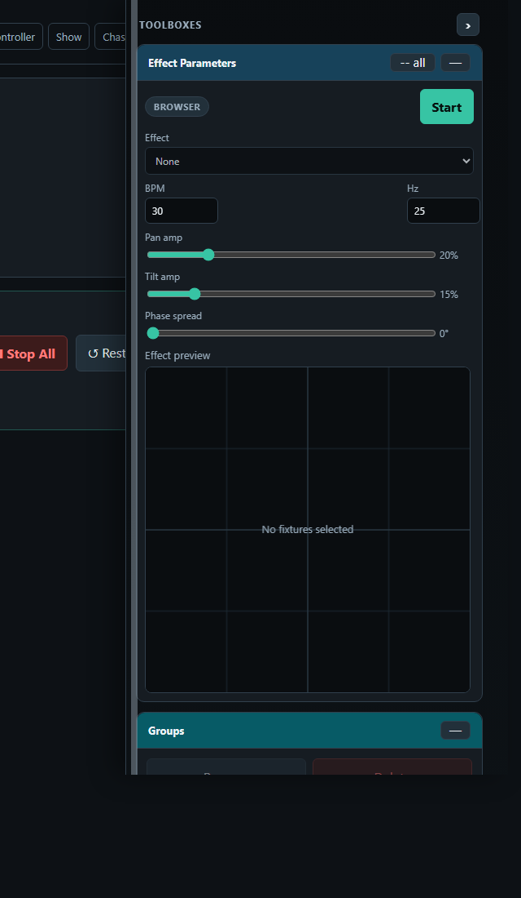

**Effect Parameters** is the live effect editor. It contains the target-aware effect dropdown, BPM, play mode, Loop N count, amplitude, phase spread, phase-preserving browser pause/resume controls, and the Pico slot upload/play controls. The shown amplitude controls follow the selected effect: two-axis effects show both axes, Pan/Tilt Sine Wave and Pulse show only the moving axis, and scalar targets show one **Amplitude** control. Pan/Tilt Pulse additionally shows the position-offset and continuous negative/symmetric/positive direction controls. These parameters are stored with saved Effects and autonomous Pico slot uploads; older saved Effects without them recall with zero offset and symmetric direction.

**Single** runs one complete BPM-timed cycle, **Loop** runs until stopped, and **Loop N** runs the selected number of complete cycles. When autonomous Single or Loop N playback completes, the Pico stops the slot and returns channels no longer used by another Effect to their current scene/base values. This prevents the last generated position or level from remaining frozen after the finite Effect has ended.

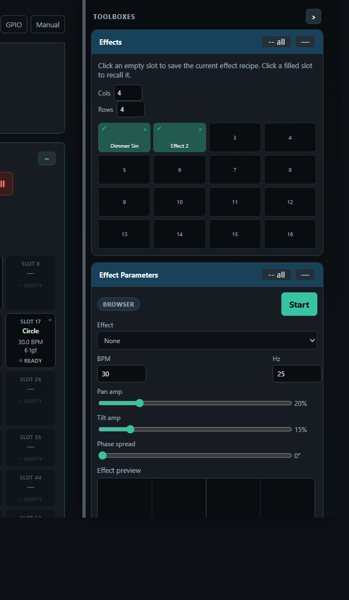

**Effects** stores reusable effect recipes. It saves the selected target, fixture participation, effect type, BPM, play mode, Loop N count, amplitude, spread, and phase offsets. It does not store fixed center values.

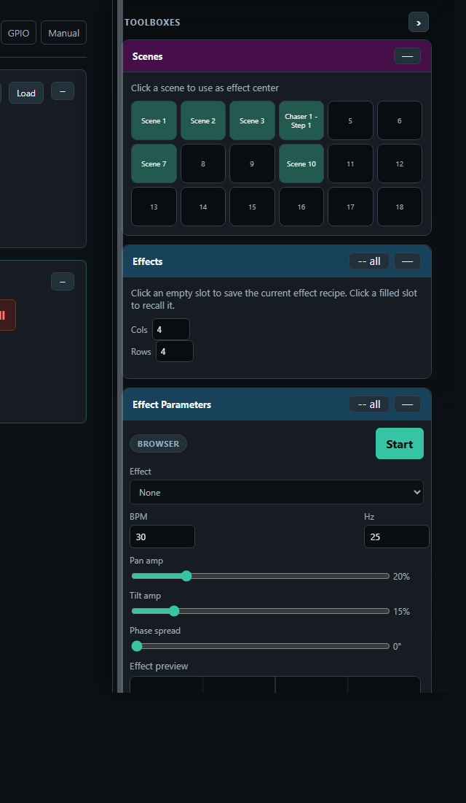

**Scenes** is read-only on Effects. Recalling a scene updates the effect center/base values used by Effects and previews the stored values on the primary show output.

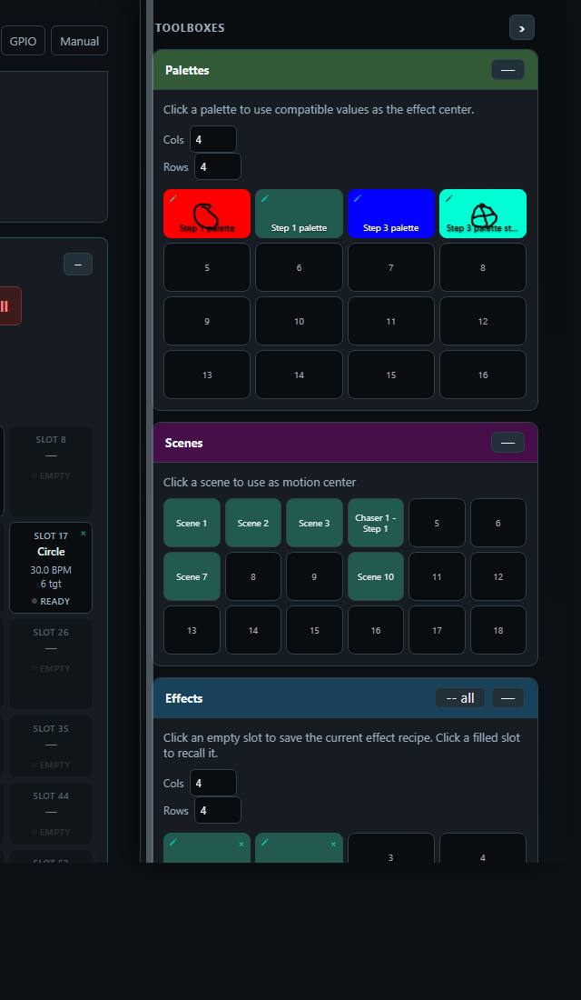

**Palettes** recalls compatible palette values into Effects. A position palette can set pan/tilt centers, while color, dimmer, or beam palettes can set scalar centers when the selected effect target matches.

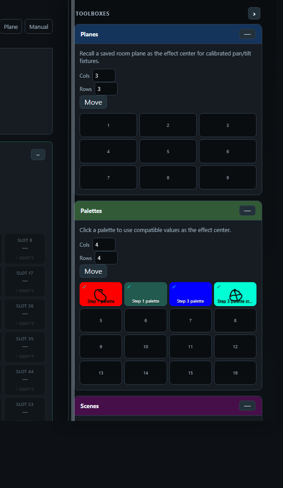

**Planes** recalls saved room planes as the current pan/tilt effect center. Select **Pan/Tilt** as the effect target, optionally select one or more groups, then click a filled plane tile. Effects interpolates the calibrated pan/tilt values for matching fixtures, enables those fixtures for the current target, sends the new center values to the Pico, and keeps the effect recipe itself separate from the recalled center. The Planes toolbox uses the same **Cols**, **Rows**, and Toolboxes Edit movement behavior as Groups, Palettes, and Effects.

#### Recommended Workflow

1. Use the Fixture Controller to position the fixtures.
2. Save or recall a scene.
3. Open Effects.
4. Select one **Effect target**.
5. Set BPM, effect shape, play mode, optional Loop N count, amplitude, and spread in the **Effect Parameters** toolbox.
6. Optionally recall a palette from the **Palettes** toolbox to set the center for the selected target.
7. Optionally save or recall the recipe from the **Effects** toolbox.
8. Click an empty Pico slot to upload the effect, then start the slot when you want autonomous playback without browser timing jitter.
9. Use browser playback from the **Effect Parameters** toolbox when you want quick live testing before uploading.

The Effects page also has a read-only scene toolbox. Clicking a scene updates the effect center and previews the position on the primary show output.

### GPIO Control

GPIO Control maps physical Pico inputs to lighting actions for one configured DMX Output at a time.

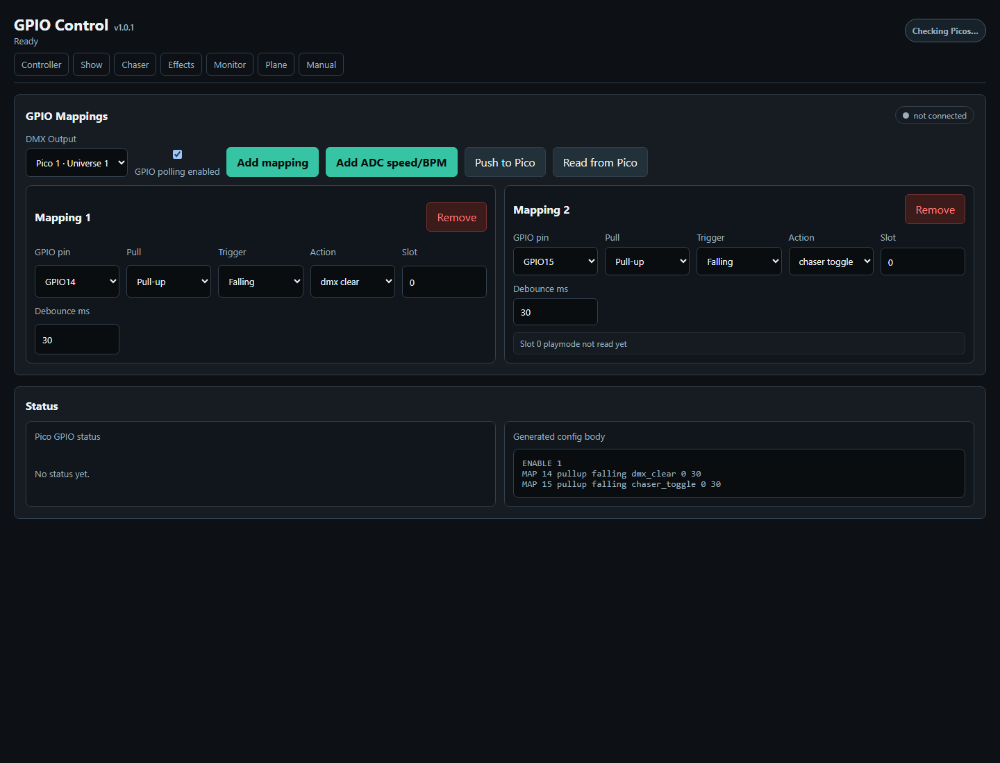

#### What You Can Do on GPIO Control

Use GPIO Control to map digital buttons and analog inputs to DMX clearing, playback, tap tempo, speed, master, scene, or palette actions, then push that configuration to the selected Pico.

#### GPIO Control Tools and Toolboxes

GPIO Control does not use the shared toolbox rail. Its equivalent tools are the **DMX Output** selector, GPIO status panel, digital-button mapping editor, ADC mapping editor, and saved mapping rows. Always choose the intended Pico output first because GPIO mappings are stored and sent per controller.

GPIO Control does not use the shared toolbox sidebar. Its setup is kept in normal page panels because GPIO mapping is configuration work, not a live fixture/scene/palette workflow.

Use **DMX Output** to select the Pico/universe whose physical GPIO pins you want to configure. The list comes from Controller → **DMX Outputs**. Every output keeps an independent enabled state, digital mapping list, and ADC mapping list, because the pins belong to that specific Pico. Switching outputs changes the editor, status readback, Chaser and Effects slot information, and the target of **Push to Pico** / **Read from Pico**.

The GPIO editor loads all per-output mapping setups from the XAMPP server first, using `gpio_setup.php` and `data/gpio_setup.json`. Browser storage is only a fallback if the server file is not available. Adding, removing, or changing a mapping autosaves the complete multi-output setup back to the server, so a PC and iPad should show the same mappings after reload. Existing single-Pico GPIO files are migrated into the first configured output.

**GPIO polling enabled** is stored independently for each output and becomes the Pico configuration's master enable flag when you click **Push to Pico**. Editing the server copy does not change the physical Pico until it is pushed. The live Status panel polls the selected Pico for pin state and event counters once per second.

Chaser GPIO actions do not define their own playmode. They start, stop, pause, resume, toggle, or tap the selected Pico's physical chaser slot. The playmode belongs to that slot, so the button follows whatever was uploaded from the Chaser page: **Single**, **Loop**, **Loop N**, or **Ping Pong**, plus forward/reverse direction. For the selected DMX Output, the GPIO page reads the Pico's chaser slot status and shows the slot mode, direction, loop state, step count, and live/ready state beside chaser mappings and chaser speed ADC mappings.

Effects GPIO actions work the same way. They use the mode stored in the selected physical Effects slot rather than defining another mode in the GPIO mapping. The page reads the Pico's Effects slot status and shows **Single**, **Loop**, or **Loop N**, finite-loop progress, BPM, target count, and live/paused/ready state beside Effects digital mappings and Effects BPM ADC mappings. Chaser slot numbers range from 0 to 31; Effects slot numbers range from 0 to 63.

Digital GPIO pins can trigger:

- DMX clear
- Output-only clear
- Stop all
- Chaser play, stop, toggle, pause, resume, pause toggle
- Chaser tap tempo
- Effects start, stop, toggle, pause, resume, pause toggle
- Effects tap tempo

ADC pins can control:

- Chaser speed multiplier
- Effects BPM

Only GPIO26, GPIO27, and GPIO28 support ADC input on the Pico 2 W.

#### Add a Digital Button Mapping

1. Open **GPIO Control**.
2. Select the intended **DMX Output** / universe.
3. Click **Add mapping**.
4. Select a free GPIO pin.
5. Choose pull mode and trigger edge.
6. Choose the action.
7. Set the slot number if the action needs one.
8. Click **Push to Pico**.

The page disables reserved pins and pins already used by other mappings.

For each digital mapping:

- **Pull-up** is normally used for a dry-contact button wired from the protected input to ground; **Pull-down** expects the active contact toward the input's high level.
- **Falling**, **Rising**, or **Both** chooses which electrical transition triggers the action.
- **Slot** is enabled only for Chaser or Effects actions and addresses the physical slot on the selected Pico. Chaser accepts slots 0–31 and Effects accepts slots 0–63.
- **Debounce ms** ignores additional transitions for 5–1000 ms after a trigger, preventing one mechanical press from producing several actions.
- Tap-tempo actions additionally show **Beat**, which applies the selected beat divider to the measured tap interval.

Editing the mapping saves the setup on the XAMPP server, but the Pico only receives it after **Push to Pico**. Use **Read from Pico** when the Pico already has the mapping you want to bring back into the editor.

#### Add an ADC Mapping

1. Add an ADC mapping.
2. Select GPIO26, GPIO27, or GPIO28.
3. Choose `chaser_speed` or `motion_bpm`.
4. Set the target slot.
5. Set the min and max value.
6. Upload the config.

The ADC **Min multiplier / Max multiplier** fields scale the full analog range to Chaser speed from `0.1×` to `10×`. For Effects, **Min BPM / Max BPM** scale it from 1 to 300 BPM. The page prevents a digital and ADC mapping from sharing the same GPIO and highlights duplicates before upload.

ADC values are filtered on the firmware side with a short mean filter to reduce ripple.

#### Tap Tempo

Tap actions use the time between button presses.

The beat divider can be set to:

- 1 beat
- 1/2 beat
- 1/4 beat
- 1/8 beat
- 1/16 beat

The firmware ignores very long gaps between taps so stopping for a while does not create an extremely slow tempo when tapping resumes.

### Room Plane

The **Room Plane** page calibrates moving lights to positions on a measured two-dimensional stage or room plane. It stores saved room definitions, fixture mount positions, and all available calibration-point values on the server. Three non-collinear points are the minimum; add further points wherever a fixture needs more local accuracy.

Open it from the **Plane** navigation link or directly:

```text
dmx_room_plane.html
```

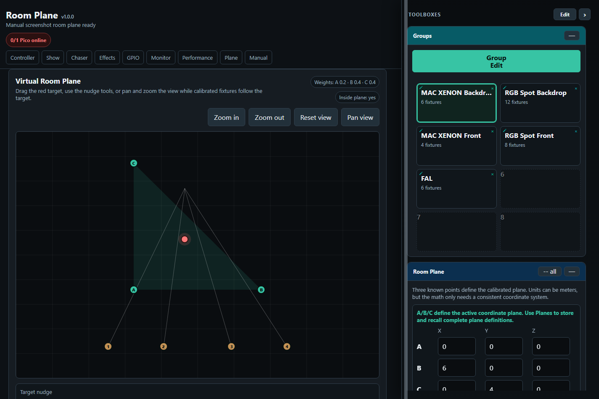

#### What You Can Do on Room Plane

Describe the real stage or room as a 2D coordinate plane, teach each moving light where measured points are, save complete calibrated planes, and recall them later. Points **A**, **B**, and **C** are the initial measured points. Optional points **D**, **E**, and later can refine selected areas. When the red target is moved, the page calculates a localized weighted pan/tilt value for every selected fixture and sends the involved Pico batches.

#### Room Plane Tools and Toolboxes

Room Plane uses the **Room Plane**, **Planes**, and **Fixtures** toolboxes for geometry, saved plane recall, fixture membership, and per-point calibration. Its shared **Groups**, **Scenes**, and **Palettes** tools provide fixture selection and live look recall while teaching. The target canvas is the work area; toolbox values and fixture calibration together determine the resulting Pan/Tilt output.

#### Room Plane Workflow

1. Patch the moving lights on the Fixture Controller page.
2. Save groups if you want to select fixtures by group on the Room Plane page.
3. Open **Plane**.
4. In the **Room Plane** toolbox, enter the measured coordinates for A, B, and C. To improve accuracy in another area, move the target there and select **Add point at target**.
5. Use **Load patched moving lights** to rebuild the working list from every compatible Controller fixture, use **Add patched fixtures** to choose individual moving lights, or recall a saved Plane that already contains fixtures.
6. Select fixtures directly in the fixture table, or use the **Groups** toolbox to select a whole fixture group.
7. Edit one fixture at a time. Move the real moving light to point A, store A, then repeat for B and C. Store any additional points needed by that fixture; other fixtures may remain on three points.
8. Move the red target in the virtual room plane. The selected fixtures update automatically.
9. In the **Planes** toolbox, click an empty tile to save a complete snapshot of the current room definition and fixture calibration.

The target can be moved by dragging the red dot, by clicking in the plane, or by using the coarse/fine target nudge buttons below the plot. The view itself can be zoomed with the zoom buttons, mouse wheel, or a two-finger pinch on a touch screen. Pinch zoom is also available in the Controller and Show Run room-plane modals and does not move the live target when the gesture begins. Use **Pan view** when you want to drag the coordinate view instead of the target.

#### Room Plane Toolbox

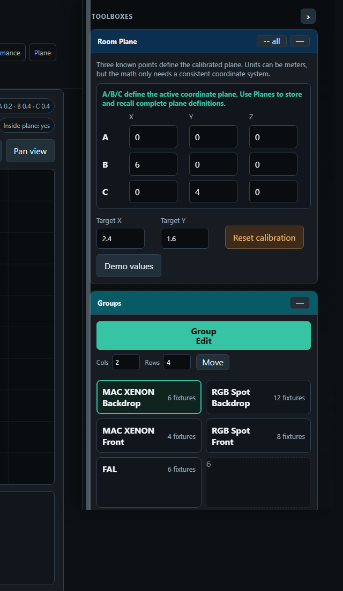

The **Room Plane** toolbox contains all measured calibration points and the current target controls.

| Field | Meaning |
| --- | --- |
| Point X/Y/Z | Known physical points in the room. Use one consistent unit, for example meters. |
| Target X/Y | Numeric target position in the plane. |
| Add point at target | Adds the next point at the current target position. The first additional point is D. |
| `x` beside an optional point | Removes that point from the working plane. At least three points always remain. |
| Reset calibration | Marks every working fixture calibration point as missing and deselects the active saved Plane without changing any saved Plane tile. |

The Z value is stored with the plane and fixture mount positions. The current target interpolation uses X/Y coordinates on the plane. Z is kept so the same saved data can later support full 3D fixture-position calculations.

**Reset calibration** operates only on the working setup. When a saved Plane is active, reset removes its selected tile state before clearing the working calibration. The saved Plane retains its room definition and fixture calibration and can be recalled again at any time.

Use **-- all** in the Room Plane, Planes, or Fixtures toolbox header to collapse all five Room Plane page toolboxes together. Scenes and Palettes keep their standard single-toolbox collapse button, matching those toolboxes on the other pages. When all five toolboxes are collapsed, **-- all** changes to **+ all**.

#### Planes

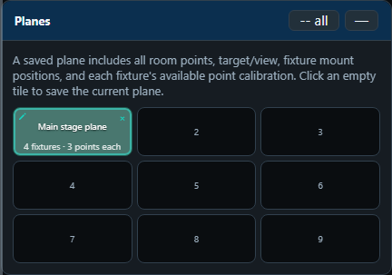

The **Planes** toolbox stores complete plane definitions as tiles, using the same visual language as scene, palette, group, and chase tiles.

| Field | Meaning |
| --- | --- |
| Filled plane tile | Recalls that saved plane, including its complete point list, target, view, fixtures, mount positions, and per-point fixture calibration. |
| Empty `+ Save current plane` tile | Saves the current plane into that tile and opens **Edit Plane Tile** so it can be named and styled. |
| Pencil | Opens **Edit Plane Tile** for the selected plane tile name, background color, uploaded icon, or drawn icon. |
| `x` | Deletes the saved plane after confirmation. |
| Cols / Rows | Shapes the Planes tile matrix. |
| Move tiles (Toolboxes Edit) | Uses the same shared tile move behavior as the Controller, Chaser, Effects, and Show Run plane/toolbox matrices. Click **Edit** in the Toolboxes header, then drag a filled plane tile to another slot, or tap a source tile and then a destination on touch screens. |

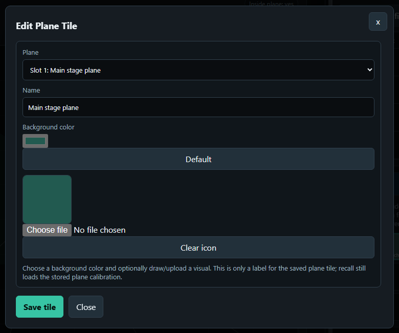

Saved Plane tiles are immutable snapshots. Editing room points, the target, fixtures, mount positions, or calibration values changes the separate working setup; it does not silently rewrite the selected tile. Click another empty tile when you want to preserve those changes as a new Plane. A saved Plane can be deleted—including the final tile—without creating a replacement default Plane.

A Plane can be saved while some fixtures or points are still uncalibrated. The tile editor warns which fixture points are missing, and the tile reports the missing-calibration count. A fixture becomes usable as soon as it has any three non-collinear calibrated points. Additional points are optional per fixture and improve only the fixtures for which they were taught. Each tile keeps its own point coordinates and exact per-fixture Pan/Tilt calibration; recalling a tile restores both even after a plane with fewer points was active.

##### Scenes and Palettes

The **Scenes** and **Palettes** toolboxes show the same shared tiles saved by Controller, Chaser, Effects, and Show Run. Click a filled Scene to send its complete stored look to the currently patched fixture controls. Click a filled Palette to send only that palette's stored controls, leaving unrelated live controls unchanged. Both recalls follow every fixture's assigned DMX Output and can update several Picos in one action. They also update the Room Plane's live fixture values so calibrated Pan/Tilt and Dimmer readings stay in step with the DMX output.

These two toolboxes are recall-only on Room Plane: clicking an empty tile never saves or overwrites data. While Toolboxes **Edit** is active, their **Cols** and **Rows** dropdowns and shared drag/tap tile movement remain available and are saved back to the shared Scene or Palette layout.

#### Fixture Calibration

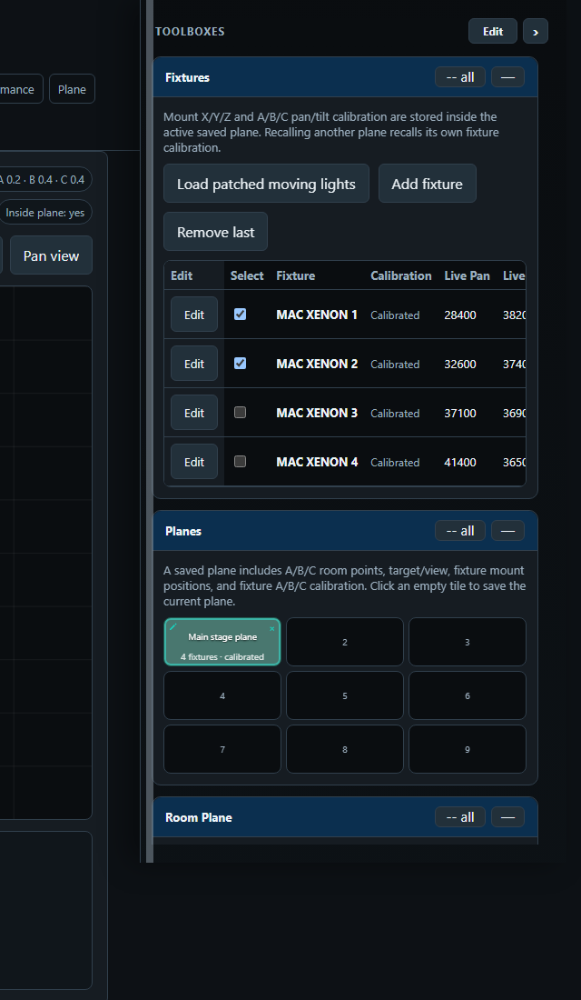

The **Fixtures** toolbox stores the relationship between each moving light and the room plane.

**Load patched moving lights** rebuilds the working list from all compatible Controller fixtures while retaining matching calibration where possible. A newly loaded fixture without matching saved calibration is explicitly shown as **Missing A, B, C**.

**Add patched fixtures** opens a touch-friendly multi-select modal containing only Controller fixtures that have Pan/Tilt controls and are not already in the working Room Plane. Tap anywhere on a fixture card to toggle it. Selected cards use the same accent border and green background as selected fixture cards on the Controller page; the **Add selected** button displays the selected count. Added fixtures start uncalibrated unless matching calibration already exists.

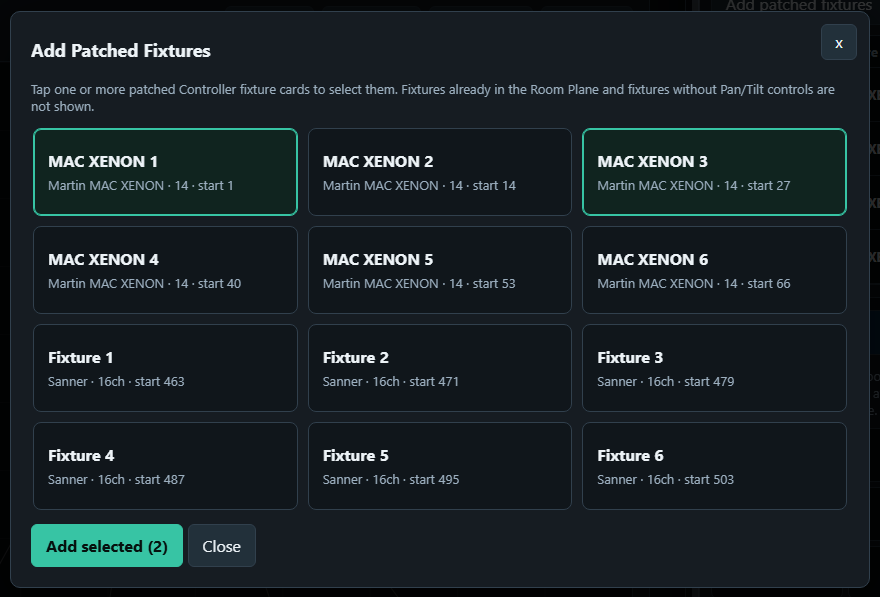

Use the fixture table's **Select** column to mark one or more working fixtures, then click **Remove selected**. Any selected subset can be removed, including the final fixture. An intentionally empty fixture list remains empty after save, reload, and Plane recall.

| Column | Meaning |
| --- | --- |
| Edit | Opens the pan/tilt/dimmer editor for this fixture. Only one fixture is edited at a time. |
| Select | Includes the fixture when the target point is applied. |
| Calibration | Shows whether the fixture has at least three usable points and lists optional points that are not taught. |
| Live Pan / Live Tilt / Dimmer | Current fixture values used by the editor and output. |
| Last send / channels | The last DMX channels written for this fixture. |
| Mount X/Y/Z | The fixture's physical mounting position in room coordinates. Today this is used for the plot, saved plane context, and future 3D calibration. It is not yet used to calculate pan/tilt output. |
| Point pan/tilt | Stored calibration values for every point in the working plane. |

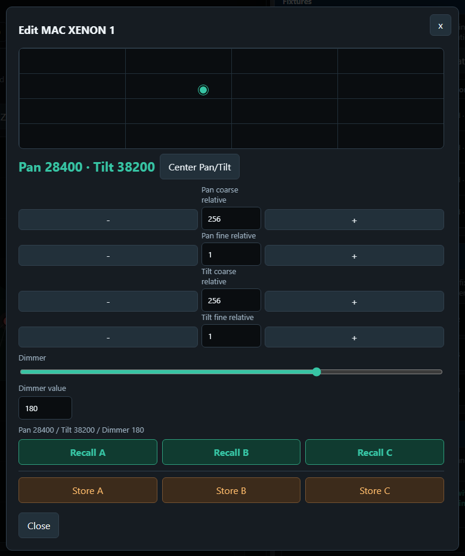

In the fixture editor, **Recall A/B/C/...** loads an already stored calibration point into the editor. **Store A/B/C/...** writes the current pan/tilt editor value into that calibration point. Recall and Store are separated by a divider, and Store uses the warning color because it overwrites calibration data. On touch devices, the modal scrolls normally outside the Pan/Tilt pad; dragging the pad temporarily locks modal scrolling so the fixture can be positioned accurately.

The Pan/Tilt coarse and fine relative-step values are shared by the fixture editor and persist across fixture changes, modal reopen, page navigation, and reload. This keeps a carefully chosen fine adjustment available throughout a calibration session.

The editor sends live DMX for patched fixtures. If the fixture profile has a 16-bit pan/tilt control, the full 0...65535 value is used. If the fixture profile only has an 8-bit pan/tilt control, the value range is 0...255.

The **Groups** toolbox on the Room Plane page is for selecting calibrated fixtures by saved group. Its **Group Edit** button opens the same Controller-style group edit workflow for the selected patched fixtures. This is separate from the fixture calibration editor: Group Edit changes live fixture controls such as dimmer, color, wheels, or pan/tilt for the selected group, while the fixture table **Edit** button is still used to recall/store A/B/C calibration points for one fixture at a time.

#### Coordinate Math

Every set of three non-collinear room points can define a triangle in the room plane. With only A/B/C, they form the single triangle:

```text
A = (Ax, Ay)
B = (Bx, By)
C = (Cx, Cy)
P = (Px, Py)   target point
```

The page calculates barycentric weights for the target point. The determinant is:

```text
D = (By - Cy) * (Ax - Cx) + (Cx - Bx) * (Ay - Cy)
```

If `D` is very close to zero, A, B, and C are on one line and the plane is invalid.

The weights are:

```text
wA = ((By - Cy) * (Px - Cx) + (Cx - Bx) * (Py - Cy)) / D
wB = ((Cy - Ay) * (Px - Cx) + (Ax - Cx) * (Py - Cy)) / D
wC = 1 - wA - wB
```

With additional points, the page creates a Delaunay triangle mesh and selects the local triangle that contains the target. Each fixture builds its mesh only from the points calibrated for that fixture, so a five-point fixture gains local accuracy while a three-point fixture remains usable. Outside the calibrated mesh, the closest suitable triangle is used for extrapolation.

The readout shows the three currently used point IDs and weights. The target is inside the selected triangle when all three weights are greater than or equal to zero:

```text
wA >= 0 and wB >= 0 and wC >= 0
```

The page still allows positions outside the triangle. In that case the same formula extrapolates beyond the calibrated area, and the **Inside plane** readout changes to `no`.

#### Pan/Tilt Interpolation

For each fixture and the three points selected around the current target, the stored calibration values are:

```text
pan1,  tilt1    values that hit selected point 1
pan2,  tilt2    values that hit selected point 2
pan3,  tilt3    values that hit selected point 3
```

The target output is the weighted blend:

```text
pan(P)  = w1 * pan1  + w2 * pan2  + w3 * pan3
tilt(P) = w1 * tilt1 + w2 * tilt2 + w3 * tilt3
```

For 16-bit pan/tilt controls, this interpolation is done in the full 16-bit range:

```text
0 ... 65535
```

The 16-bit value is then split into DMX coarse and fine bytes:

```text
coarse = value >> 8
fine   = value & 255
```

For example, a pan value of `32768` becomes:

```text
coarse = 128
fine   = 0
```

The final DMX channel numbers come from the fixture profile and the patched start address:

```text
absoluteChannel = fixtureStart + relativeChannel - 1
```

The page sends selected fixtures as a batch update. While the target is being dragged or nudged, output is automatically applied after a short debounce so movement feels live without flooding the Pico with unnecessary requests.

##### Fixture Orientation, Pan Zero, and Accuracy

Fixtures do not need to be mounted in one line or share the same Pan-zero direction. Every fixture stores its own Pan/Tilt value for every taught room point and is interpolated independently. A rotated fixture can therefore use completely different DMX values from the fixture beside it while both beams follow the same room target. A fixed Pan-zero offset, a reversed movement direction, or a different Pan/Tilt range is absorbed by that fixture's taught values.

The current calculation does not use Mount X/Y/Z or a measured fixture orientation to correct the output mathematically. Those fields are saved and used for the drawing and future 3D support; the taught Pan/Tilt values are the authority for current output accuracy.

For reliable calibration:

- Teach all points for one fixture along one continuous Pan rotation. A fixture with more than 360 degrees of Pan may be able to reach the same point with several DMX values; do not mix those alternative rotations between calibration points.
- Avoid crossing the numeric Pan boundary inside the working plane. The current interpolation blends raw DMX numbers and does not unwrap circular Pan values. For example, interpolating between `65000` and `1000` produces a value near the middle of the DMX range rather than a value close to the wrap boundary.
- Keep the main three calibration points spread across the useful area and avoid putting them on one line. Accuracy outside their triangle is extrapolated and normally becomes less predictable.
- Add local calibration points where a particular fixture misses the target. Real fixture geometry is not perfectly linear, especially for fixtures close to a large plane or mounted at a strong angle. Additional points create smaller local triangles and improve only the fixtures for which those points are taught.

Different mounting angles therefore do not inherently reduce accuracy. The main risks are imprecise teaching, using inconsistent Pan rotations, crossing the Pan wrap boundary, and relying on only three points over an area where the fixture's real movement is noticeably nonlinear.

#### Screen Transformation

The virtual room drawing uses the same room coordinates as the math, but it transforms them into screen pixels for display.

First the visible bounds are calculated from A/B/C, the target, and fixture mount positions. Then the page chooses one common scale for both axes:

```text
scale = min(screenWidth / roomWidth, screenHeight / roomHeight)
```

Using one common scale is important. It means 1 meter in X and 1 meter in Y draw with the same visual length, so the room shape is not stretched on wide screens.

Room coordinates are converted to screen coordinates like this:

```text
screenX = offsetX + (roomX - minX) * scale
screenY = offsetY + (maxY - roomY) * scale
```

Y is inverted because screen coordinates grow downward, while room Y grows upward in the virtual plane.

The view zoom changes the visible bounds before this transformation. The pan view changes the center point of those bounds. The saved plane stores the current view, so a recalled plane opens with the same framing.

#### What Is Saved

Room Plane data is saved to the server in `room_plane_setup.json`. A saved plane contains:

- Complete calibration-point list, beginning with A/B/C and including every optional point
- Target position
- View zoom and pan center
- Fixture list for that plane
- Fixture mount X/Y/Z
- Fixture Pan/Tilt calibration and calibrated state for every point taught to that fixture
- Active saved plane ID

This means you can create multiple room planes for different physical setups or stage areas. Recalling a plane recalls its own fixture calibration.

When a saved plane is loaded, its fixtures are matched to the current Fixture Controller patch by fixture ID. The saved mount position and all per-point calibration remain plane-specific, while the current fixture name, profile, DMX start address, and live connection are used. Therefore **Fixtures > Edit > Recall A/B/C/...** moves the physical fixture even if its patch address changed after the plane was saved.

#### Current Limits

The current implementation is calibration-based. It does not yet calculate pan/tilt from fixture mount position, fixture orientation, beam length, and full 3D geometry. Mount X/Y/Z is saved and drawn, but the output is currently calculated from the measured per-point Pan/Tilt values.

Use at least three non-collinear points per fixture. If all points available to a fixture are on one line, the page cannot calculate a valid plane for that fixture.

## Run Show

Use this page during live operation to recall and control the prepared show without changing its programming.

### Show Run

The **Show Run** page is the operator page. Use it when the show has already been prepared on the Fixture Controller, Chaser, and Effects pages and you want fewer editing controls on screen.

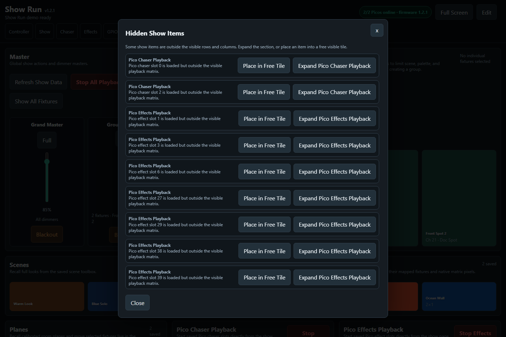

#### What You Can Do on Show Run

Use Show Run to recall prepared groups, fixtures, scenes, palettes, Pixel Matrices, planes, chaser slots, and effect slots; operate master and live controls; and use MIDI mappings without exposing the programming editors during normal operation.

#### Show Run Tools and Toolboxes

Show Run's movable cards are the operator tools: **Master**, **Groups**, **Fixtures**, **Scenes**, **Palettes**, **Pixel Matrices**, **Planes**, **Pico Chaser**, **Pico Effects**, **MIDI Controller**, and **Live Controls**. Layout editing decides which cards are visible and whether they appear in the main page or the Show sidebar; normal operation uses the cards only to recall and adjust the prepared show.

The fixed Show sidebar uses the same visual language and saved width as the Controller toolbox rail. It scrolls independently from the main Show page, so frequently used cards remain available while the main cards are scrolled. On a narrow portrait display, including an iPad, it becomes a separately scrolling rail at the bottom of the screen.

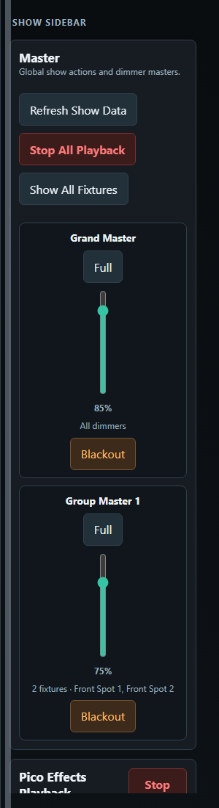

Open it from the **Show** navigation link or directly:

```text
http://localhost/dmx/dmx_show.html
```

On supported PC and iPad browsers, use **Full Screen** in the sticky header to give the operator controls the maximum available screen area. The same button changes to **Exit Full Screen** while active. Browsers require this action to start from a direct click or tap. The button is hidden when the browser does not provide a page fullscreen API; you can still use an installed Home Screen web app or the browser's own display controls in that case.

#### Run Show Run as an iPad web app

The iPad Fullscreen API displays a system message and allows a downward swipe to exit fullscreen. For show operation without that fullscreen prompt, install the Show Run page on the iPad Home Screen and open it as a web app:

1. Open **Safari** on the iPad and load the Show Run page, for example `http://YOUR-XAMPP-HOST/dmx/dmx_show.html`.
2. Tap **Share**, tap **More** if necessary, then tap **Add to Home Screen**.
3. Enable **Open as Web App**.
4. Tap **Add**.
5. Return to the Home Screen and open Show Run using the new icon instead of opening it from a Safari tab.

The Home Screen version uses an app-like window without Safari's normal toolbar. Do not tap the page's **Full Screen** button in this mode; the installed web-app window is the intended iPad display mode and does not need the browser Fullscreen API.

If you prefer the Home Screen app to open on the Fixture Controller, open `http://<XAMPP-host-or-IP>/dmx/` before using **Add to Home Screen**. The installed app is named **DMX Controller** and uses the blue XAMPP icon; open **Show** from its navigation when you are ready to operate the show. If an older Home Screen icon still says **DMX Fixture Controller Prototype** or shows a page-preview tile, remove that icon and add the Controller page again so iPadOS reads the new name and icon metadata.

To prevent an operator from accidentally leaving the Show Run web app, you can additionally use iPad **Guided Access**:

1. Open **Settings > Accessibility > Guided Access**, turn it on, and configure **Passcode Settings**.
2. Open Show Run from its Home Screen icon.
3. Triple-click the iPad top button, or the Home button on an older iPad, and select **Guided Access** if the accessibility menu appears.
4. Review the session settings and tap **Start**.
5. To leave later, triple-click the same button, authenticate with the Guided Access passcode, Face ID, or Touch ID, then tap **End**.

Show Run loads the current XAMPP show data:

- Fixture profiles and patched fixtures from `fixture_setup.php`
- Saved groups from `group_setup.php`
- Saved scenes from `scene_setup.php`
- Saved palettes from `palette_setup.php`
- Saved room planes from `room_plane_setup.php`
- Mirrored Pico chaser slots from `chaser_setup.php?slots`
- Mirrored Pico effect slots from `motion_setup.php?slots`
- Current live values from `fixture_setup.php?livevalues`

Show Run automatically refreshes this show data when the page becomes active again, for example after switching back from the Controller, Chaser, or Effects page. This keeps the operator page current without needing to reload the browser tab. Automatic refresh is skipped while **Edit** is active so card moves, tile moves, Live Controls edits, and MIDI mapping edits are not overwritten. Use **Refresh Show Data** only when you want to force the same reload manually.

#### Master Card

The **Master** card contains the global operator actions and dimmer masters. **Refresh Show Data** reloads the current XAMPP show files manually. **Stop All Playback** stops Pico chaser and effect playback. **Show All Fixtures** clears the current group and fixture target filter.

The **Grand Master** is a vertical fader. It does not overwrite stored live values; it multiplies dimmer output by a 0..1 factor, including 16-bit dimmer controls. **Blackout** below the Grand Master sets the Grand Master fader to **0%** and sends the scaled dimmer output immediately. **Group Master** faders work the same way, but only for fixtures assigned to that group master. The **Blackout** button below each Group Master sets only that Group Master to **0%**. Show Run separates the affected dimmer channels by fixture output and updates all involved Picos concurrently. When a master is below **100%**, it also locks the affected dimmer channels on each involved Pico so running playback cannot overwrite the master-limited dimmer output.

To assign a Group Master, first select one or more groups or fixtures, click **Edit**, then click **Assign** on the desired group master fader. **Add Group Master**, **Assign**, **Clear**, and the small tile `x` for deleting a Group Master are only available while **Edit** is active. Deleting a Group Master removes that fader and saves the updated master layout to server UI state. The **Grand Master** is protected and never has a delete `x`. The Grand Master factor and Group Master assignments are saved to server UI state and restored on page load. The pencil at the upper-left of the Grand Master or a Group Master opens its MIDI mapping editor; use **Learn** and move a hardware fader or knob to assign it.

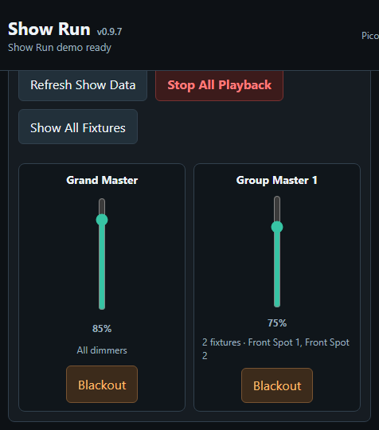

#### Groups Card

The **Groups** card contains the saved groups from the Controller page. Select one or more groups when you want scene, palette, or Group Master assignment to affect only those fixtures. Selecting a group also highlights the fixtures stored inside that group in the **Fixtures** card, so you can immediately see what the group contains. With no group or fixture selected, Show Run uses all fixtures.

Group selection is an operator filter only. It does not edit the saved group definitions and it does not save setup data.

While **Edit** is active, the pencil on a saved group tile also includes its MIDI mapping. A mapped hardware button selects or deselects that group through the same path as clicking the tile.

The **Group Edit** button opens a Controller-style Group Edit modal for the current Show target. The modal shows matching controls from the selected group or fixture target and sends live-value changes through the same Show Run output path as the other operator controls. Use it for quick grouped dimmer, color, wheel, or pan/tilt adjustments from the run page without opening the full Controller.

Show Run also starts with exact control matching. Use **Merge Controls** inside its Group Edit modal for the same 8-bit/16-bit, Pan/Tilt, and RGB/RGBW/RGBWA/CMY/CMYK conversion available on the Controller. This changes only how the current modal matches and scales controls; it does not change fixture profiles or saved show data. Genuinely merged controls are highlighted in green. Fixture-specific white, amber, and key channels are retained, ambiguous duplicate functions are skipped, and wheels continue to require exact matching.

Relative nudge step sizes in this modal are autosaved to the Show Run UI state on the XAMPP server. Separate Pan/Tilt coarse and fine values are restored when the modal or page is reopened and remain independent from the step sizes used on the setup and playback-editing pages.

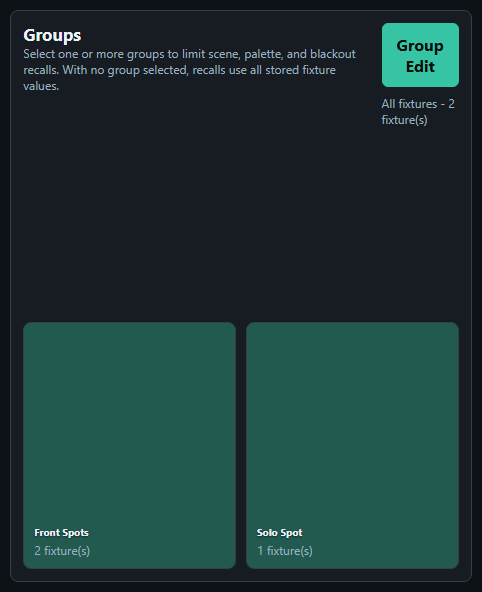

#### Fixtures Card

The **Fixtures** card lets you target individual fixtures without creating a saved group. Click a fixture tile to select or deselect it. When a group is selected, its member fixtures are mirrored here; when you change the fixture selection manually, the group selection is cleared and the current show target becomes the explicitly selected fixtures.

Use this when a scene, palette, or Group Master should apply to one fixture or a temporary hand-picked set. If you manually select or deselect a fixture here, the active group selection is cleared because the target is now an explicit fixture selection.

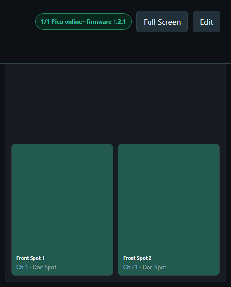

#### Scenes Card

The **Scenes** card recalls saved scene tiles from the Controller page. Click a scene tile to recall that scene to the current target. Show Run writes the recalled values to the live-value snapshot, separates the matching DMX channels by fixture output, and sends one `/dmx/b` batch to each involved Pico.

While **Edit** is active, click the scene pencil, click **Learn** in the MIDI Mapping section, and press a hardware button. Pressing that button later recalls the scene.

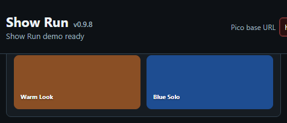

#### Palettes Card

The **Palettes** card recalls saved position, color, beam, dimmer, and effect palettes. If a group or fixture target is active, only stored values for the targeted fixtures are recalled. This lets one saved palette be reused for different parts of the rig, while every recalled fixture remains routed to its assigned DMX Output.

Palette pencils expose the same MIDI Learn section while **Edit** is active. A mapped hardware button applies the palette to the current Show target.

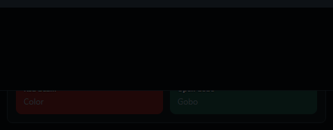

#### Pixel Matrices Card

The **Pixel Matrices** card recalls pictures created and mapped on the Fixture Controller page. If the card is not already part of your saved Show layout, click **Edit**, click an empty card `+`, choose **Pixel Matrices**, and click **Add Pixel Matrices Card**.

Click a picture tile to send its mapped colors immediately. With no Groups or Fixtures selected, every compatible mapped fixture is recalled. When a Show target is selected, only mappings belonging to those fixtures are applied. This works with separate RGB/RGBW/RGBWA/CMY/CMYK fixture controls and individual pixels of a native **RGB pixel matrix** control. Mapped fixtures are routed to their assigned DMX Outputs, and the recalled values are written to the shared live-value snapshot so the Controller and Chaser see the same current look.

Pixel Matrix cards use the standard Show layout behavior. Each picture displays the background color and optional icon saved in the shared Pixel Matrix editor. During **Edit**, change **Cols** and **Rows**, drag or tap picture tiles to arrange them locally, remove a picture from only that card with its `x`, or add another Pixel Matrices card with an independent layout. Edit the saved picture itself—including its image, fixture mappings, name, tile appearance, or deletion—on the Fixture Controller or Chaser page.

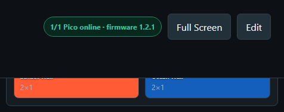

#### Planes Card

The **Planes** card recalls saved room planes from the Plane page. Click a plane tile to open a virtual room modal without leaving Show Run.

The modal uses the current Show target. Select Groups or Fixtures first when only part of the rig should move; with no target selected, Show Run targets all fixtures that match the recalled plane. Drag or click the red target point, use the X/Y coarse and fine nudge buttons, or use zoom and pan view controls to frame the room. The modal sends calibrated pan/tilt values to each fixture's assigned DMX Output and updates the shared live-value snapshot so the Controller, Chaser, and Effects pages can see the new position. Recalling a plane from Show Run does not edit the saved plane definition.

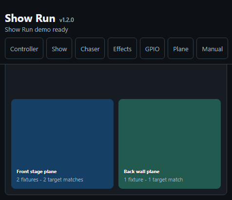

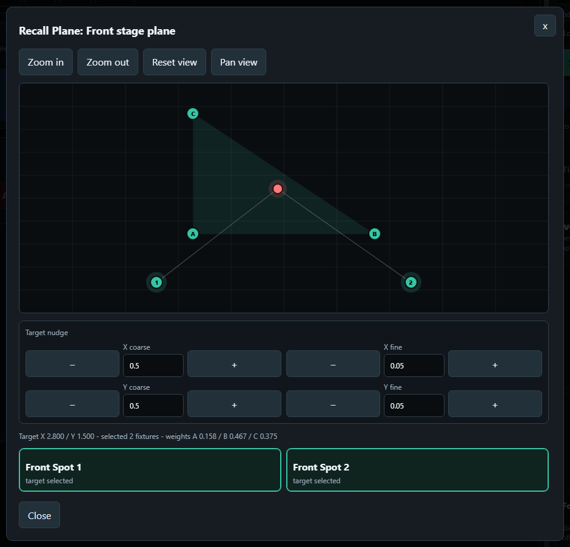

#### Pico Playback Cards

The **Pico Chaser Playback** card shows chaser slots uploaded from the Chaser page and saved by the controller application. It also reads live Pico slot state, so a slot that is loaded on the Pico can still appear when the controller's saved mirror is empty. Use the card controls to choose a logical slot, set its speed, play it, pause or resume it, or stop it.

For a linked chase, the selected logical slot identifies the coordinator member; the associated physical slot on another Pico may have a different number. For example, logical slot 1 can represent `U1 / Slot 1 + U2 / Slot 4`. The tile displays the linked universe/slot members. The card buttons operate the complete link, so **Play Slot 1** starts both physical members in this example. A slot without linked members operates only its single Pico.

In **Edit** mode, each loaded chaser tile has a pencil that opens its MIDI mapping editor. Choose the button's **Playback action** before learning it: start/stop toggle, start, stop, pause/resume toggle, pause, or resume.

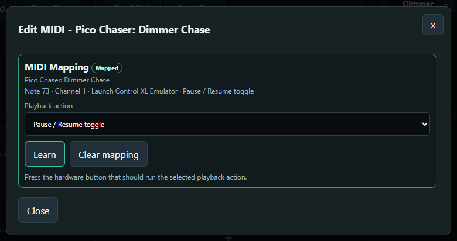

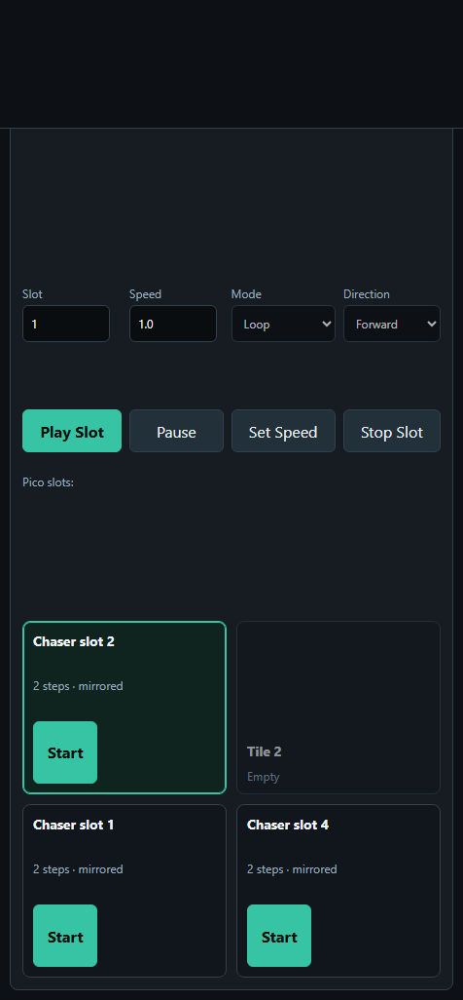

The **Pico Effects Playback** card shows effect slots uploaded from the Effects page. Choose a logical slot to see its read-only **Mode** and **Loops** settings, set **BPM**, then start, pause/resume, set BPM, or stop the slot. Each loaded tile identifies Loop, Single, or Loop N; finite-mode tiles also show completed cycles or loops reported by the firmware. Starting a mirrored slot reloads every linked member payload before running it; starting a live-only single-Pico slot starts the already-loaded Pico slot without overwriting it. Linked effect tiles use the same universe/physical-slot notation as linked chases.

Loaded effect tiles have the same MIDI edit pencil and playback-action choices, including dedicated pause and resume buttons or one pause/resume toggle.

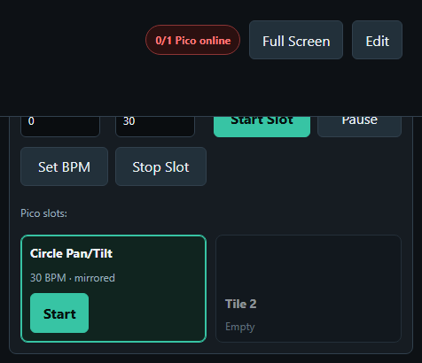

#### MIDI Controller Card

The **MIDI Controller** card has two independent inputs:

- **Computer USB MIDI** connects a class-compliant controller, such as the Novation Launch Control XL, to Chrome or Edge on the XAMPP computer. Click **Connect MIDI**, allow browser MIDI access, and select the input and optional output ports. The page prefers a connected Launch Control XL automatically when available.
- **Pico UART diagnostics** keeps the original read-only Pico GPIO5/UART1 monitor. It shows the UART/baud configuration, byte and message counters, parse errors, and last decoded event. This Pico input is not used by the new Show mappings.

Click **Check MIDI** to refresh the read-only Pico UART diagnostics from the current Pico. Click **Connect MIDI** to request browser MIDI permission and populate the computer **Input** and **Output** lists, then choose the intended input. The optional output selection is remembered and opened, but the current Show mappings do not send MIDI feedback. **Disconnect** releases the current Web MIDI connection without deleting learned mappings.

Click **Open MIDI Emulator** to test without the physical controller. It opens `dmx_midi_emulator.html` in a separate tab with 24 knobs, 8 faders, 16 channel buttons, and 8 utility buttons. The controls show the CC or note number they send. Keep Show Run and the emulator on the same XAMPP address; the connection indicators turn green when both tabs can see each other.

The emulator's **MIDI channel** selector chooses channel 1–16 for every generated CC and Note message and remembers that choice in the browser. **Reset controls** returns all emulated knobs and faders to zero and releases active buttons. The emulator communicates only with same-origin Show Run or Performance pages; it does not create a system MIDI device.

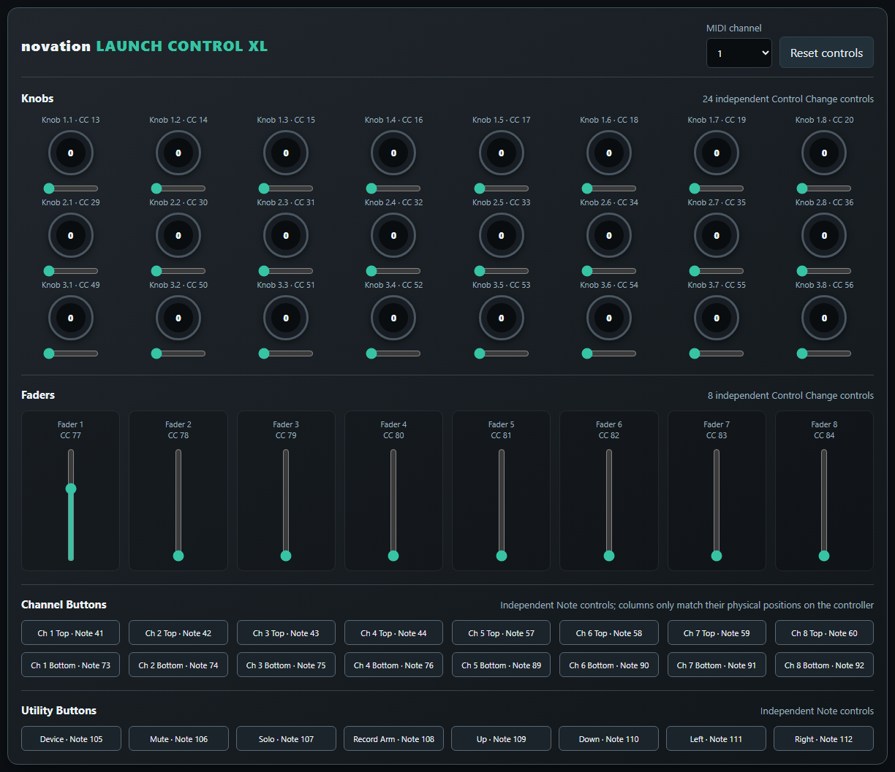

To learn with the emulator, enter **Edit** on Show Run, open a supported pencil, click **Learn**, switch to the emulator tab, and operate the desired control. Switch back to Show Run and click **Done**, then operate the emulator control again to test the mapped action. The emulator uses a same-origin browser channel and does not install or emulate a Windows MIDI device. Mappings learned from it are treated as Launch Control XL-family mappings so they can also match the physical controller later.

Open Show Run through `http://localhost/dmx/` on the XAMPP computer. Web MIDI requires a supported browser and a secure context; localhost qualifies for this local workflow. The browser asks for hardware MIDI access only after **Connect MIDI** is clicked. The emulator does not need Web MIDI permission.

MIDI mappings are edited only while **Edit** is active. Use the pencil on a supported tile or control, choose a playback action when editing a Pico Chaser or Effects tile, click **Learn**, then move a knob/fader or press a button. The first version supports Groups, Scenes, Palettes, Pico Chaser Playback, Pico Effects Playback, Grand Master, Group Masters, and Live Controls. Other Show cards remain unmapped until their desired behaviour is defined.

For Group, Scene, and Palette tiles, the MIDI Mapping section is part of the normal **Edit Tile** modal. The mapping summary shows the learned message type, number, channel, and device. **Clear mapping** removes only the MIDI assignment; it does not delete or change the tile.

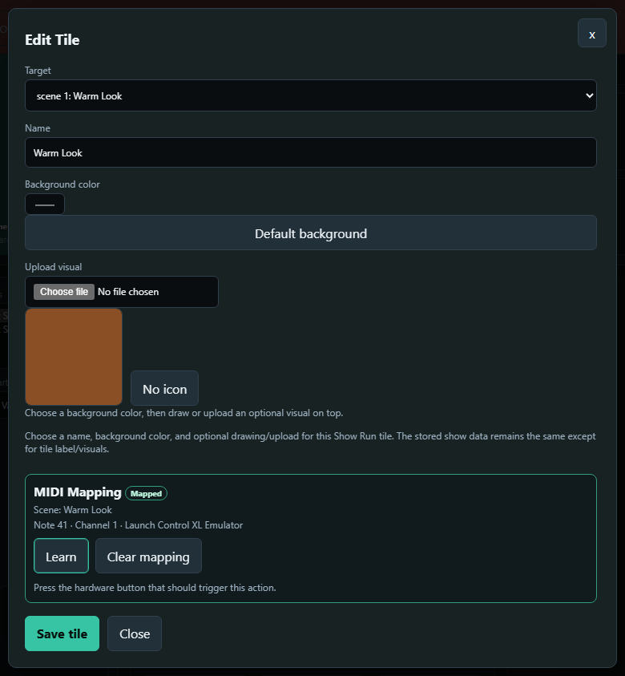

Button mappings trigger on the press edge, so the release message does not repeat the action. Faders and knobs scale MIDI `0..127` to the complete target range. **Soft takeover** is enabled by default: if the physical control and Show value differ, output waits until the physical control reaches or crosses the current value. Continuous messages are coalesced before they use the normal Show/Pico output path.

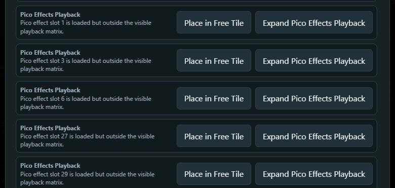

Mappings are stored with the server-side Show Run UI state and are included in setup export/import. The USB connection and selected computer ports are local to the browser; reconnect after opening a new browser session.

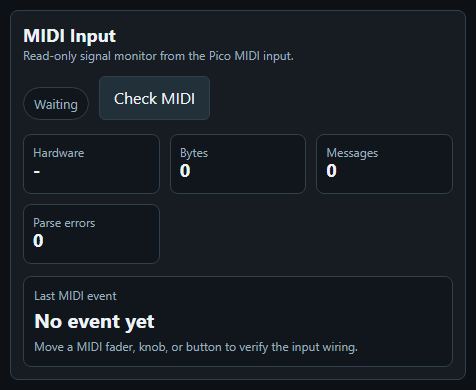

#### Layout Editing

The sticky title bar has **Edit** on the right. Layout and MIDI mapping tools are hidden during normal operation. Click **Edit** to configure the Show page, then click **Done** to return to the cleaner operator view.

In layout edit mode, the top of Show Run has a page-level card matrix. Use **Card cols** and **Card rows** to choose how many operator cards fit in the page grid. Empty card positions show a `+` tile; click it to open **Add Card**, choose the card type, then add it at that matrix position. If the matrix is full, Show Run still shows one extra `+` tile at the next position so another card can be added. After a card is added, Show Run reports the matrix position where it was placed. Every card type can be added more than once, so you can keep separate palette, scene, playback, or Live Controls cards with different tile layouts. Each card has a small top-right `x` while layout editing is active. That `x` removes the card from the Show Run page only; it does not delete the saved scenes, palettes, groups, chases, effects, or fixture data behind it.

Use **Sidebar ->** on a card to move it into the fixed rail and **<- Main** to return it to the page matrix. Choose between 1 and 12 sidebar rows. If reducing the row count would displace cards, Show Run moves them back into available main-page positions; it refuses the change when the main matrix has insufficient space. Drag the sidebar divider on a PC, or use its keyboard arrows, to change the shared toolbox width. The sidebar remains visible in **Edit** mode while empty so cards can be added, and hides in normal operation when it contains no cards.

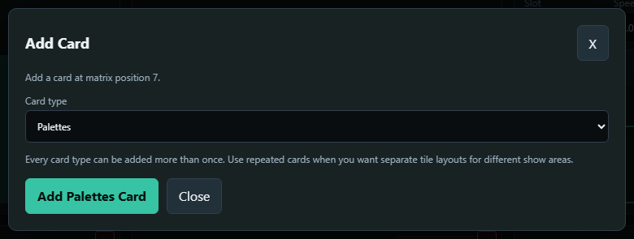

Drag a card by its title/header area to arrange whole cards, for example moving **Palettes** to the top-left and **Pico Effects Playback** to the top-right. Dragging a card to an empty matrix spot places it there and leaves the other card positions unchanged. Dragging a card onto another card swaps only those two cards. The card body remains available for tile editing and other configuration controls while **Edit** is active.

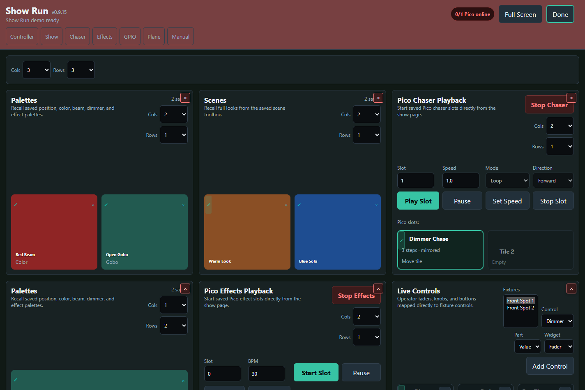

Each tile section on Show Run has native **Cols** and **Rows** dropdowns like the toolboxes, including the overall card matrix and any repeated cards. Tap a dropdown to use the native iPad picker. These controls shape the operator page layout for groups, fixtures, scenes, palettes, planes, Pico chaser slots, and Pico effect slots. While **Edit** is active, tile move mode is active automatically: drag a filled tile to another position, or on touch screens tap the filled tile and then tap the destination tile. Show Run saves card layout, tile layout, Live Controls configuration, and MIDI mappings to the XAMPP server UI state, so the same operator page is restored on another computer and included in **Export Show** / **Import Show**. The layout does not rewrite the saved toolbox setup itself.

If saved groups, scenes, palettes, planes, or loaded Pico playback slots are outside the visible matrix, Show Run opens **Hidden Show Items** and switches into **Edit**. Use **Expand** to increase that section's rows/columns until the hidden item is visible, or use **Place in Free Tile** when an empty visible tile is available. This prevents newly created palettes/scenes/planes or moved playback slots from being silently hidden on a row that is not currently displayed.

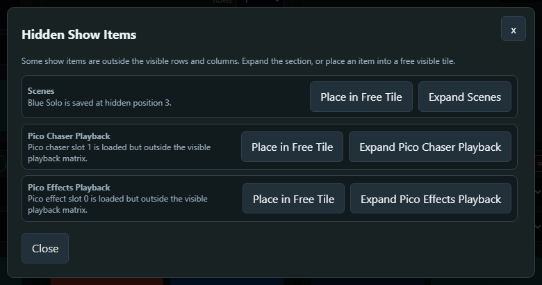

While **Edit** is active, saved group, scene, and palette tiles also show the small pencil and `x` actions. The pencil opens **Edit Tile**, where the tile name, background color, uploaded icon, or drawn icon can be changed and where the tile's MIDI mapping can be learned or cleared. These visual edits change the shared saved tile, so the updated name/color/icon appears on the setup page and in every Show Run card that uses that item. The small tile `x` only removes that item from the current Show Run card position. It does not delete the saved group, scene, or palette from the XAMPP setup files, and it does not remove that same item from another repeated Show Run card.

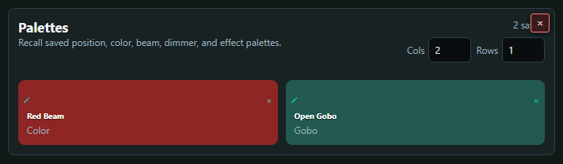

Pico chaser/effect playback tiles use the same tile move behavior during editing. Their playback buttons are replaced by **Move tile** while **Edit** is active, so a show cannot accidentally start or stop playback while you are arranging the operator page. Their upper-left pencil opens the MIDI mapping editor.

#### Live Controls

The **Live Controls** card can hold operator faders, knobs, and buttons that write directly to fixture controls without opening the full Controller page. Click **Edit**, choose a patched fixture, control, control part, and widget type, then click **Add Control**. The setup controls are hidden when **Done** is active so the operator page keeps more space for the actual controls. Multiple Live Controls cards can be used to separate faders, buttons, and mixed show controls. Faders and knobs send their value while they are moved. Compound controls are split into clear parts such as Pan, Tilt, Red, Green, Blue, White, or Amber. These widgets update the live-value snapshot and send the matching DMX bytes to every selected fixture's assigned DMX Output. Use the upper-left pencil on a Live Control to learn or clear its MIDI mapping.

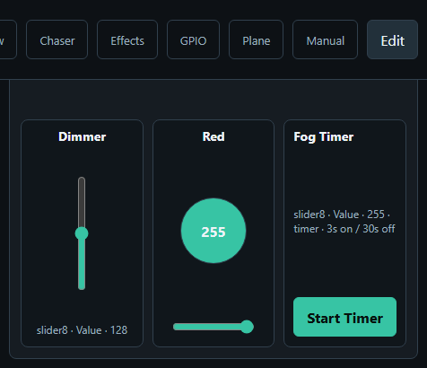


To create a momentary button, set **Widget** to **Button**, set **Button mode** to **Hold**, choose the value to send, then click **Add Control**. **Hold** sends the configured value only while the button is pressed. When the button is released, Show Run restores the value that was active before the press.

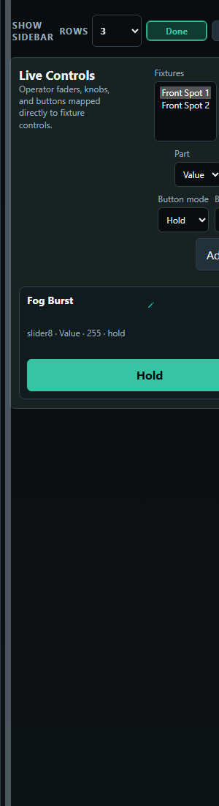

To create a fog or haze timer, set **Widget** to **Button**, set **Button mode** to **Timer**, choose the output value, then set **On s** and **Off s**. The timer sends the configured value for the On time, restores the previous/off value for the Off time, and repeats until stopped. While it is running, the widget shows the current On/Off phase, remaining seconds, and a progress bar similar to the Chaser timing display. Stopping or deleting a timer button restores the previous value.

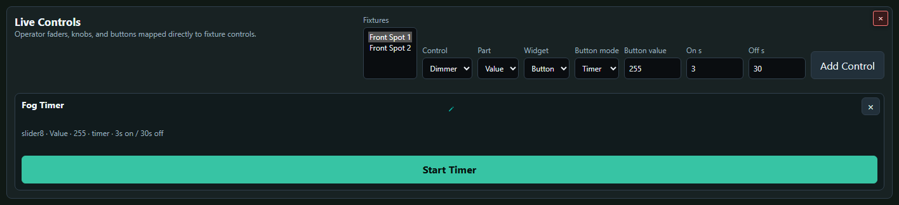

Use **Apply** mode for one-shot commands that should send the configured value once and stay there.

Live Control card configuration is stored with the server-side Show Run preferences. Use the small `x` on a live widget while **Edit** is active to remove it from the operator page.

#### Output Behavior

Scene, palette, Pixel Matrix, Live Control, room-plane target, Grand Master, and Group Master output all use the same current target rules. Selected Groups and Fixtures define the target. With no selection, all fixtures are targeted. Every fixture keeps its configured DMX Output, so one recall can update several universes simultaneously.

Show Run blackout is handled by the master faders. Click **Full** above a master fader to set that master to **100%**. Click **Blackout** below the Grand Master to set the Grand Master to **0%** for all dimmers. Click **Blackout** below a Group Master to set only that Group Master to **0%**. These buttons use the same master output path as moving the fader manually, so they do not overwrite stored live values. When any Grand Master or Group Master factor is below **100%**, Show Run separates affected dimmer channels by fixture output and sends `channel:scale` factors to every involved Pico's output-scaling endpoint. Each Pico keeps playback writing normal raw values, then scales its transmitted DMX output. When you enter Show Run, saved Grand Master and Group Master factors are restored across the involved outputs. When you leave Show Run, the page clears the master scale on those outputs and restores dimmer output to the underlying live values without those multipliers, so setup pages do not inherit the temporary show-level dimming.

The global **Stop All Playback** button calls both playback stop endpoints on every Pico involved in the mirrored Chaser and Effects slots. A linked logical slot is operated as one unit even though its member payloads may use different physical slot numbers on the individual Picos.

Show Run is intentionally read-mostly during normal operation. Outside **Edit** it does not create scenes, edit palettes, change fixture profiles, or overwrite the show setup files. In **Edit**, card placement, tile placement, Live Controls, MIDI mappings, and tile label/visual edits are saved intentionally.

## Testing and Diagnostics

These pages are intended for commissioning, verification, and fault finding. They are not needed for normal show operation.

### Pico Performance Test

The Pico Performance Test page checks the complete browser-to-Pico control path and records firmware timing and transport measurements.

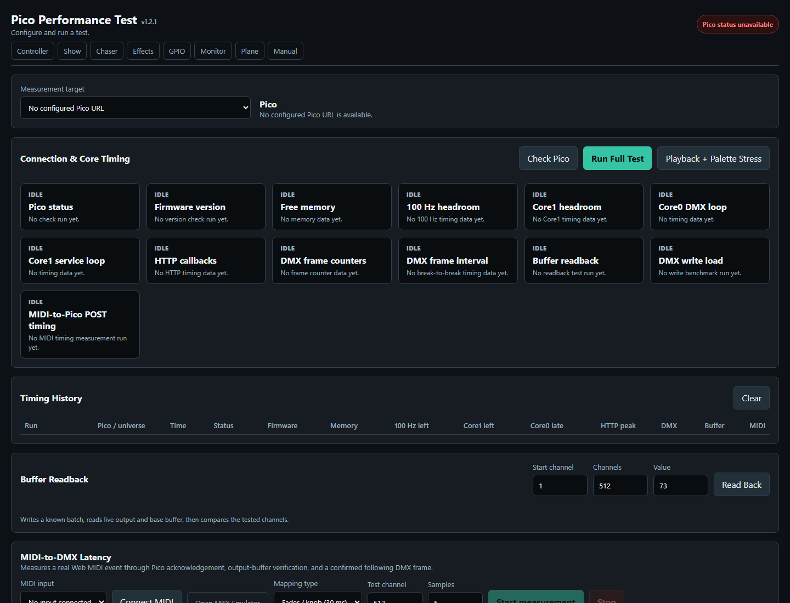

#### What You Can Do on Pico Performance Test

Use this page to verify status and firmware compatibility, measure memory and loop headroom, read buffers back, test MIDI-to-DMX latency, stress playback and palette updates, and export timing results.

#### Pico Performance Test Tools and Toolboxes

The Performance page does not use the shared toolbox rail. Its tools are organized as test panels: **Measurement target**, Pico status and firmware checks, buffer readback, MIDI-to-DMX latency, playback and palette stress, DMX write testing, Timing History, and Write History. **Run Full Test** coordinates the supported panels for each selected Pico while preserving its own result cards and cleanup status.

The **Measurement target** list is loaded from Controller → **DMX Outputs**. Choose one Pico/universe for an individual measurement, or choose **All configured Picos** to run batch-capable actions sequentially across the complete fleet. Timing History and Write History identify the Pico and universe for every result, while the live result cards show the last measured target.

Use **Check Pico** to read Pico status and firmware performance telemetry. Current firmware exposes `/perf/status.json`, which reports free RAM, Core0 100 Hz playback-loop timing, Core1 service-loop timing, HTTP callback timing, and DMX frame counters. Older firmware falls back to parsing `/logs.txt`.

The **Free memory** check shows the firmware heap/stack gap. The **100 Hz headroom** check shows the minimum time left before the Core0 playback loop would miss its 10 ms update budget. The **Core1 headroom** check shows the minimum time left before the network/service loop would miss its 2 second service budget. Healthy runs should show no late Core0 or Core1 cycles and comfortable remaining slack.

Use **Buffer Readback** to write a known batch with `/dmx/b`, then compare the tested channels from both `/dmx/output.json` and `/dmx/base.json`.

Set its **Start channel**, number of **Channels**, and test **Value**, then click **Read Back**. The requested channel range is clipped to the 512-channel universe. Because the operation writes real output before reading it, use an unused range or disconnect fixtures when the test value must not be visible on stage.

Use **MIDI-to-DMX Latency** to measure a controller event through the browser and the selected Pico output. Configure and verify the outputs in Controller → **DMX Outputs**, then click **Connect MIDI** for USB hardware or open the visible **MIDI Emulator** when you want to perform a standalone manual test. Select whether the Show Run target behaves as a **Fader / knob (30 ms)** or an immediate **Button**, choose an unused DMX test channel and sample count, then start the measurement. For a manual test, move one control and pause until **Move again** appears for each sample. USB and emulator events use the same measurement handler after ingestion; the emulator substitutes a same-origin `BroadcastChannel` hop for the physical USB/driver hop.

The primary result is **MIDI → POST**: time from the MIDI event until the browser starts the `/dmx/b` request to the Pico. This intentionally includes the 30 ms coalescing queue for faders and knobs. Fader/knob p95 is PASS at no more than 35 ms, WARN through 50 ms, and FAIL above 50 ms. An immediate button is PASS at no more than 5 ms, WARN through 15 ms, and FAIL above 15 ms. Post-coalescing transport, Pico acknowledgement, output-buffer visibility, and conservative confirmed-following-frame time are reported separately as diagnostics and do not determine the primary MIDI status. When the measurement completes or is stopped, the page finishes the common Performance Test cleanup described below. Do not use a channel currently controlled by playback, blackout, or a master while the measurement is running.

**Run Full Test** runs status/telemetry, buffer readback, DMX write load, MIDI latency, **Playback + Palette Stress**, and a final telemetry snapshot for the selected target. With **All configured Picos**, that complete sequence runs once per Pico. It needs no manual MIDI movement when the emulator is used. If no MIDI input is connected, the Performance page loads the emulator invisibly inside itself, keeps browser focus on the Performance page, and commands it to generate every configured sample through the normal emulator message path. No extra tab opens. If a physical USB MIDI input is already connected, Full Test uses it and waits for you to move the hardware control for each target. If neither source can connect, the other checks still finish and the MIDI result shows a warning. The dedicated **MIDI-to-DMX timing** card and Timing History store the MIDI-to-POST median and p95.

**Playback + Palette Stress** fills only slots that were empty when the test started and records their Pico URL and slot numbers before loading temporary data. Cleanup stops playback, lets the Pico settle, spaces the clear requests, and verifies the Chaser and Effects slot tables. Transient failures are retried up to five times. The test remains busy until cleanup is verified. If any slot cannot be cleared, the result names the Pico and remaining slots and keeps the recovery record for the next cleanup attempt instead of silently forgetting it.

Every output-changing test finishes independently for each tested Pico by stopping Chaser and Effects playback, clearing master and blackout overrides, and clearing the complete DMX output buffer. This applies to **Buffer Readback**, **DMX Write Test**, **MIDI-to-DMX Latency**, **Playback + Palette Stress**, and **Run Full Test**, including stopped or failed runs. If a cleanup request fails, the page names the Pico and failed endpoint instead of reporting a clean finish. **Check Pico** only reads status and timing information, so it does not stop playback or clear output.

Use **DMX Write Test** to compare:

- Single-channel updates
- Scene-sized batch updates
- Large batch updates
- Longer soak tests

The presets fill in the request shape: **Quick check** configures 500 requests of 512 channels, **Scene recall** configures 120 requests of 64 channels, **Stress** configures 500 requests of 128 channels, and **30s soak** configures up to 5000 requests of 32 channels for 30 seconds. **Custom** leaves **Start channel**, **Value**, **Channels / request**, **Request count**, and **Duration s** under direct control. One channel uses the single-channel endpoint; two or more channels use a consecutive `/dmx/b` batch. **Stop** ends an active run. The export button downloads the completed benchmark as CSV.

The write-test result panel shows:

- Throughput
- Effective DMX channel updates per second
- Average latency
- Median latency
- p95 and p99 latency
- Jitter
- Errors

Use **Run Full Test** to run the Pico status/performance check, buffer readback,
write test, automatic emulated MIDI-to-DMX samples (or interactive physical USB
samples), the playback/palette workload, and a final timing check in one
sequence.

Use **Playback + Palette Stress** to stress playback without overwriting saved Pico slots. The page starts chaser/effect slots that are already loaded, adds temporary demo data only to slots that are currently empty, stores those temporary slot numbers in the server UI state, then sends repeated full 512-channel palette-style `/dmx/b` recalls while playback is running. When the run finishes, the page stops playback, clears only the temporary demo slots, and removes the temporary-slot marker from the server. If a browser session is interrupted, the next stress run first reads the marker and clears the previously recorded temporary slots.

The **Timing History** table records each Pico timing check. A manual **Check
Pico** adds one row immediately. A standalone **Playback + Palette Stress** run
adds its own final timing row. **Run Full Test** includes that workload and
records one consolidated final row per Pico, so it does not add a duplicate
stress-test row. Full Test also records the latest MIDI-to-POST median and p95
in the MIDI column. The 100 Hz and Core1 columns use the same wording as the
status cards, for example "Minimum 9419us left before missing the 10ms update
budget".

Timing History and Write History keep the latest results for the current page session. Their separate **Clear** buttons erase only the displayed history; they do not clear Pico data or DMX output.

Use **Export CSV** to save results for later comparison.

Pico Performance Test and GPIO Control link to the **DMX Buffer Monitor**.

### DMX Buffer Monitor

The DMX Buffer Monitor displays all 512 channels from one Pico buffer at a time.

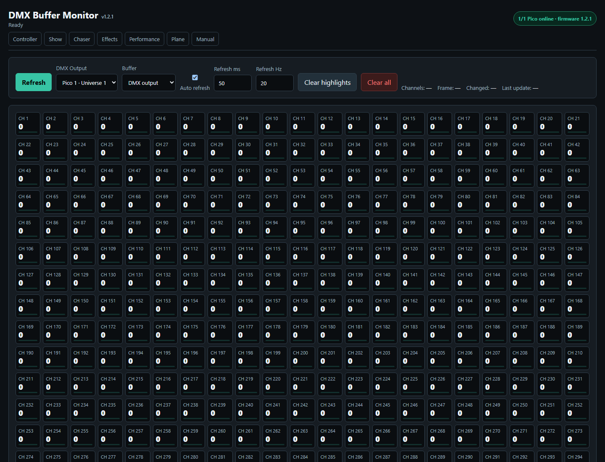

#### What You Can Do on DMX Buffer Monitor

Use the monitor to inspect live output or the Effects base/position buffer, compare consecutive reads, observe changing channels, and deliberately clear both buffers on the selected Pico.

#### DMX Buffer Monitor Tools and Toolboxes

The monitor has no toolbox rail. Its toolbar selects the **DMX Output**, chooses **DMX output** or **Base / position**, controls manual or automatic refresh, clears comparison highlights, and provides the deliberate **Clear all** action. The 512 channel tiles below are the read-only display for the selected buffer except when Clear all is explicitly used. Use **DMX Output** to choose the named Pico/universe to inspect. The selector is loaded from Controller → **DMX Outputs**, and changing it resets the comparison highlights before reading the selected controller.

Use **DMX output** to see the actual output frame currently held by the DMX engine, including values produced by Pico-side Chaser or Effects playback.

Use **Base / position** to inspect the scene base buffer used as the center for Effects.

Use **Refresh ms** to control the polling interval directly. Use **Refresh Hz** when you prefer rate instead. Both fields stay synchronized, so `500 ms` is shown as `2 Hz`. Longer intervals are calmer for observation; shorter intervals are useful when checking fast changes. **Auto refresh** starts or stops polling without changing the selected buffer.

Each refresh compares the new frame with the immediately preceding read. Changed channel tiles receive the accent highlight, while **Changed** reports their count. **Clear highlights** accepts the currently displayed frame as the new comparison baseline without changing any DMX value. **Refresh** performs one immediate read even when Auto refresh is off. Switching output or buffer resets the comparison baseline.

Use **Clear all** when you want to clear both buffers on the selected DMX Output. It calls that Pico's clear endpoint immediately, clears its DMX output buffer and base/position buffer, and then refreshes the displayed tiles.

## Advanced Tools and Data

These tools support portable backups, recovery, and low-level output clearing.

### Back Up and Restore a Show

Backup and restore is performed from the Controller's **Show** card rather than a separate page or toolbox. **Export Show** downloads the complete working show, **Import Show** validates and restores it, and the fixture-resolution dialog handles library differences. **Export Library**, **Import Library**, and **Patch CSV** are separate tools with different scopes, summarized later in this chapter.

The application saves changes automatically on the controller computer, but that server copy is not a portable backup. Use the buttons in **Fixture Controller > Show** to download a backup before changing a working show, updating the application, or moving the show to another computer.

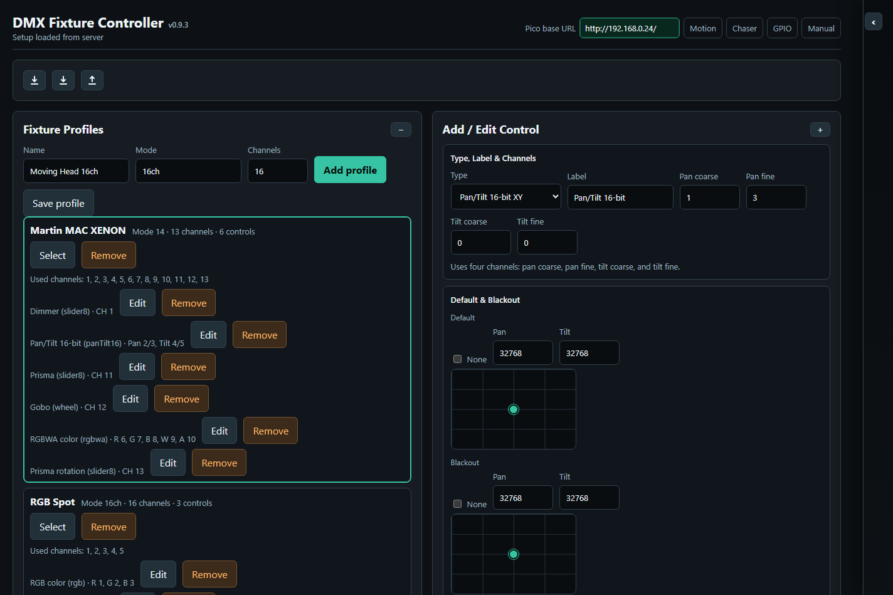

#### Create a Show Backup

1. Open **Fixture Controller** and expand the **Show** card.
2. Check the **Show name**. The name becomes part of the downloaded filename, which makes backups easier to identify later.
3. Click **Export Show**.
4. Wait for the browser to download a file such as `pico_dmx_summer-gala_show.json`.
5. Copy the downloaded file to a safe location outside the controller computer when it must survive a disk failure or computer replacement.

Create a new backup after important programming changes. Keeping several dated copies makes it possible to return to an earlier working version of the show.

The show backup contains the information needed to operate that show:

- Show name, DMX Outputs/universes, fixture profiles, patched fixtures, and current fixture values
- Groups, scenes, palettes, and Pixel Matrices
- Saved chases, effects, and their saved Pico-slot payloads
- Saved Room Planes and fixture calibration
- GPIO mappings for the configured outputs
- Show Run layout, MIDI mappings, toolbox layouts, grid sizes, and other saved interface settings
- The fixture-library definitions and modes used by the patched fixtures

The show backup does not contain the entire reusable fixture library. Use **Export Library** separately when custom fixtures, edited modes, or user-added gobo images from the complete catalog must also be protected.

#### Restore or Move a Show

**Import Show replaces the current show data.** Export the current show first if you may need it again.

1. Open **Fixture Controller** and expand the **Show** card.
2. Click **Import Show** and select the exported `.json` show file. Renaming the file does not prevent import.
3. Check the show name in the confirmation before continuing.
4. If **Resolve Fixture Updates** appears, decide which definition to use for every listed fixture.
5. Confirm the import and wait for its success message.
6. Open **DMX Outputs** and verify the Pico addresses and online state, especially after moving the show to another computer or network.
7. Check the Controller, scenes, palettes, chases, effects, Room Planes, and Show Run page before using the restored show live.

The importer checks the backup format and application compatibility before replacing anything. Supported older backups are updated automatically during import. If the backup requires a newer application, update WiFiPicoDMX and try again; do not edit the JSON file to bypass the warning.

Import restores the saved Pico chaser/effect slot descriptions on the controller server, but it cannot assume that the physical Pico memories still match. On the Chaser and Effects pages, use **Synchronize Saved Slots to Picos** when the Picos were reset, reflashed, replaced, or moved with the show.

#### Resolve Fixture Updates During Import

The show backup embeds the fixture definitions it uses. If one differs from the currently installed fixture library, **Resolve Fixture Updates** lets you choose safely:

- **Keep show** preserves the definition from the backup. Use this when the show contains tested custom channel mappings, split colors, or gobo images that must behave exactly as before.
- **Use library** replaces that imported show profile with the selected definition from the current fixture library. Use this when you intentionally want the installed library version.
- Selecting another fixture or mode maps that imported profile to the chosen library mode.
- **Use All Matches** selects the current library definition for every row that already has a match.
- **Cancel Import** closes the dialog without changing the current show.

When uncertain, keep the show definition, finish the import, and test it before deliberately merging a newer library definition into the show.

#### Show, Library, and Patch Exports

| Controller action | Result | Use it for |
| --- | --- | --- |
| Export Show | One show-name-specific `.json` file | Backing up, restoring, or moving the complete working show |
| Import Show | Replaces the current show from an exported show file | Recovering a show or loading it on another installation |
| Export Library | `pico_dmx_fixture_library.zip` | Protecting the complete reusable fixture catalog, including custom fixtures and images |
| Import Library | Replaces the active reusable fixture catalog | Restoring a previously exported complete library |
| Patch CSV | A readable DMX channel table | Documentation and troubleshooting only; it cannot restore a show |

Show and library files serve different purposes. For the most complete portable backup, keep the latest **Export Show** file together with a recent **Export Library** ZIP.

### Clear Functions

Clear operations appear where their scope is visible instead of on a separate page or in a shared toolbox. The Controller and programming pages provide output actions for normal operation, while DMX Buffer Monitor's **Clear all** explicitly clears both live output and the motion base buffer on the selected Pico. Check the selected output and the action description before using either form of clear.

There are two different clear actions:

| Action | What it clears | When to use |
| --- | --- | --- |
| DMX clear | Live DMX output and the motion base buffer | Full reset of output and base position |
| Output-only clear | Live DMX output only | Black out output while keeping the stored motion center |

Use output-only clear when you want Effects to resume around the same stored center after the blackout.

## Troubleshooting and Reference

### Troubleshooting

#### Open the Pico Firmware Diagnostics Page

Each Pico hosts a small firmware diagnostics website on port 80. It is separate from the WiFiPicoDMX application website: the application manages the show, while the firmware page reports and controls one physical Pico directly.

To find the correct address:

1. Open **Controller** and expand **DMX Outputs**.
2. Find the named DMX Output for the Pico you want to inspect.
3. Copy its **Pico Base URL**, for example `http://192.168.0.24/`. The trailing slash is valid and may be left in place.
4. Paste that complete URL into a browser on a computer or tablet connected to the same trusted network.

If several Picos are configured, each has its own Base URL and firmware page. Opening the controller computer's address, such as `http://localhost:8090/` or `http://localhost/dmx/`, opens the WiFiPicoDMX application instead. Do not expose either interface through an internet-router port-forward.

The Pico opens its **Pico 2W Logs** page by default. The visible log refreshes once per second without reloading the page. **Raw logs** opens the same information as plain text, which is useful when copying it into a support report.

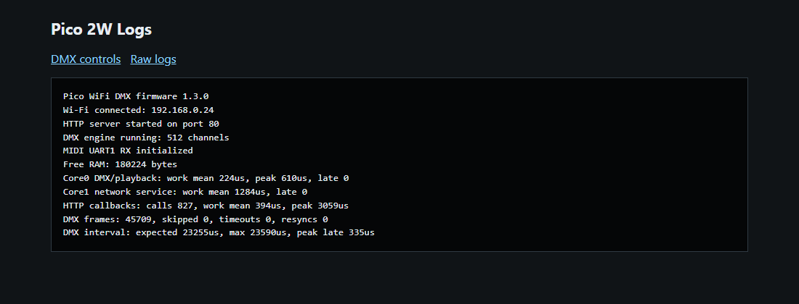

The log is a rolling, in-memory diagnostic record from the current firmware run. It contains only the most recent data and is cleared when the Pico restarts. Typical entries include:

- Wi-Fi connection state and the assigned IPv4 and IPv6 addresses
- Firmware startup, HTTP server, DMX engine, and MIDI-input initialization
- Approximate free RAM and continuing network-link status
- Core0 DMX/playback and Core1 network service workload, remaining timing slack, and late-loop counts
- HTTP request workload plus DMX frame, skipped-frame, timeout, resynchronization, interval, and late-frame counters

Use the log to confirm that Wi-Fi and the HTTP server started, that the DMX engine is running, and whether timing or frame errors increase while reproducing a problem. The Pico Performance Test presents the same kind of timing information with PASS/WARN/FAIL interpretation and is normally easier for routine checks. Keep the raw log when reporting an intermittent firmware problem.

Select **DMX controls** on the log page to open the Pico's direct channel test page. Its header shows whether DMX is running, the configured channel count, and the current frame counter. **Status JSON** opens the underlying firmware status as machine-readable text.

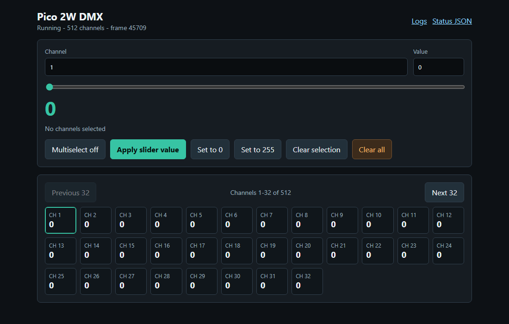

The DMX controls operate as follows:

- **Channel** selects one DMX address. **Previous 32** and **Next 32** move through the universe, and every channel tile shows the latest value read by this page.
- **Value**, the slider, and the large number are one value editor. Changing them prepares a value; **Apply slider value** sends it to the selected channel.
- **Set to 0** and **Set to 255** immediately send the minimum or maximum value.
- **Multiselect on** lets you select several channel tiles. Apply, 0, and 255 then update all selected channels. **Clear selection** only deselects the tiles; it does not change their DMX values.
- **Clear all** immediately sets all channels to zero and clears both the live DMX output and the stored base/position buffer on that Pico.

These controls write directly to the physical Pico and bypass the normal fixture, group, scene, and show workflow. The WiFiPicoDMX page may therefore not display the value you sent, and active chaser or effect playback may overwrite it. Use the firmware controls only for diagnosis, channel identification, and simple output testing. Disconnect fixtures or choose safe channels before testing, and use **Clear all** only when clearing the complete output and motion base is intended.

#### The UI does not control the Pico

- Check that the Pico is powered and connected to WiFi.
- Open the Pico URL directly in a browser, for example `http://192.168.0.24/`.
- Make sure the base URL in the UI ends with `/`.
- Make sure Controller → **DMX Outputs** contains the correct Pico URL and the header fleet pill shows that output online.

#### Chaser capture does not contain the expected values

- Move or recall the values on the Fixture Controller first.
- Make sure the participating controls include the controls you want to capture.
- Save or reload the Fixture Controller setup if fixtures were changed recently.

#### Effects move around the wrong center

- Recall the desired scene first.
- On the Effects page, click the same scene in the scene toolbox.
- Then start the effect slot.

#### GPIO mapping does not react

- Check `/gpio/status` or the status panel on the GPIO page.
- Confirm that the selected pin is not reserved or already used.
- Check pull mode and trigger edge.
- For ADC, use only GPIO26, GPIO27, or GPIO28.

#### Update from OFL reports an invalid server response

- Install the latest WiFiPicoDMX application update. Older Windows packages used PHP memory and upload limits that were too small for the complete OFL catalog.
- Run **Update from OFL** again after the upgrade. The Windows installer preserves the show-data directory and the update endpoint creates a fixture-library backup before changing the active catalog.
- If it still fails, inspect `%ProgramData%\Pico DMX Controller\logs\php-error.log` and keep the active library and its latest `data\backups` snapshot for diagnosis.

#### A chaser has more than 32 steps

The firmware supports 32 steps per chaser slot. Keep the chase within this limit before uploading to the Pico.

### Change Log

The generated HTML and PDF manual include the complete project change log
below, with the newest development or release version first. The Markdown
source remains linked to the canonical [project changelog](../CHANGELOG.md), so
release information has one maintained source.

<!-- PICO_DMX_CHANGELOG -->
